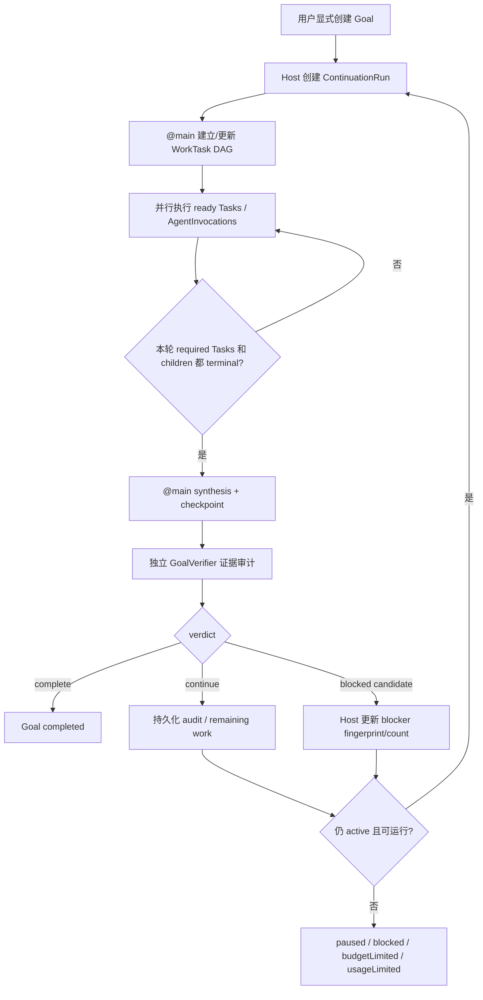

# Intatis Task / Goal 最终方案

> 日期：2026-07-14
> 性质：产品方向与第一版实现规格
> 范围：Cowork 的工作分解、Task 工具、依赖图、并行执行、Goal 跨轮持续、完成审计与 UI 语义
> 结论：**Task 采用 Claude Code 风格的产品体验、OpenCode 可验证的源码模式与 Intatis 自己的 durable DAG；Goal 采用 Codex 风格的用户显式耐久目标，再增加 Intatis 独立 GoalVerifier。**

## 0. 最终定案

Intatis 今后必须把以下四个对象分开：

| 层 | 对象 | 谁创建 | 生命周期 | 用途 |
|---|---|---|---|---|
| 产品目标层 | `Goal` | 用户显式创建 | 跨多个 turn / run | 用户真正想长期达成的目标 |
| 工作计划层 | `WorkTask`，UI 显示为 **Task** | `@main` 分析请求后通过工具创建 | 主要在当前 run 内推进，持久化以便恢复 | 一、二、三、四式工作清单、依赖 DAG 与并行分工 |
| 执行轮次层 | `ContinuationRun` | host 为普通消息或 active Goal 创建 | 一次 main 协调周期 | 隔离每轮计划、上下文、审计与用量 |
| 执行记录层 | `AgentInvocation` | Orchestrator 在委派/执行时创建 | 单次 agent 尝试 | 现有 `TaskContract`、scheduler、lease 和 agent runtime 的真实执行记录 |

三个完成概念不能再混用：

```text
模型输出结束
    ≠ WorkTask 完成
    ≠ Goal 达成
```

- `AgentInvocation` 返回文本，只能说明一次调用结束。
- `WorkTask` 只有在显式 `task_update(status: completed)` 且附带结果/证据后才完成。
- `Goal` 只有在 GoalVerifier 对全部要求完成证据审计后才完成。

这份方案同时满足已经确认的两个产品偏好：

1. **Task 像 Claude Code：**main 自动拆解、清晰编号、状态可见、依赖解锁、多任务可并行、同一轮逐项击破。
2. **Goal 像 Codex：**用户手动设定、跨轮持续、可暂停/恢复、按可验证停止条件结束，而不是普通输出结束就打勾。

第一版不做“只有 Todo 外观”的缩水实现。第一版闭环的验收范围已经包括：

- `task_create`
- `task_update`
- `task_get`
- `task_list`
- 稳定 Task ID
- dependency DAG
- 多 Task 并行委派与执行
- Task 与 AgentInvocation 显式绑定
- 用户显式 Goal
- Goal 状态、elapsed time、Pause/Resume/Edit/Clear
- 每轮 agent/subagent barrier
- 独立 GoalVerifier
- Goal 未完成时自动拉起下一轮
- 完成、阻塞、预算/用量受限的准确终态
- EventLog 恢复与 UI 投影

## 1. 为什么必须重新定义 Task 和 Goal

### 1.1 当前 `Task` 是执行单元，不是用户想要的工作清单

当前 `Packages/IntatisProtocol/Sources/Task.swift` 中的 `TaskKind` 包括：

- `root`
- `agentInvocation`
- `mailboxDelivery`
- `agentAdmission`

`TaskContract` 又强绑定：

- issuer / assignee
- workspace / capability lease
- timeout / max attempts
- reply mode
- parent execution task

因此，它本质上是 **durable execution contract**，不是 Claude 风格的“要完成的第 1、2、3 项工作”。

现有类型不应删除，因为它已经承载 scheduler、lease、恢复和审计。第一版采用兼容迁移：

```text
现有 TaskContract / ScheduledTask / TaskGraph
    产品和新文档统一称为 AgentInvocation / ExecutionTask

新增 WorkTask / WorkTaskGraph
    UI 统一显示为 Task / Tasks
```

Swift 类型是否在后续正式重命名，可以单独安排；第一版不必为改名破坏现有 EventLog 兼容性。

### 1.2 当前 `Goal` 只是消息元数据

当前 `Packages/IntatisConversation/Sources/GoalInput.swift` 的 `/goal` 只做三件事：

1. 去掉 `/goal` 前缀；
2. 把文本放进 `UserMessagePayload.goal`；
3. 添加 `Goal` tag。

它没有：

- Goal ID
- durable status
- created / updated / elapsed time
- pause / resume / clear
- token usage / optional budget
- completion evidence
- verifier audit
- continuation run
- restart recovery

`Apps/IntatisMac/Sources/CoworkViewModel.swift:640-695` 仍把解析结果当普通消息发送。

### 1.3 当前 UI 把执行任务误叫成 Goals

`Packages/IntatisSharedUI/Sources/CoworkViews.swift:420-449` 的右栏标题虽然是 `Goals`，但数据来自：

```swift
summary.runningTasks + summary.failedTasks + summary.recentCompletedTasks
```

对应 `CoworkViewModel.swift:375-379` 又把 `task.contract.objective` 直接当详情文本。因此现在的“Goal”其实是 execution task objective。

### 1.4 当前“输出完就打勾”是代码路径的必然结果

`Orchestrator.swift:3321-3350` 在 agent loop 返回 output 后直接调用 `finishCompletedTask`；`Orchestrator.swift:3376-3410` 随即持久化 `taskCompleted` 并把现有 `TaskGraph` 状态更新为 `completed`。

这对 `AgentInvocation` 是合理的：一次模型调用确实结束了。

但 UI 又把这个执行状态投影成 Goal，所以出现了错误等式：

```text
agent loop returned output
    -> execution Task completed
    -> UI Goal 打勾
```

正确路径应是：

```text
agent loop returned output
    -> AgentInvocation terminal
    -> 提供 WorkTask candidate result / report
    -> WorkTask 显式完成或继续
    -> 本轮 barrier
    -> GoalVerifier 逐要求审计
    -> Goal complete 或下一 continuation run
```

### 1.5 当前 TaskGraph 不是 dependency DAG

现有 `TaskGraph` 有 delegation lineage、深度、循环、重复任务、活跃 agent 上限等保护。虽然 `TaskEdgeKind` 定义了 `.blocks`，但当前仓库没有实际创建/消费 `.blocks` 边的实现；`addTask` 自动创建的是 `.delegates`。

因此不能声称当前已经有 WorkTask dependency graph。正确做法是新增 `WorkTaskGraph`，而不是把 execution lineage graph 继续扩成两种语义混合的万能图。

### 1.6 当前已有并行底座，但没有 dependency-aware Task 调度

`AgentScheduler` 已能跳过 busy assignee，并让不同 agent 的 invocation 同时运行；Orchestrator 也有 `maxConcurrentTasks`。

可复用的是 **AgentInvocation 并行执行底座**。尚缺的是：

- WorkTask `dependsOn`
- ready/pending 计算
- dependency 自动解锁
- dependency failure 传播
- WorkTask 到 AgentInvocation 的稳定关联
- 资源冲突检查
- UI 的 blocked / owner / dependency 投影

## 2. 外部实现调研结论

### 2.1 OpenCode：可以借鉴源码模式，但它没有现成 Task DAG

本次对照固定在 OpenCode `1.17.20`、`dev` commit [`cb8be9ba1217c2e7a2b93cf513eb21b41a7f5365`](https://github.com/anomalyco/opencode/commit/cb8be9ba1217c2e7a2b93cf513eb21b41a7f5365)。

OpenCode 当前其实有三套不同对象：

| OpenCode 对象 | 真实语义 | 能否直接作为 Intatis Task |
|---|---|---|
| Todo | session 内的展示清单；字段只有 content/status/priority；整表 replace | 不能。无稳定 ID、owner、依赖、产物、重试、审计 |
| Task tool | 创建或续接一个 child session/subagent 调用 | 不能直接等同 WorkTask；更接近 Intatis AgentInvocation |
| BackgroundJob | 进程内后台 job registry | 不能。源码明确不是 durable scheduler，重启会丢运行态 |

关键源码：

- [Todo schema](https://github.com/anomalyco/opencode/blob/cb8be9ba1217c2e7a2b93cf513eb21b41a7f5365/packages/schema/src/session-todo.ts#L7-L23)
- [Todo service](https://github.com/anomalyco/opencode/blob/cb8be9ba1217c2e7a2b93cf513eb21b41a7f5365/packages/opencode/src/session/todo.ts#L16-L63)
- [Task tool](https://github.com/anomalyco/opencode/blob/cb8be9ba1217c2e7a2b93cf513eb21b41a7f5365/packages/opencode/src/tool/task.ts#L43-L61)
- [Task create/resume child session](https://github.com/anomalyco/opencode/blob/cb8be9ba1217c2e7a2b93cf513eb21b41a7f5365/packages/opencode/src/tool/task.ts#L111-L160)
- [Task background flow](https://github.com/anomalyco/opencode/blob/cb8be9ba1217c2e7a2b93cf513eb21b41a7f5365/packages/opencode/src/tool/task.ts#L198-L327)
- [BackgroundJob 非持久化边界](https://github.com/anomalyco/opencode/blob/cb8be9ba1217c2e7a2b93cf513eb21b41a7f5365/packages/core/src/background-job.ts#L88-L120)

必须准确记录：OpenCode 当前没有 Task dependency / prerequisite DAG。`task_id` 表示续接同一个 child session，不是依赖；同一 `task_id` 的 extend 也是串行 tail，不是并行。

OpenCode 可直接借鉴或按项目开源复用政策选择性移植的部分是：

1. Task 是与 read/edit/bash 同级的模型工具，不是 UI 私有按钮。
2. `task_id` 可续接同一个 child session，避免丢失 worker 上下文。
3. child completion 自动向父 session 投递结构化结果，不要求 main 轮询。
4. 当前 caller 只看到有权调用的 agent 类型和工具 schema。
5. 子 agent 默认禁止继续 task/todowrite，递归能力必须显式授予。
6. Task card 能链接 child session。
7. Todo 从消息时间线隐藏，使用常驻进度 dock 展示。
8. 前台工作可 promotion 到后台而不重启。

OpenCode 不可照搬的部分是：

1. Todo 的 delete-all + replace-all 存储模型。
2. 进程内 BackgroundJob registry。
3. 只靠提示“不要同时修改同一文件”的并行冲突控制。
4. 用 session parent tree 代替 durable Task DAG。
5. 把实验性 `background=true` 当成稳定调度契约。

OpenCode UI 参考：

- [Task tool card](https://github.com/anomalyco/opencode/blob/cb8be9ba1217c2e7a2b93cf513eb21b41a7f5365/packages/session-ui/src/components/message-part.tsx#L1954-L2065)
- [Todo dock](https://github.com/anomalyco/opencode/blob/cb8be9ba1217c2e7a2b93cf513eb21b41a7f5365/packages/app/src/pages/session/composer/session-todo-dock.tsx#L42-L252)
- [Subagent permission derivation](https://github.com/anomalyco/opencode/blob/cb8be9ba1217c2e7a2b93cf513eb21b41a7f5365/packages/opencode/src/agent/subagent-permissions.ts#L1-L27)

### 2.2 Claude Code：采用产品行为，不采用闭源源码

Claude Code/Agent Teams 的公开产品行为与用户期望最接近：lead、独立 teammate session、共享 task list、依赖解锁、并行分工和 mailbox。

Intatis 可以参考这些行为与信息层级，但不把 Claude Code 当成可复制源码来源，也不复制其品牌、图标、截图或受保护 UI 资产。

行为参考：[Claude Code Agent Teams](https://code.claude.com/docs/en/agent-teams)。

本方案对 Claude 风格体验的翻译是：

```text
lead                 -> @main
shared task list     -> WorkTaskGraph + EventLog projection
teammate session     -> headless AgentRuntime
dependency unlock    -> WorkTaskScheduler
mailbox              -> 现有 MessageBus / mailbox
task result          -> TaskReport + evidence
```

### 2.3 Codex Goal：采用耐久目标语义

OpenAI 官方将 Goal 描述为“让 Codex 跨多个 turn 持续工作，直到可验证停止条件满足”的耐久目标。官方同时强调：

- Goal 适合一个明确 objective 和 stopping condition；
- 不适合松散、互不相关的 backlog；
- 用户可查看、pause、resume、clear；
- 好 Goal 必须说明预期行为、约束、验证方式与何时停止；
- 目标可以跨多轮、长时间独立推进。

来源：

- [Follow a goal](https://developers.openai.com/codex/use-cases/follow-goals)
- [Codex long-running work whitepaper](https://cdn.openai.com/pdf/8a9f00cf-d379-4e20-b06f-dd7ba5196a11/OAI_WhitePaper_Codex-maxxing26.pdf)
- [Codex goal runtime](https://github.com/openai/codex/blob/main/codex-rs/core/src/goals.rs)
- [Codex goal tool handler](https://github.com/openai/codex/blob/main/codex-rs/core/src/tools/handlers/goal_spec.rs)
- [Codex continuation prompt](https://github.com/openai/codex/blob/main/codex-rs/core/templates/goals/continuation.md)
- [Codex app-server goal protocol](https://github.com/openai/codex/blob/main/codex-rs/app-server/README.md)

当前 Codex 运行时工具契约还提供了两个很值得采用的边界：

1. `create_goal` 只能在用户或 system/developer 明确要求时使用，不能从普通任务自行推断。
2. agent 侧 `update_goal` 只能提交 `complete` 或 `blocked`；pause/resume/budget/usage limit 属于用户或 host 控制。

Codex 公开源码并不能证明它一定使用“另一个独立审查模型”判断完成。Intatis 的 GoalVerifier 是本项目为可靠性增加的设计，不能在文档里误称为 Codex 原实现。

## 3. 最终领域模型

### 3.1 `WorkTask`

建议新增协议对象：

```swift
struct WorkTask {
    var id: WorkTaskID
    var runID: ContinuationRunID
    var goalID: GoalID?

    var title: String
    var description: String
    var acceptanceCriteria: [String]
    var expectedArtifacts: [String]

    var status: WorkTaskStatus
    var priority: WorkTaskPriority
    var owner: AgentID?
    var dependsOn: [WorkTaskID]

    var progressNote: String?
    var result: String?
    var evidence: [TaskEvidence]
    var latestInvocationIDs: [TaskID]

    var createdAt: Date
    var updatedAt: Date
    var completedAt: Date?
    var revision: Int
}
```

第一版字段原则：

- `id` 必须稳定，不能像 OpenCode Todo 一样依赖数组 position。
- `runID` 明确它属于哪个普通 turn 或 Goal continuation run。
- `goalID` 可空；普通 Cowork 请求也可以有 Tasks。
- `dependsOn` 是真实调度依赖，不是仅供 prompt 阅读的 related tasks。
- `acceptanceCriteria` 和 `evidence` 让完成不再只是模型一句“做好了”。
- `latestInvocationIDs` 建立 WorkTask 与现有执行层的关联。
- `revision` 用于 optimistic concurrency，避免 main 与 worker 覆盖彼此更新。

#### 3.1.1 Task 状态

```swift
enum WorkTaskStatus {
    case pending      // 依赖尚未满足，由 host 计算
    case ready        // 可开始，由 host 计算
    case inProgress   // 已被 owner 领取/执行
    case blocked      // 非依赖等待，而是出现明确阻塞
    case completed
    case failed
    case cancelled
}
```

状态职责必须分开：

- `pending/ready` 由 host 根据 DAG 计算，模型不能伪造依赖已满足。
- `inProgress/blocked/completed/failed/cancelled` 通过 `task_update` 请求，并由 host 校验转换。
- `completed` 必须带 `result`，有 acceptance criteria 时必须带 evidence。
- AgentInvocation 结束不自动把 WorkTask 改成 completed。

推荐转换：

| From | To | 条件 |
|---|---|---|
| pending | ready | 全部依赖 completed |
| ready | inProgress | owner 领取或 main 委派成功 |
| inProgress | completed | 显式更新 + result/evidence |
| inProgress | blocked | 具体 blocker，且仍可能恢复 |
| blocked | ready | blocker 消失、owner 释放或 main 重排 |
| inProgress / blocked | failed | 当前方案不可恢复；可由 main 创建 retry/replacement |
| 非终态 | cancelled | main 或用户取消 |
| failed / cancelled | ready | 仅显式 retry，revision/attempt 增加 |

第一版不提供模型可见的 `task_delete`。历史 Task 是审计事实；不再需要的工作使用 `cancelled`。

### 3.2 `WorkTaskGraph`

依赖方向统一为：

```text
Task B dependsOn [Task A]
```

也就是 A 完成后 B 才能 ready。

图规则：

1. Task ID 必须存在于同一 run，或是明确允许引用的前序 continuation checkpoint。
2. 创建和更新依赖时都做 cycle detection。
3. 缺失依赖、跨 session 依赖和自依赖直接拒绝。
4. dependency failed/cancelled 时，下游进入 blocked projection，并写清原因；不得假装 completed。
5. main 可以通过 `task_update(depends_on: ...)` 重新规划，但每次变更留 EventLog。
6. 一个 Goal 新开 continuation run 时，前一 run 的 Tasks 默认只读归档；未完成 Task 可显式 carry forward，不能静默丢弃或自动完成。

`WorkTaskGraph` 和现有 `TaskGraph` 的关系是：

```text
WorkTaskGraph
  决定“现在应该做哪些工作、哪些可并行”

AgentInvocation TaskGraph
  记录“哪个 agent 以哪次 lease/attempt 实际运行了什么”
```

### 3.3 `ContinuationRun`

普通消息和 Goal 都通过 Run 执行：

```swift
struct ContinuationRun {
    var id: ContinuationRunID
    var sessionID: SessionID
    var goalID: GoalID?
    var ordinal: Int
    var status: RunStatus
    var startedAt: Date
    var endedAt: Date?
    var progressSummary: String?
}
```

- 普通请求只有一个 Run；完成后回到 idle。
- active Goal 可以有多个 Run。
- Task 属于 Run，Goal 跨 Run。
- crash/restart 后恢复未完成 Run，而不是复制一套新 Tasks。

### 3.4 `Goal`

建议新增真实协议对象：

```swift
struct Goal {
    var id: GoalID
    var sessionID: SessionID
    var objective: String
    var successCriteria: [String]
    var constraints: [String]
    var status: GoalStatus
    var revision: Int

    var tokenBudget: Int?       // 仅用户显式设置
    var tokensUsed: Int
    var activeElapsedSeconds: Double

    var latestAudit: GoalAuditSummary?
    var blockerFingerprint: String?
    var consecutiveBlockedRuns: Int
    var noProgressRuns: Int

    var createdAt: Date
    var updatedAt: Date
    var completedAt: Date?
}
```

第一版每个 Cowork session 同时最多一个当前 Goal。完成或 clear 后才可创建新的 Goal；历史 Goal 仍通过事件保留。

Goal 状态：

```swift
enum GoalStatus {
    case active
    case paused
    case blocked
    case budgetLimited
    case usageLimited
    case completed
}
```

`clear` 是用户操作与 durable event，不必伪装成模型判断出的业务状态。

#### 3.4.1 Goal 状态机

| From | 触发者 | To | 说明 |
|---|---|---|---|
| none / completed | 用户显式 Create | active | budget 只有用户明确指定时才写入 |
| active | host 在 run barrier 后发现仍需工作 | active + next run | 状态不变，自动续轮 |
| active | GoalVerifier 全部证据通过 | completed | 目标终态 |
| active | 同一 blocker 连续 3 个 Goal runs 且真实 impasse | blocked | 不是“任务很难”或“最好问一下” |
| active | 用户 Pause | paused | agent 无权自行 pause |
| paused | 用户 Resume | active | 继续自动 run |
| blocked | 用户 Resume / 外部条件改变 | active | blocker 连续计数清零 |
| active | 显式 token budget 越过 | budgetLimited | host 设置；保留目标与 checkpoint |
| active | provider/account 硬用量限制 | usageLimited | 与 Goal budget 分开 |
| budgetLimited / usageLimited | 用户恢复运行条件并 Resume | active | 不丢目标 |
| any | 用户 Clear | none | 不等于 completed |

Edit 规则：

- active Goal 编辑前先形成 safe checkpoint，再增加 objective revision 并继续 active。
- paused Goal 编辑后保持 paused，避免“改了一句话”意外恢复执行。
- 模型不能暗中改写用户目标。

## 4. 模型可见 Task 工具

所有 Task 操作与文件、网络、shell、agent 操作一样进入统一 ToolRegistry、JSON Schema、ToolCall、ToolResult、EventLog 和权限/能力校验链。

第一版必须提供四个基础工具。

### 4.1 `task_create`

```json
{
  "title": "实现 WorkTask 协议对象",
  "description": "新增模型、状态与 Codable 兼容测试",
  "acceptance_criteria": [
    "稳定 ID",
    "legacy EventLog 仍可解码"
  ],
  "expected_artifacts": [
    "Packages/IntatisProtocol/Sources/WorkTask.swift"
  ],
  "depends_on": [],
  "owner": "@main",
  "priority": "high"
}
```

返回稳定 `task_id`、初始 computed status、revision。

### 4.2 `task_update`

```json
{
  "task_id": "wt_123",
  "expected_revision": 3,
  "status": "completed",
  "progress_note": "协议与兼容测试已完成",
  "result": "新增 WorkTask/Goal 事件模型",
  "evidence": [
    {
      "kind": "test",
      "reference": "swift test --filter WorkTaskProtocolTests",
      "summary": "12 tests passed"
    }
  ]
}
```

允许更新：

- title / description
- acceptance criteria / expected artifacts
- owner
- dependsOn
- priority
- progress note
- status
- result / evidence

host 必须校验 revision、状态转换、DAG 和 caller authority。

### 4.3 `task_get`

```json
{ "task_id": "wt_123" }
```

返回 Task、依赖状态、下游依赖者、关联 invocation、latest result/evidence 和 revision。

### 4.4 `task_list`

```json
{
  "run_id": "current",
  "status": ["ready", "in_progress", "blocked"],
  "owner": "any"
}
```

返回稳定顺序的 Task projection。工具描述要告诉模型：`task_list` 是事实源，不能靠旧聊天文本猜状态。

### 4.5 调用权限

| 角色 | task_create | task_update | task_get/list |
|---|---:|---:|---:|
| `@main` | 当前 run 内允许 | 全图允许，受 schema/DAG 校验 | 全部当前 run |
| worker | 默认禁止创建新全局 Task | 只更新自己 owner 的 Task 的进度/结果；不能改 owner/deps | 自己 Task + 必需依赖摘要 |
| GoalVerifier | 禁止 | 禁止 | 只读全部当前/相关历史 Tasks |
| permission reviewer | 禁止 | 禁止 | 不进入普通 Task 数据面 |

worker 若需要新工作项，应向 main 发结构化建议；第一版不开放无界 worker 递归改图。

### 4.6 `delegate_task` 与 WorkTask 绑定

现有 `delegate_task` 应增加必填或强推荐的 `work_task_id`：

```json
{
  "work_task_id": "wt_123",
  "to": "auto",
  "role_hint": "Swift protocol implementer",
  "expected_deliverable": "实现并回传测试证据"
}
```

`to: auto` 可原子复用 idle worker；没有合适 worker 时，在并发/能力上限内创建 task-scoped worker。`spawn_agent` 继续保留给明确需要长期 teammate 或 specialist 的场景。

委派成功后：

1. WorkTask -> `inProgress`；
2. 新建 AgentInvocationContract；
3. 记录 `workTaskID <-> invocationID`；
4. scheduler 并行运行 invocation；
5. worker 返回 TaskReport；
6. 报告写入 WorkTask candidate result；
7. worker 或 main 显式 `task_update(completed, evidence)`；
8. 依赖图重新计算 ready Tasks。

AgentInvocation 返回但未显式完成 WorkTask 时，UI 应显示“result received / awaiting task settlement”，不能自动打勾。

## 5. 多 Task 并行和依赖调度

第一版的并行不是“同时发几个 prompt”这么简单，而是 dependency-aware dispatch：

1. main 分析用户请求。
2. main 用 `task_create` 建立一组 WorkTasks。
3. host 校验 DAG 并计算 ready set。
4. main 对多个互不依赖的 ready Tasks 调用 `delegate_task`，或领取一个给自己。
5. Orchestrator 把对应 AgentInvocations 放入现有 scheduler。
6. 不同 agent、无资源冲突的 invocation 并行。
7. 每个 WorkTask 显式完成后自动解锁下游。
8. dependency failed/blocked 时，main 重新规划、重试或取消下游。

并行安全边界：

- 一个 agent 同时只执行一个 foreground invocation。
- 并发数仍受 session policy / `maxConcurrentTasks` 限制。
- 有重叠明确写路径的 Tasks 默认不并行；未知 write set 时采取保守策略或由 main 显式确认 partition。
- WorkspaceLease、CapabilityLease、PathConfinement 仍是硬边界。
- “Task 独立”不等于“文件无冲突”；不能只靠 prompt 提醒。
- 同一 WorkTask 的 retry/extend 串行，不能出现两个 writer 同时结算同一 revision。

推荐第一版 runnable 条件：

```text
all dependencies completed
AND task is ready
AND owner/worker available
AND concurrency slot available
AND no known exclusive resource conflict
AND required lease can be derived
```

## 6. Goal 工具与用户控制

Goal 是用户拥有的对象。模型不能因为用户说了一句复杂请求就自行创建 Goal。

### 6.1 用户/host 控制面

UI、slash command 或明确自然语言意图最终进入 Intatis typed command/tool executor：

- `goal_create`
- `goal_get`
- `goal_edit`
- `goal_pause`
- `goal_resume`
- `goal_clear`

`/goal <objective>` 是 `goal_create` 的快捷入口，而不是普通 message tag。

如果用户用自然语言明确说“把 X 设成一个持续目标”，main 可以调用 `create_goal`；host 必须在 request context 中带 `explicit_goal_intent=true`，否则工具拒绝。

### 6.2 agent 可见工具

建议 agent 面保持克制：

- `create_goal(objective, token_budget?)`：只在用户明确要求时可用。
- `get_goal()`：只读当前状态、budget/usage、elapsed、latest audit。
- `update_goal(status: complete | blocked)`：仅供授权的 GoalVerifier/goal control runtime 提交候选终态。

main 和普通 worker 不应调用 pause/resume/clear；这些属于用户/host 权限。

`token_budget` 只有用户明确提出预算时才能写入。第一版默认 **无 Goal token budget**，避免长任务因为应用擅自猜出的上限而失败。

## 7. Goal 跨轮执行闭环

Goal 自动续轮必须由 host runtime 驱动，不能依赖模型“记得再请求自己一次”。



### 7.1 Round barrier

用户已经明确：一轮内的子 agent 工作必须先结束，再进行 Goal 审查。

barrier 条件：

- 当前 run 的 required WorkTasks 都 terminal，或已有明确 carry-forward checkpoint；
- 没有仍运行的 required child AgentInvocation；
- mailbox 中没有未消费的 required TaskReport；
- main 已完成 synthesis/checkpoint；
- durable events 已 settle。

可选、已取消或与当前 Goal 无关的 child 不应永久卡住 barrier。

### 7.2 GoalVerifier

第一版先使用当前 session 选择的同一模型，但必须是：

- 独立角色；
- 独立上下文；
- 不继承 main 的自我评价；
- 不占普通 worker scheduler slot；
- 不与 `@permission-reviewer` 混名或混职责。

命名建议：`GoalVerifier` 或 `@goal-verifier`。

输入只包含：

- 用户原始 Goal objective / success criteria / constraints；
- objective revision 历史；
- 当前权威 workspace 状态摘要；
- 本轮 WorkTask graph 与 results/evidence；
- Agent TaskReports；
- 验证命令输出、artifact hash、测试/构建结果；
- 历史 audit 的 remaining work 与 blocker fingerprint。

GoalVerifier 不能：

- 修改文件；
- 创建/删除 agent；
- 改 Task DAG；
- pause/resume/clear Goal；
- 把“模型输出结束”当作完成证据。

必要时它可以通过普通权限链调用只读/验证工具，但所有真实工具调用仍受 deterministic policy、lease 和自动权限审查约束。

### 7.3 结构化审计结果

Verifier 不应只返回一个裸 `true/false`：

```json
{
  "verdict": "continue",
  "requirements": [
    {
      "id": "req_1",
      "text": "所有 WorkTask 事件可在重启后恢复",
      "status": "unproven",
      "evidence": [],
      "gap": "尚无 crash-recovery integration test"
    }
  ],
  "progress_made": true,
  "remaining_work": [
    "补充中断后 projection 重建测试"
  ],
  "blocker": null
}
```

verdict：

- `complete`
- `continue`
- `blocked_candidate`

完成审计原则：

1. 默认“尚未证明完成”。
2. 对 objective、引用 spec/issue/plan、编号要求、artifact、命令、测试、invariant 逐项取证。
3. 测试绿色只有在覆盖对应要求时才是有效证据。
4. 任一 required item 缺证据就 `continue`。
5. 预算快耗尽、准备停工、输出总结都不构成 `complete`。

### 7.4 blocked 规则

为了避免 agent 一遇到困难就退出，第一版采用 Codex 当前工具契约的严格规则：

- 同一个 blocking condition 连续至少 3 个 Goal runs；
- 确实没有用户输入或外部状态变化就无法做有意义进展；
- hard、slow、uncertain、incomplete、希望澄清都不等于 blocked；
- host 持久化 normalized blocker fingerprint 和 consecutive count；
- 用户 Resume 后重新计数。

达到阈值才把 Goal 置为 `blocked`。在此之前 verifier 返回 `blocked_candidate`，host 仍可拉起下一轮寻找替代路径。

### 7.5 no-progress guard

active Goal 不能无限空转消耗 token。

每个 continuation run 至少要有一项可计数进展：

- Task 状态/证据发生有效变化；
- workspace/外部权威状态发生变化；
- 新验证结果排除一个不确定项；
- remaining work 被实质缩小；
- blocker 被新的证据确认或消除。

连续没有可计数进展时，host 停止自动续轮并显示 `active, waiting for progress/steering`，而不是伪造 completed。用户或外部事件可重新唤醒。

## 8. Budget 与 usage limit

预算不是权限，也不是完成判定。

必须分开：

| 类型 | 来源 | 行为 |
|---|---|---|
| Goal token budget | 用户可选显式设置 | 越过后 `budgetLimited`，保存 checkpoint，不丢 Goal |
| provider/account usage limit | 外部服务/账户 | `usageLimited`，等待额度恢复 |
| 单次请求 timeout/output cap | runtime 安全与稳定性 | 当前调用失败/重试，不代表 Goal 失败 |
| workspace/permission hard boundary | 安全政策 | 不能靠 Goal 或预算放宽 |

第一版默认不创建 Goal budget。UI 仍可显示累计 tokens/time；这是观测值，不是自动停机线。

如果用户显式预算耗尽：

1. 不再开始新的实质工作；
2. 完成本轮安全收尾；
3. 记录已经验证的进展、剩余工作、blocker 和下一步；
4. 除非目标实际已完成，否则不得标 completed；
5. 用户增加预算或明确 Resume 后继续。

## 9. UI 最终方案

当前右栏 `Goals` 必须拆成两个区域，Goal 在上，Tasks 在下。

```text
┌ GOAL ───────────────────────────────┐
│ active · 01:42:18                   │
│ 完成 Cowork Task/Goal 闭环……         │
│ 126k tokens · no budget             │
│ Last audit: 5/7 requirements proven │
│ [Pause] [Edit] [Clear]              │
└─────────────────────────────────────┘

┌ TASKS ──────────────────────────────┐
│ 3 / 6 complete · 2 running          │
│ ✓ 1. 定义协议对象                    │
│ ◌ 2. 实现 Task tools      @main     │
│ ⟳ 3. 并行调度             @worker-1 │
│ ⏸ 4. Goal projection       waits 2  │
│ ! 5. Recovery test         blocked  │
└─────────────────────────────────────┘
```

### 9.1 Goal 卡

只在 session 有真实 Goal 时显示：

- objective
- active / paused / blocked / budget limited / usage limited / completed
- active elapsed time
- tokens used / optional budget
- latest audit progress
- current continuation run ordinal
- Pause / Resume / Edit / Clear

普通用户消息不得出现在 Goal 卡。

### 9.2 Tasks 卡

显示 WorkTask，不显示 AgentInvocation：

- 编号与稳定顺序
- title
- status icon / running spinner
- owner
- dependency/blocker 简述
- done / total / running 数量
- completed 划线
- 展开后显示 acceptance criteria、result、evidence、linked child session

可借鉴 OpenCode Todo Dock 的常驻进度和 Task card 的 child-session link，但使用 Intatis 自己的视觉语言，不复制上游品牌资产。

### 9.3 执行详情

AgentInvocation、lease、execution ticket、permission decision、attempt、tool trace 属于诊断/展开层。不要再把它们冒充用户 Task 或 Goal。

## 10. EventLog、Projection 与恢复

### 10.1 WorkTask 事件

第一版至少新增：

- `workTaskCreated`
- `workTaskUpdated`
- `workTaskOwnerChanged`
- `workTaskDependencyChanged`
- `workTaskReady`
- `workTaskStarted`
- `workTaskProgressed`
- `workTaskBlocked`
- `workTaskCompleted`
- `workTaskFailed`
- `workTaskCancelled`
- `workTaskInvocationLinked`
- `workTaskEvidenceAdded`
- `workTaskCarriedForward`

### 10.2 Goal 事件

- `goalCreated`
- `goalEdited`
- `goalPaused`
- `goalResumed`
- `goalAuditCompleted`
- `goalContinuationScheduled`
- `goalProgressed`
- `goalBlocked`
- `goalBudgetLimited`
- `goalUsageLimited`
- `goalCompleted`
- `goalCleared`

### 10.3 Run 事件

- `continuationRunCreated`
- `continuationRunStarted`
- `continuationRunCheckpointed`
- `continuationRunCompleted`
- `continuationRunCancelled`
- `continuationRunRecovered`

恢复规则：

1. EventLog 是事实源，UI 只做 projection。
2. 重启后先恢复 Goal、Run、WorkTaskGraph，再 reconcile AgentInvocations。
3. terminal WorkTask/Goal 不能因 projection 重建回到 active。
4. running invocation 需要现有 retry/idempotency 规则；不能因为重启重复副作用。
5. 未完成 Goal 恢复时，只有 status=active 且无 pending unsafe settle 才自动续轮。
6. 历史 `/goal` message tag 不自动迁移成 active Goal，避免启动用户过去没有要求持续运行的任务；可显示 `legacy goal-tagged message`。

## 11. 权限语义

Task/Goal 管理是 control-plane mutation，不是 workspace write。

建议 PermissionIntent 资源：

```text
task.create
task.update
task.delegate
task.cancel
goal.create
goal.edit
goal.pause
goal.resume
goal.clear
goal.submit_verdict
```

关键规则：

1. `task_create` 不等于写文件。
2. `delegate_task` 不等于已经批准 child 未来所有写入。
3. Goal create/pause/resume 是用户/host 控制行为，不应被文件权限模型重写。
4. 真正 read/write/rm/network/bash 的性质仍由实际工具调用、参数和资源决定。
5. child effective authority 不得超过 issuer、WorkTask contract 与 lease ceiling。
6. permission reviewer 和 GoalVerifier 是两个控制面：前者审具体工具权限，后者审目标是否完成。

这与之前权限报告的最终原则一致：审批对象必须是“谁为了什么 Task，对什么资源做什么具体动作”，不能先把 agent 生命周期或 Task 管理粗暴标成 workspace write。

## 12. 首次请求与模型上下文契约

用户此前判断正确：如果模型不知道 Intatis 有 Task/Goal/agent 工具，再好的后端也不会被正确使用。

每次 AgentRuntime 首个请求必须同时包含：

### 12.1 稳定 system 环境说明

- 当前运行在 Intatis；
- 当前是 Chat / Code / Cowork 哪种模式；
- 所有外部动作与 Intatis-native 管理动作都通过工具完成；
- 只有 API `tools` 中出现的工具真实可用；
- `Task` 是当前 run 的工作项；`Goal` 是用户显式、跨轮耐久目标；
- `AgentInvocation completed` 不等于 `Task completed`；
- `Task completed` 不等于 `Goal completed`；
- Task/Goal 状态必须从工具读取和更新，不能只写自然语言假装完成。

### 12.2 动态 API tools

模型必须真正收到严格 JSON Schema：

- task_create/update/get/list
- delegate_task/spawn_agent/list_agents/remove_agent
- message tools
- goal tools（按角色和 explicit intent 动态开放）
- 文件、shell、网络等数据面工具

工具 description 要动态说明：

- 当前 caller 能调用哪些 agent；
- 当前 run / goal ID；
- 当前 authority；
- Task completion 的 evidence 要求；
- worker 是否允许改图；
- Goal 工具的显式用户意图限制。

### 12.3 `@main` 行为约束

对于多步骤工作：

1. 先分析请求，再创建简洁、可验证的 WorkTasks；
2. 不为一句简单问答机械创建 Task；
3. 把独立工作拆成无依赖 Tasks，以便并行；
4. 用 dependsOn 表达真实先后关系；
5. 及时更新 status/progress/result/evidence；
6. 不让多个 agent 修改同一未分区资源；
7. 所有 required Tasks settle 后再 synthesis；
8. active Goal 下必须等待 GoalVerifier verdict。

## 13. 第一版实现顺序

可以分阶段编码，但以下阶段共同构成一个产品闭环；不能只交付第一个 Todo 外观就称为完成。

### Phase A：术语和协议分层

- 新增 `WorkTaskID`、`GoalID`、`ContinuationRunID`。
- 新增 WorkTask / Goal / Run 协议对象与事件。
- 文档把现有 TaskContract 定义为 AgentInvocation execution layer。
- legacy EventLog 解码测试。

### Phase B：Task CRUD 与 DAG

- task_create/update/get/list。
- revision / state transition validation。
- dependency cycle/missing/cross-run 校验。
- WorkTaskProjection / WorkTaskGraph。
- Task tool role matrix。

### Phase C：并行执行映射

- delegate_task 绑定 work_task_id。
- WorkTask -> AgentInvocation durable link。
- ready set 和 dependency unlock。
- worker result/evidence 回传。
- 并发槽、资源冲突、失败传播。

### Phase D：Tasks UI

- 当前 `Goals` execution-task 列表移除。
- 新增 Tasks card/dock。
- status spinner、owner、dependency、result/evidence。
- child session / invocation details link。

### Phase E：Goal 生命周期

- `/goal` 从 message tag 改为 goal_create command。
- create/get/edit/pause/resume/clear。
- Goal card、elapsed、usage、optional budget。
- Goal/Run projection 与恢复。

### Phase F：GoalVerifier 与自动续轮

- round barrier。
- 同模型独立 verifier context。
- requirement/evidence audit schema。
- complete / continue / blocked_candidate。
- blocker 三轮审计。
- no-progress guard。
- host-driven continuation。

### Phase G：可靠性闭环

- crash recovery。
- idempotency / terminal reconciliation。
- cancel/pause during parallel work。
- budgetLimited / usageLimited 恢复。
- compatibility request snapshots。
- GUI end-to-end tests。

## 14. 第一版验收清单

### 14.1 Task

- [ ] main 能创建 4 个有稳定 ID 的 Tasks。
- [ ] task_get/list 与 EventLog projection 一致。
- [ ] task_update revision 冲突被拒绝且不丢数据。
- [ ] A -> B -> C 依赖按完成顺序自动解锁。
- [ ] cycle、自依赖、missing dependency 被拒绝。
- [ ] 两个独立 Tasks 能在两个 agent 上真实并行。
- [ ] 同一 agent 不同时执行两个 foreground Tasks。
- [ ] 已知写路径冲突不会并行。
- [ ] AgentInvocation 返回文本不会自动把 WorkTask 打勾。
- [ ] WorkTask completed 必须有 result；有 criteria 时必须有 evidence。
- [ ] dependency failed 时下游显示 blocked reason。
- [ ] 重启后 Task IDs、DAG、owner、status、evidence 一致。

### 14.2 Goal

- [ ] 普通消息不会创建 Goal。
- [ ] `/goal X` 或明确 UI 操作创建真实 Goal。
- [ ] UI 显示 objective、status、elapsed、tokens、optional budget。
- [ ] Pause 不清除 Goal；Resume 可继续。
- [ ] paused Goal 编辑后仍 paused。
- [ ] Clear 不等于 completed。
- [ ] required child 未完成时 GoalVerifier 不启动。
- [ ] verifier 使用独立上下文和只读/验证工具面。
- [ ] 缺失一项证据时 verdict=continue，并自动启动下一 run。
- [ ] 全部要求被权威证据覆盖时才 completed。
- [ ] 同一 blocker 未连续 3 runs 时不能 blocked。
- [ ] 默认 Goal 没有 token budget。
- [ ] 显式 budget 越过后进入 budgetLimited，不丢 Goal。
- [ ] provider usage limit 与 Goal budget 分开显示。
- [ ] 无进展 run 不会无限空转。
- [ ] 重启后 active/paused/blocked Goal 状态准确恢复。

### 14.3 权限与工具契约

- [ ] task/goal control-plane action 不显示为 workspace write。
- [ ] child 的真实文件/shell/network 调用仍逐次进入权限链。
- [ ] 首个 provider request 含真实可用的 Task/Goal schemas。
- [ ] main/worker/GoalVerifier/permission reviewer 收到不同工具面。
- [ ] 模型不能声称执行了没有 ToolResult 的 Task 更新。

## 15. 第一版明确不做

- 不做同一 session 多 Goal 并行；先限定一个当前 Goal。
- 不自动给 Goal 猜 token budget。
- 不把 Goal 当作 loose backlog。
- 不让 worker 默认创建/重写全局 Task DAG。
- 不提供模型可见 task_delete。
- 不把 AgentInvocation output 当 WorkTask completion。
- 不把 WorkTask 全部完成当 Goal completion。
- 不把 permission reviewer 和 GoalVerifier 合并。
- 不要求第一版使用不同 verifier 模型；先用同一模型、独立上下文。
- 不照搬 OpenCode 非持久化 BackgroundJob 或 position-based Todo。
- 不复制 Claude/OpenCode 的品牌 UI、图标、名称或受保护资产。

## 16. 与已有报告的关系

本报告保留以下既有方向：

- `07_12_26-16_25-opencode-cowork-orchestration.md` 对 Chat / Code / Cowork 三层 runtime 的理解。
- “一切都是工具调用”，Intatis-native 操作进入统一 ToolRegistry。
- Cowork 的 agent 是多个 headless Code AgentRuntime。
- EventLog / lease / scheduler / permission engine 是 host 权威控制面。
- OpenCode 源码可按 `docs/OPEN_SOURCE_REUSE.md`、固定 commit 和 NOTICE 要求选择性复用。
- 自动权限审批与 Goal/Task 资源预算分离。

本报告修正或覆盖以下旧表述：

1. 旧工具表中的 `list_tasks/cancel_task/retry_task` 不足以表达用户需要的 Task；第一版必须是 create/update/get/list + DAG + parallel。
2. “Goal 可由模型普通 create_goal”改为：只有用户显式意图才能创建。
3. “user task becomes root TaskContract”改为四层：Goal / ContinuationRun / WorkTask / AgentInvocation。
4. 旧 UI `Goals` 不再从 running/completed execution tasks 推断。
5. 旧文档若称当前 TaskGraph 已有 dependency edges，应视为目标设计，不是当前实现事实。
6. 旧权限报告中曾描述的 spawn_agent workspace-write bug 已被后续源码修正；本报告只继承“control plane 与真实文件副作用分开审批”的最终原则。

## 17. 一句话产品定义

> Intatis Cowork 是一个 Apple-first、本地可恢复的多 Agent runtime：用户可以发送普通请求，也可以显式设定跨轮 Goal；`@main` 用真实 Task 工具把当前工作拆成可验证的依赖图，多个 headless Code AgentRuntime 并行执行，Intatis 负责权限、调度、事件和恢复；每轮结束后由独立 GoalVerifier 审计权威证据，未达成就自动继续，真正达成才停止。

## 18. 建议下一步

下一步不要先继续调右栏文案，也不要只给现有 execution `TaskContract` 增加几个字段。先完成一份不改运行行为的协议 patch：

1. `WorkTask.swift`
2. `Goal.swift`
3. `ContinuationRun.swift`
4. 对应 Event payload / projection 草案
5. 四个 Task tool JSON Schema
6. Task/Goal/AgentInvocation 命名迁移表
7. 第一版验收测试文件清单

确认协议后，再把 WorkTask DAG 接到现有 AgentScheduler；这样能最大限度复用已经存在的 execution、lease、permission 和 EventLog 底座，同时避免第三次把 Task 与 Goal 混在一起。
