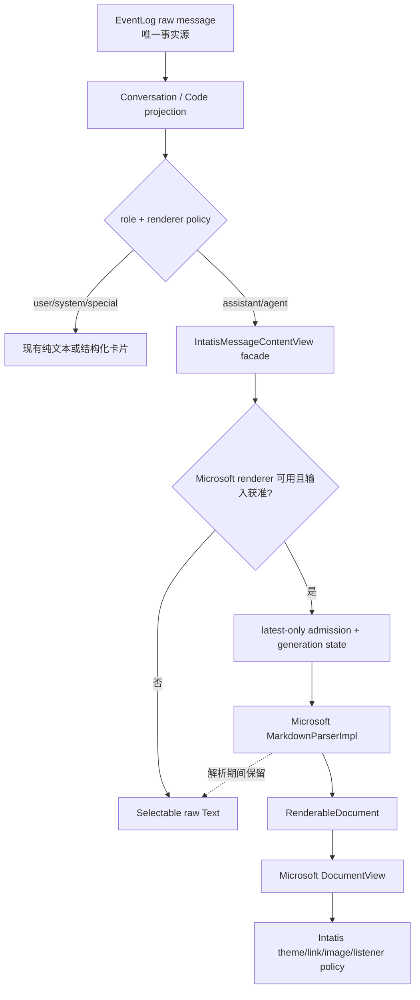

# Intatis Microsoft SwiftStreamingMarkdown 接入与旧渲染栈完整迁移报告

> 报告日期：2026-07-17
>
> 报告状态：实施前技术决策与迁移计划
>
> 固定上游：Microsoft SwiftStreamingMarkdown `v0.6.0` / `c7b12f7b3d77caa188fd1fc056d0f7ce305ef5cd`
>
> 范围：macOS Chat / Code / Cowork 与 iOS Chat 的 assistant/agent 消息显示
>
> 本轮性质：只写报告，不修改业务源码、依赖、测试、NOTICE 或项目权威文档

## MODEL_CHECK_RESULT

当前模型：GPT-5 系列 Codex；运行环境没有提供可核实的更细服务端型号。

## PATH_CHECK_RESULT

- `pwd`：`/Users/vita/Vitemis/Intatis`
- Git root：`/Users/vita/Vitemis/Intatis`
- 两者一致，符合预期仓库根目录。
- 报告创建前工作区已有大量 per-agent inference profile 相关改动，以及既有未跟踪报告；本报告没有覆盖、回退、整理或暂存这些用户改动。

## FILES_WRITTEN

- 新增：`codex-report/07_17_26-22_16-swift-streaming-markdown-adoption-migration-report.md`
- 未修改 `Apps/`、`Packages/`、`Package.swift`、`Package.resolved`、`project.yml`、`NOTICE.md`、`ThirdPartyNotices/`、测试或 `docs/`。

## 0. 技术结论

本报告建议正式采用以下方向：

> **Intatis 不再拥有 Markdown renderer。Microsoft SwiftStreamingMarkdown 作为目标上游；Intatis 只保留消息 facade、流式背压、安全策略、主题映射和 raw plain-text 熔断。**

但这项决定不等于立即把官方 `v0.6.0` 写进生产 `Package.swift`。当前应作三个不同判断：

| 判断 | 结论 |
|---|---|
| 是否继续扩写 Intatis 自有 Markdown/表格/代码/数学 renderer | **否** |
| 是否把 Microsoft SwiftStreamingMarkdown 作为首选完整替代方案 | **是** |
| 是否把官方 `v0.6.0` 原样直接进入生产包 | **否，暂不满足生产门槛** |

当前推荐状态是 **conditional go**：

1. 立即把“消息一定可见”与“是否富 Markdown”分离；raw selectable text 是永远可用的基线。
2. 用隔离 harness 固定并验证 Microsoft 官方 `v0.6.0`，不污染 Intatis 主 SwiftPM 图。
3. 优先等待或贡献上游修复；必要时只维护依赖、资源和配置暴露层面的极薄 fork。
4. 通过所有门槛后，在一个原子迁移中替换主依赖图、facade 内部实现、测试、fixture、NOTICE 与文档。
5. 正式切换后，生产回退到 raw plain text，而不是继续内置旧 MarkdownUI renderer。
6. 删除旧 MarkdownUI、自有 cmark/math/code adapter、vendored highlight.js 资源和对应旧测试，不永久维护双栈。

这一方向符合项目的开源复用原则：把解析、排版、表格、原生文本和交互交给有专业团队维护的上游；Intatis 只保留不能外包的产品边界。

## 1. “先解决 Markdown 的有无”到底是什么意思

### 1.1 消息可用性不能依赖富渲染成功

“有无 Markdown”需要拆成两层：

- **消息有没有可靠显示**：必须始终有。EventLog 中的 raw text 可以直接用系统 `Text` 显示、选择和复制。
- **消息是否进入富 Markdown projection**：是可选增强。解析器、布局或资源不可用时，可以失败关闭为 raw text。

因此第一阶段不是仓促替换 renderer，而是确立一个不随 renderer 成败变化的可用性契约：

```text
raw EventLog message
  -> role policy
  -> rich renderer available and admitted?
       yes -> upstream Markdown projection
       no  -> selectable raw Text
```

该契约已经有源码基础：`IntatisMessageContentView` 当前公开接收 `rawText`、`isComplete` 和 `policy`，并已有 `.plainText` 路径。后续只需把 plain-safe mode 提升为明确、集中、可立即切换的产品熔断，而不是再写另一套 renderer。

### 1.2 “Markdown 不可用”时必须保住什么

plain-safe mode 至少必须保证：

- 原始消息完整可见，不丢字节、不丢换行；
- 文本可以选择和复制；
- 空的未完成回复仍显示 `…`；
- session 可以打开、滚动和切换，不出现持续等待光标；
- 不创建 Markdown AST，不运行代码高亮，不加载数学字体，不发图片网络请求；
- 不修改 EventLog、Envelope、projection 或 provider 请求；
- 关闭或恢复富渲染不需要迁移任何 session 数据。

这一步解决的是产品可用性和故障熔断，不是回避 Markdown。富 Markdown 在微软路径通过验收后重新成为默认 projection。

### 1.3 不把旧 renderer 当回退路径

生产回退必须是 `microsoft | plain`，不是 `microsoft | legacy MarkdownUI | plain`。

原因包括：

- 当前旧栈正是冻结风险来源之一；
- 两套 SwiftPM 图存在确定冲突，无法安全长期并存；
- 双栈会要求维护两套样式、交互、缓存、安全门和测试；
- 用户希望解决的正是单人项目无法长期承担 renderer 维护的问题；
- Git history、上一 release 和 plain-safe mode 已提供足够的工程回滚手段。

## 2. 当前事实与本报告边界

### 2.1 当前生产只有一个富文本入口

当前公共入口是：

`Packages/IntatisSharedUI/Sources/MessageRendering/IntatisMessageContentView.swift`

公开输入保持 renderer-neutral：

```swift
messageID
rawText
isComplete
policy
style
```

业务调用点只有：

| 产品面 | 调用位置 | 迁移影响 |
|---|---|---|
| macOS Chat | `Apps/IntatisMac/Sources/IntatisChatScreen.swift` | 无需改变数据链路 |
| iOS/shared Chat | `Packages/IntatisSharedUI/Sources/Views.swift` | 无需改变数据链路 |
| Code | `Packages/IntatisSharedUI/Sources/CodeViews.swift` | 无需改变数据链路 |
| Cowork | 间接复用 `CodeItemRow` | 无需创建第四套路径 |
| 离线 fixture | `Apps/IntatisMac/Sources/RendererFixtureView.swift` | 需要更新验证内容和标签 |

因此正式替换不需要修改：

- `EventLog` schema；
- `ConversationProjection` / `CodeProjection` 的消息真值；
- provider streaming 协议；
- Chat、Code、Cowork 的 task/agent 运行机制；
- iOS 的 chat-only 平台边界。

### 2.2 当前旧渲染栈规模

当前 `MessageRendering` 自有生产源码约 1,625 行：

| 文件 | 当前行数 | 最终处置 |
|---|---:|---|
| `IntatisMessageContentView.swift` | 140 | 保留公开 facade，重写内部 |
| `IntatisRenderDocument.swift` | 809 | 删除 |
| `IntatisMathView.swift` | 296 | 删除 |
| `IntatisCodeBlockView.swift` | 380 | 删除 |

此外还有：

- `MessageRenderingTests.swift` 约 462 行旧实现专项测试；
- 三个 vendored highlight.js/CSS 文件，共 129,157 bytes；
- MarkdownUI、NetworkImage、swift-cmark、swift-snapshot-testing、iosMath 五个根级 exact 依赖；
- `NOTICE.md` 与三份 `ThirdPartyNotices` 中的旧渲染来源和许可证记录；
- 多份 `docs/` 中已固化的旧架构、门限与验证说明。

这说明只换表格不是正确终点。正确终点是上游接管完整 Markdown 显示栈，Intatis 不再维护其中任何 parser、layout、grammar 或 TeX renderer。

### 2.3 当前卡死诊断的证据边界

现有运行态证据把问题集中到含表格的 Markdown 富渲染路径，表现为应用持续转圈和 SwiftUI/AttributeGraph 布局压力。旧栈的 MarkdownUI 表格路径与 preference/measurement 反馈是主要嫌疑。

本报告不把该诊断写成未经采样的绝对结论。实施时必须用同一冻结 session 完成：

- 旧 renderer 复现；
- plain-safe mode 证明症状消失；
- Microsoft renderer 证明症状不再出现；
- Instruments/Hangs 或 `sample` 证明主线程和 AttributeGraph 不再进入原循环。

### 2.4 与 2026-07-15 旧报告的关系

`codex-report/07_15_26-chat-markdown-code-latex-rendering-research.md` 是旧方案当时的实现事实记录，不应删除或改写。

本报告是新的未来迁移决策：

- 承认旧报告中已经完成的工程和安全工作；
- 在迁移前临时保留其中的 plain fallback、安全链接/图片策略和真实 fixture；
- 不继续扩大旧 adapter；
- 切换后删除旧 renderer 源码、资源和实现耦合测试；
- 只把仍然属于产品边界的行为迁移成新上游的集成契约。

## 3. Microsoft 上游固定点与成熟度

### 3.1 固定版本

本次审计固定：

- 仓库：[microsoft/SwiftStreamingMarkdown](https://github.com/microsoft/SwiftStreamingMarkdown)
- release：[`v0.6.0`](https://github.com/microsoft/SwiftStreamingMarkdown/releases/tag/v0.6.0)
- commit：[`c7b12f7b3d77caa188fd1fc056d0f7ce305ef5cd`](https://github.com/microsoft/SwiftStreamingMarkdown/commit/c7b12f7b3d77caa188fd1fc056d0f7ce305ef5cd)
- commit 时间：2026-07-16
- 根许可证：MIT
- manifest：[Package.swift at v0.6.0](https://github.com/microsoft/SwiftStreamingMarkdown/blob/v0.6.0/Package.swift)

如果后续采用，必须使用 exact tag 或 exact revision，不得使用 README 中的浮动 `from:`。这是一个 `0.x` 且发布节奏很快的包，minor version 不能被当成稳定兼容承诺。

### 3.2 平台和公开 API

`v0.6.0` 根 manifest 声明：

- Swift tools 5.9；
- iOS 16+；
- macOS 14+；
- 单一 library product：`SwiftStreamingMarkdown`。

Intatis 当前 macOS 26 / iOS 26 deployment target 在系统版本上兼容。

主要公开 API：

| API | 用途 | Intatis 计划 |
|---|---|---|
| `MarkdownView(text:config:listener:)` | 静态完整文档 convenience view | 用于隔离 harness 对照，不直接定为生产入口 |
| `StreamedMarkdownView(source:config:listener:)` | 完整前缀快照流 convenience view | 用于隔离 harness 对照，不直接定为生产入口 |
| `MarkdownParserImpl` | 上游 parser | 需要控制 parse option 时使用 |
| `MarkdownParseOption` | speculative rewrite / LaTeX / images | 安全过渡的重要配置点 |
| `RenderableDocument` | 已解析、已应用 config 的显示快照 | 生产受控状态机的有界缓存单位 |
| `DocumentView` | 显示 `RenderableDocument` | 推荐的生产显示入口 |

静态入口源码：[MarkdownView.swift](https://github.com/microsoft/SwiftStreamingMarkdown/blob/v0.6.0/Sources/MarkdownText/MarkdownView.swift)。流式入口源码：[StreamedMarkdownView.swift](https://github.com/microsoft/SwiftStreamingMarkdown/blob/v0.6.0/Sources/MarkdownText/StreamedMarkdownView.swift)。

### 3.3 上游 CI 是积极证据，但不是生产证明

固定 commit 的官方 [CI run](https://github.com/microsoft/SwiftStreamingMarkdown/actions/runs/29519135321) 通过了：

- macOS SwiftPM unit/snapshot tests；
- iOS simulator tests；
- SwiftLint；
- macOS sample build；
- iOS sample build。

但测试面仍有明确缺口：

- 没有 `StreamedMarkdownController` / `StreamedMarkdownView` 专项回归；
- 四个 `TableViewTests` 被改名为 `skip_test...`，注释表明 CI 检测到真实失败；
- README 性能图没有公开固定语料、硬件和可复跑数值；
- sample 的更新速度远低于 Intatis 真实 1,249-delta session；
- macOS 支持在 2026-06-30 的 `v0.3.0` 才加入；
- macOS link crash 与 paragraph layout/reuse 问题在 `v0.4.0` / `v0.5.0` 才修复；
- strict concurrency 的字体/Sendable 问题仍有公开 [issue #124](https://github.com/microsoft/SwiftStreamingMarkdown/issues/124)。

所以微软团队和生产来源提高了候选优先级，但不能替代 Intatis 自己的真实 session 验证。

## 4. 为什么这套表格实现值得优先验证

Microsoft [`TableView`](https://github.com/microsoft/SwiftStreamingMarkdown/blob/v0.6.0/Sources/MarkdownText/UI/TableView.swift) 使用独立 `SwiftUI.Layout`：

- 对 cell 做有限的测量；
- 缓存列宽和行高；
- 外层使用水平滚动；
- 没有复用当前 MarkdownUI `TableBounds` / anchor-preference decoration 机制。

这不等于它没有尺寸反馈。`TableView` 的外层 `GeometryReader` 和内层 `gridView.onWidthChange` 都会写入 `@State scrollWidth`，而 `scrollWidth` 又参与 `actualColumnMaxWidths()`，进而改变 `TableLayout` 的宽度。它与旧 MarkdownUI 的 anchor-preference 路径不同，而且列宽上限可能让系统趋向固定点，但仍然存在 `layout → state → layout` 路径。

这项判断的准确边界是：

- **结构不同，值得验证**；
- **不能仅凭源码宣称已经解决当前冻结**；
- **必须用真实故障 session，叠加窗口 resize、横向滚动和 AttributeGraph 日志观察才能过门**；
- **没有证据允许直接宣称永不冻结**；
- **上游表格 snapshot tests 被跳过，Intatis 必须补真实 fixture**；
- **当前所有 cell 实际按 leading 对齐，README 所述列 alignment 尚未完整进入 renderable**；
- **table copy/download 按钮只回调 listener，listener 缺失时会形成可见但无效果的控件**。

## 5. v0.6.0 不能原样生产采用的原因

### 5.1 SwiftPM 依赖图不能和旧栈并排存在

当前根 manifest 与 Microsoft `v0.6.0` 有三组确定冲突：

| 依赖 | Intatis 当前 | Microsoft v0.6.0 图 |
|---|---|---|
| swift-cmark | exact `0.5.0` | 经 swift-markdown 解析到 `0.8.0` |
| swift-snapshot-testing | exact `1.12.0` | exact `1.19.3` |
| iosMath | `kostub/iosMath` `2.5.0` | 同 package identity 的 `junyan72/iosMath` revision |

第三项是同一 SwiftPM identity、不同 URL，不能正常共存。

直接结论：

- 不能在 Intatis 主 `Package.swift` 中加一条依赖做长期双 renderer A/B；
- 第一次真实性能验证必须使用隔离 package/app；
- 正式迁移必须一次性删除旧 root constraints，再加入新上游图；
- 生产回退依赖 raw plain text 和 Git/release rollback，而不是同一 binary 的旧 renderer。

### 5.2 畸形表格仍需要底层正式修复

Microsoft [issue #73](https://github.com/microsoft/SwiftStreamingMarkdown/issues/73) 记录过多余 pipe/列数异常导致的表格越界问题。`v0.6.0` 已在 `Table+.swift` 中增加调用 `MarkupFormatter.format()` 前的 well-formed guard，并过滤列数不匹配的行。

但该 tag 仍 exact pin `swift-markdown 0.7.3`。底层问题直到 swift-markdown [修复提交 `b2135f4`](https://github.com/swiftlang/swift-markdown/commit/b2135f426fca19029430fbf26564e953b2d0f3d3) / `0.8.0` 才有正式回归覆盖。

生产门槛应是：

1. Microsoft 发布采用 `swift-markdown >= 0.8.0` 的 tag；或
2. 极薄 fork 只升级该依赖，并在 Microsoft renderer 组合中重跑完整畸形表格 corpus。

这里的 plain fallback 不能替代修复：如果 `Document(parsing:)` 在进程内触发越界崩溃，actor、timeout、`do/catch` 或事后切 plain 都救不了当前进程。畸形表格 crash probe 必须在生产接入前通过。

不能只因为 Microsoft 本地已有 guard 或 GitHub issue 显示 closed，就把底层风险记为已彻底消失。

### 5.3 LaTeX 预处理会改写代码字面量

[`LaTexPreProcessor`](https://github.com/microsoft/SwiftStreamingMarkdown/blob/v0.6.0/Sources/MarkdownText/Parser/LaTexPreProcessor.swift) 在 Markdown parse 之前对整个字符串做正则替换。它没有先识别 fenced code 或 inline code，因此代码内容里的 `\(...\)` 也可能被转换。

这与 Intatis 当前明确要求“数学 delimiter 不得改写 code literal”冲突。

可接受路线按优先级排序：

1. 向上游贡献 code-aware LaTeX preprocessor；
2. 等待上游 release；
3. 过渡期使用公开的 `MarkdownParserImpl` + `MarkdownParseOption(latexMatchingRules: [])` + `RenderableDocument` + `DocumentView`，暂时关闭数学；
4. 不允许在 Intatis 再写一套 Markdown/code-span parser。

第三项仍是调用上游公开 parser 和 renderer，不是自研 renderer。它以暂时失去数学显示换取代码内容绝对保真，直到上游修复。

### 5.4 HighlightSwift 路径不满足当前安全和许可证要求

Microsoft 固定的 [HighlightSwift revision `99c431b...`](https://github.com/appstefan/HighlightSwift/tree/99c431b38a1444a5fd6a4978307fbbefe3a7af53) 存在以下问题：

- 内含 highlight.js 11.9.0，而 Intatis 当前审计的是 11.11.1；
- Microsoft 代码没有把 fenced language 交给 engine，而是使用自动识别；
- 自动识别会扫描多个语言；
- 没有单代码块最大字节数；
- 没有针对 highlight.js #4362 的 C/C++ fail-closed；
- package 编译进全部主题，其中 `nnfx` 源码明确标注 CC BY-SA 4.0；
- 根 MIT 不能覆盖该第三方主题自己的许可证。

Microsoft `HighlightTaskManager` 使用共享 actor/单 JSContext，说明上游已经处理过多 JavaScriptCore context 导致的内存问题，这是可以直接复用的成熟经验：[HighlightTaskManager.swift](https://github.com/microsoft/SwiftStreamingMarkdown/blob/v0.6.0/Sources/MarkdownText/UI/HighlightTaskManager.swift)。

但生产采用仍要求上游或极薄 patch 提供：

- `.disabled` 高亮策略；
- 显式 fenced language，而不是默认 auto-detect；
- 最大源码字节数和有界取消；同步 JavaScript/parse 一旦开始，普通 task cancellation/timeout 不能被当成强制中止；
- 移除不采用且许可证不合适的主题；
- 未知、超限、C/C++ 风险输入保持完整 plain code block。

在这些能力完成前，宁可让 Microsoft CodeBlockView 显示完整可复制的纯文本代码，也不能继续捆绑旧 Intatis 高亮 adapter 形成半迁移。

### 5.5 默认主题和图标不能直接成为 Intatis 资产

`v0.6.0` library target 会处理并打包：

- `Colors/Copilot/...` 默认主题资源；
- Copy / CopyFilled / downloadArrow 等 SVG/PNG；
- Microsoft 多语言字符串。

默认 [`MarkdownRenderConfig`](https://github.com/microsoft/SwiftStreamingMarkdown/blob/v0.6.0/Sources/MarkdownText/Models/MarkdownRenderConfig.swift) 直接引用这些 Copilot 资源。

即使 Intatis 运行时提供自定义颜色，这些资源仍可能进入 app bundle。根据 `OPEN_SOURCE_REUSE.md`，根 MIT 不自动授权 Intatis 使用第三方产品品牌、图标或 UI 资产。

生产采用必须二选一：

1. 上游把默认资源中性化并允许调用方替换 action icons；或
2. 极薄 fork 只移除品牌资源，改用 Intatis 自有语义颜色和 SF Symbols。

不能把 Copilot 主题换个变量名后继续分发，也不能把根 MIT 当成品牌授权。

### 5.6 Transitive manifests 实际要求 Swift 6.2 工具链解析

Microsoft 根 manifest 写的是 Swift tools 5.9，但固定依赖中的 HighlightSwift manifest 要求 Swift tools 5.10，Equatable 1.0.10 和 iosMath fork manifest 使用 Swift tools 6.0；更关键的是 [`swift-markdown 0.7.3` 的 manifest](https://github.com/swiftlang/swift-markdown/blob/0.7.3/Package.swift) 标为 Swift tools 6.2。

这意味着：

- 完整依赖图的 package-manager/manifest parser 最低门槛实际是 Swift tools 6.2；
- 这不等于所有源码使用 Swift 6.2 language mode；例如 swift-markdown manifest 仍声明 `.v5` language mode，必须区分 manifest tools version、编译器版本和 source language mode；
- 不能仅凭 Microsoft 根 manifest 宣称“Swift 5.9 toolchain 可用”；
- `docs/TESTING.md` 当前“工具链版本 Swift 5.9”与实际依赖解析要求需要在采用时重新核对；
- macOS/iOS 当前 Xcode 和 Linux/headless CI 都必须先记录 `swift --version`，并用具备 6.2 manifest 解析能力的真实环境验证；
- Equatable macro 还会引入 swift-syntax 编译成本。

这不是拒绝上游的理由，但它是一项独立工具链决策，不能藏在“替换 Markdown”里；不满足 6.2 时正式 cutover 必须停止。

### 5.7 生命周期和交互仍有产品差异

还需验证或决定：

- `RenderableDocument` 在转换时已经把字体、颜色等 config 烘焙进 attributed strings，缓存键必须包含 theme/config revision；
- `MarkdownView` / `StreamedMarkdownView` 的 controller 在初始化时捕获 source/config，主题或 source identity 变化需要明确重建 identity；
- 上游多数 `withXxx` builder 在 `v0.6.0` 没有转发 `imageConfig`，应使用完整 initializer；
- 跨 block 连续拖选由“Select more text”modal 辅助，不等同原生整篇连续选择；
- 表格 cell 本身不是逐字选择，整表复制依赖 listener；
- table copy/download 需要真实实现或可配置隐藏，不能保留死按钮；
- code copy 没有等价于当前 `intatisCodeCopyAction` 的公开 callback；应推动上游暴露动作或用 Computer Use 检查真实 pasteboard，不能为测试保留旧代码框；
- accessibility 不能只看视觉：当前旧栈已有 display-math AX label，inline math VoiceOver 仍是已知未决项；替换时必须重新验证正文/代码/数学的 VoiceOver 输出、键盘焦点以及 copy/table action 可达性；
- 图片是 experimental，remote 路径使用 `AsyncImage`，首轮必须 `.disabled`；
- URL 最终通过 SwiftUI `openURL`，必须覆盖 Intatis 的 scheme allowlist；
- `BlockView` 使用普通 `VStack`，单条 200+ block 长文必须实测内存和布局成本。

### 5.8 删除旧实现时不能丢掉产品级资源预算

Microsoft `v0.6.0` 的数学路径没有 Intatis 当前单公式约 32 KiB、每条消息 64 个公式及 bitmap/resource cap 一类的 admission budget；`BlockMathView` / `LatexViewProvider` 会把获准字符串交给 `MTMathUILabel`。代码高亮同样没有 Intatis 当前约 64 KiB 的输入上限。

因此“删除旧 809 行 cmark/math glue”不等于删除安全预算，但所有权必须划清：

- Intatis 薄层只能在 parse 前执行不理解 Markdown 语法的整条消息 UTF-8 byte/line budget；
- code block byte cap、单公式 byte cap、公式数量和 math attachment/raster cost 必须由上游公开 admission API 实现，或由准备回馈上游的通用极薄 patch 实现；
- 如果候选上游尚无这些 API，首版必须关闭 highlighting/math，不能在 Intatis 写 fenced-code/formula scanner 来恢复这些预算；
- 超出整条消息预算时完整回退 raw plain text；上游识别出的单块超限时显示完整 plain block；
- 不用 timeout 冒充对同步 parser、JavaScriptCore 或 MathUILabel 的强制终止。

这些是产品输入策略，不是授权 Intatis 重建 token、AST、代码或 TeX 识别层。

## 6. 目标架构

### 6.1 唯一事实源不变



任何 upstream AST、RenderableDocument、attributed string 或缓存都只是可丢弃 projection，不写回 EventLog。

### 6.2 保留与外包边界

| 责任 | 最终所有者 |
|---|---|
| Markdown parse / AST | Microsoft + swift-markdown |
| table/list/quote/heading/code layout | Microsoft |
| AppKit/UIKit text view | Microsoft |
| TeX parse/layout | Microsoft 的上游依赖；Intatis 不实现 |
| syntax grammar/token classification | Microsoft 的上游依赖；Intatis 不实现 |
| role policy | Intatis |
| latest-only stream backpressure | Intatis 薄 adapter |
| Intatis typography/colors | Intatis config mapping |
| URL scheme policy | Intatis `OpenURLAction` |
| Markdown image network policy | Intatis config，默认 disabled |
| raw/plain熔断 | Intatis facade |
| table copy/save product action | Intatis listener 或上游可配置隐藏 |
| EventLog/selection of source text | Intatis |

### 6.3 `IntatisMessageContentView` 公开 API 保持不变

正式实现不应让业务页面认识 Microsoft 类型。现有 facade 的输入签名保持不变，内部按状态选择：

```text
policy == plainText
  -> raw Text

policy == richText && rendererMode == plainSafe
  -> raw Text

policy == richText && renderer admitted
  -> parsing 时继续显示 raw Text
  -> generation 仍匹配时发布 Microsoft RenderableDocument
```

这一层可以新增少量 adapter 类型，但不得出现：

- 自有 Markdown token/AST；
- 自有 table layout；
- 自有 code grammar；
- 自有 TeX parser；
- 复制上游 visitor 或 renderer；
- 将 derived Markdown 作为第二事实源持久化。

### 6.4 生产建议使用受控上游状态机，而非直接把 convenience view 当黑盒

`MarkdownView` 初始持有 empty document，不能天然保证 Intatis 所需的 raw-first paint；其 controller 在初始化时捕获 config，后续 task 主要随 text 变化。`StreamedMarkdownView` 同样要求 source identity 稳定，不能在 SwiftUI `body` 更新时反复创建 source。主题、字体、消息身份或 config revision 变化必须显式失效和重建。

因此首轮生产接入建议使用上游公开的 `MarkdownParserImpl`、`MarkdownParseOption`、`RenderableDocument` 和 `DocumentView`，组成一个极薄状态机：

```text
raw projection
  ├─ plain mode / admission reject -> Text(raw)
  └─ admitted
       ├─ parsing -> 继续显示 Text(raw)
       └─ generation 仍匹配 -> DocumentView(renderable)
```

这个状态机只拥有 message identity、背压、generation cancellation、raw-first、policy 和 cache lifetime；parser、AST、table layout、TextKit、TeX 和代码块 UI 全部仍归上游。若后续官方 convenience view 暴露同等的 raw-first、config identity 和 cancellation 契约，可以再收敛回高层 API。

### 6.5 流式适配必须做背压，而不是再解析

上游 [`StreamedMarkdownView`](https://github.com/microsoft/SwiftStreamingMarkdown/blob/v0.6.0/Sources/MarkdownText/StreamedMarkdownView.swift) 的每次 emission 都是完整累计文本，并且每次重新 `Document(parsing:)`。它不是增量 AST，也没有 throttle、debounce 或 `.bufferingNewest(1)`。

Intatis 薄 source adapter 必须：

- 接收 projection 给出的最新完整 `rawText`，不直接接收单 delta；
- `AsyncStream(bufferingPolicy: .bufferingNewest(1))`；
- 约 50 ms 合并、目标约 20 Hz 仅作为初始测量值，最终由真实 session 的延迟/CPU 数据调优，不写成协议常量；
- 新订阅者立即收到当前最新快照；
- 完成时发送最终完整快照并 finish；
- message/generation identity 变化时取消旧 source；
- 永远不在 adapter 中 parse Markdown；
- ingress 队列可证明最大只有一个未消费快照。

这不是自研 renderer，而是把上游所需的完整快照协议与 Intatis 的高密度 delta 流安全连接起来。

`AsyncStream.bufferingNewest(1)` 只约束 ingress，不能自动约束 parser task 队列。解析层必须使用单一消费泵，不能每收到一个 snapshot 就再启动一个 task：每条活动消息最多允许 **1 个 running parse + 1 个可被覆盖的 pending latest snapshot**；最终 snapshot 必须覆盖 pending 并在 running 结束后得到处理。跨多条消息还需使用 session/process 级有界 parse scheduler，防止打开长历史时每个 cell 同时启动同步解析；具体并发上限由 Phase 1 数据决定。

解析/转换任务还必须携带单调 generation：旧任务即使完成，只要 message/config/source generation 已变化，就不得发布旧 `RenderableDocument`。解析调度应是 off-main、串行且有界；具体 actor/Sendable 边界必须由 strict-concurrency 构建验证，不能只靠 cancellation 假设同步工作会立即停止。

### 6.6 首轮 Microsoft config

首轮生产 config 建议：

- 使用完整 `MarkdownRenderConfig` initializer，不链式依赖有 imageConfig 转发缺陷的 builders；
- `shouldAnimateText: false`；
- `imageConfig: .disabled`；
- Intatis system semantic fonts/colors；
- 不引用 Microsoft/Copilot default theme；
- 明确 text selection background；
- code highlighting 默认 disabled，直到安全策略通过；
- citation/context menu 仅在产品明确需要时启用；
- table download 隐藏，table copy 由 listener 复制 raw Markdown；
- 外层覆盖 `OpenURLAction`，只允许 `http`、`https`、`mailto`；
- theme/config revision 参与 view identity 和完成态缓存键。

### 6.7 完成态缓存和 attachment 必须有确定性预算

若首版保留完成文档缓存，不能只以 raw text 作键，也不能依赖没有明确 cost 的默认缓存行为：

- key 至少包含 source identity/hash、theme/config revision、renderer/upstream revision 和 feature/admission mode；
- 同时设置 entry count 与估算 cost 上限，并定义 LRU/等价淘汰；
- 活动流式文档不进入完成态 cache；memory pressure、config revision 变化和 renderer revision 变化必须失效；
- 若启用 math，attachment/raster 估算必须计入 cost；无法从上游获得可靠 cost/cap 时，首版关闭 math 或不缓存含 math 的文档；
- Phase 1 必须先记录候选阈值，Phase 2 固化具体数字和测试，不能把“重复打开看起来没增长”当作唯一资源上限。

## 7. 极薄 fork 的允许边界

### 7.1 上游优先顺序

每个缺口依次采用：

1. 已发布上游 API；
2. 已合并、等待 release 的上游修复；
3. 由 Intatis 提交并希望上游接受的通用 PR；
4. 临时极薄 fork；
5. 如果 fork 必须拥有 renderer 核心，停止并重新选型，而不是继续扩张。

### 7.2 允许的临时 patch

极薄 fork 可以做：

- 升级 `swift-markdown` 精确版本；
- 移除或中性化 Copilot 颜色/图标；
- 暴露高亮 disable/language/maxBytes 配置；
- 暴露 math formula count/bytes 与 attachment cost/cap 配置；
- 暴露 table action visibility；
- 把 safe parse options 传入高层 static/stream API；
- 修复 config builder 未转发 `imageConfig`；
- 加入对应上游回归测试。

### 7.3 禁止的 fork 扩张

极薄 fork 不得：

- 重写 `Document(parsing:)` 或 CommonMark grammar；
- 自己维护另一套 Markdown AST；
- 分叉 TableLayout 算法形成 Intatis 专用 renderer；
- fork highlight.js grammar；
- fork iosMath TeX parser/layout；
- 复制整仓源码到 Intatis 的 `Packages/`；
- 保留没有 upstream issue/PR 的长期私有行为；
- 跟随浮动 `main`。

### 7.4 fork 退出条件

每个本地 patch 必须记录：

- 上游 issue/PR；
- 本地 fork commit；
- 修改原因；
- 对应回归；
- 哪个官方 release 可以删除该 patch。

一旦官方 release 吸收全部必要 patch，`Package.swift` 必须切回 Microsoft 官方 exact tag。极薄 fork 是临时供应链桥，不是 Intatis 的新 renderer 产品。

## 8. 分阶段迁移路线

### Phase 0：先保证消息永远可用

**目标：** 当前应用即使完全关闭 Markdown，也能打开问题 session、滚动、选择、复制和继续工作。

建议改动：

- 在 `IntatisMessageContentView` 上方建立集中 renderer mode；
- 支持 `plainSafe`；
- renderer mode 必须在历史消息 view 构造前可读，并提供无需先打开故障 session 的持久设置或启动参数；
- rich renderer 未完成、解析中、失败或被禁用时都先显示 raw `Text`；
- 不按 Markdown 内容写新的启发式 parser；
- 不为表格单独写 renderer；
- 问题 session 可通过一次产品级切换全部使用 plain-safe mode。

Phase 0 通过门：

- 当前卡死 session 以 plain-safe mode 打开；
- 不出现持续等待光标；
- raw text 字节、换行、选择和复制正确；
- 切换不修改 EventLog；
- 关闭并重开 session 仍可读。

**这一步完成“Markdown 有/无”中的可用性问题。** 它不是最终体验，也不扩大旧 renderer。

### Phase 1：建立隔离 Microsoft harness

**目标：** 在不修改 Intatis 主依赖图的前提下验证官方 `v0.6.0` 的真实行为。

做法：

- 在独立 scratch Swift package/app exact pin 官方 `v0.6.0`；
- 不把 harness 依赖加入根 `Package.swift`；
- 使用脱敏后的当前问题 session fixture；
- 同时验证 static `MarkdownView` 和 latest-only stream adapter；
- 对照现有 app 的 raw 文本和视觉结构；
- 记录精确 commit、Xcode、OS、机器和测试 corpus hash。

性能协议也必须在 Phase 1 固定，不能等候选看起来慢或快后再移动门槛：在一台记录型号/内存的基准 Mac 和至少一台项目定义的低端支持档位真实 iPhone/iPad 上，使用优化后的 Release 候选，至少执行 5 次 cold open、20 次相同 1,249-delta replay，并在每次完成后观察 60 秒。预算表至少记录 main-thread 最大 stall、parse p95/最大时长、peak RSS 增量、60 秒后的 residual RSS、CPU settle time、`1 running + 1 pending` backlog 和可交互延迟。具体数值由 plain-safe 基线、支持的低端硬件和产品 UX 目标确定，但进入 Phase 2 前必须书面冻结；Simulator 只负责构建和功能 smoke，不能替代真机性能、VoiceOver、字体或 attachment 验收。

必须覆盖：

- 三个表格和 42 条 pipe 行的事故输入；
- 原顺序 1,249 delta replay；
- `||||`、多余列、少列、缺 separator、半截表格；
- fenced/inline code 内 `\(...\)`、`$$`、`\[...]`；
- 100–256 KiB 长文、200+ blocks；
- 64 KiB 以上 code、C/C++、未知语言；
- Light/Dark、窗口连续缩放；
- `GeometryReader` / `onWidthChange` 表格反馈路径下的 AttributeGraph 与 hangs 采样；
- 选择、复制、table copy、code copy；
- remote/file/data image；
- links 与不允许的 scheme；
- 反复打开/关闭同一文档；
- stream 取消、session 切换和完成态。

Phase 1 go/no-go：

- 如果表格仍冻结、parser input 被改写、backlog 超界，或任何已冻结数值预算失败，停止生产接入并向上游报告；
- 如果主要问题只属于已列的配置/依赖/品牌 patch，进入 Phase 2；
- 不在 Intatis 内用自有布局绕过失败。

### Phase 2：关闭上游生产阻断项

**目标：** 得到一个可重复构建、许可证可接受、行为安全的候选 revision。

必须关闭：

1. `swift-markdown >= 0.8.0` 与畸形表格回归；
2. code-aware LaTeX，或生产首版明确禁用 math；
3. 高亮 disable/explicit language/maxBytes 和不合规主题移除；
4. Copilot 主题/图标中性化；
5. table action 可隐藏或有真实 listener 行为；
6. code copy 可由公开行为验证或有公开 callback；
7. Swift 6.2 transitive manifest 的双平台和 headless resolution；
8. config/theme identity、message/source generation 与缓存正确性；
9. Intatis syntax-agnostic whole-message budget，以及由上游提供的 code/math/attachment budgets；若后者不存在则关闭对应 feature；
10. 单一消费泵、`1 running + 1 replaceable pending` 和同步工作不可强停时的 fail-before-start 策略；
11. 完成态 cache 的 count/cost/eviction 与 attachment 成本边界；
12. VoiceOver、AX label、键盘焦点和 copy/table action 可达性合同。

候选来源优先：

- Microsoft 新 official tag；
- 否则使用固定的极薄 fork revision；
- 不接受浮动 branch。

Phase 2 通过门：

- 依赖/资源许可证清单完成；
- 所有本地 patch 有 upstream issue/PR 和删除计划；
- 没有 Intatis 专用 parser/layout 分叉；
- 隔离 harness 全矩阵通过。

### Phase 3：准备原子生产切换

**目标：** 在专用迁移分支中一次性换依赖图和 facade 内部实现，不让主包进入半迁移状态。

同一个受审改动应包含：

1. 根 `Package.swift` 删除五个旧 direct constraints；
2. 加入 Microsoft official exact tag 或极薄 fork exact revision；`IntatisSharedUI` 只通过 `.product(..., condition: .when(platforms: [.macOS, .iOS]))` 链接 Apple renderer product；
3. 更新 `Package.resolved`；
4. 重写 `IntatisMessageContentView` 内部，并把源文件 guard 改为 `canImport(SwiftUI)` + `canImport(SwiftStreamingMarkdown)`，使 CLI/Linux/headless 不编译 Apple renderer；
5. 新增 latest-only source、受控 render state、config/listener 薄 adapter；
6. 删除旧 `IntatisRenderDocument` / `IntatisMathView` / `IntatisCodeBlockView`；
7. 删除三个旧 highlight.js/CSS resources；
8. 重写 `MessageRenderingTests` 为上游集成契约，并移除旧 `canImport(MarkdownUI/iosMath)` 整文件 gate；
9. 更新 `RendererFixtureView`；
10. 更新 NOTICE、ThirdPartyNotices 和权威 docs。

不能把 package 变更和旧源码删除拆成会让默认分支不可构建的多个合并步骤。可以在迁移分支中分 commit 审阅，但进入共享主线时必须是可构建的原子状态。

### Phase 4：Intatis 生产集成验证

**目标：** 证明 Microsoft 路径在真实 Intatis shell、真实 projection 更新频率和真实 session 生命周期中成立。

自动验证至少包括：

- 新 renderer focused unit/integration tests；
- `swift build --target IntatisSharedUI`；
- full `swift test`，环境型失败单独归类；
- 核对 renderer tests 的实际 discovery/执行数量，不能只看命令 exit 0；
- IntatisMac macOS Debug build；
- IntatisiOS Simulator Debug build；
- IntatisMac 与 IntatisiOS 的优化 Release/Archive 构建，并以最终 archive/artifact 做资源、许可证和性能审计；
- 至少一台项目定义的低端支持档位 iOS 真机完成性能、VoiceOver、字体和 attachment 验收；
- Linux/headless SwiftPM resolution/build；
- `Package.resolved` 与二进制资源审计；
- `rg` 证明旧 imports、依赖和 resources 不再进入生产。

运行态必须使用 Computer Use：

- 打开问题 session；
- 回放流式输出；
- 连续滚动；
- 缩放窗口；
- 选择和复制正文、代码、表格；
- VoiceOver 朗读正文/代码/数学，并用键盘遍历链接、copy 和 table actions；
- 切 Light/Dark；
- 在 Chat、Code、Cowork 分别打开同一类消息；
- iOS simulator 检查 Chat 功能子集，并在真实低端支持档位设备复跑性能、VoiceOver、字体和 attachment 场景；
- 切换 `microsoft` / `plainSafe`，确认无需改 session 数据。

Computer Use 负责可见行为；同时使用 Instruments Time Profiler/Hangs 或等价采样负责性能事实。不能仅凭“鼠标能动”声明主线程安全。

Phase 4 通过门：

- 使用与 Phase 1 相同的 fixture hash、真实 Mac/iOS 设备、OS、优化 Release build、5 次 cold open、20 次 replay 和 60 秒稳态窗口；
- main-thread stall、可交互延迟、peak/residual RSS、parse latency 和 CPU settle time 均落在事先冻结的数值预算内；没有预算表则不得判定 go；
- 无 AttributeGraph layout cycle；
- parser work 可证明最多 1 running + 1 replaceable pending，session 级 scheduler 并发不超已定上限；
- 送入 parser 的最终 UTF-8 snapshot 与 EventLog/projection String 完全一致；富视图按 Markdown 语义验收，raw/plain 与明确 copy/export 动作另行做字节/换行保真验收；
- remote images 默认零请求；
- URL 只经 Intatis policy 打开；
- plain-safe mode 在任何 renderer failure 下都可用。

### Phase 5：生产切换与旧栈彻底退出

**目标：** 默认使用 Microsoft，旧 renderer 不再存在于生产源码或 root direct dependency 图。

切换状态：

```text
before: legacy rich | plain
after:  microsoft rich | plain-safe
```

完成时必须满足：

- `MarkdownUI` 不在 root dependency graph；
- `NetworkImage` 不再因为 MarkdownUI 被固定；
- 旧 `swift-cmark 0.5.0` exact constraint 删除；
- 旧 `swift-snapshot-testing 1.12.0` exact constraint 删除；
- 旧 `kostub/iosMath 2.5.0` direct dependency 删除；
- 自有 Markdown AST inspection/math rewrite/code highlighter 源码删除；
- vendored highlight.js/CSS 删除；
- 旧 implementation-specific tests 删除或重写；
- app/SharedUI 产物不含旧资源；
- Chat/Code/Cowork/iOS 调用点仍只认识 facade；
- raw EventLog 无 schema migration；
- 历史 session 原样可读。

这时旧实现只存在于 Git history 和历史报告，不存在于当前生产 target。

“旧栈退出”不要求 `Package.resolved` 完全看不到 `swift-cmark`、iosMath 或高亮组件；它们可能仍是 Microsoft 的传递依赖。完成标准是 Intatis 不再直接 pin、import、桥接或维护旧引擎，并且最终传递资源通过许可证与 bundle 审计。

### Phase 6：发布、上游回归与 fork 退出

**目标：** 关闭分发合规，并尽快回到 Microsoft 官方 tag。

需要：

- 更新 `NOTICE.md`；
- 重写 `ThirdPartyNotices/MarkdownRendering.md`；
- 按最终资源图重写 `SyntaxHighlighting.md`；
- 按 iosMath fork 的单字体资源重写 `MathRendering.md`；
- 明确接受或拒绝 Latin Modern Math 的 GUST Font License / LPPL 1.3c-or-later；
- 在最终 app bundle 中提供用户可访问的第三方声明；
- 核对未使用的 Copilot/CC-BY-SA 资源确实不在 bundle；
- 记录上游 tag、commit、fork patch ledger；
- 上游 release 吸收 patch 后切回官方 exact tag；
- 重新运行完整 build/test/Computer Use/Instruments 矩阵。

## 9. 精确文件迁移清单

### 9.1 保留公开职责、重写内部

| 文件 | 动作 | 说明 |
|---|---|---|
| `Packages/IntatisSharedUI/Sources/MessageRendering/IntatisMessageContentView.swift` | 保留并重写 | facade 签名、role policy、plain fallback、link policy 保持 |
| `Apps/IntatisMac/Sources/RendererFixtureView.swift` | 更新 | 使用事故输入、流式 replay、Microsoft 行为和 plain-safe mode |
| `Apps/IntatisMac/Sources/IntatisMacApp.swift` | 原则上保留 | 继续使用 `-IntatisRendererFixture` 分支；若入口必须调整，只做局部编辑，避免覆盖当前 inference 工作改动 |
| `Packages/IntatisSharedUI/Tests/MessageRenderingTests.swift` | 重写 | 从旧实现细节转成上游集成契约 |
| `Package.swift` | 原子替换依赖 | 不保留双 renderer；product 继续只对 macOS/iOS 条件链接 |
| `Package.resolved` | 更新 | 固定最终 exact graph |

### 9.2 可以新增的薄适配文件

可以把以下职责放在一个或少量小文件中：

- `IntatisMarkdownAdapter.swift`：config、listener、renderer mode、syntax-agnostic whole-message admission；
- `IntatisStreamingMarkdownSource.swift`：latest-only complete snapshots；
- `IntatisMarkdownRenderState.swift`：raw-first、generation、parse/publish/cancel 生命周期；

文件名可在实施时调整，但职责不得扩展到解析或布局。

### 9.3 最终删除

```text
Packages/IntatisSharedUI/Sources/MessageRendering/IntatisRenderDocument.swift
Packages/IntatisSharedUI/Sources/MessageRendering/IntatisMathView.swift
Packages/IntatisSharedUI/Sources/MessageRendering/IntatisCodeBlockView.swift
Packages/IntatisSharedUI/Sources/MessageRendering/Resources/highlight.min.js
Packages/IntatisSharedUI/Sources/MessageRendering/Resources/a11y-light.css
Packages/IntatisSharedUI/Sources/MessageRendering/Resources/a11y-dark.css
```

如果 `MessageRendering/Resources` 变空，还要删除 `Package.swift` 的 `.process("MessageRendering/Resources")`。

### 9.4 不应修改的业务链路

原则上不改：

- `ChatLoop` / `AgentLoop` delta 和完成事件；
- `EventLog` / Envelope schema；
- `ConversationProjection` / `CodeProjection` 的 raw text 累加；
- provider 请求和 usage 逻辑；
- Cowork scheduler/MessageBus/permission；
- iOS 的 Tools/Permission/AgentKernel/Cowork 排除边界；
- `project.yml` 的 app product 依赖结构。

`project.yml` 当前 app 只链接 `IntatisSharedUI`，通常不需要直接声明 Microsoft package。若实际 XcodeGen resolution 证明需要变更，只做生成工程所必需的最小修改。

### 9.5 权威文档更新

正式落地时必须同步：

- `docs/CURRENT_STATE.md`
- `docs/PROJECT_MAP.md`
- `docs/ARCHITECTURE.md`
- `docs/DO_NOT_BREAK.md`
- `docs/TESTING.md`
- `docs/NEXT_TARGET.md`
- `NOTICE.md`
- `ThirdPartyNotices/MarkdownRendering.md`
- `ThirdPartyNotices/SyntaxHighlighting.md`
- `ThirdPartyNotices/MathRendering.md`

旧报告保留历史，不把过去已经发生的实现事实改写成从未存在。

## 10. 新测试契约

旧测试的大量断言绑定 Intatis 自有 cmark/math/highlight adapter，不能原封不动证明 Microsoft renderer。

### 10.1 必须保留的产品契约

- raw EventLog text 是唯一真值；
- assistant/agent 才进入 rich path；
- user/system/special cards 不扩大信任范围；
- 空的 active message 显示 `…`；
- plain-safe mode 保留完整 raw text；
- links 只允许 `http` / `https` / `mailto`；
- Markdown images 默认 disabled；
- Light/Dark/theme revision 不命中旧缓存；
- VoiceOver/AX label、键盘焦点和 copy/table action 在 macOS/iOS 的差异有明确验收；
- 送入 parser 的 final UTF-8 snapshot 与 raw source 一致；rich visual semantics、raw/plain 和 copy/export 保真分别断言；
- stream 只保留最新完整快照；
- cancel/session switch 不发布旧文档；
- unknown/oversize/failed input 回退 plain；whole-message budget 必测，code/formula budgets 只有在上游提供且对应 feature 启用时才验收，否则验证 feature 确实关闭；
- macOS/iOS 均可构建；
- Linux/headless target 不意外链接 Apple UI runtime。

### 10.2 上游风险回归

| 类别 | 必测输入 | 通过条件 |
|---|---|---|
| 事故回放 | 当前冻结 session | 无 layout cycle；stall/CPU/RSS 落在 Phase 1 冻结预算内 |
| Streaming | 原始 1,249 delta | 最多 1 running + 1 replaceable pending；最终 parser input UTF-8 与 projection 一致 |
| Table | 多列、长行、半截、<code>&#124;&#124;&#124;&#124;</code>、缺/多 cell | 不崩溃、不冻结 |
| Code fidelity | code 内数学 delimiter | 字面量不被改写 |
| Highlight | C/C++、未知语言、超限 | 完整 plain code，可复制 |
| Images | http/https/file/data | 默认不发请求 |
| Links | allowlisted 与非法 scheme | 只经 Intatis OpenURLAction |
| Theme | Light/Dark 来回切换 | 字体/颜色无旧 config 残留 |
| Cache | source/config/renderer revision、memory pressure、cost 压力 | key 正确失效，entry/cost 不越界，LRU 可观察 |
| Lifecycle | 打开/关闭同 session 20–30 次 | tasks 结束；peak/residual RSS 落在冻结预算内 |
| Resize | 连续改变窗口宽度 | 无错位、循环、残留 attachment |
| Selection | 中英文/emoji/跨段/表格/代码 | 行为明确、复制结果正确 |
| Accessibility | 正文/代码/数学/链接/表格动作 | VoiceOver 语义正确、键盘可达、平台差异有记录 |
| Fallback | 强制 plain-safe | 不改 EventLog，立即可读 |

### 10.3 Computer Use 验收顺序

1. plain-safe mode 打开事故 session；
2. 独立 Microsoft harness 打开同一 fixture；
3. 生产集成后的 Chat 打开同一 session；
4. Code/Cowork 打开含表格、代码、数学的 agent message；
5. Light/Dark；
6. Copy、选择、横向滚动、table action；
7. VoiceOver + keyboard 遍历正文、代码、数学、链接和表格动作；
8. stream replay 中持续滚动和切 session；
9. 连续 resize；
10. 强制切回 plain-safe；
11. 重启后确认 raw session 仍可读。

每步同时记录：

- wait cursor；
- UI responsiveness；
- CPU；
- main-thread hangs；
- memory；
- console 的 AttributeGraph/constraint warning；
- 最终复制文本。

### 10.4 防止“测试绿色但零覆盖”

当前 `MessageRenderingTests.swift` 整个文件受 `#if canImport(...)` 旧模块 gate 约束。若只移除 MarkdownUI/iosMath 依赖而没有先重写 gate，29 个 renderer tests 可能直接不参与编译，`swift test` 仍然返回成功。

迁移验收必须同时证明：

- 新测试 import 的是最终 Microsoft product 或 Intatis adapter；
- test discovery 清单中能看到新的 renderer contract tests；
- CI 记录实际执行数和关键测试名称；
- 不允许用整文件 `canImport` 把生产依赖缺失变成静默 skip；
- snapshot 或平台限制导致的 skip 必须逐项可见，不能用“总命令是绿色”代替覆盖证明。

## 11. 依赖与许可证清单

以下是 `v0.6.0` 当前图，不代表未来 release 自动沿用：

| 组件 | 当前固定版本 | 许可证/分发关注点 |
|---|---|---|
| SwiftStreamingMarkdown | 0.6.0 / `c7b12f7...` | MIT；仍含 Copilot 命名资源和媒体图标 |
| equatable | 1.0.10 | Apache-2.0；macro，传递引入 swift-syntax |
| swift-markdown | 0.7.3 | Apache-2.0 + Runtime Library Exception；manifest tools 6.2；要求升级以纳入表格修复 |
| swift-cmark | 0.8.0 transitive | BSD-2 + 已识别 MIT-derived runtime portions |
| HighlightSwift | `99c431b...` | wrapper MIT、highlight.js BSD-3；编译含 CC BY-SA `nnfx` 主题 |
| junyan72/iosMath | `ba9ab772...` | engine MIT；Latin Modern Math 字体为 GUST/LPPL |
| SwiftUI-Shimmer | 1.5.1 | MIT |
| swift-snapshot-testing | 1.19.3 | MIT；上游 test target，仍参与 resolve |

正式采用前必须从最终 pin 重新审计，不能复制本表作为永久声明。

特别注意：

- SwiftStreamingMarkdown 根 MIT 不覆盖 HighlightSwift 内第三方主题许可证；
- iosMath engine MIT 不覆盖字体许可证；
- 不使用某个 theme 不等于它没有被编译/分发；
- 自定义 config 不等于 Copilot 资源没有进入 bundle；
- 最终合规判断必须检查实际 app artifact，而不只看源码调用路径。

## 12. 回退和事故处置

### 12.1 运行时回退

唯一保证可用的运行时回退是 raw plain text：

- 可集中关闭 Microsoft rich projection；
- 不删除、不迁移 session；
- 不清空 renderer cache 之外的任何持久数据；
- 下次打开可直接读取同一 EventLog；
- 可以在没有网络、字体或 JS engine 的情况下工作。

### 12.2 发布回退

如果 Microsoft 版本出现生产回归：

- 回退到上一个已知 release；或
- 发布 plain-safe hotfix；
- 保留事故 fixture 并上报 upstream；
- 不在热修中恢复旧 renderer 源码；
- 不在压力下新增本地 parser/layout patch。

### 12.3 fork 事故

如果极薄 fork 开始需要维护 renderer 核心：

1. 停止扩张；
2. 把当前版本固定在 plain-safe；
3. 重新评估 Microsoft 新 release 或另一成熟上游；
4. 不因为已投入 token 而继续沉没成本。

## 13. 完成定义

### 13.1 “Markdown 已恢复可用”

满足以下条件即完成第一层：

- 问题 session 可用 plain-safe 打开；
- 所有 raw message 可见、可选、可复制；
- 应用不因 Markdown renderer 进入持续 wait cursor；
- 不更改 EventLog；
- 富渲染仍可独立验证和切换。

### 13.2 “Microsoft 已可生产采用”

需要：

- 官方 tag 或极薄 fork exact revision；
- Phase 2 编号列出的全部生产阻断项关闭；
- 隔离 harness 与生产集成矩阵通过；
- Computer Use + Instruments 通过；
- 优化后的 Release/Archive 许可证和实际 bundle 资源审计完成；
- macOS/iOS/headless 构建边界通过；
- plain-safe 熔断通过。

### 13.3 “旧栈已全部替换”

需要同时满足：

- 生产 target 不 import MarkdownUI；
- 根 manifest 不再 pin 旧五项 renderer dependencies；
- 三个旧 renderer 源文件和三个旧 resources 已删除；
- 旧 implementation-specific tests 已删除或重写；
- NOTICE/ThirdPartyNotices/docs 已更新；
- app artifact 不含 Intatis 旧 vendored highlight.js/CSS、MarkdownUI/NetworkImage 资源或旧 `kostub/iosMath` 直连产物；
- Chat、Code、Cowork、iOS 仍只通过同一 facade；
- 旧 session 无迁移即可读取；
- rollback 不依赖把旧栈重新编译进 binary。

历史报告、Git history 和旧 release 中出现旧依赖不违反该完成定义。

## 14. 当前未决问题

实施前仍需确认：

1. 是否接受 iosMath fork 中 Latin Modern Math 的 GUST/LPPL 分发义务；
2. 第一版生产 cutover 是否允许暂时关闭数学；
3. 第一版是否允许代码块先保持完整纯文本、不着色；
4. table download 应隐藏、复制 Markdown，还是导出文件；
5. “Select more text”modal 是否满足 Intatis 的整篇选择体验；
6. Microsoft 下一个 release 是否会升级 swift-markdown；
7. Microsoft/HighlightSwift 是否愿意接收 highlighter policy 与主题清理 PR；
8. Copilot 资产能否在官方 package 中中性化；
9. strict concurrency issue #124 对 Intatis Xcode 26 warnings/errors 的实际影响；
10. Equatable macro/swift-syntax 对 clean build 时间和 binary graph 的影响；
11. Linux/headless resolver 是否具备 Swift 6.2 manifest 解析能力；
12. 当前事故 session 的脱敏 replay fixture 应存在哪里，才能可复现又不泄漏私密内容。

在这些问题得到证据前，报告中的 production adoption 状态保持 conditional go。

## 15. 证据索引

### Microsoft SwiftStreamingMarkdown

- [Repository](https://github.com/microsoft/SwiftStreamingMarkdown)
- [v0.6.0 release](https://github.com/microsoft/SwiftStreamingMarkdown/releases/tag/v0.6.0)
- [Exact commit c7b12f7](https://github.com/microsoft/SwiftStreamingMarkdown/commit/c7b12f7b3d77caa188fd1fc056d0f7ce305ef5cd)
- [Package.swift](https://github.com/microsoft/SwiftStreamingMarkdown/blob/v0.6.0/Package.swift)
- [MarkdownView](https://github.com/microsoft/SwiftStreamingMarkdown/blob/v0.6.0/Sources/MarkdownText/MarkdownView.swift)
- [StreamedMarkdownView](https://github.com/microsoft/SwiftStreamingMarkdown/blob/v0.6.0/Sources/MarkdownText/StreamedMarkdownView.swift)
- [MarkdownParserImpl](https://github.com/microsoft/SwiftStreamingMarkdown/blob/v0.6.0/Sources/MarkdownText/Parser/MarkdownParserImpl.swift)
- [LaTexPreProcessor](https://github.com/microsoft/SwiftStreamingMarkdown/blob/v0.6.0/Sources/MarkdownText/Parser/LaTexPreProcessor.swift)
- [RenderableDocument](https://github.com/microsoft/SwiftStreamingMarkdown/blob/v0.6.0/Sources/MarkdownText/Models/RenderableDocument.swift)
- [DocumentView](https://github.com/microsoft/SwiftStreamingMarkdown/blob/v0.6.0/Sources/MarkdownText/UI/DocumentView.swift)
- [TableView](https://github.com/microsoft/SwiftStreamingMarkdown/blob/v0.6.0/Sources/MarkdownText/UI/TableView.swift)
- [TableViewTests](https://github.com/microsoft/SwiftStreamingMarkdown/blob/v0.6.0/Tests/MarkdownTextTests/TableViewTests.swift)
- [CodeBlockView](https://github.com/microsoft/SwiftStreamingMarkdown/blob/v0.6.0/Sources/MarkdownText/UI/CodeBlockView.swift)
- [HighlightTaskManager](https://github.com/microsoft/SwiftStreamingMarkdown/blob/v0.6.0/Sources/MarkdownText/UI/HighlightTaskManager.swift)
- [MarkdownRenderConfig](https://github.com/microsoft/SwiftStreamingMarkdown/blob/v0.6.0/Sources/MarkdownText/Models/MarkdownRenderConfig.swift)
- [CI run 29519135321](https://github.com/microsoft/SwiftStreamingMarkdown/actions/runs/29519135321)
- [Malformed table issue #73](https://github.com/microsoft/SwiftStreamingMarkdown/issues/73)
- [Strict concurrency issue #124](https://github.com/microsoft/SwiftStreamingMarkdown/issues/124)

### Transitive upstreams

- [swift-markdown issue #238](https://github.com/swiftlang/swift-markdown/issues/238)
- [swift-markdown 0.7.3 manifest（Swift tools 6.2）](https://github.com/swiftlang/swift-markdown/blob/0.7.3/Package.swift)
- [swift-markdown table fix b2135f4](https://github.com/swiftlang/swift-markdown/commit/b2135f426fca19029430fbf26564e953b2d0f3d3)
- [HighlightSwift exact revision](https://github.com/appstefan/HighlightSwift/tree/99c431b38a1444a5fd6a4978307fbbefe3a7af53)
- [iosMath fork exact revision](https://github.com/junyan72/iosMath/tree/ba9ab7729b151329c54fd895a7c1859981d9484c)

### Intatis 本地依据

- `Package.swift`
- `Package.resolved`
- `Packages/IntatisSharedUI/Sources/MessageRendering/`
- `Packages/IntatisSharedUI/Tests/MessageRenderingTests.swift`
- `Apps/IntatisMac/Sources/RendererFixtureView.swift`
- `NOTICE.md`
- `ThirdPartyNotices/MarkdownRendering.md`
- `ThirdPartyNotices/SyntaxHighlighting.md`
- `ThirdPartyNotices/MathRendering.md`
- `codex-report/07_15_26-chat-markdown-code-latex-rendering-research.md`
- `docs/CURRENT_STATE.md`
- `docs/PROJECT_MAP.md`
- `docs/ARCHITECTURE.md`
- `docs/DO_NOT_BREAK.md`
- `docs/OPEN_SOURCE_REUSE.md`
- `docs/TESTING.md`
- `docs/NEXT_TARGET.md`

## PROJECT_AUDIT_SUMMARY

- Intatis 当前已经有单一 renderer facade，适合完整替换而无需改动业务链路。
- raw EventLog text 已经是唯一事实源，天然允许 renderer replacement 和 plain-safe fallback。
- 当前旧栈约 1,625 行生产 adapter、462 行专项测试和 129,157 bytes vendored resources。
- 当前五个 root renderer dependencies 与 Microsoft graph 不能安全并排解析。
- Microsoft 的表格 layout 不复用当前最可疑的 anchor-preference 机制，但仍有 `scrollWidth` 驱动的 layout/state 反馈，必须用事故 session 实测。
- Microsoft 的流式入口仍是完整快照全量重解析，Intatis 必须做 latest-only backpressure。
- Microsoft 的高层 convenience views 不天然提供 Intatis 所需的 raw-first/config identity 契约，首轮生产应优先采用公开低层 API 构建薄状态机。
- 官方 `v0.6.0` 仍存在底层依赖、LaTeX fidelity、高亮安全/许可证、品牌资源和测试成熟度门。
- 正确迁移面集中在 `IntatisSharedUI/MessageRendering`、根 package graph、fixture/tests、NOTICE 和 docs。
- Chat/Code/Cowork/EventLog/provider/permission/Cowork 编排不应被本次迁移改变。

## DOCS_CONTENT_SUMMARY

本轮重新阅读并核对：

- `/Users/vita/Vitemis/AGENTS.md`
- 项目 `AGENTS.md`（由会话入口提供）
- `docs/CURRENT_STATE.md`
- `docs/PROJECT_MAP.md`
- `docs/ARCHITECTURE.md`
- `docs/DO_NOT_BREAK.md`
- `docs/OPEN_SOURCE_REUSE.md`
- `docs/TESTING.md`
- `docs/NEXT_TARGET.md`

与本报告直接相关的项目约束是：

- raw EventLog message 是唯一真值；
- assistant/agent 与 user/system/special card 的角色边界不能扩大；
- 不在 Intatis 内重写 Markdown parser、code grammar 或 TeX engine；
- remote Markdown image 默认阻断，链接 scheme 受限；
- 上游依赖、资产、字体和传递资源必须逐项审计；
- 不复制第三方品牌/UI 资产；
- iOS 必须保持 chat-only 子集；
- 依赖变更必须更新 NOTICE、ThirdPartyNotices 和相应 docs；
- 文档任务至少执行 `git diff --check` 和 `git status --short`。

本报告只形成未来迁移方案，没有改变当前持久行为，因此本轮不更新 `docs/` 权威状态。实施 Phase 0 或任何后续源码阶段时，必须立即同步对应文档，不能等全部迁移结束后一次补写。

## VALIDATION_RESULT

- 已执行 `pwd`、`git rev-parse --show-toplevel`、`git status --short`。
- 已检查现有 `codex-report/` 命名和结构。
- 已核对 Intatis 当前 `Package.swift`、renderer 源码、fixture、测试、NOTICE 与 ThirdPartyNotices。
- 已核对 Microsoft `v0.6.0` exact checkout、公开 API、stream/parser/table/config/code/math 实现、依赖图、测试和 CI 结果。
- 已通过 swiftlang 官方 `swift-markdown 0.7.3` manifest 复核其 Swift tools 6.2 解析门槛。
- 已核对 HighlightSwift exact revision 中的 highlight.js 版本与 CC BY-SA `nnfx` 主题声明。
- 已核对 Microsoft iosMath fork 的单字体和 GUST/LPPL 边界。
- 已执行文档级 `git diff --check`、新文件 whitespace check 和最终 `git status --short`，均未发现本报告的格式错误。
- **未运行构建/测试。** 本轮只新增 Markdown 技术报告，没有修改业务源码、依赖、测试或构建配置。
- 未运行本地 Microsoft crash probe；本轮范围是形成实施报告。相关表格结论使用官方 issue、固定源码 guard 和 swift-markdown 正式修复证据，生产计划仍要求以后在真实组合中复验。

## UNCERTAINTIES

- 当前问题 session 的完整 Instruments 采样尚未形成可归档证据；Markdown 表格路径是高置信嫌疑，不写成百分之百根因。
- 本轮没有证明 Microsoft renderer 在 Intatis 真实 1,249-delta replay 下达到性能门槛。
- `v0.6.0` 的本地 malformed-row guard 与 `swift-markdown 0.8.0` 正式修复之间的剩余组合风险需要真实 corpus 验证。
- Microsoft 后续 tag 是否接受/包含依赖升级、code-aware LaTeX、高亮策略和资源中性化目前 `UNKNOWN`。
- 公开仓库非常新，不能由 Microsoft 品牌推导出 macOS 长期稳定性。
- GUST/LPPL 字体许可证是否由项目负责人明确接受尚未确认。
- 极薄 fork 是否最终需要建立，取决于上游 release 节奏和 PR 接受情况。
- 第一版是否接受暂时关闭数学/代码着色，需要产品决定。
- 本报告无法证明市场上绝对不存在另一个更成熟但未纳入本轮的 Swift renderer。

## NEXT_RECOMMENDED_ACTION

下一步建议只实施 **Phase 0 + Phase 1**：

1. 给现有 facade 建立可验证的 plain-safe mode，先让问题 session 永远可打开；
2. 建立与 Intatis 根 SwiftPM 图隔离的 Microsoft exact-version harness；
3. 用当前事故 session 的脱敏 fixture、1,249 delta replay、Computer Use 和 Instruments 得到 go/no-go 证据；
4. 不修改主 `Package.swift`，不删除旧栈，不创建长期 fork，直到隔离验收完成；
5. 验收后再决定等待 official tag，还是建立只含已列允许 patch 的极薄 fork。

这一步完成后，再按 Phase 2–6 连续推进到旧栈完全退出。
