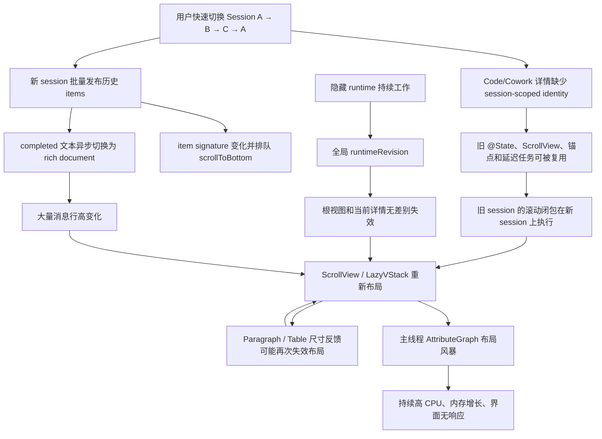

# Intatis Session 切换布局风暴修复计划

> 日期：2026-07-24
>
> 状态：已实施并完成受控验证；最终结果见第 16 节
>
> 适用范围：macOS Code / Cowork 的 session 主界面；Chat 历史回放问题作为独立工作流处理
>
> 当前判断：为页面补 `.id(sessionID)` 只能止血，正式修复还必须关闭旧 session 滚动任务、隐藏 runtime 的全局刷新传播，以及富文本视图中的尺寸反馈回路

## MODEL_CHECK_RESULT

- 当前执行环境可确认是 Codex / GPT-5 系列 Agent。
- 运行时没有暴露更精确的 deployment 名称，因此不编造具体小版本。

## PATH_CHECK_RESULT

- `pwd`：`/Users/vita/Vitemis/Intatis`
- Git root：`/Users/vita/Vitemis/Intatis`
- 两者与项目预期路径一致。
- 工作树已有大量未提交改动；本计划将其全部视为用户现有工作，不覆盖、不回退、不暂存。

## FILES_WRITTEN

- `codex-report/07_24_26-13_57-session-switch-layout-storm-remediation-plan.md`

## 0. 结论先行

这次“快速切换多个 session 后进程卡死”不是单纯的数据量大，也不是 provider、网络、Markdown 解析器或锁死造成的等待。

现有运行样本显示：

- App 仍在主动执行，而不是阻塞等待；
- 主线程长期占用接近一个 CPU 核心；
- 绝大部分采样落在 SwiftUI / AttributeGraph 的 transaction flush、子图更新、LazyVStack 放置和 ScrollView 布局；
- 内存同时升至约 2.6 GB footprint；
- 热栈中反复出现 Code/Cowork item、消息内容视图、滚动布局和锚点换算。

因此，当前事故应定性为：

> session 切换触发的展示生命周期污染，叠加无代际保护的自动滚动、全局 runtime 刷新传播和富文本高度变化，最终形成主线程布局风暴与内存放大。

修复必须同时满足两个看似相反、实际可以兼容的目标：

1. 切走 session 后，该 session 的 runtime 和正在工作的 agent 继续运行；
2. 切走 session 后，该 session 的消息、滚动和富文本变化不再驱动当前页面重新布局。

这意味着不能通过“切换时 stop runtime”规避问题。正确做法是保留后台计算生命周期，但隔离前台展示生命周期。

## 1. 本计划解决什么，不解决什么

### 1.1 本计划直接解决

- Code / Cowork 快速切换 session 时出现持续高 CPU、内存膨胀和界面无响应；
- 旧 session 已排队的 `scrollToBottom` 在新 session 上执行；
- 所有已打开 runtime 的任意 `objectWillChange` 都让根视图和当前详情重新计算；
- session 切换后，线程局部状态继续沿用上一 session 的结构身份；
- completed 消息从纯文本切换为 rich document 后的高度变化造成重复滚动和布局；
- Paragraph / Table 中可能存在的尺寸反馈回路；
- 重新进入已完成 session 时，不应呈现“仍在逐 token 输出”的视觉效果。

### 1.2 单独处理、但纳入回归验证

Chat 历史消息“重新进入后逐条、逐 token 发布”的问题与本次 Code/Cowork 布局风暴不是同一条根因链：

- Chat 当前从历史起点消费事件流，并在 replay 过程中持续发布投影；
- Code / Cowork 的普通历史恢复会先折叠本地事件，再发布最终快照；
- 因此 Chat 需要独立的“历史一次性恢复 + live 增量订阅”修复。

本计划为 Chat 单列阶段，避免把两类问题混在同一补丁中。

### 1.3 明确不在本计划中修改

- EventLog JSONL schema、Envelope、`seq` 单调性或 durable storage 语义；
- provider、模型选择、权限三层门、CapabilityLease、WorkspaceLease；
- Cowork scheduler、MessageBus 或 agent 编排模型；
- session 切换、窗口关闭时的 runtime 存活语义；
- Markdown / 代码块 / LaTeX 的功能集合；
- 用户选择的字体；
- 新的第三方依赖。

## 2. 事故证据与可信度分级

### 2.1 已确认：主线程正在发生布局风暴

事故现场的 IntatisMac 进程表现为：

- 进程状态为运行态；
- CPU 约 99%–100%；
- RSS 约 1.7–1.9 GB；
- footprint 约 2.6 GB；
- 5 秒采样的 3269 个主线程样本全部处于活跃调用栈；
- 约 3120 个样本位于 SwiftUI transaction flush；
- 2627 个样本位于 `AG::Subgraph::update`；
- 热点包含 `LazySubviewPlacements.updateValue`、`placeSubviews`、`ScrollViewLayoutComputer`、`ForEachState`、`RootGeometry` 和锚点换算。

这足以排除“进程只是等待模型返回”或“典型互斥锁死”作为当前卡死的主要解释。

### 2.2 已确认：切换时加载的是大量已完成历史

现场两个 Cowork session 的事件规模大致为：

| Session | EventLog 大小 | 事件数 | `message_delta` | `message_completed` |
|---|---:|---:|---:|---:|
| 较大 session | 约 2.62 MB | 2813 | 1900 | 37 |
| 较小 session | 约 572 KB | 755 | 674 | 4 |

切换附近新增的是 runtime 恢复、lease 等控制面事件，不是模型仍在为旧历史持续输出。

因此，“看起来仍在输出”不能直接解释为 provider 正在生成；展示层发布和布局更可疑。

### 2.3 已确认：Chat 有页面身份，Code / Cowork 没有同等隔离

- Chat 在 `IntatisChatScreen.swift` 中以 session ID 设置页面身份；
- Code / Cowork 在 `IntatisMacRootView.swift` 的同一结构位置替换 `vm`，但没有同等的 session identity；
- SwiftUI 因而有机会复用上一 session 的 `@State`、ScrollView、锚点、异步任务和内部布局缓存。

这不是完整根因，但它是 session 状态串扰的直接入口。

### 2.4 已确认：滚动请求没有 session 代际保护

Code 与 Cowork 当前都存在以下模式：

- item signature 变化后触发自动滚动；
- 使用 `DispatchQueue.main.async` 延迟执行；
- 使用共享的静态 bottom anchor；
- 没有 session ID、generation 或 cancellation token；
- bulk 历史替换和 rich 高度变化都可能继续排队。

因此旧 session 的闭包可以在用户已经切到新 session 后才执行，并针对新树触发滚动与布局。

### 2.5 已确认：隐藏 runtime 会传播到当前根视图

`AppSessionRuntimeManager` 按 `{SessionKind, SessionID}` 保留已打开 runtime，这是正确且必须保留的 Phase L 行为。

问题在于 manager 同时：

- 观察每个 runtime 的 `objectWillChange`；
- 每次变化都增加全局 `@Published runtimeRevision`；
- 根视图观察整个 manager；
- `runtimeRevision` 没有承载具体数据，只用于迫使观察者失效。

结果是：

> 后台 session 的 token、状态或投影变化，虽然没有把后台详情视图继续挂在屏幕上，仍会使当前根视图和当前详情重新求值。

当前工作树还把这条桥从排队到主线程改成了同步 `MainActor.assumeIsolated`。它是明显放大器，但即使恢复异步调度，全局无差别失效本身仍需要结构性移除。

### 2.6 强推断：富文本切换放大了已有布局抖动

completed 历史消息会经历：

1. 先显示纯文本 fallback；
2. 异步生成 rich document；
3. 整行高度变化；
4. ScrollView / LazyVStack 重新放置；
5. 自动滚动再次执行；
6. Paragraph / Table 继续报告尺寸。

当前渲染路径已经有 request、activation ID 和 cancellation 检查，能够阻止旧解析结果直接发布到错误消息，因此“旧 Markdown 结果跨 session 覆盖”不是主根因。

但 rich publication 改变大量行高，仍然是布局风暴的重要放大器。

### 2.7 待验证：Paragraph 和 Table 的局部反馈回路

两个中高风险点需要在前两层修复后通过计数器验证：

- `ParagraphNSView.layout()` 对宽度使用精确浮点不等比较，并触发 intrinsic content size 失效和 TextKit viewport layout；
- `TableView` 用同一个 `scrollWidth` 同时接收内容宽度和 viewport 宽度，而该状态又参与列宽计算，可能形成“布局输出重新成为布局输入”的反馈。

注意：`docs/CURRENT_STATE.md` 中提到 Paragraph 已有“effective width tracker”，但当前检查到的源码仍是精确宽度比较。实施时必须以源码为准，并在完成后修正文档冲突。

## 3. 根因链



修复策略必须在 B、E、H、M 四个位置分别切断传播。只改任意一个点都不足以证明事故不会复发。

## 4. 不可破坏合同

### 4.1 Phase L 生命周期合同

必须保留：

- runtime 由进程级 `AppSessionRuntimeManager` 按 exact `{SessionKind, SessionID}` 持有；
- 切换 mode、切换 session、Command-W 或关闭最后窗口都不隐式 stop；
- 删除 session 时只 drain 对应 exact runtime；
- Command-Q 才关闭新操作 admission，并在有界期限内广播 stop；
- 冷启动只 replay / reconcile，不自动调用 provider；
- 后台 agent 在用户浏览其他 session 时继续工作。

本计划只改变“谁有资格刷新哪个 UI”，不改变“谁继续运行”。

### 4.2 持久化合同

- 不修改事件 schema；
- 不把展示 generation 写入 EventLog；
- 不把 UI 滚动状态误当成 canonical session state；
- 不改变历史事件的解码兼容性；
- 不通过删除或截断历史缓解性能问题。

### 4.3 渲染合同

- Markdown、代码块、单美元 LaTeX、双美元 display math 保持现有语义；
- streaming 期间仍可显示增量文本；
- completed 历史不得伪装为重新 streaming；
- stale rich result 不得覆盖新 request；
- copy、selection、accessibility 和链接交互不能因性能优化退化。

### 4.4 多窗口合同

- 两个窗口可查看同一 runtime；
- 一个窗口切换 session 不得销毁另一个窗口所需的 runtime；
- session-local presentation state 必须按窗口、按 session 隔离；
- runtime 的业务状态可以共享，ScrollView 和临时渲染任务不能全局共享。

## 5. 目标设计

### 5.1 三层生命周期

修复后要明确分开三类对象：

| 层 | 生命周期 | 典型内容 | 切换 session 时 |
|---|---|---|---|
| Runtime | 进程级、按 session 保留 | agent、provider、projection、permission | 保留并继续工作 |
| Window presentation | 窗口级 | 当前选择、inspector 是否展开 | 按产品语义保留 |
| Session presentation | 窗口内按 session | ScrollView、bottom pin、rich activation、sheet/task | 销毁或切换到独立实例 |

当前问题的本质是 Runtime 与 Session presentation 的失效边界没有分离干净。

### 5.2 SessionPresentationID

建议引入轻量、纯展示层的 identity：

```swift
struct SessionPresentationID: Hashable, Sendable {
    let windowID: WindowID
    let kind: SessionKind
    let sessionID: SessionID
}
```

若当前窗口模型没有稳定 `windowID`，第一阶段可先使用 `{kind, sessionID}` 作为 containment identity；正式多窗口实现再补窗口维度。

它只用于：

- SwiftUI subtree identity；
- scroll anchor namespace；
- rich-render activation scope；
- 异步 UI task generation；
- stale publication 检查。

它不能成为 runtime key，也不能写入事件日志。

### 5.3 单向刷新传播

目标传播关系应为：

```text
后台 runtime
  ├─ narrow activity summary ──> 对应 sidebar row
  └─ full projection ──────────> 正在显示该 runtime 的详情视图

不得存在：
后台 runtime 任意 objectWillChange ──> 全部窗口根视图 ──> 当前任意详情
```

### 5.4 单一、可取消、可合并的滚动协调器

每个可见 thread scope 最多只能有一个待执行自动滚动任务。

滚动请求至少携带：

- `SessionPresentationID`；
- monotonically increasing generation；
- 原因：initial restore / live delta / completed / rich height correction；
- 是否允许动画；
- 发起时是否 bottom-pinned。

执行前必须再次验证：

- view 仍处于同一 scope；
- generation 仍是最新；
- view 仍可见；
- 用户没有主动离开底部；
- anchor 属于当前 session。

## 6. 精确修改面

| 文件 | 计划修改 | 不应修改 |
|---|---|---|
| `Apps/IntatisMac/Sources/IntatisMacRootView.swift` | 为 Code/Cowork 详情建立 session-scoped identity；分离窗口状态与 session 状态 | 不在切换时 stop runtime |
| `Apps/IntatisMac/Sources/SessionRuntimeManager.swift` | 移除全局 `runtimeRevision` 广播；改为窄粒度 activity/removal/opening 事件 | 不改变 exact runtime retention |
| `Apps/IntatisMac/Sources/IntatisChatScreen.swift` | 作为已存在 identity 的参考；Chat replay 阶段可能接入新恢复状态 | 不先重写 Chat UI |
| `Packages/IntatisSharedUI/Sources/CodeViews.swift` | 引入 thread scope；替换延迟滚动闭包；initial history 不动画 | 不改变消息业务模型 |
| `Packages/IntatisSharedUI/Sources/CoworkViews.swift` | 与 Code 一致；额外验证多 agent 活动期间切换 | 不改变 Cowork scheduler |
| `Packages/IntatisSharedUI/Sources/ThreadSurfaces.swift` | 让 anchor / stack 接收显式 scope，提供稳定测试点 | 不强制放弃 LazyVStack |
| `Packages/IntatisSharedUI/Sources/MessageRendering/IntatisMessageContentView.swift` | 在必要时传递 presentation scope；记录 rich 高度完成信号 | 不削弱 stale request 检查 |
| `Packages/IntatisSharedUI/Sources/MessageRendering/IntatisMicrosoftMarkdownPipeline.swift` | 只补可观测性或 bounded parsed IR 策略 | 第一轮不缓存原生 view graph |
| `Vendor/SwiftStreamingMarkdown/Sources/MarkdownText/UI/Paragraph/AppKit/ParagraphNSView.swift` | 宽度规范化、epsilon 判定、合并 intrinsic invalidation | 不反复创建 TextKit 树 |
| `Vendor/SwiftStreamingMarkdown/Sources/MarkdownText/UI/Paragraph/AppKit/ParagraphView+macOS.swift` | 配合 Paragraph 生命周期和取消语义 | 不改变内容语义 |
| `Vendor/SwiftStreamingMarkdown/Sources/MarkdownText/UI/TableView.swift` | 拆分 viewport/content width，切断状态回路 | 不牺牲横向滚动 |
| SharedUI / App lifecycle / Vendor tests | 增加代际、切换、后台活动、尺寸稳定性测试 | 不修改测试以掩盖失败 |

实施 vendored 源码修改前，仍须确认当前许可证与 provenance 记录。若需要额外记录，按 `docs/OPEN_SOURCE_REUSE.md` 执行。

## 7. 分阶段实施

## Phase 0：冻结基线并增加诊断

### 目标

在改变行为之前，把“布局风暴是否真正消失”转换成可重复测量的问题。

### 实施内容

1. 固定单一 build、单一 App 实例、单一测试机器。
2. 准备脱敏 fixture：
   - 小 session；
   - 约 755 事件的中 session；
   - 约 2813 事件的较大 session；
   - 纯文本、代码、表格、Markdown、inline/display math 混合。
3. 增加仅在 debug / signpost 下启用的计数：
   - root body recompute；
   - 当前详情 body recompute；
   - 每个 session VM publication；
   - runtime manager 对 UI 的 publication；
   - scroll request / execute / cancel / stale reject；
   - rich document publication；
   - Paragraph intrinsic invalidation；
   - Table width state update；
   - 当前 session scope generation。
4. 记录：
   - 切换开始到可交互的延迟；
   - 主线程 frame stall；
   - CPU 回落时间；
   - peak / residual RSS 和 footprint；
   - 5 秒 sample / spindump；
   - 当前 session 和后台 session 的 publication 数。

### 停止条件

- 无法用同一 fixture 稳定复现时，不进入大范围 renderer 重构；
- signpost 本身造成明显时序变化时，降低埋点频率；
- 若再次出现 provider 或工具正在真实执行，需同时记录，但不能把它误当成布局根因。

## Phase 1：隔离 session 展示身份

### 目标

用户切换 session 后，上一 session 的 ScrollView、锚点、sheet、rich activation 和临时 task 不再复用。

### 实施内容

1. 在 Code / Cowork session detail 的最小正确边界应用 `.id(sessionPresentationID)`。
2. 把真正的窗口级状态移到 identity 边界之外：
   - inspector 展开状态；
   - 窗口尺寸相关偏好；
   - 不应因 session 切换重置的 toolbar 状态。
3. 把以下内容留在 identity 边界内：
   - ScrollViewReader；
   - bottom pin；
   - scroll coordinator；
   - 消息 rich activation；
   - session-specific sheet/task；
   - transient selection。
4. `onDisappear` 或 scope 变化时：
   - 取消 UI-only task；
   - invalidate scroll generation；
   - deactivate rich publication；
   - 不调用 runtime stop。

### 为什么 `.id` 不是最终修复

`.id` 可以销毁旧 subtree，但无法自动撤销已经提交到 `DispatchQueue.main` 的闭包，也无法阻止隐藏 runtime 通过全局 manager 让新 subtree 反复重算。

### 停止条件

- 若只加 identity 后，旧滚动仍执行或 CPU 仍持续饱和，按预期进入 Phase 2，不把 containment 当作完成；
- 若 identity 导致 inspector 等窗口级状态错误重置，调整边界，不移除 identity；
- 若后台 agent 因切换被停止，立即回滚该实现。

## Phase 2：重写自动滚动生命周期

### 目标

任何旧 session 的滚动请求都不可能在新 session 上执行；大量 item 变化只能合并为有限次数滚动。

### 实施内容

1. 移除 `DispatchQueue.main.async { scrollToBottom(...) }` 形式的无主闭包。
2. 改为 session-owned、可取消的 `Task` 或 coordinator。
3. bottom anchor 带 scope：

```swift
struct ThreadBottomAnchor: Hashable {
    let presentationID: SessionPresentationID
}
```

4. 每次请求：
   - generation 自增；
   - 取消上一 pending task；
   - 在下一次合适的主线程 transaction 执行；
   - 执行前检查 scope 与 generation。
5. 区分滚动原因：
   - initial / reentry restore：不动画；
   - live streaming 且用户 bottom-pinned：可合并动画；
   - completed：最多一次；
   - rich height correction：仅当用户仍 pinned 时执行一次无动画校正。
6. 用户手动向上滚动后：
   - 不再自动抢回底部；
   - 显示现有“回到底部”交互或保留当前位置；
   - 后续 token 只更新内容，不触发强制滚动。
7. bulk history replacement 不通过每个 item 的 signature 逐次触发滚动。

### 需要新增的单元测试

- A session 排队滚动后切到 B，A 请求被取消；
- A 与 B 的 bottom anchor 不相等；
- 同一 generation 只执行一次；
- 100 次 item 变化被合并为有限执行；
- scope 变化后 stale request 被拒绝；
- initial restore 不动画；
- 用户离开底部后 live token 不抢滚动；
- rich height correction 仅在 pinned 状态执行。

### 停止条件

- 如果滚动重写后仍有无界 layout pass，保留该修复并进入 Phase 3；
- 如果正常 live streaming 不再跟随底部，先修正 pin 检测，不恢复无代际闭包。

## Phase 3：移除隐藏 runtime 的全局 UI 失效

### 目标

后台 agent 可以继续产生事件，但只更新它自己的 runtime 和必要的 sidebar 摘要，不让当前详情无差别重算。

### 实施内容

1. 删除或废弃：
   - 对所有 VM 的通用 `objectWillChange` 订阅；
   - 仅用于刷新 UI 的全局 `runtimeRevision`。
2. 为 manager 暴露窄粒度状态：
   - session opened / removed；
   - session activity 或 busy 摘要变化；
   - display name / completed timestamp 变化；
   - runtime creation / restoration 状态。
3. sidebar 使用按 session key 的 summary row model。
4. 当前详情直接观察当前 VM，不经过 manager 的全局 revision。
5. 非当前 runtime 的 message delta、rich hydration、token 计数等不发布到当前详情树。
6. manager-owned runtime creation 可以在切换后完成并保留，但旧窗口选择任务必须通过 transition token 阻止其重新成为当前页面。
7. 不取消已经正式成为共享 runtime 的后台工作；只取消窗口自己的 await / presentation task。

### 需要新增的测试

- 后台 session 发布 100 次 token，当前详情 body 不因 manager bridge 失效；
- 对应 sidebar row 的 busy 状态仍更新；
- 另一个 sidebar row 不重算或只发生可解释的父级 diff；
- 两窗口观察同一 runtime 时都收到正确业务更新；
- 一个窗口切换不影响另一个窗口；
- 删除 session 只 drain exact runtime；
- Command-Q 仍广播所有 runtime stop；
- Command-W / session switch 不 stop。

### 停止条件

- sidebar busy、完成时间或排序停止更新时，不恢复全局 revision；补齐缺失的窄事件；
- 多窗口出现状态丢失时，检查 summary store 的 key 和观察边界；
- Phase L 生命周期测试失败时，不进入 renderer 优化。

## Phase 4：稳定富文本尺寸传播

### 前置条件

只有 Phase 1–3 完成并重新采样后，仍能观察到 Paragraph / Table 产生异常重复 layout，才进入本阶段。

### 4.1 Paragraph

计划：

- 使用 normalized effective width；
- 对小于显示精度或系统缩放误差的宽度抖动使用 epsilon；
- 只有 material width change 才重新进行 TextKit viewport layout；
- 同一 run loop 合并 intrinsic content size invalidation；
- view 离开 hierarchy 或 request 失效后，不再排队新的 viewport layout；
- 保留 selection、copy、accessibility 和链接行为。

禁止：

- 每次 `layout()` 都无条件失效 intrinsic size；
- 用全局缓存长期持有 `NSView` / TextKit view graph；
- 通过固定高度裁切内容。

### 4.2 Table

计划：

- 将 `viewportWidth` 与 `contentWidth` 拆为两个状态；
- 列宽只由单向输入推导；
- GeometryReader 只更新 viewport；
- grid measurement 只更新 content；
- 只有 material change 才写 state；
- 横向滚动容器不把自己的输出立即反馈为同一轮列宽输入。

### 4.3 Rich document publication

第一轮不引入 completed native view cache，理由是：

- 现场已经出现显著内存膨胀；
- 缓存原生 view graph 可能延长 TextKit / Table / Math view 生命周期；
- 它可能隐藏而不是修复无界失效。

如果 profile 证明解析 CPU 仍是主要成本，可在后续引入：

- bounded；
- cost-aware；
- 只缓存不可变 parsed IR / document model；
- 不持有 native view；
- 按 message content hash + render options key；
- 有明确 memory warning / eviction 行为。

### 停止条件

- residual memory 增长；
- copy、selection、accessibility、链接或 math 回归；
- 同一 fixture 的 layout pass 不降反升；
- 需要依赖无界缓存才看似变快。

## Phase 5：单独修复 Chat 历史回放

### 目标

重新进入已经完成的 Chat session 时，历史一次出现，不模拟 live token 输出。

### 实施内容

1. 读取已有 EventLog 的最终 sequence。
2. 在不逐事件发布 UI 的情况下折叠历史：
   - 可在 actor / background task 中构造本地 projection；
   - 完成后在 MainActor 一次发布最终 snapshot。
3. 从 `finalSeq + 1` 订阅 live stream。
4. 只有真正 active 的新 turn 才逐 delta 发布。
5. 如果恢复期间收到新事件：
   - 用 sequence 边界去重；
   - 不丢事件；
   - 不重复 user message 或 completed message。

### 为什么必须单独提交

Chat 的问题是 projection replay publication 模式；Code/Cowork 当前事故是 session presentation 和布局传播。分开提交可以：

- 独立验证；
- 独立回滚；
- 避免将“逐 token 视觉问题”与“布局风暴”互相掩盖。

## 8. 建议补丁顺序

推荐按以下最小可审查提交单元实施，但本计划不自动创建 Git commit：

1. `diagnostics`: fixture、signpost、计数器；
2. `presentation-identity`: Code/Cowork session scope；
3. `scroll-generation`: anchor namespace、cancel、coalesce、bottom pin；
4. `runtime-publication`: 移除全局 revision，加入窄 summary；
5. `renderer-stability`: 仅针对 profile 仍命中的 Paragraph / Table；
6. `chat-history-replay`: 历史一次发布，live 增量订阅；
7. `docs-and-soak`: 更新项目文档并记录基线。

不要把所有阶段压成一个无法二分的巨大补丁。

## 9. 测试矩阵

### 9.1 Session 切换

| 场景 | 预期 |
|---|---|
| A → B | A 的 scroll / rich UI task 取消，A runtime 保留 |
| A → B → C → A 快速切换 | 只有最终 A 有展示权；无 stale scroll |
| 大 session → 小 session | 小 session 不继承大 session 锚点或高度状态 |
| 小 session → 大 session | 初始定位一次、无动画、可立即交互 |
| 当前 session completed | 不出现逐 token 历史回放 |
| 后台 session streaming | agent 继续工作，当前详情不被反复失效 |

### 9.2 内容类型

- plain text；
- 多段 Markdown；
- fenced code block；
- inline code；
- 单美元 inline LaTeX；
- 双美元 display LaTeX；
- 大表格与横向滚动；
- 列表、引用、链接；
- 单条超长消息；
- 多条短消息；
- plain + rich 混合历史。

### 9.3 滚动行为

- 进入 session 时默认到底部；
- reentry 时不播放历史滚动动画；
- live streaming 且 pinned 时平滑跟随；
- 用户向上滚动后不被抢回；
- 点击回到底部后恢复跟随；
- rich height 改变后最多一次校正；
- 旋转/窗口 resize 不触发无界滚动；
- 侧边栏开合不产生 stale anchor。

### 9.4 Runtime 与生命周期

- Code runtime 后台工作；
- Cowork 多 agent 后台工作；
- permission review 正在进行；
- session switch；
- mode switch；
- Command-W；
- 关闭最后窗口；
- 多窗口同时查看；
- 删除一个 session；
- Command-Q；
- 冷启动 replay；
- Retry / Resume / Send。

### 9.5 A/B 隔离

为了区分布局框架与 renderer 放大器，使用同一 fixture 做：

- `plainSafe` 与 Microsoft Markdown pipeline；
- math 开启与关闭；
- table 有与无；
- rich hydration 开启与仅 fallback；
- LazyVStack 与小消息数量下普通 VStack。

`plainSafe` 只能作为诊断对照和故障 containment，不能作为永久功能降级。

## 10. 性能验证协议

### 10.1 必须固定的变量

- 同一硬件；
- 同一 macOS；
- 同一 build configuration；
- 同一 binary；
- 同一 App 实例数量；
- 同一脱敏 session fixture；
- 同一窗口尺寸；
- 同一切换脚本与次数；
- 同一初始滚动位置。

### 10.2 每轮记录

- session 切换到首个可交互 frame；
- main-thread p50 / p95 / max stall；
- 5 秒 CPU profile；
- 切换停止后 CPU 回落时间；
- peak RSS / footprint；
- 30 秒、2 分钟、10 分钟 residual memory；
- SwiftUI body / layout pass；
- scroll request / execute / cancel / stale reject；
- Paragraph intrinsic invalidation；
- Table width state update；
- rich parse / publish；
- 后台 runtime publication 与当前详情 recompute 的对应关系。

### 10.3 验收原则

当前项目文档中已有的 8 ms p95 / 50 ms max 等数字，只有在相同机器、fixture 和测量方法下才可直接复用。

如果环境不同，Phase 0 必须先冻结新基线，不在计划里编造新的绝对阈值。

无论具体阈值如何，至少必须满足：

- 停止切换后不持续占满单核；
- 内存达到平台后趋于稳定，并在页面释放后有合理回落；
- stale scroll execution 为零；
- stale rich publication 为零；
- 后台 token 不导致当前详情按 token 重布局；
- 每次 scope 最多一个 pending scroll task。

## 11. 回滚策略

### 11.1 分层回滚

每个阶段独立 feature branch / commit 边界：

- identity 可单独回滚；
- scroll coordinator 可单独回滚；
- runtime summary bridge 可单独回滚；
- renderer width 修复可单独回滚；
- Chat replay 可单独回滚。

### 11.2 不允许的回滚方向

即使性能暂时恢复，也不能回到：

- 切换 session 就 stop runtime；
- 隐藏后台 agent；
- 删除历史；
- 禁用 Markdown / code / LaTeX；
- 用无界 native view cache 掩盖重复布局；
- 恢复全局 `runtimeRevision` 作为长期方案；
- 用静态延迟时间猜测布局已经稳定。

### 11.3 故障 containment

如果开发构建仍发生 layout storm：

- debug watchdog 达到预设阈值后停止继续自动切换；
- 保存 signpost、sample / spindump、scope 和滚动 generation；
- 可临时切到 `plainSafe` 复现实验；
- 不在 watchdog 中杀掉共享 runtime；
- 不把 containment 标记为根因修复完成。

## 12. 完成定义

只有以下条件全部满足，才可将本问题标记为完成：

- Code 与 Cowork 的快速 A → B → C → A 切换不再造成持续高 CPU；
- 内存不会随着切换次数无界增长；
- 旧 session 的滚动、rich result 或 UI task 不会在新 session 执行；
- 后台 runtime 和 agent 在切换后继续工作；
- 后台 token 不会让当前详情逐 token 重算；
- sidebar 仍正确显示 busy、完成状态、标题和排序信息；
- 当前 session 的 live streaming 和 bottom pin 行为正确；
- completed history 不表现为重新生成；
- Markdown、代码块、表格和 LaTeX 保持正确；
- 多窗口、删除 exact session、Command-W、Command-Q 和冷启动测试通过；
- Phase L 生命周期回归 fixture 通过；
- 受影响 target 构建、单元测试和受控 GUI soak 通过；
- `docs/CURRENT_STATE.md`、`docs/ARCHITECTURE.md`、`docs/DO_NOT_BREAK.md`、`docs/TESTING.md` 与最终源码一致；
- 性能证据和残余风险写回新的 Codex report。

## 13. 实施后的文档更新

实现完成后才更新正式项目文档：

- `docs/CURRENT_STATE.md`
  - 记录实际落地的 session presentation isolation；
  - 记录 measured performance，而不是计划值；
  - 修正 Paragraph effective width tracker 与源码不一致的描述。
- `docs/ARCHITECTURE.md`
  - 增加 Runtime / Window presentation / Session presentation 三层边界；
  - 说明 narrow runtime summary propagation。
- `docs/DO_NOT_BREAK.md`
  - 增加“切换不 stop runtime”和“hidden runtime 不全局 invalidate detail”合同；
  - 增加 scroll generation / stale rejection 合同。
- `docs/TESTING.md`
  - 增加 session-switch stress、signpost 和多窗口验证步骤。
- `docs/NEXT_TARGET.md`
  - 仅在该文件仍代表当前下一目标时更新；否则删除或改写须遵循其现状。

本轮不更新这些文档，因为业务实现尚未发生。现在把计划写成已完成事实会使 `CURRENT_STATE` 与源码冲突。

## 14. 风险登记

| 风险 | 可能性 | 影响 | 处理 |
|---|---|---|---|
| `.id` 边界过大，窗口偏好被重置 | 中 | 中 | 把窗口级状态提升到边界外 |
| `.id` 边界过小，ScrollView 仍复用 | 中 | 高 | 用 identity 单元测试和 signpost 验证 |
| 移除全局 revision 后 sidebar 不更新 | 中 | 中 | 建立窄 summary event，不恢复全局桥 |
| scroll coalesce 破坏 live 跟随 | 中 | 中 | 明确 bottom pin 状态与原因分类 |
| Paragraph epsilon 过大导致换行延迟 | 低至中 | 中 | 使用 display-scale-aware 阈值和 resize 测试 |
| Table 状态拆分破坏横向滚动 | 中 | 中 | 独立 viewport/content 测试 |
| parsed IR cache 增加内存 | 中 | 高 | 第一轮不引入；后续必须 bounded |
| 多窗口 scope key 不完整 | 中 | 高 | 最终 identity 包含 window 维度 |
| 把 Chat replay 与 Code/Cowork 混改 | 中 | 高 | 独立阶段、独立补丁、独立回滚 |
| 误把后台 runtime 取消 | 低 | 极高 | Phase L 回归作为发布阻断条件 |

## 15. 需要保留的实现原则

1. Runtime retention 与 UI retention 不是一回事。
2. 异步 UI 工作必须有 owner、scope、generation 和 cancellation。
3. 后台业务变化只应传播到真正消费它的视图。
4. 布局测量值必须单向流动，避免同一状态既是布局输入又是输出。
5. 历史恢复和 live streaming 必须是两个不同的 publication 模式。
6. 性能问题先用计数和 profile 证明，再引入缓存。
7. 修复不能以关闭 Markdown、代码块或 LaTeX 为代价。
8. 任何“看起来不卡了”的结论都必须经过多轮切换与长时间 soak。

## PROJECT_AUDIT_SUMMARY

- macOS 根选择由 `IntatisMacRootView` 驱动；
- 进程级 `AppSessionRuntimeManager` 按 exact session key 保留 Chat / Code / Cowork runtime；
- Code / Cowork 详情使用 `ScrollViewReader`、`ScrollView` 和自适应 thread stack；
- 消息超过阈值后采用 LazyVStack；
- 当前 Code / Cowork 自动滚动缺少 session generation 与取消；
- 当前 manager 存在全 runtime `objectWillChange` 到全局 revision 的刷新桥；
- rich rendering 已有 request / activation stale guard，但 completed hydration 会改变行高；
- Phase L 明确要求切换不停止后台 runtime；
- Chat 历史 replay 与 Code/Cowork session-switch layout storm 是两个需要分别修复的问题。

## DOCS_CONTENT_SUMMARY

- 本报告记录了事故证据、根因链、不可破坏合同、目标架构、精确修改面、五阶段修复顺序、测试矩阵、性能协议、回滚方案和完成定义。
- 本轮未修改 `docs/` 正式状态文档，因为没有业务源码变更；实现完成后再按实际结果回写，避免把计划误记成当前能力。

## VALIDATION_RESULT

- 已执行文档尾随空白检查：通过。
- 已执行 `git diff --check`：通过。
- 已执行 `git status --short`：本报告是唯一由本轮新增的文件；其余已修改和未跟踪文件均为用户现有工作，未触碰。
- 本轮为文档计划任务，未运行构建/测试。

## UNCERTAINTIES

- Paragraph 的真实 effective-width 行为需在实施时结合完整 vendored 文件和运行计数再次确认；当前源码与 `CURRENT_STATE` 描述存在冲突，以源码为准。
- Table width feedback 是中高可信度放大器，但尚无单独证明它是必要根因。
- `.id` 的最终最佳边界需通过窗口状态回归确定。
- 多窗口是否已经有稳定 `windowID` 需要实施时确认；没有时先用 `{kind, sessionID}` containment，再补正式 key。
- 完成验收的绝对性能阈值必须在固定环境的 Phase 0 基线上确定。

## NEXT_RECOMMENDED_ACTION

下一步先实施 Phase 0–2：冻结 fixture 和指标、建立 Code/Cowork session presentation identity、替换无代际自动滚动。取得新的 profile 后，再决定 Paragraph / Table 是否需要进入正式补丁；不要直接从缓存或关闭 rich rendering 开始。

## 16. 实施结果（2026-07-24）

### 16.1 最终结论

本计划已按“先隔离展示生命周期，再依据 profile 决定是否进入 renderer”实施。最终只读复审未发现剩余 P0 / P1 / P2 阻断项。

实际根因链在四个位置被切断：

1. Code / Cowork 的可见详情和 thread 以 exact `{kind, sessionID}` 建立 SwiftUI presentation identity；
2. 静态 anchor 与无 owner main-queue scroll 被 window-local、scope/generation-aware coordinator 取代；
3. retained runtime 不再通过通用 `objectWillChange → runtimeRevision` 让所有窗口/详情无差别失效；
4. Chat 历史使用 strict snapshot + registered live stream + strict catch-up，一次发布历史，再增量发布 live。

前述三层修复后，受控 profile 没有再出现持续 SwiftUI / AttributeGraph layout 活动，因此计划中的 Paragraph / Table 修改条件没有成立。本轮没有为了“看起来不卡”而关闭 Markdown、代码、表格或 LaTeX，也没有新增 cache、第三方依赖或 vendor 补丁。

### 16.2 实际实现

#### A. Session-scoped presentation 与滚动

- `IntatisThreadPresentationScope` 是纯展示 identity，不持久化、不替代 runtime key。
- `IntatisMacRootView` 对 Code / Cowork 完整详情设置 `.id(presentationScope)`；thread subtree 再以同一 scope 隔离 ScrollView / `@StateObject`。
- `IntatisThreadBottomAnchorID(scope:)` 替代静态 anchor。
- 每个可见 thread 的 `IntatisThreadScrollCoordinator` 同时最多一个 pending task；scope change、disappear、用户开始滚动或新请求会取消旧 generation，执行前再次核对 exact scope/generation。
- initial restore、live update 与 rich correction 无动画；只有 completion 使用 0.18 秒短动画。
- 用户离开底部后自动跟随关闭；回到底部后恢复。
- raw item signature 或 content width 明确开启 layout epoch。每个 epoch 可以完成一次 shrink→regrow recovery；首次 correction 后同一 epoch 的 `800↔900` 重复高度振荡被拒绝，新 epoch 才重新开放。这样既修复“先缩后长但未超过旧峰值”漏校正，也不重新引入 geometry→scroll 反馈环。

#### B. Runtime 窄传播与完整删除事务

- 移除 `runtimeRevision`、通用 runtime `objectWillChange` observation 与 root-wide refresh bridge。
- manager 只发布 exact-key `opening / idle / running / removing` 展示状态。
- Chat / Code 使用自身业务 activity；Cowork 新增 `runtimeBusy`，覆盖 agent、Goal、直接操作与 shutdown。recent-session settlement 仍只观察对话/agent/Goal 边沿，设置等辅助操作不会改变排序。
- `removeSession(..., deleteStorage:)` 把 exact removal fence 覆盖到 runtime drain、session 目录删除或明确 abort、workspace/settings cleanup、observation cleanup 与最终 `runtimeRemoved` 通知。其他窗口不能在 drain 和磁盘删除之间 reopen 同 key；通知也不会在目录仍存在时提前触发刷新。
- `.removing` 期间 activity/settlement 无权把状态覆盖回 idle。
- Phase L 语义保持：mode/session switch、Command-W 和关闭最后窗口不 stop runtime；Command-Q 才走 bounded process shutdown。

#### C. Chat 历史一次发布

- production history loader 使用 `EventLog.replayChecked()`；strict failure 在创建错误 live publication 前 fail closed 并显示错误。
- initial snapshot 后先注册 `stream(from: lastSeq + 1)`，再做 `replayChecked(from:)` strict catch-up；snapshot/catch-up/stream 以 seq 去重。
- `ChatHistoryProjectionBuilder` actor 一次折叠 conversation、artifact progress、artifact cards 与 turn stats；MainActor 只发布一个完整历史 snapshot。
- stop / shutdown / restart 的 owning task cancellation 阻止 stale fold 回写。
- strict failure 释放 subscription slot；macOS 再进入 cached Chat runtime 时 manager 幂等调用 `start()`，完成显式 reentry retry。

#### D. Renderer 条件阶段

- 未修改 `Vendor/SwiftStreamingMarkdown`、Paragraph、Table、iosMath、renderer admission/backpressure 或现有 width/equality guard。
- 原因不是跳过计划，而是 presentation/scroll/runtime 修复后的 sample 已回到事件等待，未再命中 renderer layout 热栈。
- `NOTICE.md`、`Package.swift`、两份 `Package.resolved` 与 ThirdPartyNotices 均没有本任务引起的变化。

### 16.3 本任务写入的文件

业务/展示源码：

- `Packages/IntatisSharedUI/Sources/ThreadSurfaces.swift`
- `Packages/IntatisSharedUI/Sources/CodeViews.swift`
- `Packages/IntatisSharedUI/Sources/CoworkViews.swift`
- `Packages/IntatisSharedUI/Sources/ChatViewModel.swift`
- `Apps/IntatisMac/Sources/IntatisMacRootView.swift`
- `Apps/IntatisMac/Sources/IntatisMacApp.swift`
- `Apps/IntatisMac/Sources/SessionRuntimeManager.swift`
- `Apps/IntatisMac/Sources/CoworkViewModel.swift`

新增测试：

- `Packages/IntatisSharedUI/Tests/ThreadScrollCoordinatorTests.swift`
- `Packages/IntatisSharedUI/Tests/ChatHistoryReplayTests.swift`

状态/约束/验证文档：

- `docs/CURRENT_STATE.md`
- `docs/ARCHITECTURE.md`
- `docs/DO_NOT_BREAK.md`
- `docs/TESTING.md`
- `docs/NEXT_TARGET.md`
- 本报告

工作树原本已有大量用户改动；本任务没有回退、清理、暂存或提交任何文件。

### 16.4 自动化验证

最终源码专项：

- `ThreadScrollCoordinatorTests`：8/8；
- `ChatHistoryReplayTests`：6/6；
- 二者合并：14/14、0 failures。

最终源码按 11 个 SwiftPM target 串行分片：

| Target | Executed | Skipped | Failures |
|---|---:|---:|---:|
| IntatisCoreTests | 31 | 0 | 0 |
| IntatisProtocolTests | 72 | 0 | 0 |
| IntatisProvidersTests | 104 | 0 | 0 |
| IntatisArtifactsTests | 14 | 0 | 0 |
| IntatisConversationTests | 132 | 0 | 0 |
| IntatisToolsTests | 98 | 14 | 0 |
| IntatisPermissionTests | 43 | 0 | 0 |
| IntatisAgentKernelTests | 82 | 0 | 0 |
| IntatisCoworkTests | 306 | 0 | 0 |
| IntatisMultimodalTests | 3 | 0 | 0 |
| IntatisSharedUITests | 70 | 0 | 0 |
| **合计** | **955** | **14** | **0** |

SharedUI 的 70 项由 8 个 class 构成：ChatHistory 6、CoworkInference 4、ExecutionTrace 7、MarkdownScheduler 6、MessageRendererMode 11、MessageRendering 25、ThreadLayout 3、ThreadScroll 8。

必须同时保留 runner adverse evidence：

- 收口过程中的两次 one-shot serial full run 分别在约 5 分钟和 84.21 秒无 suite summary 后有界中止；
- 一次早期 parallel full 在 9.515 秒尝试 955 项，因共享临时目录/timeout 竞争出现 3 failures；三项随后串行 3/3 通过；
- 最终 SharedUI 整 target 在一个 runner 中 120 秒无 summary，但 8 个 class 独立 70/70；
- 每次中止后均确认没有 `swift-test`、`xctest` 或 `IntatisPackageTests` 残留。

因此，最终权威结论是“11 target / SharedUI class 分片覆盖 955 / 14 skipped / 0 failures”，不是“某一次 one-shot full 命令成功”。

产品构建：

- IntatisMac macOS Debug：成功；
- IntatisiOS generic Simulator Debug：成功；
- 警告仅为既有 `onChange(of:perform:)` 弃用、未使用 `try?` 结果和 DEBUG Phase-L fixture 的 Swift 6 actor-isolation warning；没有新增编译错误。

静态检查：

- 相关 Code/Cowork/manager/root 文件中旧 `DispatchQueue.main.async`、静态 `bottomAnchorID`、`runtimeRevision`、`runtimeObservations`、`objectWillChange.sink` 均为零匹配；
- 最终只读复审：无 P0 / P1 / P2；
- `git diff --check`：通过。

### 16.5 Computer Use 与性能观测

验证使用 exact Debug app path、单个 Intatis 实例和用户现有只读历史；没有发送消息、触发 provider、删除 session、保存设置或修改绑定工作区。

历史规模：

| Surface / Session | 事件数 |
|---|---:|
| Chat `sess_default` | 1,499 |
| Cowork A `26Gaokao T19` | 2,816 |
| Cowork B `cowork_9mdz9qkh` | 1,575 |
| Cowork C `cowork_85j3rpax` | 758 |

切换与资源：

- 运行 8 轮 A→B→C→A，共 32 次点击；
- Computer Use 的 click + AX capture 观测为约 0.73–1.14 秒；
- 16 次后 footprint 约 142 MiB，32 次后约 141 MiB；没有随次数线性增长；
- 32 次后 `ps` 为 0.7% CPU、281,904 KiB RSS（约 275 MiB）；
- `vmmap` 当时 peak footprint 约 219.6 MiB，当前 footprint 约 141 MiB；事故现场约 2.6 GiB 没有复现；
- 1 秒 `sample` 中主线程 860/860 样本位于 `mach_msg2_trap` 事件等待，没有活动 SwiftUI / AttributeGraph layout 栈。

行为：

- B 初始到达 AX scrollbar 1.0，C 为约 0.99968；
- 最终最新 build 手动把 C 上滚到约 0.57494，1.2 秒后仍保持同一位置，rich correction 没有抢回；
- Chat 的 1,499-event completed history 一次出现，AX 同时暴露 headings、lists 与 Math formula descriptions，没有观察到逐 token replay；
- 第二窗口选择 C 后关闭，第一窗口仍保持 A；
- 关闭最后窗口后同一 PID 仍运行；`Command-Q` 后进程退出且无测试 App 残留；
- 最终两次重建后的最新 app 仍可恢复 B/C，并保持上述底部与用户上滚行为。

这些数字是同一台机器上的 Debug、单实例、短时观测，不是发行版冻结阈值，也不能替代长期真实 provider soak。

### 16.6 完成度与残余边界

已完成：

- session presentation identity、scroll generation/cancellation、user bottom intent；
- hidden runtime 的窄状态传播；
- exact session 完整删除事务与跨窗口最终通知；
- Chat strict snapshot / catch-up / once-publication；
- multi-window selection、Command-W、关闭最后窗口、Command-Q；
- Markdown / code / single-dollar math 功能保持；
- 双平台 Debug build、全仓 target/class 分片和真实大历史短时 stress。

仍为 `UNKNOWN` 或外部验证项：

- 真实后台 provider/多 agent 正在持续产出 token 时做 32+ 次切换；
- permission review 正在等待时的删除/切换；
- 为避免破坏用户数据，本轮没有在 GUI 实际删除现有 session；删除事务由源码终审与 macOS build 验证；
- >160 秒单实例 soak、malloc retaining edge、低端设备、VoiceOver/clipboard；
- Chat strict read 暂时失败时当前可见页不会自动轮询；用户切走再进入会显式重试；
- one-shot full/SharedUI combined runner 的无摘要等待仍需单独诊断，尽管所有 target/class 分片断言均通过。

### 16.7 文档与源码一致性

本节覆盖本报告前文所有“实施前”“建议”“待验证”的历史表述。正式当前状态已同步写入：

- `docs/CURRENT_STATE.md`
- `docs/ARCHITECTURE.md`
- `docs/DO_NOT_BREAK.md`
- `docs/TESTING.md`
- `docs/NEXT_TARGET.md`

原计划关于 Paragraph / Table 的阶段是测量触发的条件项；最终 profile 未触发，因此保持现有 renderer 源码才是与计划一致的结果，而不是遗漏。没有开源源码/依赖变化，所以 `docs/OPEN_SOURCE_REUSE.md` 与 `NOTICE.md` 无需因本任务更新。

### 16.8 下一建议

不要继续改 renderer。下一步如要提高发行置信度，应先用受控 fake/live provider 建立一个可持续产出 token 的后台 Cowork fixture，复用同一单实例 watchdog 做 >160 秒 A→B→C→A soak，并单独诊断 one-shot SharedUI runner 的进程/锁等待。只有 profile 再次明确命中 Paragraph / Table 热点时，才进入 renderer 条件补丁。
