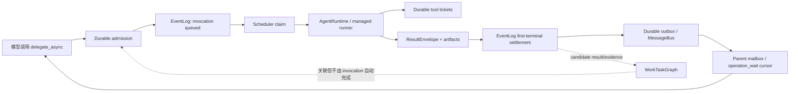

# Intatis Cowork 多 Agent Harness 开源源码审计与设计建议

## MODEL_CHECK_RESULT

- 当前模型：Codex（GPT-5 系列）。
- 精确部署版本：运行环境未提供，无法确认。

## PATH_CHECK_RESULT

- `pwd`：`/Users/vita/Vitemis/Intatis`
- Git root：`/Users/vita/Vitemis/Intatis`
- 路径匹配预期：是。
- 写入前 `git status --short`：无输出，工作树干净。

## FILES_WRITTEN

- `codex-report/07_24_26-20_21-cowork-harness-open-source-audit.md`

## 报告范围

本报告只从“模型实际能调用、宿主能够可靠执行和恢复的 harness 工具”角度审视 Cowork 多 Agent 协作，不进行网络安全、漏洞利用或攻击路径分析。

本轮工作包括：

- 核对 Intatis 当前 Cowork、AgentKernel、MessageBus、权限、持久化和生命周期设计。
- 固定并阅读 OpenCode、Codex CLI、Gemini CLI、Grok Build CLI 的公开源码版本。
- 比较它们在异步任务、消息投递、工具调度、后台进程、结构化结果、恢复和预算控制上的实现。
- 给出适合 Intatis 的目标协议、状态机、工具面和分阶段实施建议。

本轮没有：

- 修改 `Apps/`、`Packages/`、测试、构建脚本、事件 schema 或 `NOTICE.md`。
- 复制、翻译或引入任何上游源码。
- 执行真实 provider、GUI、跨进程恢复或长任务运行验证。

因此本文是源码审计与设计报告，不是实现完成度声明，也不构成任何上游代码复用批准。

## 固定源码基线

| 项目 | 仓库 | 固定 commit | 快照日期 | 本报告关注点 |
|---|---|---|---|---|
| OpenCode | [`anomalyco/opencode`](https://github.com/anomalyco/opencode) | [`66495a2a22cd0a57efcc4f721e65532f0987b4e8`](https://github.com/anomalyco/opencode/tree/66495a2a22cd0a57efcc4f721e65532f0987b4e8) | 2026-07-24 | 后台子任务、durable admission、steer/queue、动态工具 registry |
| Codex CLI | [`openai/codex`](https://github.com/openai/codex) | [`f201c30c52a35f819262865a53df94b6f4ea7a50`](https://github.com/openai/codex/tree/f201c30c52a35f819262865a53df94b6f4ea7a50) | 2026-07-24 | 异步 agent、mailbox、follow-up、runtime residency、并行工具 |
| Gemini CLI | [`google-gemini/gemini-cli`](https://github.com/google-gemini/gemini-cli) | [`69b51f8fa2af0abf717daaba4dca1c627023d82d`](https://github.com/google-gemini/gemini-cli/tree/69b51f8fa2af0abf717daaba4dca1c627023d82d) | 2026-07-23 UTC / 2026-07-24 SGT | typed agent protocol、tool scheduler、`complete_task`、进程生命周期 |
| Grok Build | [`xai-org/grok-build`](https://github.com/xai-org/grok-build) | [`69f0ba880aa98f55e3ac1dcc570e2f332f825fe2`](https://github.com/xai-org/grok-build/tree/69f0ba880aa98f55e3ac1dcc570e2f332f825fe2) | 2026-07-23 | 统一后台 handle、事件等待、workflow journal、预算与 no-progress |

Grok Build 的该公开快照标注为从 monorepo 同步，记录的 `Source-Revision` 为 `95d84f443eddcbed6cbfd6eed22e2eafe6b3939d`。本文只把公开仓库视为可核对的源码事实，不推断它与未公开部署版本完全一致。

## 结论摘要

Intatis 当前最需要补的不是“更多 agent 类型”，而是一个完整、durable、model-usable 的 **Operation / Invocation 控制平面**。

建议的组合不是照搬某个项目，而是：

```text
Codex CLI   异步 agent + mailbox + follow-up + identity/runtime 分离
Grok Build  统一后台 handle + event-driven wait/kill + workflow journal
Gemini CLI  typed protocol + complete_task + tool scheduling waves
OpenCode V2 durable admission + exact retry/conflict + steer/queue
Intatis     EventLog + 四层任务模型 + Capability/Workspace Lease + fail-closed recovery
```

Intatis 已有比多数上游更严格的 durable truth、权限和恢复边界；缺口主要在这些能力还没有被收敛为一套可让模型稳定使用的异步 harness：

1. `delegate_task` 仍以“调用者等待目标运行结束”为主要兼容语义，难以表达 fire-and-observe、wait-any、follow-up 和独立取消。
2. Agent、WorkTask、单次 Invocation、消息和 artifact 虽已有部分独立概念，但缺少一个统一的操作句柄和完整 model-facing 协议。
3. 消息能够进入 mailbox，却缺少模型可见的 `MessageID`、accepted/delivered/consumed/settled 生命周期，以及 queue/steer/interrupt 的明确差异。
4. 通用工具观察和跨 agent 交付仍偏文本化，缺少稳定的 typed result envelope、artifact 引用和 evidence contract。
5. 后台 agent 与后台命令没有共享一套 get/list/wait/cancel 观察模型；同时生产环境又不能为方便而恢复裸 `run_shell`。
6. 动态工具、MCP、后台任务、agent invocation 和普通工具调用尚未共享 exact catalog generation、冲突键、幂等性和取消语义。
7. 当前已有 Goal/WorkTask/ContinuationRun 预算和恢复能力，但尚缺 root-scoped 的统一收敛账本，不能系统识别跨 agent ping-pong、无效果重复、wait-for cycle 和后台操作失控。

目标不是把 Cowork 改成递归 agent 树，而是让现有 scheduler/mailbox/EventLog 架构获得一套清楚的异步协议。

## Intatis 当前基线

### 已有优势

Intatis 当前设计中值得保留、且不应被上游模式削弱的部分包括：

- `Goal / WorkTask / ContinuationRun / AgentInvocation` 四层语义已经明确分离。AgentInvocation 结束只能产生候选结果，不能自动完成 WorkTask；WorkTask 也不能自行完成 Goal。参见 [`docs/COWORK_PRINCIPLES.md`](../docs/COWORK_PRINCIPLES.md) 第 2 节。
- EventLog 是 session canonical truth；任务、权限、tool execution、settings 和生命周期都走 durable-first/first-terminal 语义。
- 普通用户输入和 Goal continuation 都进入 scheduler，而不是让 UI 直接运行一个不可恢复的 `AgentLoop`。
- 同一 agent single-flight，不同 agent 在显式并发上限内运行。参见 [`AgentScheduler.swift`](../Packages/IntatisCowork/Sources/AgentScheduler.swift) `L257-L285`。
- `MessageBus -> Mediator -> mailbox` 已经提供至少一次投递、消费/丢弃和恢复基础。
- CapabilityLease、WorkspaceLease、PathConfinement、PermissionEngine 和 durable tool ticket 已形成比多数上游更强的宿主边界。
- `@permission-reviewer` 和 GoalVerifier 已经是独立控制面，不占普通 worker scheduler 槽，也不运行嵌套 `AgentLoop`。
- App runtime 由 exact session manager 持有，窗口切换不等于停止；冷启动只 reconcile，不自动重放副作用。

### 当前 harness 缺口

| 缺口 | 当前源码表现 | 对实际协作的影响 |
|---|---|---|
| 委派调用仍是同步等待形态 | [`Orchestrator.swift`](../Packages/IntatisCowork/Sources/Orchestrator.swift) `L4164-L4291` 中 `delegate_task` 最终等待 scheduler result | main 在一个 tool call 内被占住；难表达多个长期子任务、wait-any、独立观察和后续 steering |
| mailbox wake 与新 root invocation 耦合 | [`Orchestrator.swift`](../Packages/IntatisCowork/Sources/Orchestrator.swift) `L3949-L4053` | “给现有运行发送信息”和“创建下一轮工作”之间的语义不够显式 |
| 同 agent 只能有一个 running invocation | [`AgentScheduler.swift`](../Packages/IntatisCowork/Sources/AgentScheduler.swift) `L257-L285` | 这是正确的不变量，但需要 queue/steer/interrupt 工具帮助模型使用它，而不是靠隐式等待 |
| 工具并行只覆盖窄集合 | [`AgentLoop.swift`](../Packages/IntatisAgentKernel/Sources/AgentLoop.swift) `L941-L975` 仅在整批调用都是 `ask_agent` / `delegate_task` 时并行 | 普通无冲突只读工具、等待工具和后台操作不能形成可解释的调度 wave |
| 通用 ToolObservation 仍以文本为中心 | [`ToolProtocol.swift`](../Packages/IntatisTools/Sources/ToolProtocol.swift) `L23-L50` | 结构化任务报告、artifact、changed files、evidence 和指标容易被压回字符串 |
| artifact 投影失败时缺少更完整的可恢复交付协议 | [`ContextProjection.swift`](../Packages/IntatisAgentKernel/Sources/ContextProjection.swift) `L180-L192` | artifact 作为跨 agent 一等交付物的 publish/share/get/list 语义还不完整 |
| production registry 固定且不暴露 raw shell | [`Orchestrator.swift`](../Packages/IntatisCowork/Sources/Orchestrator.swift) `L9106-L9152` | 安全边界正确，但缺少受控后台 build/test/command operation 来替代裸 shell |
| CapabilityLease 仍以较粗能力组为主 | [`Leases.swift`](../Packages/IntatisProtocol/Sources/Leases.swift) `L80-L132` | 动态工具和任务级 effects 很难精确冻结为一份可重放 manifest |
| 真实长任务仍有外部验证空白 | [`docs/CURRENT_STATE.md`](../docs/CURRENT_STATE.md) 的 real-provider / crash-restart 说明 | 源码级设计不能替代 provider 中断、App kill、跨重启和非幂等操作的运行证据 |

这意味着 Intatis 不是缺少 scheduler、task graph 或 recovery；它缺少的是把这些底层能力组合成模型可可靠操作的“进程管理 API”。

## 开源项目源码审计

### 1. OpenCode

#### 值得借鉴

OpenCode 源码树同时包含两条不同成熟度的路径：现行 `TaskTool` 仍走 SessionV1；V2 是尚未完成、且尚未接入现行 TaskTool 的在建控制面。

第一条是现行 `TaskTool`：子 agent 是一个有 `parentID` 的真实 Session；工具可前台等待，也有实验性的 background job。其优点是模型看到的是简单的 task handle，后续任务复用 child Session/transcript；但不能由此推断持久 runtime 复用，background job 状态本身仍在进程内。

- [`task.ts L97-L214`](https://github.com/anomalyco/opencode/blob/66495a2a22cd0a57efcc4f721e65532f0987b4e8/packages/opencode/src/tool/task.ts#L97-L214)：创建/恢复 child Session、运行任务、返回结果。
- [`task.ts L273-L347`](https://github.com/anomalyco/opencode/blob/66495a2a22cd0a57efcc4f721e65532f0987b4e8/packages/opencode/src/tool/task.ts#L273-L347)：前台执行可转入后台。
- [`background-job.ts L256-L290`](https://github.com/anomalyco/opencode/blob/66495a2a22cd0a57efcc4f721e65532f0987b4e8/packages/core/src/background-job.ts#L256-L290)：运行中的 follow-up 在当前 run 后排队。

第二条是较新的 V2 Session 控制面。虽然它尚未成为现行 TaskTool 的完整 model-facing harness，但其中的内部协议设计更值得 Intatis 借鉴：

- [`session.ts L360-L385`](https://github.com/anomalyco/opencode/blob/66495a2a22cd0a57efcc4f721e65532f0987b4e8/packages/core/src/session.ts#L360-L385) 与 [`input.ts L41-L81`](https://github.com/anomalyco/opencode/blob/66495a2a22cd0a57efcc4f721e65532f0987b4e8/packages/core/src/session/input.ts#L41-L81)：durable admission、exact retry 和冲突拒绝。
- [`input.ts L216-L288`](https://github.com/anomalyco/opencode/blob/66495a2a22cd0a57efcc4f721e65532f0987b4e8/packages/core/src/session/input.ts#L216-L288)：把 steer 与 queue 分成显式操作。
- [`run-coordinator.ts L5-L15`](https://github.com/anomalyco/opencode/blob/66495a2a22cd0a57efcc4f721e65532f0987b4e8/packages/core/src/session/run-coordinator.ts#L5-L15)：同一 key 的进程内 single-flight 和 coalesced wake；它不是 durable/cluster owner。
- [`tool.ts L20-L66`](https://github.com/anomalyco/opencode/blob/66495a2a22cd0a57efcc4f721e65532f0987b4e8/packages/core/src/tool/tool.ts#L20-L66)：typed input/output/structured schema；[`registry.ts L50-L81`](https://github.com/anomalyco/opencode/blob/66495a2a22cd0a57efcc4f721e65532f0987b4e8/packages/core/src/tool/registry.ts#L50-L81)：scoped registration 和 stale call rejection。

这些代码说明，真正好用的 agent harness 不是只有 `spawn`，而是至少包含 admission identity、运行 ownership、输入队列和冲突语义。

#### 不应照搬

- BackgroundJob registry 当前是进程内状态；[`background-job.ts L113-L119`](https://github.com/anomalyco/opencode/blob/66495a2a22cd0a57efcc4f721e65532f0987b4e8/packages/core/src/background-job.ts#L113-L119) 不足以作为 Intatis 的 canonical recovery source。
- `task_id` 实际等同 child SessionID；如果指定 ID 不存在，现行工具会创建新 child，[`task.ts L131-L172`](https://github.com/anomalyco/opencode/blob/66495a2a22cd0a57efcc4f721e65532f0987b4e8/packages/opencode/src/tool/task.ts#L131-L172)。这会把“恢复失败”和“创建新任务”混在一起。
- 现行结果主要取最后一段文本，[`task.ts L200-L214`](https://github.com/anomalyco/opencode/blob/66495a2a22cd0a57efcc4f721e65532f0987b4e8/packages/opencode/src/tool/task.ts#L200-L214)，不够承载 artifact、evidence 和 task settlement。
- V2 的 wait 尚未完成，[`session.ts L387-L424`](https://github.com/anomalyco/opencode/blob/66495a2a22cd0a57efcc4f721e65532f0987b4e8/packages/core/src/session.ts#L387-L424)；runner 也仍有 durability TODO，[`llm.ts L43-L90`](https://github.com/anomalyco/opencode/blob/66495a2a22cd0a57efcc4f721e65532f0987b4e8/packages/core/src/session/runner/llm.ts#L43-L90)。
- 默认最大 steps 可为无限，[`prompt.ts L1178-L1185`](https://github.com/anomalyco/opencode/blob/66495a2a22cd0a57efcc4f721e65532f0987b4e8/packages/opencode/src/session/prompt.ts#L1178-L1185)，不能作为 Intatis root-scoped budget 的默认值。
- shell lifecycle 有可借鉴的进程清理，但它仍是 host-authority shell，[`shell.ts L428-L595`](https://github.com/anomalyco/opencode/blob/66495a2a22cd0a57efcc4f721e65532f0987b4e8/packages/opencode/src/tool/shell.ts#L428-L595)、[`bash.ts L107-L140`](https://github.com/anomalyco/opencode/blob/66495a2a22cd0a57efcc4f721e65532f0987b4e8/packages/core/src/tool/bash.ts#L107-L140)，不能绕过 Intatis 的 managed runner、workspace lease 和 sandbox。

#### 对 Intatis 的提炼

借鉴 V2 的 admission、steer/queue、single-owner 和 typed registry；不要复用 SessionID/task/job ID 合并、进程内 job truth、last-text-only 结果和无限 steps。

### 2. Codex CLI

#### 值得借鉴

Codex CLI 的 multi-agent V2 是四个项目中最接近“模型可用异步 agent harness”的实现：

- [`spawn.rs L39-L165`](https://github.com/openai/codex/blob/f201c30c52a35f819262865a53df94b6f4ea7a50/codex-rs/core/src/tools/handlers/multi_agents_v2/spawn.rs#L39-L165) 与 [`control/spawn.rs L516-L561`](https://github.com/openai/codex/blob/f201c30c52a35f819262865a53df94b6f4ea7a50/codex-rs/core/src/agent/control/spawn.rs#L516-L561)：`spawn_agent` 完成 child thread 创建和初始通信投递后返回 canonical task path，不等待 child turn 完成，并支持上下文 fork。
- [`message_tool.rs L12-L129`](https://github.com/openai/codex/blob/f201c30c52a35f819262865a53df94b6f4ea7a50/codex-rs/core/src/tools/handlers/multi_agents_v2/message_tool.rs#L12-L129)：普通 send 与 follow-up 采用不同调用意图。
- [`input_queue.rs L34-L101`](https://github.com/openai/codex/blob/f201c30c52a35f819262865a53df94b6f4ea7a50/codex-rs/core/src/session/input_queue.rs#L34-L101)：session mailbox 保持 FIFO。
- [`control/spawn.rs L126-L195`](https://github.com/openai/codex/blob/f201c30c52a35f819262865a53df94b6f4ea7a50/codex-rs/core/src/agent/control/spawn.rs#L126-L195)、[`L250-L325`](https://github.com/openai/codex/blob/f201c30c52a35f819262865a53df94b6f4ea7a50/codex-rs/core/src/agent/control/spawn.rs#L250-L325) 与 [`residency.rs L217-L232`](https://github.com/openai/codex/blob/f201c30c52a35f819262865a53df94b6f4ea7a50/codex-rs/core/src/agent/control/residency.rs#L217-L232)：agent identity 与 runtime residency 分离；只有无 active turn、mailbox 为空且处于 Completed/Errored/Interrupted 的 agent runtime 才可 LRU 卸载，identity 可保留并按需重载。
- [`wait.rs L36-L195`](https://github.com/openai/codex/blob/f201c30c52a35f819262865a53df94b6f4ea7a50/codex-rs/core/src/tools/handlers/multi_agents_v2/wait.rs#L36-L195) 和 [`interrupt_agent.rs L26-L95`](https://github.com/openai/codex/blob/f201c30c52a35f819262865a53df94b6f4ea7a50/codex-rs/core/src/tools/handlers/multi_agents_v2/interrupt_agent.rs#L26-L95)：模型可以等待任意 mailbox activity，或中断一个指定的非 root agent。

其普通工具 harness 也有两个重要模式：

- [`parallel.rs L41-L201`](https://github.com/openai/codex/blob/f201c30c52a35f819262865a53df94b6f4ea7a50/codex-rs/core/src/tools/parallel.rs#L41-L201) 与 [`turn.rs L2033-L2049`](https://github.com/openai/codex/blob/f201c30c52a35f819262865a53df94b6f4ea7a50/codex-rs/core/src/session/turn.rs#L2033-L2049)：并行执行与确定性 transcript 排序分开处理。
- [`tool_catalog.rs L127-L217`](https://github.com/openai/codex/blob/f201c30c52a35f819262865a53df94b6f4ea7a50/codex-rs/codex-mcp/src/connection_manager/tool_catalog.rs#L127-L217) 与 [`binding.rs L237-L274`](https://github.com/openai/codex/blob/f201c30c52a35f819262865a53df94b6f4ea7a50/codex-rs/codex-mcp/src/binding.rs#L237-L274)：MCP tool binding 被固定到一次请求的 exact catalog。

#### 不应照搬

- agent graph 主要是 parent-child 和 open/closed 状态，不是 WorkTask DAG。[`types.rs L4-L12`](https://github.com/openai/codex/blob/f201c30c52a35f819262865a53df94b6f4ea7a50/codex-rs/agent-graph-store/src/types.rs#L4-L12) 与 [`store.rs L13-L59`](https://github.com/openai/codex/blob/f201c30c52a35f819262865a53df94b6f4ea7a50/codex-rs/agent-graph-store/src/store.rs#L13-L59) 不能替代 Intatis 的 Goal/WorkTask authority。
- child thread 创建与 graph edge upsert 不是一个原子 settlement；edge 写入失败会 fail-soft 继续。[`control.rs L676-L704`](https://github.com/openai/codex/blob/f201c30c52a35f819262865a53df94b6f4ea7a50/codex-rs/core/src/agent/control.rs#L676-L704)。Intatis 必须把 invocation admission、lineage 和 lease 绑定进同一 durable transaction。
- 底层 communication enqueue 能返回 submission/request ID，但 V2 tool result 丢弃该值；源码不足以把它定义为 durable MessageID。[`control.rs L168-L225`](https://github.com/openai/codex/blob/f201c30c52a35f819262865a53df94b6f4ea7a50/codex-rs/core/src/agent/control.rs#L168-L225) 与 [`message_tool.rs L110-L129`](https://github.com/openai/codex/blob/f201c30c52a35f819262865a53df94b6f4ea7a50/codex-rs/core/src/tools/handlers/multi_agents_v2/message_tool.rs#L110-L129)。Intatis 应把自己的 MessageID/receipt 明确定义为 durable 事实。
- wait 返回结果极粗：规格声称摘要哪些 agent 有更新，[`multi_agents_spec.rs L285-L294`](https://github.com/openai/codex/blob/f201c30c52a35f819262865a53df94b6f4ea7a50/codex-rs/core/src/tools/handlers/multi_agents_spec.rs#L285-L294)，实现只返回固定完成文本和 `timed_out`，[`wait.rs L133-L195`](https://github.com/openai/codex/blob/f201c30c52a35f819262865a53df94b6f4ea7a50/codex-rs/core/src/tools/handlers/multi_agents_v2/wait.rs#L133-L195)。
- agent 完成通知写回父 session 的失败只记 debug 日志并返回，无 durable outbox/retry。[`session/mod.rs L1982-L1989`](https://github.com/openai/codex/blob/f201c30c52a35f819262865a53df94b6f4ea7a50/codex-rs/core/src/session/mod.rs#L1982-L1989)。
- 默认模型合同声明子 agent 使用相同工具并共享目录。[`multi_agents_spec.rs L749-L768`](https://github.com/openai/codex/blob/f201c30c52a35f819262865a53df94b6f4ea7a50/codex-rs/core/src/tools/handlers/multi_agents_spec.rs#L749-L768)、[`config/mod.rs L212-L259`](https://github.com/openai/codex/blob/f201c30c52a35f819262865a53df94b6f4ea7a50/codex-rs/core/src/config/mod.rs#L212-L259) 的易用性不能覆盖 CapabilityLease/WorkspaceLease。
- V2 配置当前忽略 depth 选项，[`config/mod.rs L866-L885`](https://github.com/openai/codex/blob/f201c30c52a35f819262865a53df94b6f4ea7a50/codex-rs/core/src/config/mod.rs#L866-L885)；rollout budget 是 root session tree 共享、默认关闭且仍在演进的 token counter，不是 durable 跨重启收敛账本。[`rollout_budget.rs L14-L105`](https://github.com/openai/codex/blob/f201c30c52a35f819262865a53df94b6f4ea7a50/codex-rs/core/src/rollout_budget.rs#L14-L105)。
- feature 表中 multi-agent V2 虽标为 stable，但默认仍关闭；rollout budget 标为 under development 且默认关闭。[`features/src/lib.rs L1067-L1078`](https://github.com/openai/codex/blob/f201c30c52a35f819262865a53df94b6f4ea7a50/codex-rs/features/src/lib.rs#L1067-L1078)、[`L1301-L1312`](https://github.com/openai/codex/blob/f201c30c52a35f819262865a53df94b6f4ea7a50/codex-rs/features/src/lib.rs#L1301-L1312)。
- V2 model-facing 工具面没有 `close_agent` / `resume_agent`；这些只在 V1 分支注册。[`spec_plan.rs L808-L893`](https://github.com/openai/codex/blob/f201c30c52a35f819262865a53df94b6f4ea7a50/codex-rs/core/src/tools/spec_plan.rs#L808-L893)。

#### 对 Intatis 的提炼

直接借鉴“异步 spawn + FIFO mailbox + follow-up + wait + interrupt + unload/reload identity”的工具心智模型；以 Intatis EventLog/outbox、WorkTaskGraph 和 lease 重新实现其 durability 与 authority。

### 3. Gemini CLI

#### 值得借鉴

Gemini CLI 的优势不是多 agent 数量，而是 typed protocol 和工具调度：

- [`agent/types.ts L14-L44`](https://github.com/google-gemini/gemini-cli/blob/69b51f8fa2af0abf717daaba4dca1c627023d82d/packages/core/src/agent/types.ts#L14-L44)、[`L67-L120`](https://github.com/google-gemini/gemini-cli/blob/69b51f8fa2af0abf717daaba4dca1c627023d82d/packages/core/src/agent/types.ts#L67-L120) 与 [`L230-L294`](https://github.com/google-gemini/gemini-cli/blob/69b51f8fa2af0abf717daaba4dca1c627023d82d/packages/core/src/agent/types.ts#L230-L294)：stream ID、event ID 和 typed agent events。
- [`agent-session.ts L105-L223`](https://github.com/google-gemini/gemini-cli/blob/69b51f8fa2af0abf717daaba4dca1c627023d82d/packages/core/src/agent/agent-session.ts#L105-L223)：session replay/reattach 的协议形态。
- [`scheduler.ts L191-L286`](https://github.com/google-gemini/gemini-cli/blob/69b51f8fa2af0abf717daaba4dca1c627023d82d/packages/core/src/scheduler/scheduler.ts#L191-L286) 与 [`tools.ts L517-L565`](https://github.com/google-gemini/gemini-cli/blob/69b51f8fa2af0abf717daaba4dca1c627023d82d/packages/core/src/tools/tools.ts#L517-L565)：工具调用进入调度器，并按可并行性形成 wave。
- [`scheduler.ts L463-L568`](https://github.com/google-gemini/gemini-cli/blob/69b51f8fa2af0abf717daaba4dca1c627023d82d/packages/core/src/scheduler/scheduler.ts#L463-L568)：并行分组、结果收集和下一 wave 的边界较清楚；取消路径位于前述 `L262-L286`。
- [`complete-task.ts L24-L107`](https://github.com/google-gemini/gemini-cli/blob/69b51f8fa2af0abf717daaba4dca1c627023d82d/packages/core/src/tools/complete-task.ts#L24-L107)：用显式 `complete_task` schema 区分交付和普通文本回复。
- [`executionLifecycleService.ts L376-L628`](https://github.com/google-gemini/gemini-cli/blob/69b51f8fa2af0abf717daaba4dca1c627023d82d/packages/core/src/services/executionLifecycleService.ts#L376-L628)：后台 execution 的状态、订阅和 background/complete/kill 分发集中在 lifecycle service；但模型侧 registry 只暴露启动、list/read，没有 kill/write 工具，[`config.ts L4003-L4015`](https://github.com/google-gemini/gemini-cli/blob/69b51f8fa2af0abf717daaba4dca1c627023d82d/packages/core/src/config/config.ts#L4003-L4015)，进程组和 log cleanup 仍有部分位于 [`shellExecutionService.ts L289-L321`](https://github.com/google-gemini/gemini-cli/blob/69b51f8fa2af0abf717daaba4dca1c627023d82d/packages/core/src/services/shellExecutionService.ts#L289-L321)。

#### 不应照搬

- Local protocol 内部可以异步，但 model-facing agent tool 最终等待整个结果。[`agent-tool.ts L217-L241`](https://github.com/google-gemini/gemini-cli/blob/69b51f8fa2af0abf717daaba4dca1c627023d82d/packages/core/src/agents/agent-tool.ts#L217-L241) 与 [`local-session-invocation.ts L280-L320`](https://github.com/google-gemini/gemini-cli/blob/69b51f8fa2af0abf717daaba4dca1c627023d82d/packages/core/src/agents/local-session-invocation.ts#L280-L320) 仍不是完整异步控制平面。
- local subagent 明确不开放 agent tools，[`local-executor.ts L169-L205`](https://github.com/google-gemini/gemini-cli/blob/69b51f8fa2af0abf717daaba4dca1c627023d82d/packages/core/src/agents/local-executor.ts#L169-L205)。这个保险丝可保留，但不能替代 Intatis 的 task-scoped delegation lease。
- InjectionService 是共享广播式：同一 Config 下所有正在运行的 local agents 都会收到 hint，并只在 inter-turn safe point 注入。[`injectionService.ts L15-L64`](https://github.com/google-gemini/gemini-cli/blob/69b51f8fa2af0abf717daaba4dca1c627023d82d/packages/core/src/config/injectionService.ts#L15-L64)。Intatis 需要 MessageID、目标 agent、WorkTask/run scope 和 durable consumption。
- 未配置 `toolConfig` 时，local subagent 默认继承父 registry 中全部可复制的非-agent 工具，并过滤 `update_topic`。[`local-executor.ts L208-L266`](https://github.com/google-gemini/gemini-cli/blob/69b51f8fa2af0abf717daaba4dca1c627023d82d/packages/core/src/agents/local-executor.ts#L208-L266)。这对 Intatis 默认能力模型仍然过宽。
- `complete_task` 的 typed 参数最终又被 stringify，[`complete-task.ts L145-L179`](https://github.com/google-gemini/gemini-cli/blob/69b51f8fa2af0abf717daaba4dca1c627023d82d/packages/core/src/tools/complete-task.ts#L145-L179)；A2A artifact 也会被 textify，[`a2aUtils.ts L171-L249`](https://github.com/google-gemini/gemini-cli/blob/69b51f8fa2af0abf717daaba4dca1c627023d82d/packages/core/src/agents/a2aUtils.ts#L171-L249)。
- tracker 有 DAG 类型，但没有成为 agent invocation 的统一调度事实源。[`trackerTypes.ts L22-L40`](https://github.com/google-gemini/gemini-cli/blob/69b51f8fa2af0abf717daaba4dca1c627023d82d/packages/core/src/services/trackerTypes.ts#L22-L40) 与 [`trackerService.ts L139-L244`](https://github.com/google-gemini/gemini-cli/blob/69b51f8fa2af0abf717daaba4dca1c627023d82d/packages/core/src/services/trackerService.ts#L139-L244)。
- 主循环接入 loop detector，[`loopDetectionService.ts L175-L348`](https://github.com/google-gemini/gemini-cli/blob/69b51f8fa2af0abf717daaba4dca1c627023d82d/packages/core/src/services/loopDetectionService.ts#L175-L348)、[`client.ts L747-L763`](https://github.com/google-gemini/gemini-cli/blob/69b51f8fa2af0abf717daaba4dca1c627023d82d/packages/core/src/core/client.ts#L747-L763)；LocalAgentExecutor 没有接入该 detector，只依赖 max time/turn 与 final-warning/`complete_task` grace。[`local-executor.ts L747-L824`](https://github.com/google-gemini/gemini-cli/blob/69b51f8fa2af0abf717daaba4dca1c627023d82d/packages/core/src/agents/local-executor.ts#L747-L824)。

#### 对 Intatis 的提炼

借鉴 typed event protocol、tool scheduling wave、集中式 execution lifecycle 和显式 completion schema；不要把最终交付重新 stringify，也不要采用全局注入或 ambient all-tools inheritance。

### 4. Grok Build

#### 值得借鉴

Grok Build 的最大价值是把“后台命令”和“后台 subagent”纳入相似的 handle/observe/cancel 心智模型：

- [`task/mod.rs L296-L425`](https://github.com/xai-org/grok-build/blob/69f0ba880aa98f55e3ac1dcc570e2f332f825fe2/crates/codegen/xai-grok-tools/src/implementations/grok_build/task/mod.rs#L296-L425)：task 可异步执行，也会根据情境自动转后台。
- [`task/types.rs L507-L570`](https://github.com/xai-org/grok-build/blob/69f0ba880aa98f55e3ac1dcc570e2f332f825fe2/crates/codegen/xai-grok-tools/src/implementations/grok_build/task/types.rs#L507-L570)：typed snapshot 和 cancel 结果。
- [`task_output/mod.rs L24-L56`](https://github.com/xai-org/grok-build/blob/69f0ba880aa98f55e3ac1dcc570e2f332f825fe2/crates/codegen/xai-grok-tools/src/implementations/grok_build/task_output/mod.rs#L24-L56) 与 [`L205-L279`](https://github.com/xai-org/grok-build/blob/69f0ba880aa98f55e3ac1dcc570e2f332f825fe2/crates/codegen/xai-grok-tools/src/implementations/grok_build/task_output/mod.rs#L205-L279)：同一输出工具可查询 command/subagent。
- [`task_output/mod.rs L379-L483`](https://github.com/xai-org/grok-build/blob/69f0ba880aa98f55e3ac1dcc570e2f332f825fe2/crates/codegen/xai-grok-tools/src/implementations/grok_build/task_output/mod.rs#L379-L483)：等待基于事件通知，不依赖高频轮询。
- [`journal.rs L1-L41`](https://github.com/xai-org/grok-build/blob/69f0ba880aa98f55e3ac1dcc570e2f332f825fe2/crates/codegen/xai-workflow/src/journal.rs#L1-L41) 与 [`L161-L205`](https://github.com/xai-org/grok-build/blob/69f0ba880aa98f55e3ac1dcc570e2f332f825fe2/crates/codegen/xai-workflow/src/journal.rs#L161-L205)：workflow journal 用 request hash 支持确定性 replay/冲突检测。
- [`xai-workflow/src/lib.rs L10-L17`](https://github.com/xai-org/grok-build/blob/69f0ba880aa98f55e3ac1dcc570e2f332f825fe2/crates/codegen/xai-workflow/src/lib.rs#L10-L17)：workflow 有显式 turns、tokens 和 wall-clock 预算。
- [`schema_contract.rs L1-L97`](https://github.com/xai-org/grok-build/blob/69f0ba880aa98f55e3ac1dcc570e2f332f825fe2/crates/codegen/xai-grok-shell/src/session/workflow/schema_contract.rs#L1-L97)：workflow input/output schema 被当作协议合同，而不是提示词约定。

其 no-progress 检测也值得吸收：

- [`turn.rs L1922-L1966`](https://github.com/xai-org/grok-build/blob/69f0ba880aa98f55e3ac1dcc570e2f332f825fe2/crates/codegen/xai-grok-shell/src/session/acp_session_impl/turn.rs#L1922-L1966) 与 [`L2427-L2465`](https://github.com/xai-org/grok-build/blob/69f0ba880aa98f55e3ac1dcc570e2f332f825fe2/crates/codegen/xai-grok-shell/src/session/acp_session_impl/turn.rs#L2427-L2465)：把重复、无进展和最终停止作为宿主可观察状态。

#### 不应照搬

- subagent depth 固定为 1，[`task/mod.rs L31-L35`](https://github.com/xai-org/grok-build/blob/69f0ba880aa98f55e3ac1dcc570e2f332f825fe2/crates/codegen/xai-grok-tools/src/implementations/grok_build/task/mod.rs#L31-L35)。Intatis 可保留 bounded depth，但主要约束应是 CapabilityLease、task graph 和 root budget。
- restrictive tool mode 对未分类工具仍有保留逻辑，[`task/types.rs L206-L265`](https://github.com/xai-org/grok-build/blob/69f0ba880aa98f55e3ac1dcc570e2f332f825fe2/crates/codegen/xai-grok-tools/src/implementations/grok_build/task/types.rs#L206-L265)。Intatis 对未知动态 capability 应 fail closed。
- interjection 通过 synthetic message 注入，[`interjection.rs L280-L336`](https://github.com/xai-org/grok-build/blob/69f0ba880aa98f55e3ac1dcc570e2f332f825fe2/crates/codegen/xai-grok-shell/src/session/acp_session_impl/interjection.rs#L280-L336)。Intatis 应保存真实 MessageID、delivery mode 和消费状态。
- worktree 建立失败可能回退共享工作区，[`handle_request.rs L282-L337`](https://github.com/xai-org/grok-build/blob/69f0ba880aa98f55e3ac1dcc570e2f332f825fe2/crates/codegen/xai-grok-shell/src/agent/subagent/handle_request.rs#L282-L337)。Intatis 不能让失败的隔离请求静默扩大 workspace authority。
- 公开源码能证明进程内 journal/handle 语义，但“App/进程被杀后继续一个 active operation”的完整语义仍需后续确认。

#### 对 Intatis 的提炼

借鉴 unified operation handle、事件驱动 wait、typed snapshot/cancel、request-hash journal 和 root budget；不采用 silent shared-workspace fallback、synthetic-message-only steering 或未知工具默认保留。

## 横向比较

| 能力 | OpenCode | Codex CLI | Gemini CLI | Grok Build | Intatis 当前 |
|---|---|---|---|---|---|
| model-facing 异步 agent | TaskTool 有实验性 background；无模型侧 list/get/wait/cancel | V2 opt-in spawn/interrupt；wait-any；无 model-facing close | 内部异步，model tool 仍等待 | task 可后台 | `delegate_task` 主要等待终态 |
| queue / steer / interrupt | V2 内部 Session API 有 queue/steer/interrupt；尚非完整模型工具面 | mailbox + follow-up + interrupt | 同一 Config 的共享 injection + inter-turn safe point | interjection + interruptible wait | mailbox/cancel 已有，model-facing 语义未完全拆分 |
| durable admission | V2 有 exact retry/conflict，但 ownership/durability 未完成 | thread/graph 可持久化；child 创建与 graph edge 非原子/fail-soft，parent notify 非 durable | 无 durable invocation admission；AgentSession trajectory/replay 在内存，chat JSONL 不等于 invocation ledger | workflow journal/request hash | EventLog-first，当前最强项 |
| WorkTask 与 Invocation 分离 | Session/task/job 易混 | agent graph 不等于 WorkTask DAG | tracker 与 agent runtime 脱节 | workflow/task 有分层但产品语义不同 | 已明确四层模型 |
| typed completion/artifact | 现行偏最后文本 | final response/status 为主 | 有 `complete_task` schema，但又 stringify | typed task snapshot，workflow schema 较强 | Task Report 已结构化，但通用 ToolObservation/result envelope 不完整 |
| 后台 command/process | 有 host-authority shell command；无统一 durable background process handle | unified exec session | lifecycle backend 较强；模型侧仅启动/list/read，无 kill/write | command/subagent 统一观察 | production 不暴露 raw shell；缺受控通用后台 operation |
| 动态工具与 exact binding | registry/MCP 动态；V2 有 typed boundary | request-scoped MCP binding 很强 | registry/MCP/extensions 动态；未见 per-dispatch frozen catalog generation | typed runtime + registration | registry 固定，inference binding 很强，tool catalog generation 尚缺 |
| loop / budget | 默认可无限 steps | root session tree 共享 token counter，仍演进且默认关闭 | 主循环 detector，local agent 未接入 | workflow/no-progress 较完整 | Goal/run/tool budget 已有，跨 operation 收敛账本尚缺 |
| 最主要风险 | 两代实现并存、后台状态进程内 | child/edge admission 非原子、parent result 非 durable、无 WorkTask settlement | typed data 最终 textify、共享广播缺少定向 receipt | fallback 与公开/部署版本差异 | 能力强但缺统一异步 model API |

## 建议的目标 Harness

### 1. 五类稳定 ID

继续保留并强化以下身份，不要用一个“task ID”覆盖全部语义：

```text
AgentID       可复用身份、exact inference binding、mailbox 和生命周期
WorkTaskID    用户可见 DAG、依赖、acceptance criteria 和显式完成 authority
InvocationID  某个 WorkTask 的一次 agent execution attempt
MessageID     steering/reply/ack 的 durable receipt
ArtifactID    跨 agent 交付物、证据和 provenance
```

内部可以用共同的 `OperationHandle` 观察 agent invocation 与 managed command，但外部必须保留 typed kind 和 typed ID，禁止再次把 AgentID、WorkTaskID、InvocationID 和 process/job handle 合并。

### 2. Operation 状态机

建议所有可后台观察的 operation 共享最小状态：

```text
admitted -> queued -> running -> completed
                              -> failed
                              -> cancelled
                              -> interrupted
```

规则：

- admission 原子冻结 AgentID、WorkTaskID、attempt、exact inference binding、CapabilityLease、WorkspaceLease、catalog generation 和 request digest。
- `queued -> running` 只由 scheduler claim；同一 agent 仍保持单一 running invocation。
- terminal settlement 使用 EventLog first-terminal CAS；exact duplicate 幂等，冲突 terminal fail closed。
- parent/result notification 先进入 durable outbox，再由 mailbox 投影；不能把一次内存回调当作完成事实。
- crash restore 把不确定的 running operation 显示为 interrupted/needs-reconciliation，不自动重放可能有副作用的执行。

### 3. Model-facing 工具面

建议新增的概念性工具如下；名称可在 ADR 中最终确定。

```text
delegate_async(
  targetAgent,
  workTaskID?,
  contract,
  requestedCapabilityLease?,
  requestedWorkspaceLease?
) -> InvocationHandle

operation_get(operationID) -> OperationSnapshot
operation_list(filters, cursor?) -> OperationPage
operation_wait(operationIDs, mode: wait_any | wait_all, afterCursor?, timeout?) -> OperationEvents
operation_cancel(operationID, reason) -> CancellationReceipt

invocation_followup(
  invocationID,
  message,
  delivery: queue | steer | interrupt
) -> MessageReceipt

agent_close(agentID, disposition) -> CloseReceipt
```

兼容策略：

- 现有 `ask_agent` 可变成 `delegate_async + operation_wait` 的短请求 wrapper。
- 现有 `delegate_task` 可保留“等待 Task Report”行为，但底层必须先创建 InvocationHandle；随后可逐步鼓励模型直接使用异步工具。
- wait 应基于 EventLog subscriber/cursor，而不是高频 poll；`timeout` 只结束本次 wait，不应自动取消 operation。
- `operation_list` 必须有 bounded page/cursor，不能把整个 session 历史一次塞回模型上下文。

### 4. Message delivery 语义

明确区分：

```text
queue
  只进入目标 inbox；若目标正在运行，不改变当前 turn。

steer
  在下一个稳定 safe point 呈现：模型响应边界、工具 wave 边界或当前 invocation checkpoint。

interrupt
  先 durable 记录 intent；取消并 drain 当前 provider/tool；结算当前 invocation 为 interrupted；
  再以新 turn/invocation 呈现消息。它不是“把文字硬塞进正在采样的 stream”。
```

每次投递返回：

```text
MessageReceipt {
  messageID
  acceptedAtSeq
  targetAgentID
  targetInvocationID?
  deliveryMode
  state: accepted | delivered | consumed | discarded | settled
}
```

这样模型可以判断“消息已接收”与“目标已读并完成响应”的差别，也能在重启后继续观察同一 MessageID。

### 5. Typed ResultEnvelope

不要再把跨 agent 和工具的关键交付压回最后一段文本。建议统一：

```text
ResultEnvelope {
  schemaVersion
  status
  summary
  structuredValue?
  artifactRefs[]
  changedFiles[]
  evidence[]
  warnings[]
  usage {
    modelCalls
    inputTokens
    outputTokens
    toolCalls
    wallTime
  }
}
```

`complete_task` 类工具只结算 AgentInvocation，并提交一个 WorkTask candidate result；它不能绕过 `task_update`、acceptance evidence 或 GoalVerifier。

未知/不匹配的 output schema 应产生 typed failure，而不是静默 stringify。给模型的摘要可以是文本，但 durable canonical value 必须保持结构。

### 6. Artifact 作为一等协作对象

在现有 ArtifactStore 上补足协作协议：

```text
artifact_publish
artifact_get
artifact_list
artifact_share
```

每个 artifact event 至少关联：

- ArtifactID
- producer InvocationID / WorkTaskID
- mime/type、hash、size 和 store URI
- recipients 或 visibility scope
- provenance/evidence role
- EventLog sequence 与 settlement

ContextProjector 只注入明确共享、相关且在预算内的 artifact 摘要；大内容继续按引用按需读取。

### 7. Managed command operation

不要为了后台任务恢复裸 `run_shell`。可增加受控、可声明 effects 的 operation，例如：

```text
swift_test
xcodebuild
managed_command（仅在完整 allow-list/lease/sandbox 合同成立后）
```

它们可以与 agent invocation 共用 get/list/wait/cancel 观察层，但执行仍必须经过：

- ToolCall schema。
- PermissionEngine。
- WorkspaceLease 与 canonical identity revalidation。
- durable execution ticket。
- macOS Seatbelt / Linux bwrap，network 默认 deny。
- timeout、consumer cancellation、process-group cleanup。
- 结构化 stdout/stderr chunk、exit status、artifact 和 changed-files report。

这吸收 Grok Build/Gemini 的后台 lifecycle 易用性，同时保留 Intatis 当前“不暴露 raw shell”的产品边界。

### 8. Dynamic Tool Manifest

动态 registry 或 MCP 工具不能只提供 name/description/schema。建议每个 catalog entry 冻结：

```text
stableToolID
sourceID / sourceVersion / definitionHash
catalogGeneration
inputSchema / outputSchema
requiredCapabilities
workspaceEffects
networkEffects
concurrencyClass / conflictKey
timeoutPolicy / cancellationPolicy
idempotencyPolicy
artifactOutputContract
```

每次 provider dispatch 固定 exact catalog generation；工具返回时校验 generation/call identity。未知动态能力、未知 effects 或 stale generation 默认拒绝，不按“插件已安装”自动扩大 lease。

### 9. WorkTask ready-set 与 barrier

保留 WorkTaskGraph 作为产品 truth，不引入另一套隐式 todo graph。可补：

- atomic batch create。
- `dependsOn` 和 host-derived ready-set。
- barrier group / wait-for-all。
- bounded retry policy。
- expected artifacts / write-set conflict。
- WorkTask -> 多 Invocation linkage。

先采用 Swift-native declarative workflow；借鉴 Grok Build 的 request hash、journal 和 schema contract，不必在第一阶段引入独立脚本语言/runtime。

### 10. Root-scoped 收敛账本

Goal/ContinuationRun 之上增加统一的 execution ledger：

```text
token / cost / model-call / tool-call
spawned identities / concurrent operations
messages / depth / attempts / wall time
```

并检测：

- wait-for cycle。
- A -> B -> A 的重复 delegation/message ping-pong。
- 同一 tool + args + result/effect 的无效果重复。
- 连续相同 failure/recovery。
- operation 已终态但仍被重复 wait/follow-up。
- 新输出没有 changed files、artifact、evidence 或 task revision 进展。

建议 fingerprint 包含：

```text
toolID + normalized args + result class + effect disposition
+ changedFiles/diff digest + artifact IDs + WorkTask revision
```

第一次 no-progress 可给一次有界 recovery/nudge；再次命中则 durable 终结当前 run/operation，并向用户说明“为什么停止”。不能用无限 prompt retry 代替宿主收敛判断。

### 11. Agent lifetime 与 recovery

区分：

```text
task-scoped          invocation 结束且 mailbox/outbox 清空后可回收
session-specialist   identity 保留到 session 结束，runtime 可 LRU unload
persistent           仅用户/host 显式创建，不能由普通 worker 默认升级
```

借鉴 Codex CLI 的 identity/runtime residency 分离：

- runtime unload 不删除 AgentID、mailbox、history 或 exact binding。
- 后续消息可 fresh-load runtime。
- 显式 close 先关闭新 admission，再 drain 当前 invocation/outbox。
- crash 后恢复 identity；in-flight operation 标记 interrupted，不自动重放副作用。

### 12. Capability 与工具暴露

Capability profile 只能是创建 lease 的模板，不能成为 ambient authority：

- 新 worker 默认空/最小 lease，再按 task contract 显式增加。
- 未知动态工具一律不可见。
- 没有 delegation grant 就不暴露 `delegate_async` / `spawn_agent`。
- read-write 与 canCoordinate 继续正交。
- reviewer/GoalVerifier 继续独立、无普通工具。
- 每次 invocation admission 和 executor 前都重检 lease、workspace identity、catalog generation 和 exact inference binding。

## 建议控制流



关键不变量是：模型可以异步使用 operation，但事实仍由 EventLog、scheduler、lease 和 WorkTask authority 管理。

## 明确不要复制的模式

- 进程内 BackgroundJob registry 充当 canonical truth。
- SessionID、task ID、InvocationID、job/process handle 共用一个 ID。
- 找不到恢复目标时静默创建新任务。
- XML/自由文本状态、last-text-only handoff 或把 typed output 再 stringify。
- 通过 synthetic transcript 注入替代真实 MessageID 和 delivery receipt。
- workspace 隔离失败后回退共享工作区。
- 子 agent 默认继承全部工具或 coordinator 能力。
- 未分类动态工具继续可用。
- raw host-authority shell。
- 无限 steps、无限 depth 或只依靠 prompt 要求模型停止。
- parent completion notification 落盘失败后只记 warning。
- 把实验性、默认关闭或尚有 TODO 的上游路径描述为生产级完成能力。

## 分阶段建议

### Phase 0：先冻结协议，不改 runtime

产出 ADR 和 additive schema 设计：

- 五类 ID 与 OperationHandle。
- operation/message/result/artifact 状态机。
- queue/steer/interrupt safe-point 语义。
- admission digest、catalog generation、first-terminal 和 crash reconciliation。
- `ask_agent` / `delegate_task` 兼容迁移规则。

### Phase 1：最小异步 Invocation 控制面

- `delegate_async`
- `operation_get/list/wait/cancel`
- EventLog cursor wait
- durable parent outbox
- 现有同步工具改为 wrapper

验收重点：不同 agent 真并行；同 agent FIFO；wait timeout 不取消任务；重启后同一 OperationID 可解释。

### Phase 2：消息 delivery 与 safe point

- MessageID/receipt。
- queue/steer/interrupt。
- accepted/delivered/consumed/discarded/settled。
- provider/tool drain 后 interrupt。

验收重点：忙 agent 不丢消息；取消 run 的迟到消息 durable discarded；重启不重复消费。

### Phase 3：typed result 与 artifact 协作

- ResultEnvelope/output schema validation。
- `complete_task` 只结算 Invocation。
- artifact publish/share/get/list。
- WorkTask candidate/evidence linkage。

验收重点：结构不会被 stringify；大 artifact 不进入 prompt；Invocation 终态不会越权完成 WorkTask/Goal。

### Phase 4：managed runner 与 dynamic registry

- 受控 build/test command operation。
- 后台 output stream/get/wait/cancel。
- dynamic manifest 与 exact catalog generation。
- concurrency/conflict key 和 effect declaration。

验收重点：不恢复裸 shell；unknown tool/effect fail closed；cancel 清理完整进程组。

### Phase 5：workflow ready-set 与全局收敛

- atomic WorkTask batch、barrier、ready-set。
- root-scoped budgets。
- wait-for/delegation/message cycle。
- repeated no-effect fingerprint。
- 一次有界 recovery 后 durable no-progress terminal。

## 建议测试矩阵

| 类别 | 最小验收 |
|---|---|
| Admission | 相同 request digest exact retry 幂等；同 ID 不同 payload 冲突关闭 |
| Scheduler | 同 agent 单运行；不同 agent 遵守并发上限；取消/超时释放所有 reservation |
| Wait | wait-any/wait-all、cursor、超时、consumer cancel、terminal 已存在时立即返回 |
| Message | queue/steer/interrupt；MessageID 全生命周期；跨重启不重消耗 |
| Result | schema mismatch、artifact refs、changed files、evidence；不自动完成 WorkTask |
| Recovery | queued 恢复；running -> interrupted/reconcile；副作用不自动重放 |
| Outbox | parent 不在线、append 失败、重复投递、消费 ack 失败 |
| Managed process | stdout/stderr、timeout、process group、sandbox startup deny、App stop |
| Dynamic tools | stale catalog generation、未知 capability/effects、MCP disconnect/reconnect |
| Convergence | delegation cycle、wait-for cycle、ping-pong、重复无效果调用、预算到达 |
| Lifetime | task-scoped recycle、specialist unload/reload、explicit close、session delete/Quit |
| 平台 | macOS 完整；iOS 不链接 AgentKernel/Cowork/runner |

真实验收还必须覆盖至少一次：

- provider streaming 中断。
- provider 不响应取消。
- agent 执行中 Command-Q。
- tool prepared 后 App kill。
- parent/child 同时终态竞争。
- 非幂等 operation 的人工对账。
- 长 Goal 跨多个 ContinuationRun 和进程重启。

## VALIDATION_RESULT

本报告写入并完成三路源码交叉复核后执行：

- `git diff --check`：通过，无 tracked diff whitespace error。
- `rg -n '[[:blank:]]+$' <report>`：无匹配；新增但未暂存的报告也没有行尾空白。
- fenced code block 计数：28，成对闭合。
- 固定 commit 链接检查：83 个唯一 GitHub `/blob/` permalink 均固定到本报告列出的四个 commit；三位只读复核 Agent 未发现失效 permalink。
- 本地引用检查：8 个唯一相对路径全部存在；`Orchestrator.swift`、`AgentScheduler.swift`、`AgentLoop.swift`、`ToolProtocol.swift`、`ContextProjection.swift`、`Leases.swift` 和两份 Cowork 文档的引用区间已抽样读回。
- `git status --short`：只显示 `?? codex-report/07_24_26-20_21-cowork-harness-open-source-audit.md`。

未运行构建或测试，因为本轮没有修改业务源码、配置、构建脚本或测试源码。

## UNCERTAINTIES

- OpenCode V2 仍有未完成 wait/durability 路径；现行 TaskTool 与 V2 不能当成同一成熟度。
- Codex multi-agent V2 在该 commit 的 feature table 中为 stable 但默认关闭；rollout budget 仍 under development/default off。其 wait 规格声称返回更新摘要，而当前实现只返回固定文本和 `timed_out`，属于已确认的规格/实现漂移。
- Gemini 的 agent protocol 在接口层支持异步事件，但本地 model-facing subagent tool 仍等待结果；协议 registry/replay 的跨进程持久性不能仅凭类型定义确认。
- Grok Build 公开仓库是 monorepo 同步快照；本报告无法确认其与线上产品、内部仓库或未来 commit 的差异。
- 四个上游都没有直接提供符合 Intatis 全部 EventLog、四层完成 authority、lease、权限 reviewer 和 Apple-first 平台边界的现成实现。
- 本轮没有实际运行这些上游 CLI，也没有验证 provider interruption、App kill、跨重启 active operation 或所有 provider 的并行 tool-call 行为。
- Intatis 当前真实 provider 多 agent 长任务、symlink/workspace 组合和非幂等 crash reconciliation 仍需设备级验证。
- 若后续决定复制/翻译上游源码，必须按 `docs/OPEN_SOURCE_REUSE.md` 重新固定 commit、逐文件/依赖核对许可证、记录 provenance 并更新 `NOTICE.md`；本报告本身没有完成该准入。

## NEXT_RECOMMENDED_ACTION

下一步应先写一份不改代码的 ADR，冻结 `OperationHandle`、五类 ID、operation/message/result 状态机，以及 `delegate_task` 的兼容迁移路径。ADR 评审通过后，再只实施 Phase 1 的最小异步 Invocation 控制面，不要同时引入 dynamic MCP、通用 shell、workflow runtime 或大规模 UI 改造。
