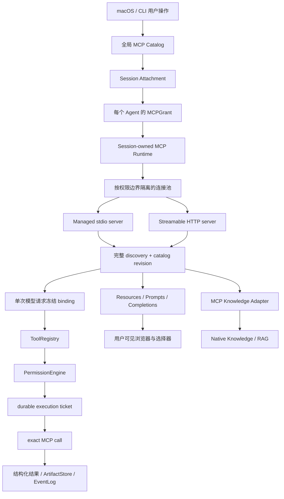

# Intatis MCP 与 Knowledge/RAG 完整系统规划

## MODEL_CHECK_RESULT

- 当前模型：Codex（GPT-5 系列）。
- 精确部署版本：运行环境未提供，无法确认。

## PATH_CHECK_RESULT

- `pwd`：`/Users/vita/Vitemis/Intatis`
- Git root：`/Users/vita/Vitemis/Intatis`
- 路径匹配预期：是。
- 工作树在本轮开始前已有较多未提交改动；本轮不覆盖、不回退、不整理这些改动。

## FILES_WRITTEN

- 新增本报告：`codex-report/07_25_26-14_58-mcp-full-system-plan.md`
- 同步纠正旧调研报告：`codex-report/07_25_26-11_06-mcp-open-source-audit-and-intatis-direction.md`

本轮只写规划文档，不修改业务源码、配置、构建脚本或测试。

## 先纠正一个误会

上一份报告把“以后按什么顺序实施”说成了“现在只规划什么”，这是不对的。

这份报告的范围是最终完整形态：

- 本地 stdio MCP。
- 远程 Streamable HTTP MCP。
- OAuth、凭据与多账号。
- tools、resources、resource templates、prompts、completion、roots。
- 动态目录刷新、订阅、日志、进度、取消、重连。
- sampling、elicitation 和实验性的 MCP tasks。
- 多 Agent 授权、工作区隔离、本地沙箱、远程网络边界。
- macOS 界面、CLI、状态、诊断、导入与迁移。
- 大工具目录。
- MCP knowledge server 接入。
- Intatis 自己的 Knowledge/RAG。
- 持久化、崩溃恢复、测试、开源复用与升级。

后文仍会分“实施波次”，但波次只表达依赖顺序。所有能力都已规划清楚，不代表用户已经决定逐项实施。

## 结论

当前 Intatis 还没有 MCP 客户端，也没有真正的 Knowledge/RAG。

目前只有一些可复用的地基：

- Agent 已经能调用真实工具。
- 工具会经过 CapabilityLease、WorkspaceLease 和三层权限门。
- 工具执行前后有 durable ticket 和 EventLog。
- Cowork 已经能给不同 Agent 不同工具。
- managed terminal 已经证明本地进程可以被沙箱、取消和收尾。
- Code/Cowork 会话已经有进程级 runtime owner。
- ArtifactStore 可以承接大文件和二进制结果。

所以要做的不是再造一个 Agent 内核，而是增加两个彼此分开的系统：

```text
MCP
= 让 Agent 受控地连接外部工具、资源和提示词

Knowledge/RAG
= 让 Intatis 对明确选中的资料建立可更新、可搜索、可引用的知识库

MCP knowledge server
= 两者之间的一种接入方式
```

最终应做到：

> 用户可以把本地或远程 MCP server 接到一个 Code/Cowork 会话，并明确决定每个 Agent 能看见什么。模型看到的工具版本与真正执行的版本完全一致；调用继续经过 Intatis 原有权限、耐久记录和取消链；本地 server 在工作区沙箱中，远程 server 受固定网络与凭据边界约束。资源、提示词、RAG 内容都带来源并被当作外部资料，而不是隐藏系统指令。

## 我们到底想解决哪些问题

| 想解决的问题 | 现在的风险或缺口 | 完成后应该是什么样 |
|---|---|---|
| Agent 不能连接 MCP server | 配了地址也无法握手、列工具或调用 | 本地与远程 server 都有真实连接、状态和调用链 |
| 模型可能看旧工具却调到新工具 | 同名工具更新后可能执行错版本 | 模型看到哪一版，就只能调用那一版；不一致直接拒绝 |
| 一个会话里有多个 Agent | 全员共享会造成越权 | server 挂载和 Agent 授权分开；worker 默认零 MCP 权限 |
| 本地 server 是真实程序 | 可能读宿主文件、拿环境变量或联网 | 固定工作区、最小环境、默认断网、敏感路径拒绝、可靠收尾 |
| 不同 Agent 的工作区权限不同 | 共用一个 server 进程会把大权限借给小权限 Agent | 权限边界不同就使用不同连接/进程；跨 Agent 默认不共享，即使边界相同也只把未来复用当内部性能优化 |
| server 会断线和更新目录 | 可能留下“僵尸工具”或半套新目录 | 先撤下失效能力，完整刷新后一次发布新目录 |
| MCP 调用可能有副作用 | 如果另开通道会绕过现有权限 | 全部走 ToolRegistry → PermissionEngine → durable ticket |
| 调用超时不代表没执行 | 自动重试可能重复写入或付款 | 结果不明就记为 execution uncertain，绝不自动重放副作用调用 |
| 远程 OAuth token 可能泄漏 | token 可能进入配置、日志、重定向或命令历史 | 凭据只经 SecretRef/token store 解析，固定 origin，任何日志都不含秘密 |
| server 返回内容可能巨大 | 撑爆上下文或内存 | 有统一上限，大内容进入 ArtifactStore，只给模型摘要与引用 |
| resources/prompts 可能带恶意指令 | 外部文字可能偷偷提升权限 | 永远标成不可信来源；prompt 必须由用户显式选择和插入 |
| 工具很多 | 全塞给模型浪费上下文 | 小目录直接展示；大目录先受权搜索，再按冻结版本调用 |
| “能读 resource”被误认为已有 RAG | 没有索引、新旧判断和引用 | Native Knowledge 有采集、切块、索引、更新、检索和引用合同 |
| 崩溃或退出 | 遗留进程、连接或未知调用 | Session/App 退出有界 drain；冷启动只对账，不自动重放 |
| 用户已有其他 CLI 的 MCP 配置 | 重配麻烦，复制秘密又危险 | 可预览导入公开字段；秘密转为 Intatis 引用；不删原配置、不自动启动 |

## 给用户判断的范围分层

“全部规划清楚”不等于“默认要求你把每一项都做掉”。我建议按价值分成四层，你可以逐层保留或删除：

| 层 | 包含什么 | 我的判断 |
|---|---|---|
| 必须解决 | 真实连接、模型看到与执行同一版工具、每个 Agent 独立授权、本地沙箱、现有权限链、可靠取消和退出 | 没有这些就不应接 MCP |
| 完整常用能力 | Streamable HTTP、OAuth、resources、prompts、completions、roots、动态刷新、macOS/CLI 管理与诊断 | 建议纳入正式 MCP 产品 |
| 可选高级能力 | basic sampling、elicitation、实验 MCP tasks、大工具目录搜索、Native Knowledge/RAG | 全部在本报告中规划，但可以分别决定是否实施 |
| 明确不自动做 | `sampling.tools`、自动启动项目配置、自动安装包、prompt 升为系统指令、默认跨 Agent 共用连接、iOS 本地 Agent runtime | 除非以后另有完整设计，否则保持不支持 |

这里的“可选”不是“报告先留白”，而是完整方案和边界都已经写出，但不替用户预先决定产品一定要启用。

## 两条独立完成线

### A. MCP 完整体系

完成本地/远程连接、OAuth、tools/resources/prompts/completions/roots、动态刷新、多 Agent、权限、沙箱、生命周期、UI/CLI 和发布认证后，就可以独立宣布：

> Intatis 的 MCP client 已完成。

它能接外部 knowledge server，但不依赖 Intatis 自己先造一套 RAG。

### B. Native Knowledge/RAG

完成来源授权、采集、切块、索引、更新、search/read 和引用后，可以另行宣布：

> Intatis 的 Native Knowledge 已完成。

Knowledge 可以只索引本地 workspace/artifact；MCP knowledge adapter 属于第三步的联合体验，不阻塞 A 或 B 的独立完成。

## 最终支持表

| 能力 | 规划结论 |
|---|---|
| 本地 stdio、Streamable HTTP | 正式支持 |
| tools、resources、resource templates、prompts、completions、roots | 正式支持 |
| logging、progress、cancel、resource subscription、listChanged | 正式支持 |
| OAuth 2.1/PKCE/refresh/multi-account | 正式支持 |
| basic sampling | 支持但默认关闭，必须单独审批、限额、无 Agent 历史和工具 |
| `sampling.tools` | 有意不声明；只有未来另做非递归受控 tool loop 后才重新评审 |
| form/URL elicitation | 支持但始终由用户交互，不允许模型自动回答 |
| MCP tasks | 保留完整设计；规范和 SDK 仍标为实验时不广告，成熟并通过兼容验证后启用 |
| legacy SSE | 只可能作为显式 compatibility mode；是否实现由 W0 证据决定 |
| 大工具目录 search/use | 可选扩展；目录规模达到阈值且用户保留该能力时实施，仍走同一权限与冻结版本 |
| Native Knowledge/RAG | 独立产品轨，不作为 MCP 完成的前置条件 |

## 完整范围与明确边界

### 本规划包含

- Intatis 作为 MCP client/host，服务于 macOS Code、Cowork 和 `intatis` CLI。
- 本地 stdio 与远程 Streamable HTTP。
- 规范要求的初始化、版本与能力协商、超时、取消和关闭。
- server 提供的 tools、resources、resource templates、prompts、completions。
- client 提供的 roots，以及受控的 sampling、elicitation。
- MCP 2025-11-25 的实验性 tasks 规划。
- 多 Agent 可见性和实际执行权限。
- MCP 与 Native Knowledge/RAG 的连接。

### 本规划不把下面内容混进同一个实现

- Chat 仍是无工具产品面，不因为 MCP 改成 Agent。
- iOS 仍是 Chat 子集，不链接本地进程、Tools、AgentKernel、Cowork 或本地 MCP runtime。
- “把 Intatis 自己作为一个通用 MCP server 暴露给其他应用”是另一个产品方向。本规划会给模块留下边界，但不把它混入当前 client 目标。
- MCP 不是新的权限系统，也不是新的 AgentLoop。
- RAG 不是 MCP 的别名；两者可以独立工作。

### 平台能力矩阵

| Host | 本地 stdio | 远程 HTTP | 结论 |
|---|---|---|---|
| macOS DeveloperID App | 支持 | 支持 | 完整 Code/Cowork 产品面 |
| macOS App Store sandbox App | 不支持 | W0 核对 entitlement 与产品政策后决定 | 不能因为支持远程就偷带本地进程 |
| macOS `intatis` CLI | 支持 | 支持 | 使用 CLI 的 session owner 和本地 sandbox |
| Linux `intatis` CLI | 仅 bwrap 和全部策略可用时支持，否则 fail closed | 支持 | 不宣称 PTY；stdio 只需要 pipe |
| iOS App | 不支持 | 本规划不支持 | 继续保持 Chat-only，无 Tools/AgentKernel/Cowork |

## 公开实现给出的答案

本报告沿用上一份固定源码审计的版本：

| 项目 | 固定版本 | 主要借鉴 |
|---|---|---|
| Codex CLI | [`4c43465133428898aa84f0bfc02c306ed65fb66a`](https://github.com/openai/codex/tree/4c43465133428898aa84f0bfc02c306ed65fb66a) | 主线：配置、连接、目录、精确调用、关闭、OAuth |
| Codex MCP binding 修复 | [`65f8bf68533332628b7fc213eade2a91d18d36ee`](https://github.com/openai/codex/commit/65f8bf68533332628b7fc213eade2a91d18d36ee) | prepared call 与目录版本绑定 |
| Gemini CLI | [`3818efbbfbf8ef029ef53a6ab1093db39971ce83`](https://github.com/google-gemini/gemini-cli/tree/3818efbbfbf8ef029ef53a6ab1093db39971ce83) | tools/resources/prompts 变化通知的合并刷新 |
| OpenCode | [`5e2a6257b22c0141a20c281f4c2a641311afe5a5`](https://github.com/anomalyco/opencode/tree/5e2a6257b22c0141a20c281f4c2a641311afe5a5) | resources/templates/prompts、MIME、大小控制和断开撤目录 |
| Grok Build | [`6e386420825bd44ae648c63e7c8cba12fcec9401`](https://github.com/xai-org/grok-build/tree/6e386420825bd44ae648c63e7c8cba12fcec9401) | 管理面、重启、大目录 search/use、Knowledge 参考 |
| 官方 Swift MCP SDK | `0.12.1` / [`a0ae212ebf6eab5f754c3129608bc5557637e605`](https://github.com/modelcontextprotocol/swift-sdk/tree/a0ae212ebf6eab5f754c3129608bc5557637e605) | Swift 协议、transport、OAuth 和完整能力基础 |
| MCP 规范 | [2025-11-25](https://modelcontextprotocol.io/specification/2025-11-25) | 当前完整协议目标 |

### 以 Codex CLI 为主线

Codex 最值得复用的不是具体 Rust 类型，而是四个做法：

1. server 配置是有身份和版本的，不是一段随时变化的字典。
2. 连接可以换代，旧请求持有自己的对象，不能被全局刷新偷换。
3. 工具调用先准备成一个具体调用，再真正发送。
4. 本地进程有 process group、TERM/KILL 和输出上限。

相关源码：

- [MCP 配置](https://github.com/openai/codex/blob/4c43465133428898aa84f0bfc02c306ed65fb66a/codex-rs/config/src/mcp_types.rs)
- [server catalog](https://github.com/openai/codex/blob/4c43465133428898aa84f0bfc02c306ed65fb66a/codex-rs/codex-mcp/src/catalog.rs)
- [session/task MCP runtime](https://github.com/openai/codex/blob/4c43465133428898aa84f0bfc02c306ed65fb66a/codex-rs/codex-mcp/src/runtime.rs)
- [连接管理](https://github.com/openai/codex/blob/4c43465133428898aa84f0bfc02c306ed65fb66a/codex-rs/codex-mcp/src/connection_manager.rs)
- [工具目录与 prepared call](https://github.com/openai/codex/blob/4c43465133428898aa84f0bfc02c306ed65fb66a/codex-rs/codex-mcp/src/connection_manager/tool_catalog.rs)
- [binding](https://github.com/openai/codex/blob/4c43465133428898aa84f0bfc02c306ed65fb66a/codex-rs/codex-mcp/src/binding.rs)
- [MCP tool call](https://github.com/openai/codex/blob/4c43465133428898aa84f0bfc02c306ed65fb66a/codex-rs/core/src/mcp_tool_call.rs)
- [stdio launcher](https://github.com/openai/codex/blob/4c43465133428898aa84f0bfc02c306ed65fb66a/codex-rs/rmcp-client/src/stdio_server_launcher.rs)

但 Intatis 必须修正 Codex 的几个缺口：

- Codex 的普通 MCP tool handler 仍有重新取得 current binding 的路径。Intatis 必须把模型请求冻结的 binding 一路带到执行，不能按名字回退到最新版。
- Codex 的 stdio launcher 做了进程管理，但所审计路径明确没有套入它的 shell sandbox。Intatis 必须使用自己的 WorkspaceLease 和沙箱。
- 普通 `listChanged` 通知在所审计版本里主要记录日志。Intatis 要做完整的合并刷新和原子发布。
- server annotations 只能当提示，不能替代 Intatis 权限判断。
- 连接恢复不能自动重放可能已经产生副作用的调用。

### 从其他项目补齐 Codex 没有做完的部分

- Gemini CLI 的价值是连续通知合并、刷新过程中又来通知时补一次尾部刷新，以及每个 Agent 有独立目录视图。
- OpenCode 的价值是 resources、templates、prompts、MIME 和大结果产品形态。
- Grok Build 的价值是 server 管理状态、单一重启任务、有界 backoff、大工具目录的 `search_tool/use_tool`，以及可重建 Knowledge 索引。

不能照搬的做法：

- 不让本地 server 继承完整 `process.env`。
- 不把 OAuth token 原文保存进普通 JSON。
- 不让子 Agent 默认继承父 Agent 的全部 MCP。
- 不设置一个可以绕开 Intatis 权限的 `trust: true`。
- 不让大目录的 `use_tool` 变成无权限捷径。
- 不把 server instructions 静默变成 system/developer prompt。

## 目标使用体验

### 场景一：本地代码工具 server

```text
用户在 Settings 添加本地 server
→ Intatis 先做配置校验和 Test
→ 用户把它挂到一个 Code session
→ 为该 session 选择可见 roots、读写、网络和凭据
→ 第一次明确 Send 或点击 Connect 时才启动
→ server 在受管 pipe process 中握手
→ 工具目录完整获取并发布
→ Agent 的下一次模型请求只看到获准工具
→ 调用进入现有权限和 durable ticket
→ Session 删除或 App 退出时关闭进程
```

### 场景二：Cowork 多 Agent

```text
同一 session 挂了 issue-tracker server
→ @main 获得 search_issue + update_issue
→ worker-A 只获得 search_issue
→ worker-B 没有任何 MCP
→ @permission-reviewer 永远没有 MCP
```

即使都指向同一个 server，只要 worker-A 和 `@main` 的工作区、网络、凭据或 roots 不同，就不能共用同一个真实连接。

### 场景三：远程 OAuth server

```text
用户添加 HTTPS endpoint
→ Intatis 固定 canonical origin
→ 登录页显示 server、origin、scope 和账号
→ PKCE/state 完成登录
→ token 进入 MCPTokenStore，不进入 EventLog
→ 登出或 origin 改变时旧连接和旧 binding 立即撤销
```

### 场景四：Knowledge/RAG

```text
用户选择一个工作区目录、几份 artifact 和一个 MCP knowledge collection
→ 明确选择是否建立本地索引
→ Intatis 采集、切块、哈希、索引
→ Agent 只在自己的 WorkspaceLease 和 KnowledgeGrant 内搜索
→ 返回片段、文件/URI、版本、位置和引用
→ 文件变化后旧 generation 标记 stale 并增量更新
```

## 工程附录阅读说明

如果只想判断“这些问题要不要解决、最终应该变成什么样”，读到这里已经足够。

下面保留完整工程附录，目的是让以后实施时不再临时补权限、生命周期或迁移。附录中的几个重复短语可以这样理解：

- `authority`：一条连接实际拿到的工作区、网络、凭据和回调权限范围。
- `generation`：某一次真实连接或本地 server 进程。
- `raw catalog revision`：一次从 server 完整获取并确认过的原始目录；`Agent view revision` 是这个 Agent 获准看到的派生目录。
- `binding/snapshot`：这次模型请求实际看到并冻结的工具清单和执行路由。
- `staging/stale`：新目录未完整确认前的暂存状态，以及旧目录已经不能继续使用的状态。

## 总体结构



### 谁拥有长期对象

| 对象 | owner | 原因 |
|---|---|---|
| 全局 server catalog | App/CLI 共享配置层 | 统一解析、版本和 provenance |
| session attachment | EventLog-first session state | 某个全局 server 是否属于该会话 |
| Agent MCPGrant | Agent 的 CapabilityLease 投影 | 决定谁能看见和调用什么 |
| MCP runtime | 统一 `SessionRuntimeOwner` 语义；macOS 由 `AppSessionRuntimeManager` 的 exact Code/Cowork runtime 承载，CLI 有自己的 exact session owner | 窗口切换不应关闭连接；删除/退出时能精确 drain |
| 连接/本地进程 | MCP runtime 内、按 authority key 分池 | 权限边界不同不能共用 |
| 单次请求 binding | 单次 provider dispatch | 模型看到的描述与实际执行对象必须一致 |
| OAuth/token store | 共享凭据服务 | 不进入 session 日志或 server 配置 |
| Knowledge index runtime | session/workspace Knowledge owner | 有自己的 generation、更新和删除合同 |

`AgentRuntime` 当前是值类型并持有静态 ToolRegistry，不适合成为长连接 owner。MCP runtime 应由 session runtime 持有，再给每次 provider 请求提供只读、冻结的工具快照。

## 最重要的安全边界：一个 Session 不等于一个共享进程

“Session 持有 MCP runtime”只表示生命周期由 Session 统一管理，不表示所有 Agent 共用一条连接。

每条连接都要有一个 `MCPConnectionAuthority`，至少包含：

- server 定义的不可变 revision。
- transport 与 endpoint/command。
- 本地 `LaunchArtifactIdentity`：真正 executable/interpreter/script/package 的 canonical identity。
- descendant process policy：默认禁止子进程；必要 helper 的 exact `LaunchArtifactIdentity` allow-list。
- credential reference 与账号身份摘要，不含 token 原文。
- WorkspaceLease ID、canonical root identity 和允许路径。
- read-only/read-write。
- denied patterns 与不可移除的敏感路径规则。
- MCP roots。
- 本地 server 网络策略，或远程 server 的精确 origin/egress 策略。
- 允许的 sampling/elicitation/callback 能力。
- host 平台和 sandbox profile revision。

默认规则：

- authority 不完全相同，就创建不同连接。
- 本地 stdio server 尤其不能跨 authority 共用进程。
- 即使 authority 完全相同，也先默认不跨 Agent 复用；只有单独验证隔离合同后才打开显式复用。
- 权限缩小时，旧 authority generation 立即 retired。
- 权限扩大只能影响下一次 provider 请求，不能给当前请求补权。

## 必须分开的六种“版本”

不能只有一个笼统的 `version`：

| 身份 | 表示什么 | 变化时发生什么 |
|---|---|---|
| `MCPServerRevision` | 用户保存的 command/URL/env refs/timeout/filter 等配置 | 生成新配置 revision |
| `MCPConnectionGeneration` | 一次真实连接或本地进程 | 旧 generation 不再接收新调用 |
| `MCPRawCatalogRevision` | 一次从 server 完整获取并验证的原始 tools/resources/prompts 快照 | listChanged/重连成功后生成新原始目录 |
| `MCPAgentCatalogViewRevision` | 从原始目录经全局、session、Agent policy 派生出的可见视图 | filter/grant 变化时生成新视图，不改写原始目录 |
| `MCPBindingID` | 某次 provider dispatch 实际看到的工具和路由 | 同一 assistant response 的 tool calls 只能用它 |
| `MCPRevocationGeneration` | 权限、roots、credential 或网络边界的收紧 | 旧 prepared call 在发送前 fail closed |

工具调用冻结的信息至少包括：

- model-visible qualified tool name。
- server ID 与 server revision。
- connection generation。
- raw catalog revision 与 Agent catalog view revision。
- remote tool name。
- schema hash。
- Intatis ToolRegistry version。
- Agent、task、attempt、turn 和 tool-call identity。
- CapabilityLease/WorkspaceLease/MCPGrant 指纹。
- authority 与 revocation generation。
- 一个只指向该具体 client generation 的 prepared execution route。

## 配置系统

### 三层配置

1. 全局 catalog：定义“有哪些 server”。
2. session attachment：定义“这个 Code/Cowork session 接了哪些 server”。
3. Agent grant：定义“这个 Agent 能看到 server 中的哪些能力”。

三层不能合成一个勾选框。全局存在不等于 session 使用；session 使用也不等于所有 Agent 自动获得。

### `MCPServerDefinition`

本地 stdio 需要：

- stable server ID、display name、immutable revision。
- executable 与 argv 数组，禁止拼成 shell string，也禁止在正式启动时通过模糊 `PATH` 搜索。
- `LaunchArtifactIdentity`，锁定真正要启动的 executable；使用 interpreter/script 时同时锁定 interpreter 与 script/package。
- 子进程策略默认 deny；确需 helper 时逐个保存 exact helper identity，shell 也必须作为明确 helper 单独同意，不能用通配 `process-exec`。
- 可选 cwd，但必须在获准 root 内。
- env 的普通值和 SecretRef，禁止任意继承宿主环境。
- startup/call/shutdown timeout。
- required/optional 和 start policy。
- 网络策略。
- tools/resources/prompts allow/deny filter。
- 来源与固定上游信息。

`LaunchArtifactIdentity` 至少保存可用于再次核对的：

- canonical path。
- file type、owner、mode、device/inode、size 和内容 hash。
- no-follow/symlink 解析结果。
- macOS code-signature/team/notarization 摘要，在目标具备这些信息时记录。
- interpreter、script、package entrypoint 和 lockfile/hash，在相应启动形态下记录。

Test 可以从用户输入的 command 解析一次真实路径，但保存和正式 Connect 必须使用已确认的 exact identity。启动前再次核对；文件被替换、解释器变化、package entrypoint 变化或无法证明 identity 时，创建新 server revision，要求重新 Test 和同意，不能沿旧许可启动“同一路径的新程序”。

helper allow-list 变化同样创建新 revision/authority 和 consent。所有后代必须继承同一 filesystem/network sandbox、process group、death cleanup 和输出限制；如果 host 不能证明 descendant exec policy 生效，需要 helper 的 server 就 fail closed。

远程 HTTP 需要：

- canonical HTTPS origin 与 MCP endpoint。
- 明确的 transport。
- timeout、TLS/trust、proxy policy。
- header 的普通值和 SecretRef。
- OAuth client/scopes/account reference。
- redirect policy。
- required/optional。
- allow/deny filter。

### 保存与更新

- 新增或编辑先进入 staging。
- 先做静态校验，再允许 Test。
- Test 使用临时 generation，不让 Agent 看见。
- 用户确认后原子保存一个新 revision。
- 旧 revision 保留，已有 binding 不被改写。
- view-only 配置变化不重连。
- command、args、cwd、env、credential、origin、roots、sandbox、network 变化必须创建新 generation。
- 工具 allow/deny 变化可以只创建新 catalog view，但仍要创建新 binding/revocation generation。

### Test、Connect 和 Refresh 本身也要授权

ToolRegistry 权限链只覆盖模型发起的 `tools/call`。启动一个本地 executable、连接远程 origin、做 OAuth 或持续订阅，本身也是宿主动作，不能因为“还没调工具”就没有授权合同。

新增 `MCPControlPlaneAdmission`：

- 操作类型至少包括 Test、Launch/Connect、Authenticate、Refresh/Subscribe、Disconnect 和 Install proposal。
- 每次操作绑定 exact server revision、`LaunchArtifactIdentity`/origin、authority、roots、网络、credential refs 和调用者。
- deterministic hard gate 先拒绝平台不支持、identity 不明、越界 root、危险 redirect、缺沙箱或无 exact egress 的动作。
- 用户在 Test 中的确认只允许一个临时 generation，不自动变成长期 launch consent。
- Attach 只保存会话意图，不等于无限期允许启动。
- session 自动 Connect 需要一个对 exact revision/authority 有效的 `MCPConnectionConsent`；没有时 Send 在 provider request 前停住并要求用户确认。
- revision、launch artifact、origin、credential identity、roots、network 或 sandbox 改变会撤销旧 consent。
- 用户明确点击 Connect/Refresh 是宿主控制面操作，不交给模型 reviewer 代替用户判断，但仍经过 hard gate、清洗预览、取消和 durable terminal。

记录：

- session 内 Test/Connect/Refresh/Disconnect 的 request 与 terminal 写入该 session EventLog。
- 尚未属于任何 session 的全局 Test 写入 owner-only、bounded 的 catalog operation journal；保存时只保留清洗后的事实和 terminal。
- 不记录 token、完整 env 或 wire payload。

### 配置来源和冲突

建议来源顺序：

1. Intatis 用户明确保存的全局 catalog。
2. 当前 session 明确固定的 server revision。
3. 用户明确执行的 import。
4. 以后可能存在的 plugin-provided proposal。

项目目录内发现的配置只能显示为“可导入建议”，不能自动启动进程或联网。相同 alias 冲突时要求用户选择或重命名，不能静默覆盖。

### 不在连接时偷偷安装软件

- command 不存在时显示 `setup required`。
- 不在 Connect 时静默执行 `npx -y`、`uvx` 下载或包管理器安装。
- 安装/更新是单独的、用户明确触发的 managed terminal 工作流。
- 安装完成后重新 Test，再保存或连接。

## Session 与连接生命周期

### 状态

每个 server attachment 至少有：

- `disabled`
- `setup_required`
- `auth_required`
- `idle`
- `starting`
- `initializing`
- `discovering`
- `ready`
- `degraded`
- `refreshing`
- `reconnecting`
- `stopping`
- `failed`

状态要带清洗过的 reason、上次成功时间、当前 generation/raw catalog/Agent view revision 和可行动按钮，不能只给“连接失败”。

### 冷启动

为了保持现有 Phase L 合同：

- 冷启动只 replay EventLog、读取 catalog、恢复 attachments/grants 和标记历史状态。
- 不自动启动本地进程。
- 不自动联网。
- 不自动 OAuth refresh。
- 不自动调用 provider。
- 不自动恢复未完成的 MCP tool call 或 MCP task。

只有这些明确动作可以启动：

- 用户点击 Connect/Test/Login/Refresh。
- 用户明确 Send/Resume/Retry，且该 Agent 的获准 server 需要在本次请求前 ready。
- CLI 明确执行对应命令。

### required 与 optional

- optional server 失败：该 server 能力从请求目录撤下，其他健康 server 和内置工具继续工作，界面显示 degraded。
- required server 失败：只阻止依赖它的 Agent/provider dispatch，在任何模型请求前给出可行动错误。
- reviewer、GoalVerifier 等固定零 MCP 的控制面 Agent 永远不受 session required server 阻塞。
- required 应落在 attachment/Agent view 上，不能因为全局 catalog 中某个 server required 就阻塞无权使用它的 Agent。

### 断线与重连

- 断线后先阻止新 prepared call，再更新 UI。
- 未来 provider 请求立即撤下该 generation 的能力。
- 已经发送的调用等待有界结果；如果结果未知，记 `executionUncertain`。
- 一个 server 同时只能有一个 reconnect task。
- 使用有界 exponential backoff + jitter。
- 用户操作、权限收紧、登出、session stop 可以立即取消 backoff。
- 不自动重放 `tools/call`。
- discovery/list/read 等只读协议请求可以在新 generation 上重新发起，但必须有新的 request identity。

### 关闭

turn cancel、task terminal、session delete、Command-Q 的范围不同：

- turn cancel：取消该 turn 的 MCP request，发送 cancellation notification，然后停止等待。
- task terminal：取消并 drain 该 task 的 exact requests/subscriptions；只有连接本来就是 task-scoped，或它已经没有其他引用时才关闭连接，不能误关仍由同 session 其他 Agent/任务使用的连接。
- session delete：精确关闭该 session 的全部 connections/processes，再提交删除。
- Command-Q：停止 admission，广播全部 runtime stop，在有界 deadline 内 drain。

## 本地 stdio server

MCP stdio 需要 pipe，不需要 shell，也不需要 PTY。

新增底层 `ManagedPipeProcess`，职责是：

- 直接执行固定 executable + argv。
- 不经过 `/bin/sh -c`。
- 启动前复查 `LaunchArtifactIdentity`，不重新走 `PATH` 或跟随新 symlink。
- 独立 stdin/stdout/stderr pipe。
- stdout 只承载 MCP 协议。
- stderr 只进入有界、清洗过的诊断。
- 复用 managed terminal 的 Seatbelt/bwrap、process group、death pipe、TERM → KILL、drain 和临时 HOME 思路。
- 默认禁止 server 再启动子进程；允许的 helper 必须命中当前 authority 的 exact identity allow-list。
- 所有允许后代继承同一 sandbox、network、process group 和 death cleanup，不能通过 child process 逃出边界。
- 默认不继承宿主环境，只注入固定 allow-list 和解析后的必要值。
- 默认断网。
- 精确绑定 WorkspaceLease、canonical root、允许路径、denied patterns 和敏感凭据路径。
- 输出、单消息、队列和 stderr 都有上限。
- partial write、协议 framing 不确定或 pipe 状态无法证明时关闭 generation。
- 受控 cancel/session stop/App shutdown 时完成 TERM → KILL → drain，并证明没有仍由该 runtime 持有的子进程。

App/主机突然崩溃或机器掉电时不能承诺“绝对没有孤儿进程”。冷启动只能依据 death-pipe/process-group/owner marker 等可证明事实做 reconcile；不能仅凭历史 PID 杀进程，更不能误杀已经复用该 PID 的无关程序。

### 沙箱

本地 server 的沙箱要比终端更严格：

- 不需要让 server 自己运行任意 shell，除非用户明确配置的 server 本身需要并获得能力。
- read-only Agent 使用 read-only filesystem policy。
- read-write 也只能写 WorkspaceLease 允许位置。
- credential 文件路径默认加入 deny。
- temporary HOME 不包含用户真实 shell/history/config。
- 默认网络 deny。

如果当前 macOS Seatbelt 无法证明“只允许某个远程 host”，不能在报告里假装已有 host 级网络白名单。

最终合格状态是：增加真正的 managed network enforcement，做到 exact host/port allow-list。

在它完成前，本地 server 保持完全断网；“用户批准一个较宽网络范围”只能作为明确标注风险的开发实验，不能算正式能力完成。

Linux CLI 只有在 bwrap 可用且策略完整时运行本地 server，否则 fail closed。Windows 当前不在项目平台范围内。

## 远程 Streamable HTTP

### 连接边界

- 只支持配置中明确的 HTTP(S) endpoint。
- 正式环境默认要求 HTTPS；localhost 开发可明确例外。
- 固定 scheme、host、port 和 trust domain。
- 拒绝带 user-info 的 URL。
- 不自动跟随跨 origin redirect。
- Authorization header、cookies 和 client identity 不能跨 origin。
- 不继承系统浏览器 cookie。
- proxy 是否允许是显式策略，不使用不可见 ambient proxy。
- 每个请求带协商后的 `MCP-Protocol-Version`。
- session ID、连接恢复和 404 处理都绑定具体 generation。

### transport

- 主目标是 Streamable HTTP。
- legacy SSE 是否支持要由固定 SDK/兼容性调研决定。
- 如果支持 legacy SSE，必须是用户显式选择的 compatibility mode，不能自动 downgrade。
- transport 变化生成新 server revision 和 connection generation。

Streamable HTTP 的宿主状态机必须覆盖 [MCP Transports 2025-11-25](https://modelcontextprotocol.io/specification/2025-11-25/basic/transports) 的完整行为：

- 所有 client 消息各自使用 POST，并同时接受 `application/json` 与 `text/event-stream`。
- POST 的 request 可以收到 JSON response 或与该 request 关联的 SSE stream；notification/response 被接受时处理 `202 Accepted` 空响应。
- 可选 GET SSE stream 用于 server 主动请求/通知；server 返回 405 时把它记为“不支持 GET stream”，不是连接整体失败。
- 每条 SSE stream 单独跟踪 event ID、`retry` 和最后已处理位置；只有同一 stream 才能用 `Last-Event-ID` resume，redelivery 要去重。
- 网络断开不等于 MCP cancel；host 必须显式发送 cancellation，断线后的副作用状态仍可能 unknown。
- 初始化返回的 `MCP-Session-Id` 绑定 connection generation，后续每个 HTTP request 都带同一 ID，并按敏感 session identifier 处理。
- 带 session ID 的请求收到 404 时，为未来操作创建新的 initialize generation；如果 404/断线发生在已发送的 `tools/call` 上，原调用记 execution uncertain，绝不自动发到新 session。
- 正常关闭时发送带 session ID 的 DELETE；405 表示 server 不支持 client termination，随后仍关闭本地连接状态。
- 多个并行 SSE stream 的消息必须路由到 exact request/generation，不能让迟到 response 结算另一个调用。

### 网络授权

- 连接建立和 `tools/call` 是两种不同动作。
- 连接 server 的 origin 由 attachment policy 允许。
- tool 自己可能访问什么，不能仅凭 MCP annotation 推断。
- 对远程 tool call，PermissionEngine 至少知道 server、origin、tool、账号摘要、参数摘要和 server annotations。
- server annotations 只能提高警惕，不能降低 Intatis 的风险等级。

## OAuth 与凭据

### 先纠正当前项目事实

当前源码没有真正调用 macOS Security/Keychain API：

- [`Keychain.swift`](../Apps/IntatisMac/Sources/Keychain.swift) 的类实际叫 `ConfigSecretResolver`。
- 文件注释明确说明 legacy `.keychain` ref 会转为配置引用，provider 请求不调用 macOS Keychain。
- [`TESTING.md`](../docs/TESTING.md) 也明确写 GUI 不再读写 OS Keychain。

所以不能在规划里写“直接复用现有 Keychain”。正确做法是先定义：

```text
MCPTokenStore
MCPSecretResolver
```

它们不关心底层是 owner-only Intatis auth/config、系统 Keychain，还是以后的其他安全存储。

### 推荐的当前默认

- 普通 API key/header/env secret 沿用 Intatis 当前 SecretRef/config/auth-file 设计。
- OAuth access/refresh token 使用新的 `MCPTokenStore` 接口。
- W0 应实际比较当前 owner-only auth/config 后端与 OS Keychain 对 macOS GUI、CLI、Linux、备份和迁移的影响，再给出一个明确工程推荐；不应先让用户在两个技术类名之间盲选。
- 无论底层后端是什么，用户得到的结果相同：token 只存在于声明的凭据后端，不进入 EventLog、session state、普通诊断、项目文档或命令历史。
- 如果最终建议会改变 Intatis 整体凭据产品政策，再把影响和迁移方案交给用户决定。

### OAuth 完整能力

- OAuth 只用于 HTTP transport；stdio server 按规范通过受控 env/SecretRef 获得自己的凭据，不把浏览器 OAuth 流塞进 stdio。
- OAuth 2.1。
- PKCE。
- state/nonce 与回调 generation。
- 从 `WWW-Authenticate` 的 `resource_metadata` 开始发现，并支持 endpoint-path 与 origin-root 两种 Protected Resource Metadata well-known 地址。
- 同时支持 RFC 8414 Authorization Server Metadata 与 OIDC discovery 的规定顺序。
- 优先支持预注册 client 和 server 宣告支持时的 Client ID Metadata Documents；Dynamic Client Registration 只是兼容 fallback，不是默认首选。
- 每次 authorization/token 请求使用 canonical resource URI 与 `resource` parameter，token 必须绑定正确 audience。
- 从 401/403 challenge 取得当前所需 scope，按最小权限做 step-up；不能猜测 challenge scopes 与 metadata scopes 的包含关系。
- access token refresh single-flight。
- 账号、server ID、origin、client、scope 隔离。
- token source pinning，不能因配置变动读到另一个来源。
- Login、Logout、Reset、账号切换和授权范围查看。
- refresh、logout、origin 变化会 retire 旧 connection generation。
- callback 迟到时不能复活已取消或已替换的登录代次。
- 禁止 token passthrough：只把该 authorization server 为当前 canonical MCP resource 签发的 token 发给当前 server，防止 confused-deputy 和跨资源 token 复用。

完整行为以 [MCP Authorization 2025-11-25](https://modelcontextprotocol.io/specification/2025-11-25/basic/authorization) 为准，SDK 只减少协议代码，不替 Intatis 决定 trust policy、token store 和 generation fence。

### 凭据只能存在于专用后端

OAuth refresh token 为了跨重启工作，可能必须持久保存在一个明确标记为 secret-bearing 的 `MCPTokenStore`。禁止的不是“专用凭据后端保存 token”，而是 token 出现在其他地方。

下列原文不能进入 global server catalog、EventLog、`session.json`、permission preview、普通日志、诊断包、导出文件、项目文档或 CLI history：

- access/refresh token。
- client secret。
- Authorization header。
- 完整 env。
- OAuth callback query。
- 完整原始 MCP wire log。

## MCP 初始化与能力协商

[MCP lifecycle 2025-11-25](https://modelcontextprotocol.io/specification/2025-11-25/basic/lifecycle) 要求 initialize 是第一项交互，并完成版本与能力协商。

Intatis 的顺序：

```text
transport ready
→ initialize(protocol versions + Intatis client capabilities)
→ 校验 server response
→ 选择双方都支持的 protocol version
→ 保存 negotiated capabilities
→ notifications/initialized
→ 才开始 discovery 或普通操作
```

规则：

- 不支持返回版本就断开。
- 只使用双方明确协商的能力。
- required capability 缺失时失败；optional capability 只标记不可用。
- 每个请求都有普通 timeout 和绝对 maximum timeout。
- progress 可以延长普通 timeout，但不能突破 maximum。
- timeout 后发送 cancellation notification 并停止等待。
- initialize response 中的 server instructions 只是有来源的外部文字，不自动进入 system prompt。

## 完整目录与动态刷新

### discovery

每个新 connection generation 要分页完整读取它声明支持的：

- tools。
- resources。
- resource templates。
- prompts。

completions 按需调用，不需要提前穷举。

读取流程：

```text
逐页读取到 staging
→ 校验 cursor、重复项、名称、schema、URI、MIME、大小和总数
→ 计算完整 raw catalog hash
→ 一次发布 MCPRawCatalogRevision
→ 再依次应用 global/server policy、session attachment filter 和 Agent MCPGrant
→ 生成 MCPAgentCatalogViewRevision
```

不能边读边把半套目录交给模型。

原始目录与 Agent view 必须分开：

- listChanged/重连只改变 raw catalog。
- session filter 或 Agent grant 改变只生成新 view/binding，不伪造 server 目录变化。
- 一个 raw catalog 可以派生多个互不相同的 Agent view。
- raw catalog cache 不代表任何 Agent 获得权限。

### listChanged 与 resource update

- tools/resources/prompts 的连续通知短时间合并。
- 刷新过程中又来通知，完成后再补一次尾部刷新。
- 每次刷新仍走完整 raw staging。
- 收到某一类 listChanged 后，该类旧目录立即标记 stale。
- stale tools 不进入新的 provider request；刷新成功才重新发布 raw revision 并派生新 view。
- 已经冻结但尚未 dispatch 的 prepared call，在 revocation/stale 检查时拒绝。
- 已经发到 server 的调用按原 generation 收尾，不能换路由。
- resource subscription update 只更新明确订阅项，仍要大小/来源检查。
- 刷新失败时保留诊断和上一 revision 的历史显示，但不把 stale tool 继续当成可调用 current tool。

### 名称

模型可见工具使用稳定限定名，例如：

```text
mcp__<serverAlias>__<toolAlias>
```

- 长度超过模型/provider 限制时使用稳定缩短 + hash。
- mapping 存在 binding 中。
- 两个工具映射到同名时 fail closed。
- server display name 改变不自动改变稳定 alias。
- 绝不只按 remote tool name 全局查找。

## 单次模型请求的精确绑定

当前 [`AgentLoop.swift`](../Packages/IntatisAgentKernel/Sources/AgentLoop.swift) 在 turn 开始时一次计算 `specs`，随后执行工具时从成员 `registry` 按名字重新查找。

完整目标是改成每次 provider dispatch 都创建：

```text
AgentRequestToolSnapshot
```

其中同时持有：

- 发给模型的全部内置/MCP ToolSpec。
- 每个名字对应的 exact ToolRegistration。
- MCP prepared route。
- registry/catalog/connection/lease/revocation identity。

规则：

- 一个 provider response 里的所有 tool calls 都使用同一个 snapshot。
- 下一次 provider dispatch 可以取得更新后的 snapshot。
- tool call 执行时必须传入 response-owned snapshot。
- 不能从全局 current registry 按名字回查。
- 连接失效、权限收紧或 catalog stale 可以拒绝旧调用。
- 任何情况下都不能把旧调用改发给新版同名工具。

这比“每 turn 固定一次工具列表”更准确：一个 AgentLoop turn 可能包含多次 provider 请求；每次请求各自冻结，响应内保持完全一致。

## 动态 ToolRegistry 基础改造

当前源码有三个需要在接 MCP 前解决的结构问题。

### 动态 descriptor

[`ToolProtocol.swift`](../Packages/IntatisTools/Sources/ToolProtocol.swift) 的 `Tool.descriptor` 是 `static`，ToolRegistry 也从具体类型读取 descriptor。

一个 `DynamicMCPTool` 类型无法用一个 static descriptor 表达数百个不同 server/tool/schema。

目标：

- `ToolRegistration` 持有实例级 descriptor 和 executor。
- MCP registration 另保留受限、已验证的 output schema、annotations、title/icons 等 metadata；只有 input schema 进入模型参数定义。
- 现有静态工具通过兼容 initializer 自动填入 descriptor。
- 目录、授权、schema hash、permission preview 和执行复查全部使用 registration 中的同一个 descriptor。
- 不能一半使用 static descriptor、一半使用动态 descriptor。

### registry version

当前 `ToolRegistry.adding()` 保留旧 `registryVersion`。MCP 目录或 schema 变化时必须生成新 registry version。

目标：

- registry builder 显式接收 immutable version。
- version 包含内置 registry base、Agent grant、catalog revisions 和 binding generation 的稳定摘要。
- 冲突仍 fail closed。

### 结构化结果

当前 `ToolObservation` 主要是 text/truncated/diff/changedFiles，无法完整承载 MCP content。

目标是 additive 扩展：

- text blocks。
- structured JSON。
- image/audio refs。
- resource links。
- embedded resource refs。
- Artifact refs。
- provenance。
- truncation/size/MIME/hash。

旧调用仍可只使用 text；旧 EventLog 仍能解码。

server 声明 output schema 时，structured result 在进入模型前校验；不匹配时返回 typed server-output failure 并可把有界原始结果存 artifact 供诊断，不能因为 output schema 或 annotation 而放宽权限。

## MCP 工具调用

### 统一执行链

```text
模型返回限定工具名
→ response-owned snapshot 找到 exact registration
→ 参数 JSON/schema 校验
→ MCPGrant + CapabilityLease + WorkspaceLease 检查
→ DeterministicPolicyGate
→ ModelPermissionReviewer
→ PermissionResponder
→ durable tool_execution_prepared
→ 再验证 connection/catalog/lease/revocation
→ tools/call
→ 结果清洗、Artifact spill、tool_execution_settled
→ ToolResult/EventLog
```

MCP 不得有“直接调用 client”的旁路。

### 默认权限

- 一个粗粒度 `.useMCP` 不够。
- CapabilityLease 增加 additive `mcpGrants`，旧数据默认空。
- grant 至少能表达 server revision、tools/resources/prompts、名称/filter、task、expiry、callback 能力。
- worker 默认零。
- child grant = parent grant ∩ 用户/协调者请求 ∩ session policy。
- `@permission-reviewer`、GoalVerifier 和其他控制面 Agent 永远为空。
- `@main` 也不默认获得所有 server；由 session policy 和用户明确选择。

### 风险判断

- server 的 `readOnlyHint`、`destructiveHint`、`idempotentHint` 等 annotation 是不可信提示。
- `destructiveHint` 可以让 Intatis 更谨慎。
- `readOnlyHint` 不能自动降低权限。
- 默认 MCP tool call 进入 ask 流。
- 用户以后可以给 exact server revision + tool schema + authority 建立明确策略。
- reviewer 只能收窄，不能放行 hard deny。

### 调用结果不确定

如果 request bytes 已经发送，而连接随后断开：

- 不能说“没有执行”。
- 不自动 retry。
- durable ticket 标记 execution uncertain/需要人工对账。
- UI 显示 server/tool/时间/账号摘要和安全诊断。
- 只有用户明确发起新的调用，才创建新 request identity。

## Tools 返回内容

支持 MCP 的：

- text。
- structured content。
- image。
- audio。
- resource link。
- embedded resource。

统一规则：

- 单 block、单 result、单 request 和单 turn 都有限额。
- 文本先 SecretScanner，再进入模型或 EventLog。
- 大文本和二进制写 ArtifactStore。
- 模型只得到 bounded summary、artifact ID、MIME、大小、hash 和来源。
- UI 可以显式打开 artifact。
- unknown MIME 默认不内联。
- `isError: true` 表示协议调用完成但工具执行失败，映射为 typed tool failure。
- server 返回的链接不会自动 fetch。
- server 返回的路径不会自动获得本地文件权限。

## Resources

### 产品形态

提供：

- resource browser。
- resource templates。
- 显式 list/read 工具。
- subscription 状态。
- URI、名称、MIME、大小、修改/版本信息。

### 权限与安全

- resource grant 与 tool grant 分开。
- list 和 read 是不同权限动作。
- URI scheme allow-list。
- `file://` 仍受 WorkspaceLease。
- HTTP resource 不自动绕过网络策略。
- template 参数先 schema 校验。
- 内容一律标记为 server-provided/untrusted。
- 大或二进制 resource 进入 ArtifactStore。
- resource link 只有显式 read 才取得内容。
- subscription update 不自动注入 Agent 上下文。

## Prompts、instructions 与 completions

### Prompts

server prompt 必须是用户功能，不是隐藏系统功能：

- 在 composer 中显示 prompt picker。
- 显示 server、prompt 名、说明和参数表单。
- 用户预览后显式插入。
- 插入行为记录为 `user-selected/server-provided` prompt event，并保留 server/revision/prompt provenance；不能把 server 内容误记成用户原创。
- Agent 只有 prompt grant 才能看见。
- server prompt 内容仍标为不可信，不提升为 system/developer role。

### Server instructions

- 初始化返回的 instructions 默认只显示在 server 详情。
- 用户可以为某个 session 显式启用。
- 启用后也只能作为有界、带来源的外部 context。
- 不能覆盖 Intatis policy、用户指令、CapabilityLease 或 WorkspaceLease。

### Completions

- 用于 prompt/resource template 参数辅助。
- 按用户输入显式调用。
- 有 debounce、timeout、大小限制和取消。
- completion 返回值不自动提交。

## Roots

[MCP roots 规范](https://modelcontextprotocol.io/specification/2025-11-25/client/roots) 要求只暴露有适当权限的 root；当前规范中的 root URI 必须是 `file://`。

Intatis 的 roots 只能来自该 connection authority：

- 不能把 App 所有打开的目录给 server。
- 不能把 session 所有 WorkspaceLease 无差别合并。
- read-only/read-write 要与沙箱一致。
- 用户界面明确显示将暴露哪些 root。
- root 改变会发送 `notifications/roots/list_changed`，并创建新的 authority/revocation generation。
- root 不可访问或 bookmark scope 失效时，连接降级或 retired。
- server 知道 root 不等于可以越过 OS 沙箱；二者必须同时成立。

## Logging、progress、ping、cancel 与订阅

- server logging 进入单独的 bounded diagnostics channel。
- 默认不进入模型上下文。
- 高频日志采样、限速和去重。
- progress 绑定 exact request ID。
- progress 可以更新 UI 卡片，但只保存必要的低频里程碑。
- ping 有 timeout，不延长已经失效的 generation。
- cancel 传播到 MCP，并在 host 端停止等待。
- late result 只能结算原 request，不能影响新 request。
- resource subscription 绑定 Agent/session grant；撤权、disconnect、session stop 时解除。

## Sampling

MCP sampling 是 server 反过来要求 Intatis 调模型。[2025-11-25 规范](https://modelcontextprotocol.io/specification/2025-11-25/client/sampling) 还允许 server 请求带 tools 的 sampling。

这不能直接调用现有 AgentLoop。

终态增加独立 `MCPSamplingBroker`：

- 每个 server/Agent policy 单独开关，默认关闭。
- UI 显示哪个 server 请求、完整清洗 prompt、模型、最大 token 和估算成本。
- 用户可拒绝、编辑输入，并在返回 server 前查看输出。
- 使用固定、显式选择的 inference binding。
- 不读取当前 Agent 私有历史。
- 不自动附加其他 MCP server context。
- 不继承 Intatis ToolRegistry。
- 不启动嵌套 AgentLoop。
- token、费用、并发、速率、timeout 和输出上限独立。
- request/decision/result 有独立 durable identity。

初始即使支持 basic sampling，也不声明 `sampling.tools`。带工具的 sampling 只有在未来另行设计一套受控、非递归 tool loop 并完成审计后才可能开启；否则持续明确返回 unsupported。

## Elicitation

[MCP elicitation 规范](https://modelcontextprotocol.io/specification/2025-11-25/client/elicitation) 有 form 和 URL 两种模式。

终态增加独立 `MCPElicitationBroker`：

- server 不能让模型自动回答。
- UI/CLI 明确显示请求 server、原因、字段和目标 domain。
- form 只支持规范允许的受限 schema。
- 用户可编辑、接受、拒绝或取消。
- form 严禁密码、API key、access token、付款凭据等秘密。
- URL mode 明确显示 HTTPS host 并取得用户同意。
- URL 不能携带 Intatis secret 或预认证 bearer。
- 外部流程的第三方 token 由 server 保存，不能经 Intatis MCP client 透传。
- 请求有速率限制、timeout、generation 和 durable terminal。

OAuth 登录 Intatis 到 MCP server，与 MCP server 通过 URL elicitation 登录第三方服务，是两条不同凭据链，界面和存储不能混淆。

## MCP Tasks

[MCP tasks](https://modelcontextprotocol.io/specification/2025-11-25/basic/utilities/tasks) 在 2025-11-25 引入，目前规范明确标为 experimental。

完整规划包含：

- task-augmented `tools/call`。
- `tasks/get`。
- `tasks/result`。
- `tasks/list`。
- `tasks/cancel`。
- status/progress。
- sampling/elicitation 的 task augmentation，在对应 broker 已完成后。

MCP task 有两个方向，必须使用两套状态机：

### Intatis 发请求，server 持有任务

当 Intatis 对 server 发 task-augmented `tools/call` 时：

- Intatis 是 requestor，server 是 receiver。
- server 生成 task ID；Intatis 用 `MCPRemoteServerTaskID` 保存映射。
- 映射记录 server/revision、connection generation、originating tool-call、remote task ID、TTL、poll interval 和相关 metadata。
- 根据 server capability 与 tool 的 `execution.taskSupport = required/optional/forbidden` 决定是否允许 task augmentation；两层都必须匹配。
- Intatis 负责有界 polling/result/cancel，也可处理 status notification，但不能只依赖通知。

### server 发回调请求，Intatis 持有任务

当 server 对 Intatis 发 task-augmented `sampling/createMessage` 或 `elicitation/create` 时：

- server 是 requestor，Intatis 是 receiver。
- Intatis 生成独立 `MCPClientHostedTaskID`。
- Intatis 自己持久化 working/input_required/completed/failed/cancelled、TTL、结果和访问者 identity。
- Intatis 必须实现该方向的 get/result/list/cancel、分页、related-task metadata、terminal CAS 和 TTL 清理。
- 只有对应 sampling/elicitation broker 已完成，且 Intatis 明确广告了 exhaustive task capability，server 才能创建这种任务。
- EventLog 只保存 secret-safe task identity/state/terminal；需要在 TTL 内返回的清洗后 payload/result 放入 owner-only task result store 或 ArtifactStore，过期按合同清理，不能把完整 sampling prompt 或 elicitation response 直接写进普通 JSONL。

两套 MCP task 都必须与 Intatis 自己的 `TaskID`、Cowork WorkTask 和 AgentInvocation 完全分开：

- 不自动把 MCP task 变成 Cowork WorkTask。
- 不让 MCP server 创建 Intatis Agent。
- 不同 server/account/connection generation 不能列举、取得或取消对方任务。
- task 的 model-immediate-response 等 server metadata 只作不可信展示提示，不能绕过 tool result 或用户审批。
- 冷启动只 replay/reconcile 任务事实，不自动 poll、调用 provider 或继续用户交互；明确 Resume/Refresh 后才恢复 requestor 动作。
- client-hosted active callback task 在无法安全恢复时 durable 标为 interrupted/failed 或 input required，不能伪造完成。
- TTL/expired/not-found 是协议状态，不改写既有历史事实。
- SDK 和规范稳定度未验证前不广告任何 task capability。

这是完整目标的一部分，但必须排在普通 request、取消和恢复合同稳定之后。

## 大工具目录

目录低于阈值时直接把获准工具给模型。

超过上下文预算或数量阈值时：

- 不发送全部 schema。
- 暴露一个 Intatis 内置的 `search_mcp_tools`。
- 搜索范围只能是当前 Agent grant 可见的目录。
- 结果包含 server、工具名、说明摘要、schema 摘要和 exact raw catalog + Agent view revision。
- 用户/模型选择后，由一个正常的限定工具调用进入 ToolRegistry 和权限链。
- search 结果不能作为无状态名字跳板。
- catalog 刷新后旧 search result 不可调用。

可以参考 Grok Build 的 search/use 体验，但实际 `use` 不能绕开 snapshot、grant、PermissionEngine 或 durable ticket。

## Knowledge/RAG

### 为什么要单独做

当前 [`Capability.swift`](../Packages/IntatisProviders/Sources/Capability.swift) 里虽然有 `.embedding` 枚举，但仓内没有：

- embedding 请求实现。
- KnowledgeSource。
- 文档枚举/抽取。
- chunking。
- 词法或向量 index。
- freshness/generation。
- search/read。
- citation。

所以不能说 Intatis 已有 RAG，也不能把 MCP resource browser 当作 RAG。

### Native Knowledge 的完整管线

```text
KnowledgeSource
→ 明确授权与枚举
→ 内容抽取
→ 规范化与 Secret/denied-path 检查
→ chunk + source position
→ content hash
→ lexical index
→ optional embedding index
→ hybrid retrieval
→ cited KnowledgeHit
→ explicit read
```

### 执行与生命周期不能成为旁路

- 模型侧 `knowledge_search` / `knowledge_read` 仍是普通 Intatis tools，必须经过 ToolRegistry、KnowledgeGrant/WorkspaceLease、PermissionEngine、durable ticket 和 EventLog。
- 如果模型请求新增、同步或重建索引，该管理动作也走受控工具链；用户在 Settings/CLI 主动操作时走 `KnowledgeControlPlaneAdmission`，不能绕过 deterministic hard gate。
- 每次 indexing operation 有 source revision、operation ID、generation、进度、取消和 terminal；失败不能发布半套新 index。
- `SessionRuntimeOwner` 持有 indexing/search runtime、watcher 和 in-flight embedding tasks；task/session/App stop 时按 exact owner 取消并 drain。
- 文件 source 必须先取得 WorkspaceLease，并在真实读取期间用 RAII 持有 security-scoped bookmark；scope 失效、root identity 变化或 denied policy 收紧会使 operation fail closed。
- watcher 只能观察已授权 roots，不能因为建立索引而扩大目录范围。

### 数据来源

- 用户明确选择的目录和文件。
- workspace 中符合规则的源码/文档。
- ArtifactStore 中用户明确加入的 artifact。
- 用户笔记。
- 用户明确生成并选择保留的 session summary。
- 显式配置的 MCP knowledge collection。

默认不索引：

- denied path。
- credential/auth 文件。
- vendor/generated/build 目录。
- 隐藏的浏览器 profile 和 session secret。
- 大型 binary。
- 未经用户选择的其他 session。
- 任意 MCP resources 全量镜像。

### 索引

- 词法检索是必备基线，embedding 是可选增强。
- index 是可重建派生物，不是 canonical source。
- 每个 source、document、chunk 有稳定 ID、content hash 和 generation。
- rename、delete、modify 能增量更新。
- watcher 丢事件或 generation 不明时标记 stale，并要求 scan。
- embedding 模型、维度和版本变化生成新 index generation。
- 无 embedding provider 时自动退化到词法，不假装语义搜索可用。
- 大目录继续保留 live `rg` 作为精确搜索；index 不替代源码真值。

### 远程 embedding 的数据出域

把本地 chunk 发给远程 embedding provider 是独立的数据出域动作，不是“开启语义搜索”四个字就自动同意。

每个 collection 必须明确：

- local 或 remote embedding。
- exact provider、model revision、canonical trust domain 和 egress allow-list。
- 会发送哪些 source/type、最大 batch/大小和是否允许源码。
- denied/secret/credential 内容永不发送。
- provider retention/training policy 的用户可见摘要与 `UNKNOWN` 标记。
- 本地保存哪些向量、如何删除、source 删除后何时清除派生向量。
- provider/model/domain 变化时重新 consent 并生成新 index generation。

remote embedding request 经过 network permission、SecretScanner、timeout/cancel 和 bounded retry；已经收到 provider 的数据不能靠本地删除宣称远端也已删除，除非 provider 有可验证的删除合同。

### 检索结果

每个 `KnowledgeHit` 至少包含：

- source/collection ID。
- document URI/path。
- source revision/content hash。
- chunk ID。
- 文件位置或资源位置。
- 词法/向量/综合 score。
- bounded excerpt。
- freshness/stale 状态。
- 可展示 citation。

Agent 先 search，再显式 read；不能把大量命中自动塞进每个 turn。

### MCP knowledge adapter

有两种接法：

1. server 明确提供 search/read tools：按普通 MCP 工具调用。
2. server 提供 resources/collections：用户明确配置如何枚举、读取和是否本地索引。

默认：

- 远程内容不永久缓存。
- 只保存必要的来源、hash 和短期 cache metadata。
- 开启 sync/index 前显示隐私、磁盘、网络和 embedding 成本。
- MCP server 断线后 cached 内容标记来源离线/可能 stale。
- 直接调用 server 的 search/read tool 或读取 resource，只需要对应的 MCP tool/resource grant，并走普通 MCP 权限链。
- 只有把 MCP 内容 sync/index 进 Native Knowledge，或通过 Native Knowledge search/read，才额外需要 KnowledgeGrant。
- 从 Native Knowledge 命中后若要 live 回读远程 MCP source，读取动作再同时检查当前 MCPGrant；不能用旧 index 绕过已经撤销的 server 权限。
- 两条路径都经过各自的大小、秘密和 provenance 检查，但不把两种 grant 合并成一个模糊权限。

### RAG 内容仍不可信

检索命中只是资料，不是命令：

- 标记来源。
- 使用清楚的 context wrapper。
- 不进入 system/developer role。
- 不允许文档文字改变工具权限。
- 对 prompt injection 做检测和提示，但不能声称检测必然完整。

## macOS 产品界面

### Settings → MCP 与 Knowledge

全局列表显示：

- server 名称、来源、revision。
- local/remote transport。
- enabled/disabled。
- setup/auth/test 状态。
- 最近成功和清洗后的失败原因。
- Edit、Test、Login/Logout、Disable、Duplicate、Delete。

新增流程：

1. 选择 local stdio 或 remote HTTP。
2. 填配置或 import。
3. 选择 SecretRef，不在普通文本框回显已有 secret。
4. 选择默认 network/roots/filter。
5. Test。
6. 预览 server capabilities 与目录。
7. 原子保存。

平台不支持时不能只在执行阶段报错：App Store build/iOS 不显示可用的 local stdio 添加入口，Linux 缺 bwrap 时显示 fail-closed 原因；remote HTTP 是否可用按平台矩阵判定。

### Session Project Settings

- Attach/detach server revision。
- required/optional。
- start policy。
- session roots。
- network policy。
- account identity 摘要。
- tools/resources/prompts filters。
- 当前 connection/catalog status。

### Agent Access

按 Agent 显示授权矩阵：

- server。
- tools。
- resources。
- prompts。
- sampling。
- elicitation。
- task/expiry。

worker 默认空；新 worker 是否继承某个模板由用户明确设置。模板也只能给出上限，实际 child grant 仍取交集。

### Server detail

Tabs：

- Overview。
- Tools。
- Resources。
- Prompts。
- Access。
- Activity。
- Diagnostics。

Activity 只显示清洗后的连接/刷新/调用摘要，不显示 secret 或完整 wire payload。

### 对话体验

- MCP call card：server/tool、参数摘要、权限、进度、耗时、结果状态、artifact/source。
- Resource browser：list/template/read/subscribe。
- Prompt picker：参数表单、预览、显式插入。
- OAuth sheet：origin、scope、账号、状态。
- Elicitation form/URL approval。
- Sampling review。
- Remote MCP task progress。
- Knowledge 面板：sources、index generation、覆盖率、stale、sync/reindex。

## CLI

### MCP

```text
intatis mcp list
intatis mcp status
intatis mcp add
intatis mcp edit
intatis mcp remove
intatis mcp enable
intatis mcp disable
intatis mcp attach
intatis mcp detach
intatis mcp connect
intatis mcp disconnect
intatis mcp refresh
intatis mcp inspect
intatis mcp tools
intatis mcp resources
intatis mcp prompts
intatis mcp grant
intatis mcp revoke
intatis mcp auth login
intatis mcp auth logout
intatis mcp doctor
intatis mcp import
intatis mcp export
```

统一支持适用的：

- `--session`
- `--agent`
- `--server`
- `--json`

CLI secret 规则：

- 不接受普通命令行参数中的 token 明文。
- 只接受安全交互输入、stdin 专用 secret channel 或 SecretRef。
- `--json` 输出也不含 secret。
- doctor/export 默认清洗。

交互式 CLI 可以提供 `/mcp ...` 对应命令，但最终调用同一共享服务，不能另写一套解析与生命周期。

现有 `/clear` 表示“建立一个新的 CLI session”，不是只清空屏幕。因此：

- 先取消并 drain 旧 session 的 MCP 调用、连接和本地进程。
- 新 EventLog/SessionID 获得新的 MCP runtime。
- 全局 server catalog 仍存在，但旧 session attachments、Agent grants 和 live connections 不自动带入。
- 如果以后支持 new-session template，必须是用户明确配置的 attachment/grant 模板，而不是复用旧 live authority。

### Knowledge

```text
intatis knowledge list
intatis knowledge add
intatis knowledge remove
intatis knowledge sync
intatis knowledge reindex
intatis knowledge search
intatis knowledge get
intatis knowledge stats
intatis knowledge doctor
```

## 持久化与事件

### 全局 catalog

建议新增 owner-only：

```text
mcp-catalog-v1.json
```

保存：

- immutable server revisions。
- display/source/provenance。
- secret references，不保存 secret。
- migration/import marker。

使用稳定 lock、no-follow、原子替换、读回验证和 owner-only 权限，形态沿用现有 inference catalog/store 经验。

全局 Delete 不能破坏历史 session replay：

- 被任何 EventLog attachment/binding 引用的 immutable server revision 只能 disable + tombstone。
- tombstone 立即阻止该 revision 新连接、关闭它的 live generation、撤销它的 launch/connect consent，但保留 secret-free definition/provenance 供历史解释。
- tombstone 不自动删除或 logout credential；同一 auth identity/SecretRef 可能仍被其他 revision/session 使用。credential revoke/delete 是独立用户动作，必须对 exact auth identity 做 durable/live 零引用证明。
- UI 删除前显示仍引用它的 session 数量，并提供先 detach 的路径。
- 只有证明零 durable/live 引用且满足保留策略后，才允许 hard purge。
- replay 遇到 tombstoned revision 可以解释历史，但不能从 cache 或旧 credential 重新连接。

### Session EventLog

EventLog 保存 durable 用户意图和安全事实：

- server attachment/detachment。
- attachment policy revision。
- exact launch/connect consent granted/revoked。
- Test/Connect/Refresh/Disconnect control-plane request 与 terminal。
- Agent MCPGrant granted/revoked。
- roots/network policy revision。
- prompt 显式插入。
- sampling request/decision/terminal。
- elicitation request/decision/terminal。
- remote-server MCP task 的 request/mapping/state/terminal。
- client-hosted sampling/elicitation task 的 secret-safe request/state/terminal；敏感 payload/result 只进专用 result store。
- 与现有 tool execution 关联的 MCP binding snapshot。
- 重要 connection/catalog terminal 和 execution uncertain。

不把高频 progress、ping 或完整 diagnostics 全塞进 EventLog。

### `session.json`

只做 secret-free 派生摘要：

- attached server IDs/revisions。
- grant 摘要。
- last known sanitized state。
- projectedThroughSeq。

EventLog 继续胜出。不能把完整 token、env、wire payload 或动态大 schema 放入 projection。

### catalog cache

完整动态 schemas/resources/prompts 可以放 owner-only、可重建 cache：

- 与 server revision + connection generation + raw catalog revision 绑定。
- 只用于 UI 和冷启动历史显示。
- 没有 live ready connection 时，不能从 cache 执行 tool。
- stale/unknown future schema 时 fail closed。

### Tool authorization

现有 `ResolvedToolAuthorization` additive 增加可选 MCP snapshot：

- server/revision。
- connection generation。
- raw catalog revision 与 Agent view revision。
- binding ID。
- schema hash。
- authority/revocation fingerprint。

旧事件缺字段仍可解码；非 MCP tool 保持 nil。

## 模块与源码落点

### 新模块 `IntatisMCP`

职责：

- SDK adapter。
- config/catalog。
- connection authority/pool/generation。
- stdio/HTTP transports。
- initialize/capabilities。
- discovery/refresh。
- prepared call。
- OAuth/token-store interfaces。
- resources/prompts/completion。
- logging/progress/subscription。
- sampling/elicitation brokers。
- MCP tasks。

依赖只面向必要的 `IntatisCore`、`IntatisProtocol`、`IntatisTools` 和官方 SDK；不反向拥有 AgentLoop、Cowork 或 App UI。

### `IntatisProtocol`

新增 SDK 无关的：

- MCP IDs/revisions。
- server attachment。
- MCPGrant/KnowledgeGrant。
- authorization snapshot。
- EventLog payload。
- structured result/provenance。

协议层不暴露 SDK 具体类型。

### `IntatisTools`

- 实例级 ToolRegistration descriptor。
- dynamic registry version builder。
- structured ToolObservation。
- `ManagedPipeProcess`。
- MCP dynamic tool bridge 的通用执行接口。

SDK client 本身仍放 `IntatisMCP`。

### `IntatisAgentKernel`

- 每次 provider dispatch 获取 `AgentRequestToolSnapshot`。
- provider response 与 snapshot 绑定。
- `runTool` 接收 snapshot，而不是回查成员 current registry。
- MCP prepared route 进入同一 authorization/durable execution。

### `IntatisCowork`

- CapabilityLease 投影精确 MCPGrant。
- `toolRegistry(for:agentID:)` 合并该 Agent 的 MCP snapshot。
- spawn/delegate 时按交集授予。
- reviewer/GoalVerifier 强制空。
- grant/revoke 与 roster/task 状态原子持久化。

### macOS 与 CLI

- 定义共享 `SessionRuntimeOwner` 生命周期合同。
- macOS 的 `AppSessionRuntimeManager` 持有 exact session MCP runtime。
- CLI interactive/noninteractive command 创建并关闭自己的 exact session owner，不能依赖 App 类型。
- CodeViewModel/Cowork runtime 只使用共享 owner seam。
- GUI 和 CLI 共用同一配置、token、runtime API。

### iOS

- 不链接 `IntatisMCP`、Tools、AgentKernel 或 Cowork。
- 如果未来只想做远程 resource browser，也应另开产品评审，不能借此把 workspace Agent runtime 带入 iOS。

### Native Knowledge 模块

建议独立 `IntatisKnowledge`：

- KnowledgeSource。
- extractor/chunker。
- lexical index。
- optional embedding adapter。
- search/read/citation。
- watcher/sync/generation。
- MCP knowledge adapter。

这样 MCP 与本地目录知识可以分别演进。当前产品边界只链接 macOS Code/Cowork 与合格 CLI，不进入 iOS Chat 子集。

## 开源复用计划

| 来源 | 方式 | 计划 |
|---|---|---|
| 官方 Swift MCP SDK | dependency，待兼容与许可证验证 | 负责协议、transport、OAuth 基元 |
| Codex catalog/binding/connection 设计 | reference | 重新以 Swift/Intatis 生命周期实现 |
| Codex 某段算法若逐行翻译 | derived | 固定 commit、记录 provenance、更新 NOTICE |
| Gemini listChanged 合并刷新 | reference | 借状态机和测试，不复制整个 runtime |
| OpenCode resource/prompt 体验 | reference | 借交互与大小策略 |
| Grok search/use、restart、Knowledge | reference | 借产品与测试思路 |

用户更偏好 Codex CLI，这个优先级应真实反映到实施中：

- 连接 identity、prepared call、catalog revision、required/optional、关闭和输出上限，先对照 Codex 的真实源码与测试，而不是凭印象重新设计。
- 如果 Codex 某个小而独立的算法或测试向量比重新实现更可靠，可以直接选择性复用或逐行翻译；该文件必须固定上游 commit，并按 `derived` 记录。
- Rust 与 Swift 的并发/ownership 结构不同，不能为了“直接复用”而常驻嵌入整个 Codex Rust MCP runtime，也不能让 helper 绕过 Intatis session owner、PermissionEngine、WorkspaceLease 或 EventLog。
- 最值得优先移植的是行为合同和回归测试；只有能保持同等边界的最小源码切片才进入产品。

引入 SDK 前必须：

- 固定 tag + commit。
- 核对 LICENSE 与全部传递依赖。
- 做独立 SwiftPM 兼容 probe。
- 核对 Swift tools version、macOS deployment target、并发检查和 Linux CLI。
- 验证 stdio transport 是否只包裹 file descriptors，确保进程仍由 Intatis 启动。
- 更新 `OPEN_SOURCE_REUSE.md`、provenance 和 `NOTICE.md`。

本报告没有复制、翻译或引入任何上游源码。

## 完整实施波次

下面 W0–W12 是完整规划的依赖顺序，不是一份要求整包接受的承诺：

- W0–W8 加 W10 完成 MCP client 本身，包含配置迁移和发布认证。
- W9 是完整设计过的可选高级协议分支；未选择时不广告对应 capability，并以明确 unsupported 通过兼容测试，不阻塞普通 MCP 完成。
- W11 完成独立 Native Knowledge/RAG。
- W12 完成 MCP 与 Native Knowledge 的联合适配。

批准总体方向不等于立刻改代码；开始实施时仍应逐波次评审、验证和回写文档。

### W0：冻结事实与兼容基线

完成：

- 固定 MCP 2025-11-25 和 SDK 版本。
- SDK/许可证/依赖/Swift/macOS/Linux probe。
- 决定 legacy SSE。
- 决定 App Store 远程 MCP 产品边界。
- 决定 MCPTokenStore 的初始后端。
- 写入 architecture decision 和开源 provenance 计划。

退出条件：

- 不依赖猜测即可编译一个不启动真实进程的 SDK client fixture。
- 所有 UNKNOWN 有明确 owner 和验证方法。

### W1：稳定数据模型

完成：

- MCP IDs/revisions/authority/grants/attachments。
- raw catalog revision、Agent view revision 与 `LaunchArtifactIdentity`。
- EventLog additive schema。
- dynamic ToolRegistration descriptor。
- structured ToolObservation/ToolResult。
- registry version builder。
- authorization MCP snapshot。
- old JSONL/old registry 兼容测试。

退出条件：

- 没有网络/进程也能证明旧事件可读、grant 默认空、动态 schema 指纹稳定。

### W2：配置、catalog 与导入 staging

完成：

- owner-only global catalog store。
- immutable revisions。
- Test-before-save staging。
- source/provenance/conflict。
- referenced revision tombstone/zero-reference purge。
- sanitized import/export。
- session attachment/grant durable state。

退出条件：

- 并发保存、崩溃、symlink/permissions/corruption 测试通过。
- 未经用户确认不会启动任何 server。

### W3：Session runtime 与 authority 隔离

完成：

- session-owned `MCPRuntime`。
- authority-keyed connection pool。
- generation/revocation state machine。
- `MCPControlPlaneAdmission` 与 exact launch/connect consent。
- required/optional。
- cold-start no-connect。
- session delete/Command-Q drain。

退出条件：

- 不同 WorkspaceLease/network/credential 的 Agent 无法共用连接。
- 窗口切换不关闭 runtime；session 删除只关闭 exact session。

### W4：Managed stdio 与基础协议

完成：

- `ManagedPipeProcess`。
- canonical executable/interpreter/script identity 的 Test、保存与启动前复查。
- Seatbelt/bwrap、默认断网、最小 env、sensitive-path deny。
- initialize/version/capability/initialized。
- ping/timeout/cancel/shutdown。
- stdout protocol/stderr diagnostics。

退出条件：

- 能运行真实 fixture server。
- 越界/联网/环境泄漏被拒。
- 受控 cancel/App exit 后无残留；crash 后只按可证明 identity reconcile，不凭历史 PID 误杀。

### W5：Tools 全链路与精确 binding

完成：

- tools discovery/pagination/validation。
- per-provider-dispatch snapshot。
- qualified names。
- MCPGrant 过滤。
- ToolRegistry → PermissionEngine → durable ticket → exact call。
- result/Artifact/SecretScanner。
- execution uncertain。

退出条件：

- 同名工具换 schema/connection 后旧 response 绝不调用新实现。
- reviewer/worker 默认看不到 MCP。
- 任何 MCP call 都有现有权限与耐久证据。

### W6：远程 HTTP 与 OAuth

完成：

- Streamable HTTP。
- POST JSON/SSE、GET stream、202、event resume、session ID、404 reinitialize 和 DELETE。
- exact origin/redirect/trust/proxy/egress。
- OAuth 2.1/PKCE、Protected Resource Metadata、RFC8414/OIDC discovery、Client ID Metadata Documents、resource/audience binding、scope step-up、refresh/account。
- login/logout/reset。
- token generation fence。
- optional legacy SSE compatibility。

退出条件：

- token 不跨 origin、不进日志。
- auth revoke 后旧 binding 立即失效。
- 网络/断线不自动重放 tool call。

### W7：动态目录、Resources、Prompts、Completions、Roots

完成：

- tools/resources/prompts listChanged 合并刷新和尾部补刷。
- atomic catalog publication。
- resources/templates/read/subscriptions。
- prompt picker/provenance。
- completions。
- roots/list_changed。
- server instructions 用户显式策略。

退出条件：

- 通知风暴不产生半套目录。
- stale tool 不进入新请求。
- prompt/resource 不会静默成为高优先级指令。

### W8：完整产品管理面

完成：

- macOS Settings、Session Settings、Agent Access、server detail。
- call/resource/prompt cards。
- status/diagnostics/doctor。
- 完整 CLI 与 `--json`。
- safe import/export。
- setup/install 指引。

退出条件：

- 用户不用编辑事件文件就能完成添加、测试、挂载、授权、登录、诊断和删除。
- GUI/CLI 对同一配置产生相同结果。

### W9：可选高级协议分支——Sampling、Elicitation、MCP Tasks

完成：

- 独立 sampling broker。
- form/URL elicitation broker。
- 费用/隐私/速率/timeout。
- 实验 MCP tasks 的 remote-server 与 client-hosted 两套 IDs/state machines，以及 poll/result/list/cancel。
- 与 Cowork Task 完全隔离。

退出条件：

- 若启用：sampling 不递归 AgentLoop、不继承工具/历史。
- 若启用：elicitation 不能收集 form secret。
- 若启用：两类 MCP task 都不自动变成 Intatis WorkTask。
- 若不启用：initialize 不广告对应 capability，收到越界请求时返回明确 unsupported，普通 MCP 仍可完成。

### W10：运行可靠性、迁移与可选大目录

完成：

- 可选 `search_mcp_tools`。
- hot reload/reconnect/backoff。
- request/connection/catalog metrics。
- bounded diagnostics。
- crash recovery、late response、partial write、network partition fault injection。
- protocol conformance fixtures。
- Codex/OpenCode/Gemini/Grok/Claude 配置导入。
- 性能、内存、压力、崩溃、重启、真实 OAuth 和真实 server E2E。
- 开源 NOTICE/provenance。
- 操作文档与升级矩阵。

退出条件：

- 若启用大目录扩展：目录不压垮 context，stale search result 不能调用。
- 重连、刷新、取消竞争有确定终态。
- 无 MCP 配置的用户行为不回归。
- MCP 终态验收条件全部通过。

### W11：Native Knowledge/RAG

完成：

- KnowledgeSource/Grant。
- extractor/chunker/hash/generation。
- lexical index。
- optional embedding provider/index。
- hybrid search/read/citation。
- watcher/sync/reindex/delete。
- workspace/artifact/note/session-summary sources。

退出条件：

- 无 embedding 时词法检索仍完整可用。
- 任何命中可追溯到 exact source/version/location。
- denied/secret/vendor/generated 不被意外索引。

### W12：MCP Knowledge bridge 与联合体验认证

完成：

- MCP search/read adapter。
- explicit resource collection indexing。
- offline/stale/cache policy。
- MCPGrant、KnowledgeGrant、source provenance 和 citation 的统一展示。
- 外部 server、本地 index、offline cache 的联合故障/隐私/删除测试。

退出条件：

- MCP knowledge 与 Native Knowledge 可统一引用，但权限和来源不混淆。
- MCP 与 Native Knowledge 各自独立关闭时，另一条产品线仍正常工作。
- 联合体验验收条件通过。

## 测试与验证总矩阵

### 配置与存储

- 新增、编辑、删除、disable、revision。
- 并发写、崩溃中断、readback。
- owner-only、no-follow、symlink/hardlink。
- unknown future schema。
- secret 永不进入 catalog/EventLog/projection/export。
- import conflict、rollback、原文件保留。
- referenced server delete → tombstone，zero-reference 后才 purge。
- PATH 输入只在 Test 解析；保存/启动使用 exact `LaunchArtifactIdentity`。
- executable/interpreter/script/package 替换、symlink swap、hash/signature 改变。
- 默认 child exec deny；exact helper allow-list、helper 替换、descendant sandbox/network/process-group 继承。

### 连接与协议

- initialize 成功/版本不兼容/能力缺失。
- Test/Connect/Refresh consent、revoke、revision/authority 变化。
- required/optional 混合。
- 启动 timeout、调用 timeout、absolute timeout。
- stdio EOF、stderr flood、malformed JSON-RPC、超大 frame。
- HTTP redirect、origin 改变、TLS、proxy、session invalid。
- HTTP POST JSON/SSE、202、GET/405、event retry、Last-Event-ID、redelivery 去重。
- `MCP-Session-Id`、404 新 initialize、DELETE/405；已发送 tool call 不重放。
- ping/cancel/late response。
- graceful close、TERM、KILL、orphan proof。

### 权限与多 Agent

- worker 默认零。
- reviewer/GoalVerifier 永远零。
- DeveloperID/App Store/macOS CLI/Linux/iOS 平台矩阵。
- exact tool/resource/prompt grant。
- child 取交集。
- task expiry/revoke。
- WorkspaceLease/read-only/network/credential 不同不共用。
- raw catalog 相同但 Agent filter/grant 不同，产生不同 view 而不改 raw revision。
- 扩权只影响下一请求；缩权立即阻止未发调用。

### binding 与刷新

- 同名同 schema 新 connection。
- 同名新 schema。
- tool 删除、增加、改 annotation。
- listChanged storm。
- refresh 中再通知。
- refresh 失败。
- disconnect 后新请求无僵尸工具。
- old response tool call 不路由到 current catalog。
- stale search result 拒绝。

### 调用与权限

- schema invalid。
- hard deny。
- reviewer deny/timeout/failure。
- manual approve/decline/cancel turn。
- prepared 后 revoke。
- request 发送前失败 = not started。
- request 发送后断线 = execution uncertain。
- 绝不自动 replay。

### 结果

- text/structured/image/audio/resource link/embedded resource。
- `isError`。
- binary/unknown MIME。
- result 大小、总 turn 大小。
- Artifact spill。
- SecretScanner。
- malicious link/path/resource。
- provenance round-trip。

### Resources/Prompts/Roots

- pagination/template 参数。
- URI scheme/WorkspaceLease。
- resource update/subscription cancel。
- prompt picker/参数/显式插入。
- server instructions disabled/enabled。
- completion debounce/cancel。
- root consent/list/change/unavailable。

### OAuth

- PKCE/state。
- callback cancel/late/duplicate。
- Protected Resource Metadata 的 header/path/root discovery。
- RFC8414 与 OIDC discovery 顺序。
- preregistration、Client ID Metadata Documents 和 DCR fallback。
- canonical resource URI、resource parameter、audience binding。
- 401/403 scope challenge、least-privilege step-up、confused-deputy 拒绝。
- refresh single-flight。
- account/server/origin/scope 隔离。
- logout/revoke。
- token 不进 logs/diagnostics/history。
- redirect/header leakage。

### Sampling/Elicitation/Tasks

- sampling 默认 deny。
- 用户 review/edit/deny。
- 无 history/tools/context。
- token/cost/concurrency/timeout。
- form secret 拒绝。
- URL origin consent。
- elicitation cancel/late completion。
- MCP task create/get/result/list/cancel/TTL。
- remote-server task 与 client-hosted callback task 的双向状态机、隔离、分页和 related-task metadata。
- tool `execution.taskSupport` required/optional/forbidden 与 capability 组合。
- MCP task 与 Cowork Task ID 不混淆。

### 生命周期

- window close/switch 不 stop。
- turn cancel 只取消 turn。
- task terminal exact drain。
- session delete exact drain。
- Command-Q 全 runtime drain。
- crash 后 cold replay 不连接、不 poll、不重放。
- 受控 shutdown 无残留；crash reconcile 只用可证明 identity，不凭历史 PID 误杀。

### Knowledge/RAG

- source consent/grant。
- model search/read 的 ToolRegistry/PermissionEngine/durable ticket。
- indexing control-plane admission、operation generation、bookmark RAII、watcher owner 和 shutdown。
- chunk/hash/location。
- create/modify/rename/delete。
- watcher missed event → stale/rescan。
- lexical-only。
- embedding version migration。
- remote embedding provider/model/trust/egress/retention/delete consent 与 secret/denied 数据不外发。
- hybrid ranking。
- exact citation。
- denied/vendor/generated/binary/secret exclusion。
- MCP collection cache/offline/stale。
- prompt injection 作为不可信资料处理。

### 性能

- 1、10、100 个 server。
- 10、1,000、10,000 个工具的 direct/search 模式。
- notification storm。
- 大 resource/result。
- 慢 server、hung server、反复 crash。
- 并发 Agent、不同 authority。
- 大目录 index、增量更新、冷启动。

## 迁移与兼容

当前没有 MCP durable state，所以采用 additive 设计：

- 没有 MCP 配置时，Chat/Code/Cowork/CLI 的既有行为保持不变。
- CapabilityLease 新 `mcpGrants`、`knowledgeGrants` 默认空。
- EventLog 新字段 optional，旧 JSONL 可读。
- `session.json` 只加派生字段。
- 不修改旧 envelope 的 seq、原始 bytes 或语义。
- iOS target 不新增链接。

### 从其他工具导入

支持显式导入：

- Codex。
- Gemini CLI。
- OpenCode。
- Grok Build。
- Claude/其他兼容格式，只有完成固定源码/格式审计后加入。

导入流程：

```text
用户选择来源
→ 只读解析
→ 预览 command/args/cwd/url/timeout/filter
→ 标出未知字段和疑似 secret
→ secret 转成 Intatis SecretRef，不直接复制到普通配置
→ policy 使用最严格合并
→ staging validate + Test
→ 用户确认
→ 原子保存新 Intatis revision
→ 记录 provenance/marker
```

不会：

- 自动扫描并启动其他工具配置。
- 自动读取其他应用凭据。
- 删除或修改原配置。
- 把未知字段当成安全默认。

## 终态验收条件

### A. MCP 完成条件

以下全部成立，就可以独立宣布 MCP client 完成，不等待 Native Knowledge：

1. 本地与远程 MCP 都能真实连接和调用。
2. Test/Connect/Refresh 有 exact host-control admission、consent 和 durable terminal。
3. 本地 executable/interpreter/script identity 在 Test、保存和启动前一致；替换后旧许可失效。
4. 模型看到哪版工具，就只会执行哪版。
5. raw server catalog、Agent view 和 provider binding 不混层。
6. 不同 authority 的 Agent 永不共用真实连接；跨 Agent 默认不复用。
7. worker 默认零，reviewer 永远零。
8. 所有 MCP tool call 都经过现有权限与 durable ticket。
9. 本地 server 不能越过 workspace、denied paths 和 exact network allow-list；allow-list 未完成时保持断网。
10. Streamable HTTP 的 POST/GET/SSE/resume/session/404/DELETE 有完整 generation 合同。
11. HTTP token 绑定 canonical resource/audience，不跨 origin，也不进入普通 durable/diagnostic 输出。
12. 断线、撤权、登出、root 变化后旧 binding 立即失效。
13. 可能已有副作用的未知调用不会自动重试。
14. 动态刷新一次发布完整 raw catalog，再派生 Agent view；不存在半新半旧或僵尸工具。
15. tools/resources/prompts/results 都有大小、秘密和 provenance 控制。
16. prompt/instructions/外部资料不会静默变成高优先级指令。
17. sampling/elicitation/tasks 启用时不会递归 AgentLoop、混入 Cowork Task 或绕过用户；未启用时不广告并明确返回 unsupported。
18. 冷启动不自动启动进程、联网、调用 provider、poll 或重放。
19. GUI 和 CLI 能完成配置、测试、挂载、授权、认证、诊断和删除。
20. 无 MCP 的用户不发生行为或数据兼容回归，iOS 平台边界不被削弱。
21. 固定上游、许可证、NOTICE、故障注入、协议一致性和真实 E2E 全部通过。

### B. Native Knowledge 完成条件

1. KnowledgeSource/Grant、index generation、freshness、search/read 和 exact citation 完整。
2. model search/read 与 indexing control plane 都经过相应权限、durable operation 和 session lifecycle。
3. WorkspaceLease/bookmark scope、watcher、cancel/shutdown 不扩大文件权限。
4. 远程 embedding 有 exact provider/trust/egress/retention/delete consent；本地词法路径不依赖它。
5. denied/secret/vendor/generated/binary 不被意外索引或外发。
6. source 修改、rename、delete、watcher 丢事件和 embedding model 变化都有确定更新/重建合同。
7. 无 Knowledge 的用户不发生行为或数据兼容回归。

### C. 联合体验完成条件

1. MCP knowledge 与 Native Knowledge 可统一 search/read/citation。
2. MCPGrant、KnowledgeGrant、缓存、来源和数据出域不混淆。
3. 任一系统离线或关闭时，另一系统仍能独立工作。
4. 外部内容始终作为有来源的不可信资料进入模型。

## 已经可以冻结的设计决定

- 以 Codex CLI 为主参考，Gemini/OpenCode/Grok 补齐。
- 优先使用官方 Swift MCP SDK，但必须先做兼容和许可证 probe。
- SDK 只负责协议与 transport，不拥有进程、权限、workspace、凭据、EventLog 或 App 生命周期。
- MCP runtime 由 session 持有；连接按 authority 隔离。
- 不同 Agent 默认不共享真实连接；未来即使 authority 完全相同，也只能把复用作为通过隔离测试后的内部性能优化。
- provider dispatch 冻结执行路由，不按名字回查 current registry。
- MCPGrant 是结构化增量字段，默认空。
- reviewer/GoalVerifier 永远无 MCP。
- 本地 server 使用 managed pipe process，不走 shell/PTY，默认断网。
- Streamable HTTP 是远程主 transport。
- prompt/resources/RAG 一律是带来源的不可信内容。
- MCP 和 Native Knowledge 是两个模块。
- implementation waves 是完整计划的顺序，不是裁掉后续范围。

## 仍需验证或由用户决定

### 必须用实验确认

- 官方 Swift MCP SDK `0.12.1` 与当前 Swift tools 5.9 工程、Swift 6.1 toolchain、macOS 26、Linux CLI 的兼容性。
- SDK 的传递依赖、许可证和完整 capability 覆盖。
- Swift SDK 对 MCP 2025-11-25 tasks、elicitation URL mode、sampling tools 的实际成熟度。
- 当前 owner-only auth/config 与 OS Keychain 两种 token-store 后端对 GUI、CLI、Linux、备份和迁移的真实差异，并据此给出单一推荐。
- Seatbelt 当前是否能提供可证明的 exact host network enforcement。
- App Store 版本是否允许远程 HTTP MCP，以及产品是否希望提供。
- protocol conformance suite 的覆盖范围。

### 需要产品决定

- 是否支持 legacy SSE。
- OAuth callback 使用 loopback、custom scheme 还是两者。
- sampling 可使用哪些模型、费用上限和是否允许无人值守；建议始终需要明确策略，默认关闭。
- 哪些 KnowledgeSource 默认可被建议，哪些必须每次手动添加。
- Native Knowledge 的首个 embedding provider；词法能力不依赖这个决定。

这些不确定性不妨碍完整规划，但会阻止相关波次直接进入源码实施。

## PROJECT_AUDIT_SUMMARY

本轮实际核对：

- [`AgentLoop.swift`](../Packages/IntatisAgentKernel/Sources/AgentLoop.swift)：当前 turn 一次生成 tool specs，执行时从成员 registry 查找；完整目标要改成每次 provider dispatch 的 response-owned snapshot。
- [`ToolProtocol.swift`](../Packages/IntatisTools/Sources/ToolProtocol.swift)：当前 static descriptor、registry version、授权指纹和 adding 行为；动态 MCP 需要实例 descriptor 和新 version。
- [`Leases.swift`](../Packages/IntatisProtocol/Sources/Leases.swift)：当前 CapabilityLease 只有封闭 ToolCapability 集合；需要 additive MCPGrant/KnowledgeGrant。
- [`ToolAuthorization.swift`](../Packages/IntatisProtocol/Sources/ToolAuthorization.swift) 与工具执行事件：已有 registry/schema/args/lease/invocation 精确事实，可增量加入 MCP snapshot。
- [`Orchestrator.swift`](../Packages/IntatisCowork/Sources/Orchestrator.swift)：已有按 Agent lease 构造 registry 的接入点。
- [`SessionRuntimeManager.swift`](../Apps/IntatisMac/Sources/SessionRuntimeManager.swift)：已有 exact session runtime owner、删除和 App 退出 drain。
- [`Keychain.swift`](../Apps/IntatisMac/Sources/Keychain.swift)、[`TESTING.md`](../docs/TESTING.md)：当前实际凭据体系不是 OS Keychain。
- [`Capability.swift`](../Packages/IntatisProviders/Sources/Capability.swift)：只有 embedding 能力枚举，没有 RAG 实现。
- [`Package.swift`](../Package.swift) 与 `project.yml` 平台边界：当前没有 MCP SDK/target，iOS 是受限子集。
- `docs/CURRENT_STATE.md`、`PROJECT_MAP.md`、`ARCHITECTURE.md`、`DO_NOT_BREAK.md`、`OPEN_SOURCE_REUSE.md`、`TESTING.md`、`NEXT_TARGET.md`、`COWORK_PRINCIPLES.md`。

源码与部分常驻上下文中“已有 KeychainStore”的描述存在冲突；本报告采用当前源码和项目主文档为准。

## VALIDATION_RESULT

- `git diff --check`：通过。
- `rg -n '[[:blank:]]+$' <两份报告>`：无匹配。
- Markdown fenced code block：新报告 34 个、旧报告 22 个，均成对闭合。
- 本地相对链接：新报告 10 个、旧报告 6 个，全部存在。
- 过期的范围、凭据和共享连接表述检查：无匹配。
- 官方 MCP lifecycle、authorization、transports、roots、sampling、elicitation 和 tasks 页面已按 2025-11-25 版本复核。
- 两轮独立只读终审分别检查技术一致性与用户可读性；修正后最终技术 gate 未发现剩余 P0/P1。
- `git status --short`：确认两份 MCP 报告是本任务文件；进入任务前已有业务源码、测试、项目文档、terminal 新文件和另一份报告改动均保持原状。

未运行构建或测试，因为本轮只写完整规划报告，没有修改业务源码、配置、构建脚本或测试源码。

## NEXT_RECOMMENDED_ACTION

下一步不是直接开始写某个“最小 MCP”。

下一步应由用户先审这份完整规划，明确：

1. 哪些终态能力保留、删除或调整。
2. 哪些已经冻结的设计决定可以接受。
3. legacy SSE、App Store 远程能力、sampling/elicitation/tasks、大目录和 Knowledge 的产品选择。

规划冻结后，再只执行 W0：做 SDK/许可证/平台/网络/凭据的事实验证，并据此把 W1–W12 拆成可实施的源码任务。W0 不得把后续范围删成一个临时小版本。
