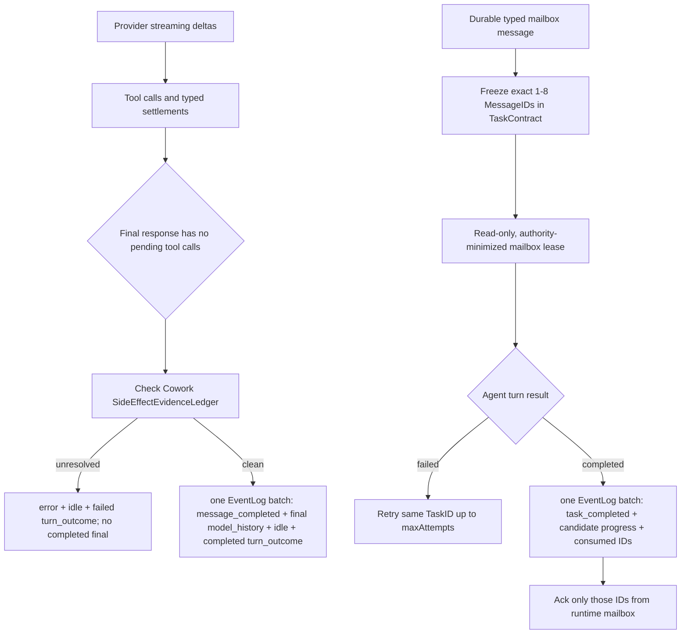

# Cowork 终态发布、Mailbox 重投与 WorkTask 权限修复实施报告

> 日期：2026-08-07
>
> 初始状态：本报告生成时仅完成事故分析与实施设计，尚未修改业务源码、配置、测试源码或项目说明文档
>
> 实施状态：用户随后确认方案；2026-08-07 已完成本报告范围内的源码、测试、文档、构建与本机开发安装
>
> 事故对象：最近 Cowork session `cowork_rqx6cgvb`
>
> 本报告用途：保留逐文件、逐类型、逐函数施工清单，并记录用户确认后的实际实施结果

## MODEL_CHECK_RESULT

- 当前运行环境可确认是 Codex / GPT-5 系列 Agent。
- 环境没有提供可审计的精确 deployment 名称，因此不编造更细型号。

## PATH_CHECK_RESULT

- `pwd`：`/Users/vita/Vitemis/Intatis`
- Git root：`/Users/vita/Vitemis/Intatis`
- 两者与仓库要求一致。
- 工作树在本轮开始前已有未提交改动，集中在 Chat/Cowork composer 附件相关 App、SharedUI、Conversation 与文档文件；这些都视为用户现有改动，本轮没有覆盖、回退、暂存或整理。

## FILES_WRITTEN

- 仅新增本报告：`Codex-Report/08_07_26-14_13-cowork-terminal-mailbox-reconciliation-plan.md`
- 本轮没有修改 `Apps/`、`Packages/`、`docs/`、`Package.swift`、`project.yml`、构建脚本或测试源码。

## 0. 结论先行

最近 session 的 EventLog 没有损坏，也没有丢失四个候选答案或 Judge 结果。真正的问题是四条已经存在、但没有在同一条终态合同下闭合的链路：

1. `AgentLoop` 先写入了 `message_completed` 和最终 assistant model-history，随后才检查仍未清账的 denied/no-effect side effect；因此同一轮先出现“看起来完整的答案”，后出现 `unresolved_denied_side_effects` 和失败卡片。
2. `CodeProjection` 当前忽略 `turn_outcome`，无法用权威的 failed outcome 撤销旧日志里已经被错误标成 complete 的答案；`AgentModelHistoryProjector` 也会把那条失败轮的最终 assistant item 带入后续 `@main` provider 历史。
3. mailbox wake task 没有冻结它负责的具体 `MessageID`。原 task 在同一 `TaskID` 上重试三次并耗尽后，后续无关任务完成又为同一 pending message 创建了一个全新的 `TaskID`，重置了尝试次数，违反“delivery 失败只能重试同一 task”的既有合同。
4. mailbox wake 复用了普通 delegated task 的能力准备逻辑。发给 `@main` 的一条异步完成消息因此获得了完整 coordinator/read-write lease，并被通用目标“Review and respond to pending mailbox messages”驱动去重新创建 Judge、重新委派和重开已经结束的工作。
5. `task_create` / `task_update` 没有工具专属的 `PermissionActionPreview`。自动审查者只能看到参数摘要不可用，因而无法判断 Judge WorkTask 的精确语义；同时模型容易混淆 `wt_…` WorkTask ID 与 `task_…` AgentInvocation ID，并复用过期 revision。

修复不能通过删除日志、放松 side-effect evidence、把 stale update 当成功、缩短 timeout 或清空 mailbox 来完成。正确方案是：

- 在发布最终答案前完成 Cowork side-effect 终态校验；成功终态使用一个 EventLog batch 落盘；
- 让 UI projection 与 provider-history projection 都服从 `turn_outcome`；
- 把每个 mailbox delivery task 与 1–8 个精确 `MessageID` 绑定，只允许同一 `TaskID` 有界重试；
- task completion 与 `agent_message_consumed` 原子落盘，成功后再从内存 mailbox ack；
- ordinary mailbox reply 使用只读、reply-only lease，`request_delegation` 单独使用最多一次委派的窄能力；
- 为 WorkTask 工具提供秘密安全、参数摘要绑定不变的专属权限 preview，并加强 ID/revision 指引。

## 1. 事故事实与事件顺序

### 1.1 数据完整性

- EventLog 从 `seq 0` 到 `seq 4564` 连续，共 4565 条事件。
- 没有 seq 缺口或重复。
- `session.json` 的投影位置与 EventLog 对齐。
- 四个候选 WorkTask 均已完成，Judge invocation 也已完成；候选答案和评选结果都已持久化。
- 因此不需要删 session、截断 JSONL、手工改事件或执行数据迁移。

### 1.2 关键时间线

| 事件位置 | 已确认事实 | 影响 |
|---|---|---|
| `seq 1293` | 一条发给 `@main` 的 `information_replied` 进入 durable mailbox | 消息应当获得至少一次、有界的处理机会 |
| `seq 1301` 起 | 第一个 mailbox task `task_ne6gsm25` 被创建 | 它使用通用 mailbox objective，未绑定精确 MessageID |
| Root 收尾阶段 | `@main` 对四个 WorkTask 使用 `expected_revision=1`；当时权威 revision 已是 4 | 四次 `task_update` 都被正确拒绝为 stale/no-effect；只对一个任务成功重试 revision 4 |
| 同一 Root | `task_create` 创建 Judge WorkTask 被自动 reviewer deny；随后 `delegate_task` 调用 Judge 成功 | 两个调用是不同 authority/resource，后者不能为前者清账 |
| `seq 2873` | `@main` 的完整文本先以 `message_completed` 落盘 | UI 将它显示成正常完整答案 |
| `seq 2876` / `2878` | 随后写入 `unresolved_denied_side_effects` 与 failed `turn_outcome` | 同一轮同时显示“完成答案”和红色失败卡 |
| 至 `seq 2940` | `task_ne6gsm25` 在同一 TaskID 上完成 attempts 1/2/3，全部失败并耗尽 | 这一段符合有界重试合同；pending message 也正确没有被 consumed |
| `seq 3977` / `3981` | 后续一个无关 root 成功 | 其完成钩子再次扫描 `@main` pending mailbox |
| `seq 3983` | 同一 pending message 被包装成新 task `task_vo93yvr4` | 新 TaskID 把 attempts 重置为 1，直接违反 mailbox retry 合同 |
| `seq 3983` 以后 | 新 mailbox task 带着 `@main` 的宽 coordinator lease 重新创建/委派 Judge | 一条完成通知被误当成新的执行请求 |
| `seq 4561` / `4562` | 第二个 mailbox task 最终 timeout/fail | 不是数据丢失，而是错误重唤醒与权限过宽造成的额外执行 |

## 2. 根因定位到当前源码

### 2.1 最终文本在 side-effect 校验前落盘

文件：`Packages/IntatisAgentKernel/Sources/AgentLoop.swift`

当前 `send` 主循环约在 860–921 行执行：

1. 构造 `completedResponseEvents`；
2. 追加 `.messageCompleted` 与最终 `.modelHistoryItem(.message)`；
3. `log.append(completedResponseEvents)`；
4. 之后才调用 `sideEffectEvidence.unresolvedDescriptions()`；
5. 有未清账 side effect 时抛出 `unresolvedDeniedSideEffects`；
6. catch 再写 error、idle、failed `turn_outcome`。

所以日志并非自相矛盾：它忠实记录了错误的发布顺序。

`SideEffectEvidenceLedger` 本身没有坏。它坚持“只有同 authority/resource 的成功 settlement 才能清账”是正确的 fail-closed 行为，不能弱化。

### 2.2 展示投影忽略权威 turn outcome

文件：`Packages/IntatisConversation/Sources/CodeProjection.swift`

- `.messageCompleted` 会立即把 agent item 设为 `complete = true`。
- 后续 `.error` 只调用 `markCurrentPartialAgentStopped(with:)`；该函数明确只处理最后一条尚未 complete 的 agent item。
- `.turnOutcome` 当前位于 no-op case 中。

因此旧日志即使已经明确写了 failed outcome，之前的完整气泡仍保持正常完成状态。

### 2.3 后续 provider 历史也会保留失败轮的最终 assistant item

文件：`Packages/IntatisAgentKernel/Sources/AgentModelHistoryProjector.swift`

`directTurns` / `conversationDirectTurns` 按 `model_history_item` 重建后续 provider 历史，但目前不读取相同 `TurnID` 的 `turn_outcome`。最近 session 中，错误的最终 assistant item 与 `message_completed` 同批落盘；只修 UI 不足以阻止它继续影响下一轮模型。

### 2.4 mailbox task 的去重键不是 MessageID

文件：`Packages/IntatisCowork/Sources/Orchestrator.swift`

- `enqueueMailboxWakeTask` 只检查同 assignee、Goal、ContinuationRun 下是否存在 queued/claimed mailbox task。
- task 一旦 failed，它就不再属于 queued/claimed，后续扫描会创建新 `TaskID`。
- `TaskContract` 没有保存它负责的 MessageID；objective 只有通用文字，`relatedTasks` 只保存 causal task。
- 自动失败路径在同一 task 上调用 `admitRetry` 是正确的，但无关 task 完成后的 `enqueuePendingMailboxWakeIfNeeded` 不知道这个 message 已经由哪个失败 task 耗尽。

### 2.5 mailbox task 继承了普通 delegated task 的宽 lease

文件：`Packages/IntatisCowork/Sources/Orchestrator.swift`

`enqueueMailboxWakeTask` 调用 `prepareDelegatedTask`。后者会复制 assignee 的 default capability lease；对 `@main` 来说，这包含 `manageWorkTasks`、`delegateTask`、workspace mutation、Git、终端等 coordinator 能力。mailbox task 于是具备重新编排整条任务图的权限。

### 2.6 WorkTask 权限 preview 与模型语义不足

文件：`Packages/IntatisCowork/Sources/WorkTaskTools.swift`

- `TaskCreateTool.permissionIntent` 虽在 metadata 中保存了 title/owner/dependencyCount，但默认 action preview 只识别一组通用 key，不识别 `title`、`description`、`acceptance_criteria` 等字段，所以 `task_create` preview 为空。
- `TaskUpdateTool` 同样没有向 reviewer 提供 task ID、revision、status、result/evidence 的安全语义摘要。
- descriptor 没有足够醒目地区分 WorkTask `wt_…` 与 AgentInvocation `task_…`。

## 3. 不可破坏的合同

实施时必须同时满足：

1. `turn_outcome` 仍是每个新 turn 唯一且权威的 terminal record。
2. denied、stale、policy/reviewer/sandbox/runtime failure 的 typed source 不得被抹平。
3. `SideEffectEvidenceLedger` 只能由匹配的 successful settlement 清账；不能因为模型写了一段最终文本就清账。
4. `task_update` stale rejection 仍是 no-effect failure，不得伪装成 success。
5. typed message 必须先 durable，再进入 mailbox。
6. 只有 ContextProjector 实际呈现且 agent turn 成功的 MessageID 才能 consumed。
7. consumed 必须 durable-first；Goal/run cancellation 只能用 discarded，不能伪造 consumed。
8. delivery failure 只能对同一 TaskID 做受 `maxAttempts` 约束的 retry，不能创建新 TaskID 重置预算。
9. EventLog schema 只能做 additive、legacy-decodable 扩展；Envelope、seq、既有事件名不变。
10. mailbox 仍通过 scheduler/event flow 调用普通 AgentLoop，不允许同步嵌套 AgentLoop。
11. capability 只能收窄，不能因 mailbox 或 reviewer 修复扩大 agent 权限。
12. 不改写、删除或“修复”已有 JSONL；旧 session 通过新的 projection/recovery 逻辑得到正确行为。

## 4. 目标流程



## 5. 下一轮计划修改的全部文件

### 5.1 Production 源码

| 文件 | 计划修改的类型/函数 | 目的 |
|---|---|---|
| `Packages/IntatisProtocol/Sources/Task.swift` | `TaskContract` 属性与 initializer | additive 保存 `mailboxMessageIDs` |
| `Packages/IntatisAgentKernel/Sources/AgentLoop.swift` | `send` 主循环的 final branch | 校验先于 final publish；成功终态原子 batch |
| `Packages/IntatisAgentKernel/Sources/AgentModelHistoryProjector.swift` | `directTurns`、`conversationDirectTurns`，新增 failed-turn 过滤 helper | 旧日志的 failed final assistant 不再进入后续 provider 历史 |
| `Packages/IntatisAgentKernel/Sources/ContextProjection.swift` | `directMessages` | 新 mailbox task 只投影 contract 冻结的 MessageID |
| `Packages/IntatisAgentKernel/Sources/ContextBuilder.swift` | `RuntimeEnvironmentManifest.systemPrompt`、`coworkSystemPrompt`、direct-message 渲染 | 强化 WorkTask revision/终态规则；给模型明确 MessageID/kind/causal identity |
| `Packages/IntatisCowork/Sources/Orchestrator.swift` | message admission、mailbox wake、retry、lease preparation、terminal settlement、restore reconciliation | 精确 MessageID 去重、有界同 ID retry、窄 lease、task+consume 原子落盘 |
| `Packages/IntatisCowork/Sources/WorkTaskTools.swift` | `TaskCreateTool`、`TaskUpdateTool`、`TaskGetTool` | 专属 permission preview、ID namespace 与 revision 指引 |
| `Packages/IntatisConversation/Sources/CodeProjection.swift` | `apply` 的 `.turnOutcome` case，新增 failed-turn item helper | 现有错误 session 重放时撤销伪 complete 状态 |

### 5.2 测试源码

| 文件 | 计划新增/调整的测试 |
|---|---|
| `Packages/IntatisProtocol/Tests/TaskContractTests.swift` | 新字段 round-trip；旧 JSON 缺字段仍解码为 nil |
| `Packages/IntatisAgentKernel/Tests/AgentLoopPolicyTests.swift` | unresolved side effect 不写 `message_completed`，只写 failed outcome |
| `Packages/IntatisAgentKernel/Tests/ModelHistoryProjectionTests.swift` | failed turn 丢弃最终 assistant history；completed/missing legacy outcome 保持兼容 |
| `Packages/IntatisAgentKernel/Tests/ContextProjectionTests.swift` | frozen IDs 精确投影、8 条上限、unrelated pending 不被呈现/消费、ID/kind/causal 字段转义 |
| `Packages/IntatisConversation/Tests/IntatisConversationCodeTests.swift` | `message_completed -> error -> failed turn_outcome` 旧顺序被标成未完成/失败 |
| `Packages/IntatisCowork/Tests/MessageDelegationSplitTests.swift` | wake contract 绑定 ID；普通 lease 无 coordinator/mutation 能力；consume failure 仍重试同 TaskID |
| `Packages/IntatisCowork/Tests/OrchestrationReliabilityTests.swift` | restore 8+2 exact batch；active 不重复；failed exhausted 不创建 replacement；旧无字段 task 保守恢复 |
| `Packages/IntatisCowork/Tests/WorkTaskRuntimeTests.swift` | task_create/update preview、ID namespace 提示、stale no-effect 语义保持 |
| `Packages/IntatisCowork/Tests/PermissionReviewControlPlaneTests.swift` | reviewer prompt 能看到脱敏 WorkTask preview，但仍只保存 args digest/count、不暴露 raw args |

### 5.3 实施后同步更新的项目文档

| 文件 | 计划更新内容 |
|---|---|
| `docs/ARCHITECTURE.md` | final turn commit 顺序；TaskContract MessageID binding；mailbox atomic settlement；窄 lease |
| `docs/DO_NOT_BREAK.md` | 明确“同 MessageID 不得换 TaskID 重置 attempts”；final completion 必须通过 side-effect 检查 |
| `docs/COWORK_PRINCIPLES.md` | mailbox delivery identity、最小能力与终态原子性原则 |
| `docs/CURRENT_STATE.md` | 记录修复后的真实状态与遗留兼容策略 |
| `docs/PROJECT_MAP.md` | 更新 TaskContract、AgentLoop、projection、mailbox 相关职责与测试索引 |
| `docs/TESTING.md` | 记录 focused/full test 与 macOS/iOS build 结果 |

### 5.4 明确不计划修改

- 不改 `Event.swift`、`Envelope.swift` 或添加新事件类型；现有 `agent_message_consumed`、`agent_message_discarded`、`turn_outcome` 已足够。
- 不改 `AgentScheduler.swift`；它已经支持同一 TaskID 的 exact retry、attempt 单调与 maxAttempts 拒绝，问题在 Orchestrator 的 admission identity。
- 不改 `Leases.swift`；直接用现有 `CapabilityLease` / `CommunicationGrant` / `DelegationGrant` 构造窄 task lease。
- 不改 `PermissionReviewControlPlane.swift`；它已正确绑定 action preview、参数 digest/count 与 authorization snapshot，缺的是 WorkTask tool 对 preview 的填充。
- 不改 `Apps/` 或 SharedUI；`CodeItem` 已有 `complete`、`isFailure`、`recoveryAdvice`，projection 修正后现有 UI 可以表达。
- 不改 `Projection.swift` 的普通 Chat 路径；本事故是 Code/Cowork `CodeProjection` 与 Cowork AgentLoop 路径。
- 不引入依赖，不改 `NOTICE.md`，不改版本号，不改构建/分发脚本。

## 6. 逐文件、逐函数代码设计

### 6.1 `Task.swift`：给 mailbox delivery 一个可审计的精确身份

修改 `TaskContract`：

```swift
/// Exact durable mailbox items owned by this delivery invocation.
/// Nil means a legacy/non-mailbox contract.
public var mailboxMessageIDs: [MessageID]?
```

initializer 增加默认参数并赋值：

```swift
mailboxMessageIDs: [MessageID]? = nil
```

写入规则：

- 仅新建 `.mailboxDelivery` 时写 non-nil。
- 每个 task 保存 1–8 个去重 MessageID。
- 同一 batch 必须有相同 recipient、sender、Goal/run scope 与 authority class。
- 普通 root/agent invocation 保持 nil。
- 字段是 optional，Swift synthesized `Codable` 对旧日志缺字段解码为 nil；不提高 schema version，不迁移旧 JSONL。

### 6.2 `AgentLoop.swift`：先验证，再发布最终答案

修改 `send` 主循环约 860–921 行的 final branch。

当前错误顺序：

```swift
append(messageCompleted + finalModelHistory)
check unresolved side effects
append(idle)
append(completed turnOutcome)
```

目标顺序：

```swift
if pendingToolCalls.isEmpty,
   context.runtimeEnvironment.mode == .cowork {
    let unresolved = await sideEffectEvidence.unresolvedDescriptions()
    guard unresolved.isEmpty else {
        throw AgentLoopError.unresolvedDeniedSideEffects(unresolved)
    }
}

if pendingToolCalls.isEmpty {
    await appendTurnStats(...)
    turnStatsAppended = true

    var terminalEvents = completedResponseEvents
    terminalEvents.append(.agentStatus(...idle...))
    terminalEvents.append(.turnOutcome(...completed...))
    try Task.checkCancellation()
    try await log.append(terminalEvents)
    return assistantText
}

// Tool-call iteration keeps persisting its function-call history as today.
try await log.append(completedResponseEvents)
```

关键点：

- unresolved check 只提前到“无 pending tool call、准备结束 turn”的分支；带 tool calls 的中间 assistant/function-call history 仍按现有流程持久化。
- final `.messageCompleted`、最终 assistant `.modelHistoryItem`、`.agentStatus(.idle)`、`.turnOutcome(.completed)` 使用同一次 `EventLog.append([Event])`。
- catch 仍负责 error、idle、failed/interrupted outcome。
- 已经 stream 的 delta 不删除；失败时它保持 incomplete，并由 projection 标记为停止。
- 不改 `SideEffectEvidenceLedger.recordDenied`、`recordSucceeded`、`restore` 或 authority/resource key。

### 6.3 `AgentModelHistoryProjector.swift`：失败轮的最终 assistant 不再污染下一轮

新增私有 helper，名称计划为：

```swift
private static func terminalOutcomesByTurn(
    events: [Envelope]
) throws -> [TurnID: TurnOutcomePayload]

private static func isInvalidatedFinalAssistant(
    _ item: ModelHistoryItemPayload,
    outcomes: [TurnID: TurnOutcomePayload]
) -> Bool
```

规则：

- 同一 `TurnID` 的 outcome 为 `.failed` 或 `.interrupted` 时，过滤该 turn 的 `.message` + `.assistant` 最终 item。
- 保留该 turn 的真实 user/context item、function-call batch、tool output、tool-search output 与 reasoning；它们是后续诊断和 provider 协议配对所需的真实历史。
- `.completed` 保留最终 assistant。
- legacy 日志没有 `turn_outcome` 时保持旧行为，不凭错误文本猜 outcome。
- 如果同一 TurnID 出现冲突 terminal，projector fail closed，不任意选择一个。

修改调用点：

- `directTurns(...)`
- `conversationDirectTurns(...)`

最近 Cowork session 走 `directTurns`；同时覆盖 Code 的共享历史路径，避免相同协议错误在另一产品面重现。

### 6.4 `CodeProjection.swift`：用 failed outcome 纠正旧的 complete 气泡

从当前 no-op 列表移出 `.turnOutcome`，新增：

```swift
case .turnOutcome(let payload):
    guard payload.outcome != .completed else { break }
    mutationChange = markInvalidatedAgentCompletion(for: payload)
```

新增私有 helper：

```swift
private mutating func markInvalidatedAgentCompletion(
    for payload: TurnOutcomePayload
) -> CodeProjectionChange
```

关联顺序：

1. 首选 `payload.taskID + payload.agentID` 与现有 `activeTaskByAgent` / `latestCompletedMessageByTaskAttempt` 的 exact task-attempt 映射。
2. 若是没有 task tracking 的兼容日志，再按 `submissionID`、agent attribution 和事件顺序查找最近一条 complete agent item。
3. 不能唯一关联时不改任何其他消息，避免把别的 agent/turn 标成失败。

命中后：

```swift
items[index].complete = false
items[index].isFailure = true
items[index].recoveryAdvice = RuntimeRecoveryAdvice(
    title: payload.outcome == .interrupted
        ? "Response interrupted"
        : "Response was not accepted as complete",
    detail: boundedReason,
    retryable: true)
```

这只改变 presentation fold，不改 EventLog，也不伪造新 error。最近 session 重新打开后，原本正常完成的长答案会显示为未完成/失败，与其后的失败卡一致。

### 6.5 `ContextProjection.swift`：新 mailbox task 只能看到被冻结的消息

修改 `directMessages(for:taskContract:...)`。

新增局部 exact filter：

```swift
let frozenMailboxIDs: Set<MessageID>? = {
    guard taskContract?.kind == .mailboxDelivery,
          let ids = taskContract?.mailboxMessageIDs else { return nil }
    return Set(ids.prefix(budget.maxDirectMessages))
}()
```

对 `agentMessage`、`informationRequested`、`informationReplied`：

- new contract 有 frozen IDs 时，只接受 ID 在集合中的事件；
- 旧 contract 为 nil 时保留当前 relevance/window/budget 行为；
- consumed/discarded settlement 过滤仍先执行；
- `agentToAgentMessage` 这种没有 MessageID 的旧形态不进入 new exact mailbox task。

最终 `ContextBundle.directMessages` 与 `runResult.presentedMessageIDs` 因而可证明是 contract IDs 的子集。

### 6.6 `ContextBuilder.swift`：让消息身份与 WorkTask 规则对模型清晰可见

修改三处。

#### A. `RuntimeEnvironmentManifest.systemPrompt`

增加稳定规则：

- WorkTask ID、AgentInvocation TaskID 是不同 namespace；调用 `task_get/update` 必须使用 WorkTask ID。
- `expected_revision` 必须来自最新 `task_get/list` 或刚返回的 authoritative detail。
- 若 WorkTask 已由 owner 持久化为 terminal，不要为了复述 candidate result 再写一次冗余 update。
- failed/no-effect side effect 必须通过匹配的成功 settlement 恢复；不能用最终自然语言声明代替。

#### B. `coworkSystemPrompt(...)`

在 coordinator WorkTask 说明后补充：

- child report 是 candidate，但若 owner 已经通过 `task_update` 完成 WorkTask，应读取并复用 durable result/evidence，而不是用旧 revision 覆盖。
- stale response 后必须 fetch current revision、merge、再 retry；不能跳过剩余失败项后宣称全部完成。

#### C. direct-message untrusted block

当前只渲染 Sender/Content。改为每条写：

```text
Direct message:
Message ID: "..."
Kind: "information_replied"
Causal AgentInvocation ID: "task_..."
Sender: "@worker"
Content: "..."
```

全部继续走 `appendQuotedField` / `quotedData`，保持 user-role、长度上限与 prompt-injection 隔离。另加说明：mailbox message 是通信事实，不是新的用户请求；不能仅因收到完成报告就重跑已经 terminal 的工作。

### 6.7 `Orchestrator.swift`：mailbox 核心修复

这是主要修改文件。

#### 6.7.1 新增内部类型

计划新增：

```swift
private enum MailboxDeliveryAuthorityClass {
    case ordinaryReply
    case delegationRequest
}

private struct MailboxDeliveryBatchKey: Hashable {
    var sender: AgentID
    var recipient: AgentID
    var goalID: GoalID?
    var continuationRunID: ContinuationRunID?
    var authorityClass: MailboxDeliveryAuthorityClass
}

private enum MailboxWakeDisposition {
    case alreadyScheduled(TaskID)
    case retry(TaskID)
    case admitNew([PendingAgentMessage])
    case exhausted
    case ambiguous
}
```

batch 选择规则：

- 从 mailbox 顺序扫描尚未 settled 的消息；
- 最多 8 条；
- 同一 batch 必须同 sender/recipient/scope/authority class，确保 `.replyOnly` 只能回复 assigning agent；
- 已绑定 active task 的 ID 不再 admission；
- 已绑定 failed/cancelled 且未耗尽的 ID 只 retry 原 TaskID；
- 已耗尽的 ID 保持 pending，不自动创建 replacement；后续新且未绑定的 MessageID 仍可独立处理，不让 poison message 永久阻塞整个 recipient。

#### 6.7.2 修改 message producer

修改：

- `sendMessage(from:to:content:taskID:)`
- `requestInformation(from:to:question:taskID:)`
- `replyMessage(from:to:content:inReplyTo:taskID:)`
- `requestDelegation(from:objective:reason:parentTaskID:)`

它们在 durable message 已进入 scheduler mailbox 后，把刚生成的 exact ID 传给 wake path：

```swift
await enqueueMailboxWakeTask(
    sender: from,
    recipient: to,
    requestedMessageIDs: [message.id])
```

不再只传一个模糊的 causalTaskID。

#### 6.7.3 重写 wake admission

修改：

- `enqueuePendingMailboxWakeIfNeeded(for:fallbackSender:)`
- `enqueueMailboxWakeTask(sender:recipient:causalTaskID:)`

后者计划改签名为：

```swift
private func enqueueMailboxWakeTask(
    sender: AgentID,
    recipient: AgentID,
    requestedMessageIDs: [MessageID]? = nil
) async
```

新增 helpers：

```swift
private func mailboxWakeDisposition(
    for recipient: AgentID,
    requestedMessageIDs: [MessageID]?
) -> MailboxWakeDisposition

private func explicitMailboxTasks(
    for messageID: MessageID
) -> [(task: ScheduledTask, record: ExecutionRecord?)]

private func matchingLegacyMailboxTasks(
    for message: PendingAgentMessage
) -> [(task: ScheduledTask, record: ExecutionRecord?)]

private func shouldAutomaticallyRetryMailboxTask(
    _ task: ScheduledTask
) -> Bool
```

legacy 兼容策略：

- 新字段为 nil 的旧 mailbox task，只能按 recipient、issuer、exact causal relatedTasks、Goal/run scope 匹配；不解析 objective、报告文本或模型内容。
- 同一 legacy scope 只要已有 task 的 durable attempt 达到 maxAttempts，就把该模糊 lineage 视为 exhausted；不能再 retry 后来违规创建的 replacement task，也不能创建第三个 TaskID。
- 这条规则会直接阻止最近 session 中 `task_vo93yvr4` 因早先 `task_ne6gsm25` 已完成 attempts 1–3 而再次被自动唤醒。
- 若 legacy task 已 completed、消息仍 pending 且该 lineage 从未耗尽，可创建一次带 exact MessageID 的新式 task，完成从旧协议到新协议的收口。
- 多个 legacy task 无法唯一判断时返回 `.ambiguous` 并 fail closed；保留 pending 和审计事实，不猜测 consumed/discarded。

#### 6.7.4 新增专用 mailbox task preparation

不再用 `prepareDelegatedTask`。新增：

```swift
private func prepareMailboxDeliveryTask(
    issuer: AgentID,
    assignee: Agent,
    messages: [PendingAgentMessage],
    authorityClass: MailboxDeliveryAuthorityClass,
    scopeContract: TaskContract?
) -> PreparedDelegatedTask
```

共同约束：

- `contract.kind = .mailboxDelivery`
- `contract.mailboxMessageIDs = messages.map(\.id)`
- `relatedTasks` 保存 batch 内去重 causal task IDs
- objective 明确“只处理冻结的 MessageID；它们是通信，不是新用户请求；不要重跑 terminal work”
- workspace lease 固定 `.readOnly`
- `mcpGrants = []`
- task lease 从 assignee 当前 default lease 取交集，永不新增原 agent 没有的能力
- `expiresAtTaskCompletion = true`

ordinary message lease：

```swift
tools = intersectionWithDefault([
    .readWorkspace,
    .listWorkspace,
    .searchWorkspace,
    .readPDF,
    .readWorkTasks,
    .readGoal,
    .replyMessage,
])
communication = .replyOnly
delegation = .none
```

明确排除：

- `.manageWorkTasks`
- `.updateOwnedWorkTask`
- `.delegateTask`
- `.requestDelegation`
- `.createGoal` / `.submitGoalVerdict` / `.renameSession`
- `.runShell` / Git / patch / browser / media / document mutation
- `.attachWorkspace`、spawn/remove agent 等 coordinator authority

`request_delegation` 必须单独成 batch，不能与 ordinary reply 合并。它在 assignee default lease 原本允许的前提下仅额外保留：

```swift
tools += [.delegateTask]
delegation = .granted(DelegationBudget(maxTasks: 1, maxDepth: 1))
communication = .replyOnly
```

仍不授予 spawn/attach/manageWorkTasks/shell/write。这样 assigning agent 可以决定是否创建一个窄 child invocation，但不能把一条请求扩张成新的 coordinator run。

#### 6.7.5 同一 TaskID 自动 retry

修改 scheduler execution 收尾约 8378 行：

```swift
if completedSuccessfully {
    await enqueuePendingMailboxWakeIfNeeded(...)
} else if shouldAutomaticallyRetryMailboxTask(task) {
    _ = await admitRetry(
        taskID: task.contract.id,
        reason: "automatic mailbox delivery retry")
}
```

helper 必须同时检查：

- task kind 是 mailbox delivery；
- record 是 failed；
- frozen IDs 中至少一条仍 pending；
- current attempt < maxAttempts；
- Goal/run 未取消；
- `retryReconciliationFailure` 没有 non-replayable side effect 阻挡。

`admitRetry` 与 `AgentScheduler.acceptRetry` 保持现状，继续负责 attempt+1、same identity、lease renewal 和 durable queue event。

#### 6.7.6 task completion 与 consumed 原子落盘

修改：

- `finishCompletedTask(_:result:presentedMessageIDs:metadata:)`
- `persistInvocationSettlement(_:contract:workTaskProgressNote:)`
- 删除/替换 `consumeDeliveredMessages(for:messageIDs:)`
- 将测试 seam `setMessageConsumptionAppender` 改名为 `setMessageConsumptionPreflightForTesting`

新增 helpers：

```swift
private func deliveredMessageConsumptions(
    for task: ScheduledTask,
    presentedMessageIDs: Set<MessageID>
) -> [(message: PendingAgentMessage,
       payload: AgentMessageConsumedPayload)]

private func acknowledgeDeliveredMessages(
    _ settlements: [(PendingAgentMessage,
                     AgentMessageConsumedPayload)],
    recipient: AgentID
)
```

`persistInvocationSettlement` 增加 additive 参数：

```swift
additionalEvents: [Event] = []
```

成功路径变成：

```swift
let consumptions = deliveredMessageConsumptions(...)
try await messageConsumptionPreflightForTesting?(consumptions)

try await persistInvocationSettlement(
    taskCompletedEvent,
    contract: task.contract,
    workTaskProgressNote: ...,
    additionalEvents: consumptions.map {
        .agentMessageConsumed($0.payload)
    })

acknowledgeDeliveredMessages(consumptions, recipient: task.assignee)
```

production EventLog 会在同一跨进程锁/append batch 中写：

1. `task_completed`
2. 可选 candidate-only `work_task_progressed`
3. 本轮实际呈现的 `agent_message_consumed`

任何 append 失败都不会留下“task 已 completed、consume 未落盘”的半终态；task 进入 failed/quarantine 路径，并且后续只 retry 同一 TaskID。内存 ack 永远在 batch 成功之后。

对于新 `.mailboxDelivery`，`presentedMessageIDs` 还必须与 `contract.mailboxMessageIDs` 取交集，防止 provider/context bug 消费 contract 外的消息。非 mailbox root 仍可消费它确实投影并成功处理的 direct message，保持现有语义。

### 6.8 `WorkTaskTools.swift`：补齐 reviewer 语义与 ID/revision 引导

#### A. `TaskCreateTool.permissionActionPreview(_:)`

新增工具专属实现，最多 7 个字段：

```swift
public func permissionActionPreview(
    _ args: ToolArgs
) -> PermissionActionPreview? {
    guard let value = try? args.decode(Args.self) else { return nil }
    return PermissionActionPreview(
        kind: Self.descriptor.name,
        fields: [
            "title": value.title,
            "description": value.description,
            "owner": value.owner ?? "unassigned",
            "acceptance_criteria": joined(value.acceptanceCriteria),
            "expected_artifacts": joined(value.expectedArtifacts),
            "depends_on": joined(value.dependsOn),
            "priority": (value.priority ?? .normal).rawValue,
        ])
}
```

`PermissionActionPreview` 现有 normalization 会再做 secret redaction、每字段/总字符限制、最多 8 keys；authorization 仍使用完整 normalized args 的 digest/count，不把 preview 当执行参数。

#### B. `TaskUpdateTool.permissionActionPreview(_:)`

固定最多 8 个字段：

```swift
[
    "task_id",
    "expected_revision",
    "status",
    "changed_fields",
    "progress_note",
    "result",
    "evidence_count",
    "retry",
]
```

`changed_fields` 只列出本次 non-nil patch key，不展开无关 raw JSON；result/progress 由 preview sanitizer 负责脱敏和截断。

#### C. descriptor 与 namespace-aware error

修改 `TaskUpdateTool.descriptor` / `TaskGetTool.descriptor` 及 `task_id` 参数说明：

- 明确这里需要 WorkTask ID，正常生成形式是 `wt_…`；
- `task_…` 是 AgentInvocation ID，应从 `task_get/list` 或 WorkTask detail 获取 ID；
- update 前使用当前 detail 的 revision；terminal WorkTask 不要冗余 settle。

新增私有 helper，计划名：

```swift
private func workTaskNamespaceHint(
    rawID: String,
    underlyingError: Error
) -> Error
```

只在 manager 返回 not-found 且 raw ID 看起来是 `task_…` 时返回可操作的 `ToolExecutionRejectedWithoutSideEffect`。如果历史 WorkTask 确实使用非标准 ID 且 manager 能找到它，调用照常成功；不对所有 legacy ID 强制 `wt_` pattern。

#### D. 保持不变的语义

- `TaskUpdateTool.decodeRequest` 的 optimistic concurrency 不变。
- `Orchestrator.provenWorkTaskUpdatePreflightRejection` 仍只对 mutation 前的可证明拒绝给 no-effect evidence。
- stale update 仍不算 successful settlement。
- `task_create` deny 与 `delegate_task` success 仍不能互相清账。

## 7. 测试计划与精确验收点

### 7.1 Protocol

`TaskContractTests.swift`：

- `testTaskContractCodableRoundTrip` 加入两个 mailbox MessageID 并断言全等。
- 新增 `testLegacyMailboxTaskWithoutMessageIDsDecodesAsNil`。
- 保持现有 legacy execution fields decode 测试。

### 7.2 AgentLoop terminal

`AgentLoopPolicyTests.swift`：

- 在已有 denied Cowork action 场景中断言：
  - 有 streamed delta；
  - 没有 final `message_completed`；
  - outcome 只有 `.failed`；
  - error code 为 `unresolved_denied_side_effects`；
  - matching successful settlement 后的正常场景仍可完成。

现有 `AgentLoopOutcomeTests.testExplicitCompletionWithoutToolCallsReturnsFinalText` 作为成功路径回归，不需要修改文件。

### 7.3 Provider history

`ModelHistoryProjectionTests.swift` 新增：

- prior root 的 user/tool history + final assistant + failed outcome；下一 root projection 保留 user/tool，丢弃 final assistant。
- interrupted outcome 同样丢弃 final assistant。
- completed outcome 保留 assistant。
- 无 outcome 的 legacy log 保持旧行为。
- 冲突 terminal fail closed。

### 7.4 UI projection

`IntatisConversationCodeTests.swift` 新增：

```text
message_delta
message_completed
error(unresolved_denied_side_effects)
turn_outcome(failed, exact task/agent/submission)
```

断言：

- 原 agent item `complete == false`
- `isFailure == true`
- recovery advice 表明答案未被接受为完成
- error card 仍存在
- 其他 agent/其他 submission 的完成消息不受影响

### 7.5 Context exactness

`ContextProjectionTests.swift`：

- 10 条 pending，contract 冻结前 8 条，只投影这 8 个 ID。
- unrelated pending 不进入 bundle，也不进入 `presentedMessageIDs`。
- consumed/discarded frozen ID 不复活。
- direct message block 包含 MessageID、kind、causal task、sender，并保持 quoted/untrusted。
- legacy nil field 仍使用现有 bounded relevance 行为。

### 7.6 Orchestrator mailbox

`MessageDelegationSplitTests.swift`：

- 更新 `testSendMessageCreatesDurableMailboxWakeTaskAndConsumesMessage`：wake contract 的 IDs 等于 message ID。
- 更新 request/reply/delegation 对应测试，断言 exact binding。
- ordinary mailbox capability lease：read-only、reply-only、delegation none；tool registry 不出现 task_create/update、delegate/spawn/shell/Git/patch/browser。
- delegation request 独立 batch：至多一个 delegate task，无 spawn/attach/manageWorkTasks。
- consumption persistence failure：provider 最多 3 次、所有 queue attempts 使用同一 TaskID `[1,2,3]`、消息保持 pending、没有 completed/consumed 半状态。现有“先完成后新 task 再失败三次”的 4 次预期改为 3 次。

`OrchestrationReliabilityTests.swift`：

- 保持 `testRestoreSynthesizesMailboxWakeAndConsumesOnlyProjectedBatches` 的 10 条 = 8+2，并新增两个 contract ID 集合无重叠、并集等于 10 条。
- active/queued exact task 存在时 restore 不创建 duplicate。
- failed attempt 1/2 时只 retry 相同 TaskID。
- failed attempt 3 时，后续无关 root completed 不创建新 TaskID，provider request count 不增加。
- 构造 legacy nil field + 同 causal scope 的 attempt3 与 replacement attempt1，确认整个旧 lineage 被视为 exhausted，直接覆盖最近 session 的回归形状。
- 新 MessageID 即使同 recipient 仍可新建独立 task，不被旧 poison message 阻塞。
- Goal/run cancellation 仍产生 discarded，不产生 consumed/retry。

### 7.7 WorkTask permission

`WorkTaskRuntimeTests.swift`：

- task_create preview 包含 title/description/owner/dependencies，并触发已有 sanitizer 的 redacted/truncated 标志。
- task_update preview 包含 exact WorkTask ID、revision、status、changed fields、evidence count。
- manager 能找到非标准 legacy WorkTask ID 时仍成功。
- not-found `task_…` 返回“这是 AgentInvocation ID”的 typed no-effect 提示。
- 现有 stale revision 仍返回 current revision、状态不变，不能被 preview 修复误标 success。

`PermissionReviewControlPlaneTests.swift`：

- reviewer prompt 出现 `action_preview: kind=task_create` 与 bounded semantic fields。
- prompt/EventLog 不出现 raw args 或测试 secret。
- authorization 的 `normalizedArgumentsDigest` / character count 与执行前 revalidation 保持全等。

## 8. 兼容性与恢复策略

### 8.1 EventLog

- 不添加 event type。
- 不修改旧 event payload。
- `TaskContract.mailboxMessageIDs` 是 optional additive 字段。
- 旧 JSONL 原样保留、继续 decode。
- 不执行离线 migration；新 projection 和 restore 每次从 canonical log 推导。

### 8.2 最近 session 的实际恢复效果

安装修复版并重新打开后应发生：

1. 原 `message_completed -> failed turn_outcome` 被 `CodeProjection` 标为未完成/失败，不再像正常最终答案。
2. 后续新 `@main` 请求构建 provider history 时，不再包含该 failed turn 的最终 assistant item。
3. pending message 仍保留审计事实，不伪造 consumed/discarded。
4. legacy matcher 发现同一 mailbox lineage 已有 attempt 3，不 retry `task_vo93yvr4`，也不创建第三个 TaskID。
5. 四个候选与 Judge 结果继续保留，无需重跑或修复数据。

### 8.3 旧 completed-but-unconsumed 日志

旧版本可能已经写了 `task_completed`，但消费事件因独立 append 失败而缺失。若其 legacy lineage 没有耗尽：

- restore 可为仍 pending 的 exact message 创建一次新式、绑定 MessageID 的 task；
- 从此 task completion 与 consumed 原子落盘；
- 如果 legacy 关系不唯一，fail closed，不猜测 consumed。

## 9. 明确不采用的修法

- 不删除或编辑最近 session 的 JSONL。
- 不把 `unresolvedDeniedSideEffects` 改成 warning。
- 不把 stale `task_update` 当 successful no-op；最近 session 的 requested result/evidence 与当前状态并非可证明完全相同。
- 不用 `delegate_task` success 清除 `task_create` deny。
- 不在 failed turn 后清空 mailbox。
- 不 consumed 未投影的第 9/10 条消息。
- 不把 exhausted pending message 标为 discarded；discarded 只用于 Goal/run cancellation。
- 不靠缩短 600 秒 timeout 解决错误任务创建。
- 不让 reviewer 接收 raw JSON args。
- 不扩大 worker/main default lease。
- 不增加“无限 retry 的新 task generation”。
- 不新增 UI 按钮或另一个恢复状态机作为第一阶段修复。

## 10. 实施顺序

1. `AgentLoop` final ordering + `CodeProjection` / `AgentModelHistoryProjector` 历史纠正。
2. `TaskContract.mailboxMessageIDs` + protocol tests。
3. `ContextProjection` exact filter + `ContextBuilder` identity/prompt。
4. `Orchestrator` exact wake disposition、专用窄 lease、same-ID retry。
5. `finishCompletedTask` 与 consumed atomic batch。
6. WorkTask tool preview、ID/revision 指引。
7. focused tests。
8. 全量 `swift test`、XcodeGen、macOS Developer ID product build 与 iOS build。
9. 更新六份项目文档，最后运行 diff/status 校验。

## 11. 实施后的验收命令

计划至少运行：

```sh
swift test --filter TaskContractTests
swift test --filter AgentLoopPolicyTests
swift test --filter ModelHistoryProjectionTests
swift test --filter ContextProjectionTests
swift test --filter IntatisConversationCodeTests
swift test --filter MessageDelegationSplitTests
swift test --filter OrchestrationReliabilityTests
swift test --filter WorkTaskRuntimeTests
swift test --filter PermissionReviewControlPlaneTests
swift test
xcodegen generate
xcodebuild -project Intatis.xcodeproj -scheme IntatisMac -configuration Debug build
xcodebuild -project Intatis.xcodeproj -scheme IntatisiOS -configuration Debug -sdk iphonesimulator build
git diff --check
git status --short
```

不默认构建遗留 `IntatisMacAppStore` target。

## 12. 完成判据

- Cowork unresolved side effect 的 turn 不再写 final `message_completed` 或最终 assistant model-history。
- final success 的 message/model-history/idle/completed outcome 是一个原子 EventLog batch。
- 旧失败 turn 的完成气泡被 projection 标为失败/未完成。
- 旧失败 turn 的最终 assistant 不进入下一轮 provider history。
- 每个新 mailbox task durable 绑定 1–8 个 exact MessageID。
- 同一 MessageID 的自动失败只出现一个 TaskID，attempt 最多 `[1,2,3]`。
- 无关 root completion 不会为 exhausted message 创建 replacement task。
- ordinary mailbox task 无 WorkTask mutation、delegation、spawn、shell、Git、patch、browser 或 write authority。
- `request_delegation` 最多获得一次 delegate、read-only workspace，且单独成 batch。
- 只有实际呈现且成功轮的 ID consumed；task completion 与 consumed 同批，ack 在后。
- task_create/update reviewer 能看到秘密安全的语义 preview，raw args 仍不可见且 digest binding 不变。
- 旧 TaskContract/JSONL 继续解码；不修改现有 session 数据。
- focused tests、全量 SwiftPM tests、macOS build、iOS build 和 `git diff --check` 全部通过。

## 13. 风险与需要后续确认

1. **历史 UI 关联的唯一性**：正常 Cowork scheduler 对同一 agent 单飞，`taskID + agentID + active attempt` 足以唯一命中；仍需用“同 agent 的迟到旧 attempt + 新 attempt”回归测试证明不会标错。若无法唯一关联，必须不修改消息。
2. **legacy mailbox 模糊性**：旧 contract 没有 MessageID，不可能从数据中恢复不存在的精确信息。报告选择 exact causal/scope 匹配并在 ambiguity/exhaustion 时 fail closed；这可能留下可见 pending audit，但不会继续烧模型调用。是否以后提供用户显式“重新投递此旧消息”的 UI，属于独立产品决策，不纳入本修复。
3. **旧 compaction summary**：最近 session 没有证据表明错误 final 已被后续 compaction 固化。新的 projector 会在下一次 provider request 前过滤 direct failed assistant。若将来发现已有 checkpoint summary 在修复前吸收了这条文本，不能无损反推摘要内容，应标记为需要单独的 checkpoint compatibility 设计，不能改写历史。
4. **delegation-request 最小能力**：一次 delegate budget 必须与 assignee 当前 default lease 取交集，并通过现有 ToolRegistry/CapabilityLease 测试证明未间接暴露 spawn/attach。若 `delegate_task` 的现有注册还隐含额外 capability，实施时以源码为准进一步收窄，而不是扩大计划。

## 14. 本轮检查与验证记录

本轮实际只读检查了：

- 仓库级与项目级 `AGENTS.md`；
- `docs/VERSIONING.md`、`CURRENT_STATE.md`、`MACOS_DISTRIBUTION.md`、`PROJECT_MAP.md`、`ARCHITECTURE.md`、`DO_NOT_BREAK.md`、`OPEN_SOURCE_REUSE.md`、`TESTING.md`、`NEXT_TARGET.md`、`COWORK_PRINCIPLES.md`；
- 最近 session 的 EventLog/派生投影与关键事件顺序；
- 本报告第 5 节列出的 production/test 源码及相关现有测试。

本轮未运行构建或测试，因为用户明确要求先不要修改代码；只会对本报告运行 `git diff --check`、diff 内容与 `git status --short` 校验。

## 15. 用户确认后的实施追记

- 第 5 节列出的 production/test 文件已按第 10 节顺序实施；未新增依赖、未改版本号、未改
  `Package.swift`、`project.yml`、构建/分发脚本、NOTICE 或 `Apps/`/SharedUI 业务界面；用户先前的
  composer attachment 改动均保留；
- terminal ordering、authoritative turn projection/provider history、TaskContract exact
  `mailboxMessageIDs`、mailbox 窄 lease/同 TaskID 有界重试/原子 consume、legacy fail-closed、
  WorkTask ID/revision 指引和秘密安全的语义 permission preview 均已完成；
- 报告要求的 focused tests 通过；完整 SwiftPM suite 最终退出 0，`IntatisCoworkTests` 327、
  `IntatisSharedUITests` 141、`IntatisAgentKernelTests` 175 tests 均为 0 failures；
- `xcodegen generate`、版本一致性、`IntatisMac` Debug、`IntatisiOS` Simulator Debug 和
  `IntatisMac` universal Release 全部通过。Release 为 `0.36 (36)`、
  `com.Vita0818.IntatisMac`、`x86_64 arm64`；完成 ad-hoc Hardened Runtime 签名和 strict
  codesign 验证后已安装到 `/Applications/Intatis.app`，旧 App 在废纸篓中有 timestamped
  可恢复备份；
- 事故 session `cowork_rqx6cgvb` 未被改写；新 App 冷启动后仍为 `seq 0...4564`，mtime 未变化。
  `seq 2873 message_completed` / `2874 model_history_item` 后跟
  `2878 failed turn_outcome` / `2879 task_failed` 的真实旧日志结构与新增回归覆盖一致；
- Computer Use 按推荐的 `node_repl + @oai/sky` 多次启动均失败；Screen Recording 与 Apple
  Events fallback 也被系统权限拒绝。因此没有声称窗口内失败卡片的像素/AX 视觉 smoke 已通过，
  详细验证证据见 `docs/TESTING.md`。

## NEXT_RECOMMENDED_ACTION

在 Computer Use 或 Screen Recording/Accessibility 权限可用时，只读打开
`cowork_rqx6cgvb`，补做最后一项视觉 smoke：确认 `seq 2873` 对应答案显示为失败/未完成，并且
界面未出现自动 Retry。不要为此新增恢复按钮、重写旧 JSONL 或触发 provider 请求。
