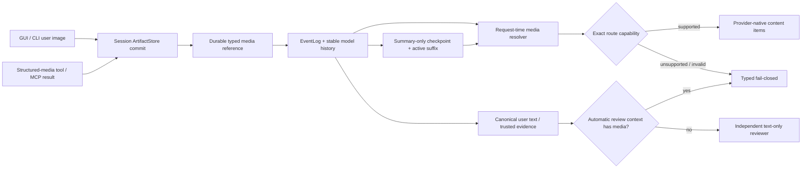

# Intatis 持久多模态上下文：Codex CLI 参考实现、断点与最小闭环实施报告

## 报告元数据

- 调研日期：2026-08-09
- Intatis 仓库：`/Users/vita/Vitemis/Intatis`
- 报告性质：源码审计、公开上游行为核对、事实修订、最小闭环实现与验证记录
- 本轮状态：**已实现 durable Agent 用户图、原 call 工具图 FCO、active-history replay、
  summary-only compaction、route/permission fail-closed，并同步测试与项目文档**
- 上游基线：OpenAI Codex CLI `0.145.0` / tag `rust-v0.145.0`
- 上游固定 commit：Intatis 现有 provenance 记录将该 release 固定到
  `25af12f7e61572b0bc18ddb1008be543b91519b0`
- 证据标记：`FACT` 为源码或官方文档直接证明；`INFERENCE` 为面向 Intatis 的设计判断；
  `UNKNOWN` 为本轮不能可靠确认的行为

> 说明：本轮核查的上游源码归档自身没有 `.git`，因此行号事实按
> `rust-v0.145.0` 归档核对；commit 对应关系继承本仓库
> `docs/OPEN_SOURCE_REUSE.md` 已登记的 provenance，不伪装成由该归档独立证明。

## 一、交接结论

这不是文档编辑器、PDF、OCR 或脱敏工具的问题，而是 **Intatis 平台级的 durable
multimodal context 合同没有闭合**。

Codex CLI 已经证明两类图片都能进入后续模型上下文：

1. 用户图片作为 user message 的原生 `input_image`；
2. 工具图片作为原 `call_id` 对应的原生 `function_call_output` 多模态内容。

本轮实施前，Intatis并非“完全不支持图片”，而是各层完成度不同：

- macOS Chat 与共享 Chat runtime 已能把用户图片保存进 `ArtifactStore`，在历史重建时
  重新加载；iOS 链接了同一底层能力，但当前 UI 尚没有等价的用户图片 picker；
- Cowork GUI 能把当前轮图片交给 acting agent；accepted user event先保存`attachmentIDs`，进入
  AgentLoop后model-history才保存同一批IDs。未完成submission可在GUI中显式Retry并重新解析，
  但accepted→AgentLoop之间尚无ingestion-time digest binding；exact `@main` stable main-thread已完成
  历史轮的provider replay/compaction也未闭合，ordinary-agent直投则本来就是task-scoped；
- MCP image/audio 已被有界、durable 地写入 `ArtifactStore`，并在 `structuredResult` 中保存
  ArtifactID、声明 MIME、大小、SHA-256 与 provenance；当前尚未完成真实图片解码、实际类型、
  尺寸与像素上限核验，因此不能把现状称为完整的媒体安全验证；
- 但是 Agent model history projector、compactor、`AgentInputItem`、OpenAI Responses
  wire 和 permission reviewer 仍以文本为主，导致历史图片或工具图片在这些边界被静默降级。

最重要的判断是：

> Intatis 应借鉴 Codex 的“原生多模态 item、精确 call correlation、统一 replay”语义，
> 但不应照搬 Codex 把完整 base64 和绝对路径写进 rollout JSONL 的存储形式。

Intatis 已有更适合自己的基础：EventLog 是 canonical truth，ArtifactStore 已能保存
二进制，MCP durable block 已有 hash/size/provenance。缺的是把这些能力连成一条：

```text
durable typed artifact reference
→ stable model history / compaction checkpoint
→ request-time verified resolver
→ route-capability check
→ provider-native multimodal wire
```

本轮已按这条最小链路完成实现。后文第七、八节保留实施前基线与根因，便于审计改动动机；
第九至十二节是已采用的合同，第十五节记录实际实现与验证结果。

Chat、Code、Cowork 不应互相复用产品 runtime。正确依赖方向是把 ArtifactStore commit、
durable image reference、request resolver 和 provider lowering 放在不依赖 AgentKernel 的共享层：
Chat 继续使用独立、无工具的 `ChatLoop`；Code/Cowork 继续共同使用 `AgentRuntime`/`AgentLoop`，
并只在该分支增加 function-call output、replay、compaction 与 permission 合同。不得为了统一图片
链路让 Chat 或 iOS 链接 AgentKernel。

### 1.1 实施总原则：最少代码闭合全部基本功能

本报告采用以下工程原则：**最小化新增概念、状态和重复实现，而不是删减基本闭环或安全边界。**

P0 的“全部基本功能”只包括：Code与Cowork exact `@main` stable main-thread中的用户图片在current
turn、next turn及宿主现有session恢复后仍可见；Cowork ordinary-agent直投只承诺current turn与
GUI Retry，不把task-scoped worker扩成新会话系统。MCP structured-result 图片及已经产出同一structured media
contract的工具图片，以原 `call_id` 的原生 FCO进入下一次模型请求；
live/replay 使用同一 canonical content；上下文压缩时 summarizer真实看见所选窗口内的图片，
压缩成功后该窗口内所有旧用户/工具原图退出 model-facing history、由摘要替代，但原 blob 与审计记录仍保留；
unsupported/missing/corrupt media在网络请求前或下一次模型继续前 typed fail；Chat/iOS现有行为不回归。
P0的CLI正向图片验收限定macOS；Linux在无经测试的bounded解码backend时只要求typed unsupported，
不把“能读magic bytes”冒充完整像素验证。

为控制工程量，实施应遵守：

- 复用现有`String + images` provider形状，只新增一份durable image reference和一个session-scoped
  resolver；P0不为任意text/image交错另造通用content AST或admission event；
- 复用 Chat 已有 ArtifactStore commit/read 逻辑与 MCP 已有 ordered `content`，不再建立平行媒体库；
- Code/Cowork 继续共用同一个 AgentLoop；Chat只消费共享底层或保持现状，不改造成AgentLoop；
- P0 不迁移 ArtifactStore index、不做 content-addressed storage/GC/派生图片缓存、不启用audio、
  不让 reviewer直接看图，也不顺手实现 Goal attachments或重做CLI session生命周期；
- 不以生产代码行数为唯一指标；兼容 fixture、安全检查和端到端测试不能因“少代码”被删除。

本轮以当前reader/writer源码与fixtures完成协议验证并实施，并从`v0.41` exact commit
`e5f64ed`临时编译旧reader，确认v2 direct、v1 checkpoint后的v2 suffix与v2 checkpoint均fail closed；正式release仍可再用当时实际
分发的旧App制品补一层包装/签名等价性检查。实现继续拆成少量纵向changeset，不把全文复制成一个
无中间验证的巨型编码任务。

## 二、范围与非目标

### 2.1 本报告覆盖

- Cowork GUI/CLI与CLI Code既有图片入口，加上Code GUI最小附件接线；Code与Cowork exact `@main`
  覆盖current/next及宿主既有session恢复，ordinary-agent直投覆盖current与GUI Retry；
- MCP structured-result图片及已经产出同一structured media contract的工具图片，从tool result
  到同一call的provider output；generated-image/browser path转media明确后移；
- EventLog、ArtifactStore、稳定 model history 与 replacement-history compaction；
- OpenAI Responses wire 以及其他 route 的显式 capability/fail-closed 合同；
- automatic permission在media-present上下文中的fail-closed边界，以及现有纯文本reviewer路径；
- Chat 现有 durable user-image链路的复用与回归边界，但不重构 Chat runtime；
- 取消、失败、恢复、Artifact 生命周期和验收测试。

### 2.2 本报告不覆盖

- 文档解析、文档编辑、PDF 编辑器或具体开源文档工具选择；
- OCR、PDF redact、表格计算或 Office 渲染；
- 图片生成/编辑产品 UX；
- 远程 URL 图片抓取；
- 本轮直接实现音频，但数据合同不得堵死未来 audio content；
- 让独立 reviewer直接看图；让任何旧原图跨 compaction checkpoint后仍自动进入每次请求；
- 为图片功能单独重做 CLI Chat/Code 的进程级 session恢复语义；
- 复制 Codex Rust 实现、prompt、UI、品牌或测试快照。

## 三、证据基线

### 3.1 官方产品事实

`FACT`：Codex CLI 官方资料明确支持通过 `-i/--image` 添加图片，也支持在交互界面
粘贴图片。官方开源说明将 CLI 源码指向 `openai/codex`：

- [Codex CLI image inputs](https://learn.chatgpt.com/docs/image-inputs?surface=cli)
- [Codex open-source documentation](https://learn.chatgpt.com/docs/open-source)
- [固定上游源码树](https://github.com/openai/codex/tree/25af12f7e61572b0bc18ddb1008be543b91519b0)

### 3.2 上游源码核查范围

本轮重点核查了 Codex `0.145.0` 的以下链路：

- CLI/TUI 图片输入与剪贴板；
- `UserInput::LocalImage` 到 `InputImage`；
- 图片验证、缩放、data URL 生成；
- Responses input 编码；
- rollout JSONL、resume、fork；
- `view_image`、MCP image/audio 与 image-generation tool output；
- remote/local compaction；
- Guardian 初始 review context 与 `view_image` 例外。

### 3.3 Intatis 源码核查范围

本轮重点核查了：

- `Packages/IntatisProtocol/Sources/ModelHistory.swift`
- `Packages/IntatisProtocol/Sources/MCPResults.swift`
- `Packages/IntatisProtocol/Sources/Event.swift`
- `Packages/IntatisArtifacts/Sources/Artifact.swift`
- `Packages/IntatisArtifacts/Sources/ArtifactStore.swift`
- `Packages/IntatisProviders/Sources/Capability.swift`
- `Packages/IntatisProviders/Sources/ChatProvider.swift`
- `Packages/IntatisProviders/Sources/ToolCalling.swift`
- `Packages/IntatisProviders/Sources/OpenAIToolCalling.swift`
- `Packages/IntatisTools/Sources/ToolProtocol.swift`
- `Packages/IntatisMCP/Sources/MCPToolExecution.swift`
- `Packages/IntatisAgentKernel/Sources/MCPArtifactStoreToolSink.swift`
- `Packages/IntatisAgentKernel/Sources/AgentLoop.swift`
- `Packages/IntatisAgentKernel/Sources/AgentModelHistoryProjector.swift`
- `Packages/IntatisAgentKernel/Sources/AgentModelHistoryCompactor.swift`
- `Packages/IntatisAgentKernel/Sources/PermissionAuthorizationContextReporter.swift`
- `Packages/IntatisConversation/Sources/ChatLoop.swift`
- `Packages/IntatisCowork/Sources/Orchestrator.swift`
- `Packages/IntatisCowork/Sources/PermissionReviewControlPlane.swift`
- `Packages/IntatisSharedUI/Sources/ChatViewModel.swift`
- `Apps/IntatisMac/Sources/CodeViewModel.swift`
- `Apps/IntatisMac/Sources/CoworkViewModel.swift`
- `Apps/intatis-cli/Sources/Attachments.swift`
- `Apps/intatis-cli/Sources/Interactive.swift`

源码、测试和说明冲突时，本报告以当前源码为准。

## 四、Codex CLI 的真实用户图片链路

### 4.1 入口表示是路径，不是 durable model payload

`FACT`：

- `-i/--image` 解析为 `Vec<PathBuf>`：
  `codex-rs/utils/cli/src/shared_options.rs:8-18`；
- exec 新会话与恢复后的新输入都转成 `UserInput::LocalImage`：
  `codex-rs/exec/src/lib.rs:725-780`；
- TUI 剪贴板图片先编码为 PNG，并将 tempfile `.keep()` 成一个本地路径：
  `codex-rs/tui/src/clipboard_paste.rs:49-108,119-137`；
- TUI 提交把附件路径变成 `LocalImage`：
  `codex-rs/tui/src/chatwidget/input_submission.rs:140-183`。

这里的 `PathBuf` 只是 ingestion 表示，不是恢复时模型必须依赖的唯一载荷。

### 4.2 Durable boundary 之前转换成 provider-ready 图片

`FACT`：Codex protocol 明确区分：

- `UserInput::Image` 是已预编码的 data URI；
- `UserInput::LocalImage` 是稍后读取并转成 base64 data URL 的本地文件。

对应代码：`codex-rs/protocol/src/user_input.rs:11-39`。

Core 在写入模型历史/rollout 前完成读取、校验、缩放和重编码：

- local image 转换：`codex-rs/protocol/src/models.rs:1712-1784`；
- history/rollout 前准备：`codex-rs/core/src/session/mod.rs:2780-2798,2833-2857`；
- 图片验证与 data URL 重写：
  `codex-rs/core/src/image_preparation.rs:78-88,104-134`；
- `data:{mime};base64,{encoded}` 生成：
  `codex-rs/utils/image/src/lib.rs:38-56,215-262`。

读取或处理失败时，Codex 会写入显式错误占位，而不是把坏图片伪装成成功的视觉输入。

### 4.3 模型历史与 UI 元数据是两套表示

`FACT`：成功处理后，同一 rollout 中存在两类冗余信息：

1. **模型可恢复载荷**：`ResponseItem::Message.content[].InputImage.image_url` 内联
   `data:image/...;base64,...`；
2. **UI/历史编辑元数据**：原始 `PathBuf`，用于回退或重新附加。

因此准确表述是：

> Codex `0.145.0` 使用“data URL（模型历史）+ local path（UI 元数据）并存”，
> 不是只存路径，也不是 ArtifactID/blob reference。

关键位置：

- processed response item 写入 rollout：
  `codex-rs/core/src/session/mod.rs:3088-3095`；
- rollout item 和 JSONL：
  `codex-rs/protocol/src/protocol.rs:3209-3224,3404-3410`，
  `codex-rs/rollout/src/recorder.rs:1856-1894`；
- UI user item 保留 `LocalImage PathBuf`：
  `codex-rs/protocol/src/items.rs:77-84,428-435,498-505`；
- legacy event 的 `local_images` 仅用于 UI，不是 API-ready URL：
  `codex-rs/protocol/src/protocol.rs:2324-2347`，
  `codex-rs/protocol/src/legacy_events.rs:77-96,501-505,562-590`。

另一个不应照搬的细节是：Codex 还会把原始 path 放进模型可见的图片标签文本，见
`codex-rs/protocol/src/models.rs:1383-1386,1559-1580`。

### 4.4 Responses wire、resume 与 conversation fork

`FACT`：模型 history 直接成为 Responses `input`：

- history → `Prompt.input`：`codex-rs/core/src/session/turn.rs:266-273,1087-1103`；
- `ResponsesApiRequest.input`：`codex-rs/core/src/client.rs:824-908`，
  `codex-rs/codex-api/src/common.rs:215-239`；
- JSON request：`codex-rs/codex-api/src/endpoint/responses.rs:70-97`。

最终 wire 形状是 `type: "input_image"` + data URL，不需要另一个伪造的 user message。

`FACT`：resume 从 rollout 重建 `ResponseItem`，再准备历史媒体；conversation fork
复用同一 reconstruction：

- `codex-rs/rollout/src/recorder.rs:1002-1039`；
- `codex-rs/core/src/session/rollout_reconstruction.rs:317-372`；
- `codex-rs/core/src/session/mod.rs:1284-1289,1324-1350,1364-1389`；
- `codex-rs/core/src/thread_manager.rs:978-1077,1823-1847,1915-1945`。

因此，成功写入 rollout 后，即使原图文件消失，模型 resume 仍可依赖 inline data URL；
但 UI 历史编辑仍可能因为原 path 失效而无法重新附加。

`FACT`：目标模型不支持图片时，Codex 在本次 prompt projection 中把图片改成明确的
omitted placeholder，不会静默当作已看见：
`codex-rs/core/src/context_manager/history.rs:324-342`，
`codex-rs/core/src/context_manager/normalize.rs:318-344`。

`INFERENCE`：Intatis P0 不应照搬这一降级。只要当前请求或仍存活history明确要求传递图片，
exact route不支持时应在网络前返回 `image_delivery_unsupported`；文字placeholder不能支持
“模型已经完成视觉检查”的成功结果。

## 五、Codex 的真实工具图片链路

### 5.1 工具图片不是补一条 user message

`FACT`：Codex Responses 的 `function_call_output.output` 是一个 union：

- 纯字符串；或
- `input_text` / `input_image` / `input_audio` content item 数组。

相关类型与序列化位于：

- `codex-rs/protocol/src/models.rs:1820-1928,1975-2027`。

`view_image` 返回的是原 `call_id` 对应的 `FunctionCallOutput`，内容包含
`InputImage`，而不是一条假 user message：

- `codex-rs/core/src/tools/handlers/view_image.rs:84-98,143-186,219-233`。

该 output 进入当前 history、rollout、下一次 Responses input 和 resume 链路，继续保持
call/output pairing。

### 5.2 MCP image/audio 也是原生 tool output content

`FACT`：Codex 将 MCP text/image/audio 分别转换为 InputText/InputImage/InputAudio；
image/audio bytes 转成 data URL：

- `codex-rs/protocol/src/models.rs:2027-2140`。

Image generation extension同样返回同一 call 的 content array：图片 data URL 加可选
文本 output hint：

- `codex-rs/ext/image-generation/src/tool.rs:132,526`。

### 5.3 一个不应复制的上游限制

`FACT`：在本轮固定源码里，某些 MCP result 若同时存在 non-null
`structured_content` 与普通 media `content`，转换逻辑会优先 structured JSON text，
使普通 image/audio content 不进入同一个 provider output；encrypted exception 另算。

`INFERENCE`：Intatis 已经把 `MCPStructuredToolResult.content` 与
`structuredContent` 分开持久化，实施时应支持两者并存，不应复制这一优先级丢媒体行为。

## 六、Codex 的 compaction 与权限审查边界

### 6.1 Compaction 并不等于图片永远保留

`FACT`：Codex `0.145.0` 对 OpenAI/Azure 默认启用 remote compaction v2：

- route 判断：`codex-rs/model-provider-info/src/lib.rs:417-419`；
- feature 默认：`codex-rs/features/src/lib.rs:1378-1383`；
- compact 分流：`codex-rs/core/src/tasks/compact.rs:40-76`。

Remote v2 会把可见 prompt history 交给 compact，并在客户端保留一批最近的真实 user
messages。原始图片可随整条 user message 保留，直到预算淘汰该整条旧消息：

- `codex-rs/core/src/compact_remote_v2.rs:445-578`；
- 保图与预算测试：`codex-rs/core/src/compact_remote_v2.rs:731-821`。

这不能扩大成“压缩后所有图片都在”：

- 被预算淘汰的旧 user image 不再进入 active replacement history；
- 更老视觉信息是否忠实进入 opaque summary 没有保证；
- tool-output image 并不属于“最近真实 user messages”保留集合。

`FACT`：local/model-generated compaction 的 summarizer 在模型支持图片时可以看见图片，
但随后重建的 replacement history 是 text-only；图片可能被描述进摘要只是推断，不是合同：

- `codex-rs/core/src/compact.rs:231-269,323-368,478-495,589-663`；
- `codex-rs/protocol/src/items.rs:428-446`。

`FACT`：resume 采用最新仍有效的 replacement checkpoint 加其后 suffix；checkpoint
以前的旧 JSONL 即使物理存在，也不会重新进入 active history：

- `codex-rs/core/src/session/rollout_reconstruction.rs:61-88,113-185,286-363`。

### 6.2 Codex Guardian 初始 review context 是文本

`FACT`：Codex Guardian 的初始 review prompt 把父会话 message/tool output 转成文本，
父会话图片不会直接进入初始 reviewer request：

- `codex-rs/core/src/guardian/prompt.rs:64-121,173-241,419-520`；
- `codex-rs/core/src/guardian/review_session.rs:752-835`。

例外是 Guardian 工具表包含 `view_image`。若文本里仍有可读本地 path、reviewer 模型
支持 vision 且模型主动调用该工具，它可以二次读取：

- `codex-rs/core/src/tools/spec_plan.rs:564-590`；
- `codex-rs/core/src/tools/handlers/view_image.rs:219-233`。

这不是可靠的“父图片直接传给 reviewer”合同；纯 data/http 图片、失效路径或模型没有
主动调用时都不成立。

## 七、Intatis 实施前状态矩阵

本节记录本轮实现开始前的源码基线，用于解释后续改动为何必要；实现后的真实状态见第十五节。

| 面 | 当前源码事实 | 结论 |
| --- | --- | --- |
| macOS Chat / shared Chat runtime | `ChatViewModel` 将 ArtifactID 写入 user event；`ChatLoop.buildHistory()` 通过 resolver 从 ArtifactStore 重载历史图片 | 已有完整的历史用户图片自动重载，可下沉通用 commit/read；不是 Agent model-history/FCO 实现 |
| iOS Chat UI | iOS 链接 Conversation/Artifacts/SharedUI，但当前 composer menu 没有等价的用户图片 picker | 底层可复用，产品入口尚未闭合；不得因此引入 AgentKernel |
| CLI Chat | `PendingAttachments` 只持有当前轮 data URL；默认 `UserMessagePayload` 没写 attachment IDs，也没有 history resolver；Chat/Code 使用随机临时 session 目录 | 图片不能进入下一轮；进程重启会丢失整个临时 session，并非图片独有的恢复缺陷 |
| Code GUI | 当前 composer 没有等价图片附件入口 | 尚无用户图片产品接线 |
| CLI Code | 当前轮图片可以传给 AgentLoop，未建立 durable ArtifactID ingestion/reload | current-turn only |
| Cowork GUI | accepted user event先保存attachment IDs；进入AgentLoop后仅stable-history policy追加model-history；初次执行和GUI显式Retry会按ID解析图片；Goal attachments明确拒绝 | 所有目标的current turn/GUI Retry已有durable基础；只有exact `@main`是跨轮stable main-thread，ordinary agent为task-scoped |
| CLI Cowork | 当前轮 `PendingAttachments.images` 直传，未提交 session ArtifactStore refs；CLI没有submission Retry命令 | current-turn only；P0只给exact `@main`接既有persistent restart/next-turn |
| MCP tool result | image/audio bytes 先进入 session ArtifactStore；`MCPContentBlock` 保存 ArtifactID/声明MIME/size/SHA/provenance | 有界 durable 媒体事实已具备；真实类型、解码、尺寸/像素验证尚缺 |
| Generated image / browser screenshot | 当前主要返回 workspace screenshot/image path 的文字结果；仓内没有通用 `view_image` tool | 不能把 workspace path 当 durable model media |
| AgentLoop tool continuation | `ToolObservation.structuredResult` 被持久化，但下一次 provider conversation只追加 `observation.text` | 工具图片只剩 placeholder text |
| Stable model history | user/replacement item 已有 `attachmentIDs`；function output 只有 `output: String` | 用户 ref 有槽位，工具 ref 无原生槽位 |
| Projector | provider-facing user message投影为 `.user(content)`；function output投影为 `.tool(id, content: String)`；旁路结构仍保留部分 `attachmentIDs` | provider-facing history没有图片表示槽位，并非所有投影输出都完全丢失ID |
| Compactor | replacement item保留 user `attachmentIDs`，但返回的 `providerHistory` 是 `.user(text)` | checkpoint“记得 ID”，live request却看不到图 |
| Provider capability / transport | catalog 有 `.visionInput`；`ToolCallingProviderCapabilities` 仅声明 `supportsToolSearch`；任何 Responses 请求当前又被同一 tool-search gate约束 | 缺 FCO image能力，且 Responses transport 与 tool-search capability错误耦合 |
| OpenAI Responses wire | user role可编码 `input_image`；`functionCallOutput` 强制 `output: .string` | 用户当前轮能发，工具输出不能发原生图片 |
| Permission reporter | acting-agent reporter复用当前 provider messages，可能看见当前图片；输出只是文本报告 | 没有 durable exact artifact binding |
| Permission reviewer | reviewer request是 `tools: []` 的纯文本 messages，canonical evidence只拼接 user text | 无法独立核验图片授权 |
| Artifact lifecycle | ArtifactStore有 add/read/list，无 delete/GC | 当前安全方向是保留；不能贸然删引用中的 blob |

关键源码证据：

- Chat durable reload：`Packages/IntatisConversation/Sources/ChatLoop.swift:151-181`；
- Chat GUI ArtifactID：`Packages/IntatisSharedUI/Sources/ChatViewModel.swift:381-421`；
- CLI in-memory attachment：`Apps/intatis-cli/Sources/Attachments.swift:6-40`，
  `Apps/intatis-cli/Sources/Interactive.swift:271-287,1249-1272`；
- Cowork durable attachments/current-turn resolve：
  `Apps/IntatisMac/Sources/CoworkViewModel.swift:2535-2555,2742-2805`；显式 Retry恢复见
  `Apps/IntatisMac/Sources/CoworkViewModel.swift:1047-1061,2887-2968`；
- Cowork stable main-thread只属于exact `@main`，ordinary target为task-scoped：
  `Packages/IntatisCowork/Sources/Orchestrator.swift:7517-7522`，
  `Packages/IntatisAgentKernel/Sources/AgentLoop.swift:1127-1160`；
- outbox/queued/whole-task retry的attempt与TurnID差异：
  `Apps/IntatisMac/Sources/CoworkViewModel.swift:2898-2924`，
  `Packages/IntatisCowork/Sources/Orchestrator.swift:3393-3407,3501-3514`，
  `Packages/IntatisAgentKernel/Sources/AgentLoop.swift:522-531`；
- accepted user/outbox与稍后model-history的时序：
  `Packages/IntatisProtocol/Sources/Event.swift:14-60`，
  `Packages/IntatisConversation/Sources/SubmittedIntentStore.swift:632-660`，
  `Packages/IntatisAgentKernel/Sources/AgentLoop.swift:688-709`；
- stable history attachment slots：
  `Packages/IntatisProtocol/Sources/ModelHistory.swift:129-348`；
- direct schema gate与checkpoint覆盖边界：
  `Packages/IntatisAgentKernel/Sources/AgentModelHistoryProjector.swift:1016-1020,1222-1226,1292-1302`；
- projector text-only：
  `Packages/IntatisAgentKernel/Sources/AgentModelHistoryProjector.swift:1390-1502`；
- compactor text-only provider history：
  `Packages/IntatisAgentKernel/Sources/AgentModelHistoryCompactor.swift:294-320`；
- tool continuation text-only：
  `Packages/IntatisAgentKernel/Sources/AgentLoop.swift:976-997,1680-1708`；
- provider string-only FCO：
  `Packages/IntatisProviders/Sources/ToolCalling.swift:240-290`，
  `Packages/IntatisProviders/Sources/OpenAIToolCalling.swift:688-735`；
- tool message→FCO转换当前丢弃images：
  `Packages/IntatisProviders/Sources/ToolCalling.swift:222-224,273-277`；
- Responses/tool-search耦合：
  `Packages/IntatisProviders/Sources/ToolCalling.swift:354-365,377-395`，
  `Packages/IntatisProviders/Sources/OpenAIToolCalling.swift:160-173,534-542`；
- MCP durable media block：
  `Packages/IntatisMCP/Sources/MCPToolExecution.swift:439-475`，
  `Packages/IntatisAgentKernel/Sources/MCPArtifactStoreToolSink.swift:32-62`；
- current ArtifactRef / legacy path event：
  `Packages/IntatisArtifacts/Sources/Artifact.swift:19-47`，
  `Packages/IntatisProtocol/Sources/MultimodalEvents.swift:8-26`；
- generated image / screenshot path-only：
  `Packages/IntatisAgentKernel/Sources/ProviderImageGenerationToolService.swift:15-90`，
  `Packages/IntatisTools/Sources/BrowserTools.swift:4439-4470`；
- reviewer text evidence：
  `Packages/IntatisAgentKernel/Sources/PermissionAuthorizationContextReporter.swift:215-250,349-380`，
  `Packages/IntatisCowork/Sources/PermissionReviewControlPlane.swift:761-790,2085-2115`。
- 当前image token估算按ready URL字节计：
  `Packages/IntatisAgentKernel/Sources/AgentTokenEstimator.swift:26-28`。

## 八、实施前的精确根因

当前不是一个单点 bug，而是以下五个表示之间没有统一合同：

1. **Ingestion media**：本地 path、picker bytes、CLI data URL；
2. **Durable media**：ArtifactID 与 ArtifactStore blob；
3. **Model-history media**：当前只有 user `attachmentIDs`，tool output是 String；
4. **Resolved provider media**：`ImageAttachment` 只有 ready-to-send URL；
5. **Review evidence media**：目前不存在独立的图片证据绑定。

因此同一张图可能在当前轮存在、EventLog 中存在、ArtifactStore 中也存在，却仍会在下一轮
provider request、压缩后 history 或 reviewer request 中消失。

更具体地说：

- durable unresolved reference 与 provider-ready data URL 被混为一层；
- user media 与 tool-output media 没有共享底层 reference contract；
- tool output缺少`callID + output String + ordered image refs`表示；
- route capability只表达“vision input”，没有区分 user image 与 function output image；
- `AgentRequest.requiresResponsesAPI` 与 `supportsToolSearch` 被错误当成同一个 gate，普通 FCO image
  无法独立要求 Responses transport；
- projector/compactor的 provider-facing output只能是已准备好的 `[AgentMessage]`，其中没有历史
  图片的表示槽位；它们的旁路 `realUserMessages`/replacement仍可携带 `attachmentIDs`；
- live continuation使用原始 `observation.text`，durable replay使用有界清洗文本，尚无唯一
  canonical function output；
- reviewer文本摘要不能证明“用户图片中的内容确实授权了这次动作”。

## 九、目标架构

### 9.1 总体数据流



### 9.2 两级内容类型

实现必须区分：

1. **Durable/provider-neutral content**：只保存 text 与不可变 artifact reference；
2. **Request/provider-ready content**：在 dispatch 前把经验证 bytes 降低为 data URL、
   upload ID 或其他 route-specific wire。

不要让 EventLog 直接持久化 provider wire，也不要让 provider adapter直接持有
ArtifactStore 或 session filesystem 权限。

当前provider类型已经有`AgentMessage.content + images`。最小实现不再增加通用durable content
enum，而是在现有model-history string形状旁增加一份可验证图片数组：

```swift
struct ModelHistoryImageReference: Codable, Sendable, Equatable {
    let artifactID: ArtifactID
    let mimeType: String
    let byteCount: Int
    let sha256: String
}

// direct item使用该字段；replacement保留同字段只为v1/v2显式解码与校验，
// 新compactor writer在checkpoint中始终写nil，不把旧原图继续带入上下文。
ModelHistoryItemPayload.imageReferences: [ModelHistoryImageReference]?
ModelHistoryReplacementItem.imageReferences: [ModelHistoryImageReference]?
```

最小方案不改accepted `UserMessagePayload`或submitted-intent outbox：它们继续只保存canonical
`attachmentIDs`。AgentLoop在任何provider dispatch前，从exact session ArtifactStore对这些IDs做
bounded resolve/验证并生成descriptor。对Code与Cowork exact `@main` stable-history policy，先把v2
real-user model-history item原子落盘，current turn再从实际append返回的canonical Envelope物化，不能
继续使用调用方的pre-append副本。ordinary-agent task-scoped直投只保留本次request snapshot，不写
stable history；GUI Retry重新从同一blob解析。`AgentLoop.send`同时拒绝调用方直接传入任何
provider-ready `images`/data URL，因此task-scoped current也不能绕过accepted attachment IDs和同一
resolver。若进程崩在stable v2 item落盘前，尚未发生provider
dispatch，restart/GUI Retry可重新生成binding；这不声称具备ingestion-time digest取证，也不需要
新event、outbox schema或sidecar文件。

v2 model-history user继续使用`content: String`，并要求`imageReferences.map(\.artifactID)`与canonical
`UserMessagePayload.attachments`及既有model-history `attachmentIDs` exact/order一致；descriptor数组
还必须与本次resolver从exact committed blobs生成的dispatch snapshot逐字段相等。含图片的v2
function output继续使用`callID + output: String`，旁边附
`imageReferences`。provider-ready `AgentInputItem.functionCallOutput`最小扩为
`callID + output + images: [ImageAttachment]`；`AgentMessage.tool`同样接受images并在转换时原样
传递，复用现有`AgentMessage.images`和user-image lowering。

P0固定wire顺序为：非空canonical text若存在则在前，图片按source order随后；纯图片FCO不强造
空text或placeholder。structured JSON只canonicalize一次并进入该output string。任意text/image
交错、audio、多种provider content AST都不是基本图片闭环，不应为它们增加类型层级。

约束：

- `callID` 属于function output item，不进入image ref；图片数组顺序就是唯一ordinal；
- `sourceEventSeq`/submission/turn/task correlation 应由包裹 item 或 Envelope 负责，不要
  把一次引用的全部上下文写进 artifact identity；
- digest/size/MIME 必须由host在第一次model admission前从已commit blob生成，并在每次dispatch时
  对实际bytes重新验证；
- pixel dimensions属于resolver验证结果，不持久化进最小binding；session identity来自exact
  EventLog/ArtifactStore注入；MCP provenance继续保存在`tool_result`，不复制进每个image ref；
- structured JSON 不另加第三套 provider item：`MCPStructuredToolResult.content` 中已有的
  `.structuredJSON` 按canonical JSON只降低一次；`structuredContent`维持既有协议校验但永不作为
  provider source，P0不新增副本equality合同；
- 当前 `ArtifactRef` 没有 byte count 或 digest，不能把随机 ArtifactID 当成内容完整性证明；
- P0 不修改 ArtifactStore index。只有v2 direct model-history item保存上述descriptor；v2 checkpoint
  只继承media-aware lineage且不保存旧图ref。legacy `attachmentIDs` 只允许本次ephemeral bounded
  resolve，不能声称具备历史digest证明；
- 当前 `ArtifactRef` 还包含 store-relative path；`ArtifactAddedPayload` 更会把绝对 path
  写入 legacy EventLog。两者都不能直接充当 model-history ref，也不能进入 provider-visible
  content。彻底消除legacy absolute path属于独立迁移，不纳入P0；
- `MCPContentBlock` 已有 ArtifactID/MIME/byteCount/SHA/provenance，可直接作为tool bridge的
  事实来源，但不把MCP专用类型暴露成所有用户附件的公共模型类型；
- 未来启用audio或任意content interleaving时再增加新schema与route tests；P0不预先实现。

shape validation必须冻结：model-history v1的`imageReferences == nil`；v2 refs非空且只允许real-user
message或function-call output；user IDs/order必须exact一致；FCO refs必须与同批durable
`tool_result.structuredResult.content`的ordered image blocks在ArtifactID/MIME/byteCount/SHA上逐字段
相等。新v2 checkpoint只用来标记它覆盖/继承了media-aware历史，所有replacement item的
`attachmentIDs`与`imageReferences`都必须为nil；旧v1 replacement attachment IDs仍可解码，但
projector不得在压缩后重新插图。context与compaction summary同样不得携带媒体；`byteCount > 0`、
MIME为canonical白名单值、SHA-256为canonical lowercase hex。FCO的`output`只有在refs非空时才允许
为空。不能把新字段挂到assistant/context/summary上再由projector忽略。

### 9.3 EventLog 与 schema 纪律

必须保持：

- EventLog 仍是 append-only canonical truth；
- 旧 JSONL 继续可解码；
- 新 multimodal model-history/event payload不写base64、路径或未经限制的远程URL；现有
  `artifact_added.path` 是明确legacy debt，不是可复用先例；
- UI/audit text projection 与 provider model history保持分离；
- 含图model-history function output必须在同一batch绑定同turn/call的唯一tool result与同
  `{callID, agent, taskID, attempt}`的唯一tool execution settlement；仅靠邻近事件、call ID或数量匹配
  不构成correlation；stable Code prepare/settle使用model-history规范化的attempt 1；
- 新字段/事件只能 additive；Code与Cowork exact `@main` stable Agent history遇到unknown event、seq gap或未知
  schema时必须在provider/compaction/授权前fail closed。Chat使用独立的event/projection合同，
  不应把这条Agent语义扩张成重构Chat replay的理由。

Schema 演进不能只给已知 v1 payload 增加一个 optional `imageReferences` 后继续写
`schemaVersion = 1`。旧 Swift decoder 会忽略未知 key，然后把同一事件继续投影成 text-only；
这不是兼容，而是静默语义降级。

实施前`v0.41`的事实是：Code与Cowork exact `@main` stable active direct history都经
`selectLatestInvocation`，旧projector会拒绝非`currentSchemaVersion`的direct item；因此“显式
schema v2”并非天然不安全。另一个事实是，v1 checkpoint可能遮蔽checkpoint前的v2 direct item，而
Chat的普通 replay本身是
fail-soft。后者不要求Chat消费Agent events，但说明兼容证明必须按consumer和checkpoint边界写，
不能只检查一次decode。

为减少事件分流和投影代码，P0把现有`model_history_item`与`model_history_compacted`升级为显式
schema v2，不另建平行model-history event。新projector同时读取并分别校验v1/v2；含
`imageReferences`非空的direct item写v2；无图的message/FCO即使来自structured result也继续使用
既有v1 String形状。覆盖任一v2/media语义或继承media-aware checkpoint的checkpoint必须继续写v2，
即使它的summary-only replacement已不携带图片；从未含媒体语义的纯文本v1 history可继续写v1。
EventLog专用checkpoint writer与projector replay都必须拒绝任何覆盖v2 direct item/checkpoint的v1
checkpoint，防止先写入再由旧语义掩盖新语义。

P0不承诺旧binary把尚未产生v2 model-history的accepted attachment IDs升级为新digest语义；该状态仍按
legacy bounded resolve处理。真正驱动新provider语义的是dispatch前durable-first的v2 direct item。
旧reader兼容矩阵必须覆盖direct item、checkpoint前缀/suffix、provider、compaction、恢复和授权；任何
能忽略v2后text-only继续的路径都阻塞发布。本轮从`v0.41` exact source snapshot编译验证旧projector
拒绝v2 direct及v1 checkpoint后的v2 direct suffix、旧protocol拒绝v2 checkpoint；当前
writer/projector与AgentLoop suites再覆盖masking、provider、compaction、恢复和授权入口。不要给known v1 model-history只加optional key，也不要
为尚未dispatch的accepted user event新增平行围栏系统。

采用该schema v2方案时：

- 保留当前 `content`、`output`、`attachmentIDs` 的 legacy decoder；
- legacy `output: String` 显式映射成一个 `.text(output)`；
- legacy user `attachmentIDs` 没有ingestion时的digest事实；只能从exact session ArtifactStore做
  本次ephemeral bounded resolve，不能把现算hash冒充ingestion历史证明；压缩后也不再插入旧图；
- 不改变旧 enum case和旧 JSONL的原始编码含义；
- unknown future event、seq gap或不支持的 media schema不能支持 absence/order proof。

### 9.4 Session-scoped media resolver

新增一个 host-owned、request-scoped resolver。输入是 durable ref，输出是已验证的
provider-ready media。它至少要：

1. 在 exact session ArtifactStore 中解析 ArtifactID；
2. no-follow 读取 owner-only/single-link blob；
3. 核对 session binding、byte count、SHA-256、声明 MIME 与实际magic/type；
4. 对P0白名单格式限制总bytes、单图bytes、像素和尺寸；Apple平台可用系统解码API，Linux若
   没有等价安全backend，只能采用经测试的bounded parser或对该格式typed fail，不能伪称已解码；
5. 只在当前 provider dispatch内生成 data URL，不持久化该字符串；
6. 取消或失败时释放内存，不创建无主临时文件；
7. 将 missing/corrupt/mismatch/unsupported 分成 typed error。

P0不做normalization/resize/cache，也不为尚不存在的GC增加request pin/generation机制。先冻结
最小图片格式白名单；格式扩展是后续兼容任务。

resolver contract应放在Chat与Agent都可链接的Foundation-only底层；P0的实现消费者是
Code/Cowork、CLI与compaction。Chat可在不改变事件或行为时机械复用，也可暂时
保留现有`ChatAttachmentResolver`并只跑回归；不得把“共享底层”扩大成一次Chat重构。实现核心不能
放在SwiftUI-only文件中，Linux CLI也不能依赖SharedUI。iOS target只能链接
Chat/Provider/Artifact子集，不能因此引入AgentKernel、Tools或Cowork。

### 9.5 Route capability 必须细分

P0在`ToolCallingProviderCapabilities`最低增加`supportsUserImageInput`与
`supportsFunctionOutputImageInput`。为避免给schema-v1 provider catalog的`[Capability]`新增未知enum
值，P0不新增持久化catalog case：两个flag独立承载和检查，但首版使用同一个最窄代码allowlist——
exact profile声明`.visionInput`，且exact request adapter为
`ProviderRequestAdapter.openAI`。这个adapter就是对Intatis已实现OpenAI Responses lowering的显式
wire opt-in，不再增加第二个“native route”schema字段。

因此P0正向映射为`wire == .openai`、effective
`requestAdapter == ProviderRequestAdapter.openAI`且profile声明`.visionInput`；此时user/FCO两个flag
均为true。`.legacyOpenAIWire`、`.openAICompatible`、`.openRouter`与未知adapter均为false。自定义
connection只有显式选择`.openAI` adapter并声明`.visionInput`才进入同一已审核wire；不能从base URL、
provider ID或model slug猜测。未来若要支持其他compatible adapter，仍须新增明确的代码route predicate
与wire测试，而不是扩大当前allowlist。

含user或FCO图片的`AgentRequest.requiresResponsesAPI`都返回true；这是必要条件，因为现有`.openAI`
Chat Completions adapter尚未实现。OpenAI provider在请求tools中存在任一
non-function Responses tool，或input中存在tool-search call/output时才检查`supportsToolSearch`；
user/FCO图片分别检查自己的capability。这样无需再发明通用`supportsResponsesTransport`抽象，
也不会把FCO-image-only Responses误报为`toolSearchUnsupported`。

P0只支持经审核的data URL图片route；MIME白名单和大小限制由共享host policy确定，不先为
upload ID、remote URL、audio或每种provider限制建立新抽象。

这些capability必须来自 exact model + exact provider route的已审核 metadata，不得从 model slug、
base URL 或“OpenAI-compatible”字样猜测。

当 user images支持而 tool-output images不支持时，不得把工具图片伪造成 user message绕过。
返回类型可预知时可在执行前拒绝；对返回类型未知的MCP工具，必须在发现FCO image后、下一次
provider dispatch前以`image_delivery_unsupported` typed fail。未来若产品另行
定义“media本来就是可选”的explicit omission模式，它必须进入canonical history、明确告诉模型
未看到图片，并且不能满足任何视觉验收；该模式不属于P0 fallback。

### 9.6 Tool output contract

`ToolObservation.structuredResult` 已经包含足够的 MCP durable media事实。为避免三份内容重复，
P0冻结唯一source规则：有`structuredResult`时，只以其ordered `content`生成一个canonical text
和按source order排列的image refs；其中`.structuredJSON` canonicalize一次并合入text。
`structuredContent`维持既有协议校验但不参与provider output；`observation.text`只作UI/audit
legacy。没有structured result的普通工具，才把canonical sanitized observation作为output。

canonical String规则必须只有一个实现：按block顺序遍历；`.text`加入清洗文本；
`.structuredJSON`加入canonical JSON；`.imageReference`只把ref追加到图片数组，不制造placeholder
文本；`resourceLink`、`embeddedResourceReference`与`artifactReference`不在本任务发明新语义，
只复用/提取当前MCP converter已有的bounded textual presentation（如已清洗URI/artifact提示），且
不得读取资源bytes或从自由文本反解析ID；若无法证明等价则该block typed unsupported。audio在P0
typed unsupported。各文本段以单个
换行连接，并在持久化前只做一次UTF-8 bound。live与replay消费该已提交String，不得分别重算。
AgentLoop应：

1. 从上述唯一source生成`output: String + imageReferences`；
2. 在同一tool call中持久化`callID + output`；图片refs非空时使用v2并附完整descriptors，无图时
   保持v1 String形状；
3. 当前 live continuation与未来 replay消费同一个 canonical shape；
4. provider wire有非空text时先发一个`input_text`，随后按source order发`input_image`；纯图片FCO
   不强造空text或placeholder；
5. 仍保留 bounded legacy `observation` 供 UI、审计和旧 decoder使用；
6. 不从自由文本中的 `[MCP image artifact ...]` 反解析 ArtifactID。

工具返回structured result且ArtifactStore commit结果已知后，无论media lowering是否成功，都必须
形成一个completion batch，不能让已执行工具因audio unsupported、畸形descriptor等pre-batch错误而
缺settlement。对stable history policy，成功分支把以下事实放进**同一个EventLog batch**，复用现有
`appendToolCompletion`，不另建tool-media事务系统：

- `tool_result` audit payload；
- `tool_execution_settled`；
- exact `callID + output` 的model-history binding；ordered image refs非空时为v2，否则为v1。

含图binding还必须在WAL/JSONL前验证：同一batch只有一个同turn/call的`tool_result`，并只有一个
`{callID, agent, taskID, attempt}`全等的settlement；复用call ID但turn、agent、task或attempt不同不能
互相配对。stable Code的工具prepare/settle沿用model-history规范化attempt 1，不能落成`nil`后再依赖
位置猜测。

task-scoped ordinary-agent policy不制造stable model history：其completion batch只写canonical
`tool_result + tool_execution_settled`，然后从append返回的canonical
`tool_result.structuredResult`运行同一lowering，构造本轮内存FCO。若该task-scoped lowering失败，
settlement仍已落盘，随后直接写turn-level error/outcome并终止，不伪造stable FCO。

stable policy若lowering/descriptor shape在batch前失败，则同一batch仍写真实`tool_result`、真实
settlement，以及原`callID`的truthful terminal error FCO；其稳定String固定为
`[media delivery unavailable: <stable-code>]`（P0至少冻结`media_output_unsupported`与
`media_output_invalid`）、无refs并使用v1，不伪装模型看过media。随后写turn-level
error/outcome并终止，不把该error FCO作为继续当前turn的fallback。

completion batch成功前不得继续下一次provider request。`appendToolCompletion`必须返回并解码实际
append所得canonical Envelopes：stable分支把canonical model-history item交给调用方，task-scoped
分支把canonical `tool_result`交给调用方；live continuation只从相应返回值物化，不能append后继续
使用原observation或pre-append对象。成功batch后，再由同一resolver
对已提交binding做blob readback、digest/MIME/尺寸复验和exact-route capability preflight。
EventLog append失败时保留可能的orphan artifact，不自动回滚、删除或扫描；P0不实现reconciliation，
不得把不确定的blob commit伪装成可安全rollback。未来若增加reconciliation，再以durable index/EventLog
证据处理这些orphan。

媒体交付失败不得改写工具执行事实：如果有副作用的工具已经committed，随后才发现图片损坏或route
不支持，stable分支带exact `callID`的v2 FCO binding与`succeeded/committed` settlement仍如实保留；
task-scoped分支保留canonical tool result与settlement。P0随后
复用现有`ErrorPayload`稳定media code和failed `turn_outcome`/`runtime_failed`终结turn，且不发下一次
provider request；这只是turn-level失败终态，不宣称现有事件已经提供原子的
`{turnID, callID, code}` delivery fact。若未来需要逐call交付审计，必须另行增加显式correlation，
不能从邻近事件猜测。P0不新增“delivery failure”事件/FCO字段，也不得把已发生的副作用写成
“工具未执行”或用placeholder伪装模型看过图片。

OpenAI Responses adapter应把多模态 FCO编码成 content array；Chat Completions或其他不支持
该形状的 route必须按 capability拒绝，不得静默只发 placeholder text后宣称成功。

### 9.7 Replay 与 compaction

Projector保持纯、同步和不读文件；异步blob读取只发生在dispatch resolver。当前
`AgentModelHistoryProjection.messages: [AgentMessage]`没有承载unresolved refs的槽位，最小改动是
保留该messages数组，另加`[ProjectedImageBinding?]`形式、按message index严格对齐的kernel内部
`imageBindings` sidecar（只是一段内存投影，不是新文件或数据库）。必须始终满足
`imageBindings.count == messages.count`。binding本身是可判别enum：
`.userVerified([ModelHistoryImageReference])`、`.userLegacy([ArtifactID])`、
`.toolVerified(callID, [ModelHistoryImageReference])`；无媒体槽为nil，不存在legacy tool形状。user槽
只可绑定同index的user message；tool槽必须核对同index tool message的exact `callID`；base/suffix/
checkpoint拼接与增量append必须同步更新两数组，不能分步暴露。legacy user槽由resolver做bounded
resolve，不能在同步projector内伪造descriptor。
旧的只返回`.messages`的public projection入口必须改成返回完整state，或在存在任一binding时fail
closed，不能静默丢sidecar。AgentLoop据此复制对应message并填入`AgentMessage.images`。同理，
`AgentModelHistoryRealUserMessage`增加`imageReferences`，用于压缩前的完整窗口验证、媒体感知schema继承
与逻辑组预算；成功checkpoint会主动剥离这些refs，不再将其写进后续model-facing replacement。

这里的compaction指模型上下文压缩，不是图片文件压缩。它只发生在Code与Cowork exact `@main`
stable Agent history接近上下文阈值时；ordinary-agent task-scoped直投不被本任务扩成跨轮history。
原EventLog和ArtifactStore blob不删除。P0冻结为：

1. 压缩前，real-user message与其selected user-image refs作为一个逻辑组参与summarizer与预算；
   不得只丢文字或只丢图片后声称summarizer看过完整输入；
2. 本次`active compaction window`精确定义为latest valid replacement（若有）加其后全部active
   direct suffix，直到新checkpoint声称覆盖的exact latest sequence；不得在构造summarizer request
   前另做隐藏的prefix clipping。summarizer输入必须经过同一resolver，真实看见该窗口内的
   user/tool images；缺失、route不支持或整个窗口无法安全送入summarizer时compaction typed fail；
   不能删除最老逻辑项再把未看过的内容宣称已进入摘要；
3. checkpoint成功后，窗口内旧user images、raw tool-output images及相关旧call/output媒体组全部
   退出model-facing replacement，只由continuation summary表示；报告/UI audit中的artifact仍保留；
4. checkpoint不复制blob/base64，也不保留任何旧`attachmentIDs`/`imageReferences`；retained
   real-user只保留文本与submission provenance；
5. checkpoint schema v2表示“该lineage已经覆盖/继承media-aware语义”，不是“图片仍在replacement”；
   writer和projector都必须拒绝后继v1降级；
6. live history中的 function call/output仍必须完整成对；不能在 checkpoint提交前提前删除；
7. P0在固定bytes/pixels上限后，对active request中的每张图片统一收取`4_096` estimated-token charge；
   同一常数用于normal dispatch、compaction trigger与summarizer request预算。成功checkpoint已剥离图片，
   因而summary-only replacement fitting只计算实际保留的文本。该常数是host保守预算，不是provider
   计费承诺；不能按base64 URL字节数除以4，也不能把image-only active message算零token；
8. 只要被替换窗口包含/继承v2 media语义，checkpoint就使用媒体感知schema v2；即使旧tool图片
   已被摘要移除，也必须继承其reader capability。纯文本v1窗口可继续写v1。提交仍必须
   EventLog-first，并使用与summarizer dispatch相同的物化快照；成功后才替换live history；
9. resume只从latest valid checkpoint + suffix恢复，不扫描checkpoint前旧事件偷回图片；
10. legacy v1 replacement `attachmentIDs`只为旧JSONL解码保留；压缩边界后不得再次resolve并插图；
11. checkpoint append成功后，provider history必须从实际append返回的checkpoint重新投影；其
    imageBindings必须全nil，不能继续使用compactor的pre-append `providerHistory`副本。

若产品未来要求任何raw user/tool image跨checkpoint继续自动进入每次模型请求，则不属于上述P0：
必须增加完整group retention、媒体预算与真实视觉成本的postcondition。本报告已确认的基本语义是：
summarizer真实看图后，旧原图由摘要替代；blob仍留作UI/audit。

### 9.8 Permission reviewer 的正确边界

这里讨论的不是“图片是否已经脱敏后才能上云”，而是另一个问题：

> 当用户的授权语义来自图片时，独立 reviewer能否证明自己审查的是与 acting agent相同、
> 未被替换的那张图片？

当前`PermissionAuthorizationContext`没有media-present、allow-basis或veto-only字段，现有control
plane又把report全文交给同一个可返回allow的纯文本reviewer。因此“reporter先描述图片、reviewer只把
描述用于deny”无法由宿主验证；P0不能把这句话当作安全边界。

P0 安全合同：

1. 图片、预览图、图片内文字一律是 **untrusted supporting evidence**，不能扩大用户authority；
   图片里写着“请删除/上传”不等于用户在 canonical message中授权了该动作；
2. 对任何需要automatic reviewer的ask-class请求，host先检查其exact durable/provider snapshot是否
   含user/FCO image；只要含media，P0就不生成/注入图片描述，而是以稳定code
   durable deny。该code不得只塞进reason字符串：P0给现有`PermissionApprovalFailureKind`新增
   `.mediaAuthorizationUnsupported`并通过既有permission settlement持久化；
3. 只有完全text-only的snapshot才沿用现有reviewer；其allow依据仍限于deterministic gate、canonical
   user text、实际tool request与既有可信结构化证据；
4. verdict仍只能收窄deterministic gate，不能放行hard deny；automatic mode不得因media deny隐式
   切换人工fallback。人工模式仍按既有用户显式决策合同处理；
5. P0不新增reporter视觉读取、媒体相关性分类、图片摘要prompt或第二个reviewer pass。

若未来要让automatic mode在media-present上下文中allow，必须另行增加可验证的结构化text-only
allow pass与独立veto pass，或让reviewer直接获得受限视觉输入；不得仅靠prompt声称图片描述只会
收窄。reviewer仍不得获得任意文件、ArtifactStore遍历、普通worker/MCP工具或nested AgentLoop。

### 9.9 Artifact 生命周期与 GC

当前 ArtifactStore没有删除/GC。P0 的 hard rule 是：**所有 durable user/tool previews至少
保留到整个 session被明确删除；orphan在reconciliation完成前也不 sweep。** 保留无主blob比
错误删除仍被history引用的blob更安全。由于当前实现本来就没有删除路径，P0无需为了“什么都不删”
先实现GC、mark/sweep、pin或orphan sweeper；只需继续执行单项/单次请求/turn ingestion预算，并将
session总量配额作为独立存储加固任务。

未来 GC只能在可证明 reachability后进行，root至少包括：

- 全部仍有效 EventLog user/model-history refs；
- 最新及仍可恢复的 compaction checkpoints；
- submitted-intent outbox；
- prepared/未settled tool executions；
- active provider/reviewer requests；
- `artifact_added` legacy events、draft/pending attachments与in-flight pin/lease；
- 若未来支持 session fork/export，则包括其共享或复制所有权。

若 append-only `tool_result` / artifact event仍允许UI或audit重新打开图片，它就是session内
永久root；若产品希望回收，必须先引入显式retention class/retire tombstone，并接受历史预览
不可用的产品语义。

还需要 artifact commit 与 EventLog append之间的 orphan reconciliation。unknown future event、
seq gap、损坏index/outbox或commitUncertain时禁止sweep。未来mark/sweep还必须与ArtifactStore
stable lock、generation和request pin lease协调，避免GC在blob commit与EventLog append之间删掉
新对象。无法证明blob不再被任何durable root引用时不得删除。当前ArtifactID并非内容寻址；
是否升级为content-addressed ID、增加index digest字段或保持随机ID + verified metadata，是后续
设计选择，不应在P0中混做破坏性迁移。

### 9.10 iOS 与共享模块边界

Chat是共享图片commit/read/resolver的现有消费者与回归边界，不是Agent model-history/FCO的实现
主体。新v2 Agent events只属于Code与Cowork exact `@main` stable history；不得仅因Chat的普通projection使用
fail-soft replay就把Agent checkpoint语义塞进Chat，也不得让Chat复用AgentLoop。

共享给 iOS 的内容只能是 Foundation-only、secret-free、path-free 的 protocol ref、
ArtifactStore读取合同和 Chat provider lowering。AgentKernel materializer、Tools、Permission、
Cowork、document runner、PDFKit/AppKit/WKWebView helper、LibreOffice/Python/pdfcpu均不得因为
“共用图片 resolver”进入 iOS。

当前边界可由 `project.yml:179-193` 与 `Package.swift:84-93,237-256` 核对：iOS链接
Core/Protocol/Providers/Conversation/Artifacts/Multimodal/SharedUI，不链接Tools/AgentKernel。
新协议可以让iOS为日志兼容解码不适用的tool-media ref，但iOS不得据其中任何path打开workspace
文件或暴露document tools。实施必须增加linkage/build regression，并保留现有Chat附件行为。

## 十、实际实施切片与剩余发布门

本轮把原来的八阶段计划收敛成一个协议门、两个纵向slice和一个共同release gate；两个slice均已
从durable write闭合到可捕获的provider request，没有留下只写不读的字段。真实endpoint仍属于下述
release-only外部验证；旧reader则另以`v0.41` exact source snapshot编译fixture验证。

### Phase 0：最小协议门与当前 reader fixture

- 冻结`String + ModelHistoryImageReference[]`、dispatch前durable binding、legacy text映射，以及
  复用既有`error + turn_outcome`的失败合同；
- 固定拟议的model-history/checkpoint v2规则与media-aware checkpoint继承规则；覆盖direct、
  checkpoint前缀/suffix、restart、permission evidence的旧reader矩阵，
  任何静默降级都阻塞实施；
- 冻结P0图片格式/bytes/pixels白名单、每图`4_096`的统一预算函数，以及既有user vision、tool-search、
  FCO image独立gate；
- 冻结唯一tool-output source、执行settlement与媒体交付分离、上下文压缩策略；
- 先写protocol golden fixtures与旧JSONL tests；不引入依赖，不修改ArtifactStore index。

### Slice 1：用户图片 current → Code/Cowork `@main` replay

最小触点：`ModelHistory.swift`、共享Foundation-only resolver、`AgentLoop.swift`、projector、
`Capability.swift`、`ProviderRegistry.swift`、
`ToolAuthorization.swift`、user-image provider preflight、Code/Cowork提交接线及相应tests。

- accepted user/outbox继续只持有attachment IDs；AgentLoop在任何dispatch前验证immutable blob并生成
  descriptor；stable policy durable-first写v2 model-history，task-scoped policy只建本次request
  snapshot，崩在此前不发provider request；
- Agent current turn也从已提交ArtifactID解析，不能保留独立data-URL快路径；stable policy的current
  与replay同路，task-scoped policy复用同一resolver但不制造跨轮history；
- projector以现有messages加index-aligned imageBindings输出durable refs，dispatch前由同一resolver
  生成`ImageAttachment`；`AgentModelHistoryRealUserMessage`同步携带refs供compactor使用；
- 将`.visionInput`与effective `.openAI` request adapter合取为`supportsUserImageInput`，unsupported
  route在任何user-image网络请求前typed fail；该显式wire opt-in的user image同样强制Responses，
  compatible/legacy/OpenRouter/unknown adapter默认false，Slice 1不得依赖后续FCO slice补gate；
- Code GUI只接入共享`IntatisMacComposerAttachmentAccessory`、import modifier与attachment store，
  不另做composer或第二套图片入口；
- Cowork不改ingestion payload、outbox schema或user event；只增加一个纯Retry planner来保留既有
  identity。outbox canonicalization Retry仍是submission attempt 1；restored queued exact task不新增
  queued事件、不增taskAttempt并复用frozen TurnID；restored running若已由Orchestrator durable requeue，
  submission状态只对齐该下一exact attempt；只有failed/cancelled whole-task execution retry才增加
  taskAttempt并获得新TurnID。created/assigned/running或identity/attempt不一致均typed拒绝；
- macOS CLI Code `/attach`先落session ArtifactStore并承诺同一进程next-turn；macOS CLI Cowork exact `@main`
  使用既有持久session承诺next/restart，ordinary target只承诺current。CLI没有submission Retry命令。
  CLI Chat不在本Agent图片任务中扩建；不得把CLI Chat/Code session产品重构塞进图片任务；
- macOS/iOS Chat只复用resolver或保持现状并跑回归，不增加Agent event或iOS picker。
- automatic review若发现exact snapshot含media，直接durable deny；不生成图片描述交给allow-capable
  reviewer；使用typed `.mediaAuthorizationUnsupported` settlement。text-only snapshot保持既有
  reviewer路径。

### Slice 2：原 call structured-media工具图片 FCO → replay → compaction

最小触点：`ToolCalling.swift`、`OpenAIToolCalling.swift`、`AgentLoop.swift`、projector、compactor、
`AgentTokenEstimator.swift`，以及Slice 1已触及的`Capability.swift`/`ProviderRegistry.swift` route
metadata；
优先复用现有`MCPStructuredToolResult`、`MCPArtifactStoreToolSink`和`appendToolCompletion`；只有为
非图片resource block提取现有bounded formatter时才机械调整MCP converter，不修改ArtifactStore。

- `structuredResult.content`唯一降低为canonical text + source-ordered image refs；
- `AgentMessage.tool`与`AgentInputItem.functionCallOutput`支持并转发`output + images`；OpenAI
  Responses保持原`call_id`，有非空text时先编码`input_text`，随后按序编码`input_image`，纯图片
  不增加placeholder；
- FCO images触发Responses route并检查`supportsFunctionOutputImageInput`；只有存在non-function
  Responses tool或tool-search call/output时才检查tool-search capability；不复用user-image gate；
- stable current continuation从append返回的canonical model-history FCO物化，与restart replay同路；
  task-scoped continuation从append返回的canonical `tool_result.structuredResult`经同一lowering物化；
- capability不支持或图片损坏时，在下一次网络请求前typed fail；若工具副作用已committed，stable
  settlement与expected v2 FCO binding、或task-scoped settlement与canonical tool result仍如实落盘，
  再用既有typed error/failed turn outcome终止；
- compaction summarizer使用同一resolver看见完整active window及其中用户/工具图片；成功后窗口内
  所有旧raw images与相关媒体组退出model-facing replacement、由summary替代，blob仍保留；
- media-aware checkpoint v2 durable-first；纯文本checkpoint可保持v1；restart只使用latest valid
  checkpoint + suffix。
- 已进入history的FCO media若出现在**后续**ask-class请求的authorization snapshot中，同样触发
  media-present durable deny；这不指产生该FCO的原工具调用，后者在知道输出类型前已经完成授权。

### Release gate：权限、兼容与真实矩阵

- 覆盖cancellation、append failure、unsupported/corrupt media、旧reader/checkpoint竞态；
- 做真实OpenAI Responses user/FCO image smoke，以及macOS Code/Cowork、CLI、iOS Chat linkage矩阵；
- 更新当前状态/架构/测试文档。P0到此结束，不实现orphan sweeper、GC、content-addressed storage、
  reviewer vision、audio或全provider兼容矩阵。

静态估计本方案约触及12–16个生产文件，绝大多数是字段传播、校验和既有wire扩展；这是范围预估
而非行数KPI。若实现开始扩张到新package、
新数据库、第二套artifact index、通用media framework或Chat→AgentLoop重构，应先停止并重新审查。

## 十一、验收矩阵

| 场景 | 必须证明的结果 |
| --- | --- |
| macOS Chat regression | 既有current/next/restart用户图片链路行为不回归；不引入Agent events |
| Code/Cowork GUI current turn | 所有受支持目标的provider收到原生user image；durable ref无base64/path |
| Code GUI / Cowork `@main` next turn | 不重新选择文件也能从ArtifactStore恢复相同digest图片 |
| macOS Code / Cowork `@main` restart | 删除原始导入文件后，已有session仍从blob恢复；缺blob typed fail |
| macOS CLI Code | 同一进程next-turn恢复；不把整个CLI session持久化冒充图片修复 |
| macOS CLI Cowork | exact `@main` next/restart恢复同一图片；ordinary target只承诺current |
| Linux CLI | Phase 0若未冻结至少一种安全bounded解码格式，则图片route稳定typed unsupported，不列入正向完成矩阵 |
| Cowork retry | 同一SubmissionID/冻结payload/附件IDs且不重复user event；outbox retry保持attempt 1，restored queued exact resume不递增或重写queued，restored running durable requeue只对齐下一exact attempt；只有failed/cancelled whole-task execution retry递增taskAttempt并用新TurnID |
| User image after compaction | summarizer真实看见后由summary接替；checkpoint不保留ID/ref，也不把旧原图重新插入provider history |
| MCP image tool output | 下一模型请求收到同一 `call_id` 的原生 FCO image |
| Text + structured JSON + image | JSON只canonicalize一次进output；非空text若有则在前、图片source-order；纯图片不造placeholder，不因副本去重丢media |
| Stable tool output after restart | Code与Cowork exact `@main` replay保持call/output pairing与artifact digest |
| Unsupported user-image route | dispatch前typed fail；不能显式omission后仍宣称模型已看图 |
| Unsupported FCO-image route | 不伪造user message，不退成placeholder；若工具已执行则settlement仍保真 |
| Corrupt/missing artifact | resolver fail closed；不访问相邻路径或远程URL |
| Digest/MIME mismatch | 既有error/failed turn outcome记录稳定media code；不把未知bytes送provider |
| Cancellation | request停止、临时data URL释放；durable refs不被误删 |
| Compaction | summarizer实际看到latest valid replacement +完整active suffix及其中图片；成功后全部旧raw user/tool media在model history只留summary、blob仍在；checkpoint durable-first |
| Resume checkpoint | 只用latest valid replacement + suffix，不扫描旧事件偷回已淘汰图片 |
| Automatic review + media | exact snapshot一旦含user/FCO image即typed `.mediaAuthorizationUnsupported` durable deny；不把图片描述交给allow-capable reviewer，不隐式人工fallback |
| Text-only reviewer | allow只由canonical text、实际tool request与可信结构化证据支持 |
| Malicious text inside image | 只能作untrusted evidence，不能扩张canonical user authority |
| Artifact append failure | live history不前进；orphan可识别，不伪造提交成功 |
| Artifact retention | P0无sweep；blob至少保留到session删除，不以实现GC为完成门槛 |
| iOS | 既有Chat ArtifactStore/replay不回归，不新增picker，且不链接Tools/Permission/AgentKernel/Cowork |
| Legacy JSONL / rollback | v1 text/output/attachmentIDs继续被新binary解码；v2 direct/media-aware checkpoint不能被旧Agent静默降级；accepted但尚无v2 item的IDs按legacy规则处理，不承诺旧binary升级语义 |

最小业务闭环的自动测试集合覆盖：

- protocol encode/decode golden fixtures；
- resolver hash/MIME/size/pixel/no-follow tests；
- AgentLoop current-turn FCO request capture；
- projector replay与compaction replacement capture；
- OpenAI Responses request JSON snapshot；
- old-reader v2 direct/checkpoint/suffix fail-closed兼容矩阵；失败即阻塞本方案；
- media-present automatic durable-deny与text-only reviewer allow/deny矩阵；
- macOS CLI Code next-turn与CLI Cowork exact `@main` runtime/log/store重建；CLI Chat保持既有行为；
- Chat iOS linkage audit。

`commitUncertain`、blob已提交后EventLog append失败、进程级subprocess与取消竞争的确定性故障注入，
属于发布前hardening矩阵：当前生产合同已要求不删blob、不推进伪造history并传播typed失败，但为了遵循
“最小代码覆盖全部基本功能”，P0不为这些低层系统调用新增全局fault-injection framework，也不为CLI
新增stdio/provider subprocess seam。未运行的hardening项必须在验证状态中明确列出，不能冒充已通过。

Fake provider可以证明 request shape、事件顺序和恢复合同，但不能证明真实 endpoint接受多模态
FCO。真实 provider测试必须单列，不能用 scripted provider的通过结果外推。

以下明确后移，不属于P0完成门槛：generated-image/browser screenshot path全面转media、iOS新picker、
CLI Chat/Code进程级session恢复、reviewer直接看图、audio、GC/reachability和全provider兼容矩阵。

## 十二、禁止性约束

实施任务不得：

- 把新的图片base64、完整bytes或路径写入model-history/EventLog media binding；
- 把现有含path的 `ArtifactRef` / `ArtifactAddedPayload` 直接当model-history media ref；
- 只给known v1加optional media key，让旧reader忽略后继续text-only推理；
- 从 placeholder文本反解析 ArtifactID；
- 把 tool image改写为fake user message；
- 因模型名看起来支持 vision就跳过 exact route capability；
- 用`supportsToolSearch`同时充当Responses transport或FCO image gate；
- 让current turn继续走独立data-URL快路径而replay走ArtifactStore；
- 同时发送`structuredResult.content`、`structuredContent`和`observation.text`造成内容重复；
- 让 provider adapter直接遍历session filesystem；
- 让 compaction summary的文字描述冒充原图仍在上下文；
- 在summarizer看见之前静默丢弃旧逻辑组，却声称摘要覆盖了它；
- 让 automatic reviewer在缺图片证据时放行；
- 把图片内文字当成扩张用户权限的canonical instruction；
- 为 reviewer授予普通 worker/file/MCP工具；
- 把已committed的工具副作用因媒体交付失败而改写成“工具未执行”；
- 改旧 JSONL语义或让unknown future event被忽略后继续授权/恢复；
- 在无reachability证明时删除 artifact；
- 为P0迁移ArtifactStore index、实现GC/content addressing或建立第二套媒体库；
- 重写已工作的Chat/Cowork ingestion/Retry，或让Chat复用AgentLoop；
- 把Agent schema兼容要求错误扩张成Chat必须改用Agent replay；
- 因此任务把 AgentKernel/Tools/Cowork引入iOS；
- 顺手修改文档工具方案或实现PDF/Office backend；
- 未经许可证/provenance流程复制Codex源码或prompt。

## 十三、风险与未决策项

### 已冻结的 P0 决策

1. 使用现有event type的显式model-history/checkpoint schema v2；当前writer/projector对v2→v1
   降级fail closed。另从`v0.41` exact commit编译旧reader fixture，证明旧projector拒绝v2 direct、
   旧protocol拒绝v2 checkpoint；实际已分发App制品仍可在正式release前补做包装等价性复验；
2. P0只接受PNG/JPEG；Apple平台用ImageIO在有界读取后验证尺寸、像素并完整解码，缺少等价安全
   decoder的平台typed unsupported；
3. 默认限制为每图20 MiB、每批40 MiB、最多8图、单边8192、25 MP；模型预算每图固定4,096 token。

### P1 决策

1. ArtifactStore index/独立文件sidecar是否长期承载ingestion-time verified metadata；P0只在首次
   model admission写model-history descriptor，不提供摄入时取证；
2. normalization/resize结果是否缓存为派生artifact，以及版本升级策略；
3. session fork/export共享blob还是复制blob，content-addressed storage是否值得迁移；
4. 独立reviewer是否必须直接看图；若需要，是只接收用户图片还是也允许相关tool-output image；
5. raw tool images是否跨checkpoint自动保留、audio何时启用及哪些route支持tool-output audio；
6. CLI Chat/Code何时获得明确的进程级session选择/恢复产品合同；
7. 除显式`.openAI` adapter外，其他OpenAI-compatible adapter如何opt in user/FCO image；P0默认false。

### UNKNOWN

- 本轮上游归档没有 `.git`，固定commit映射依赖仓库现有provenance；
- Codex legacy remote `/responses/compact` server是否回传原图片，公开客户端源码不能保证；
- Codex未追踪到的全局机制是否清理所有 `codex-clipboard-*` kept temp files；
- Intatis真实OpenAI/OpenAI-compatible endpoint对多模态FCO的完整兼容矩阵；
- Linux无新增依赖时可安全覆盖哪些图片格式；
- 当前所有ArtifactStore实例/导出路径未来是否存在跨session共享所有权；
- 图片token的provider精确计量与remote compaction摘要质量。

## 十四、本轮采用的直接实现合同

以下是本轮实际采用的合同，可继续用于代码复核或后续增量任务：

> 在 Intatis 中实现 durable multimodal context 主链。使用 session ArtifactStore 支撑的
> immutable typed image references，关闭AgentKernel的durable user-image replay与MCP
> structured-result image FCO缺口。最少代码原则是“保留现有
> String/attachmentIDs/AgentMessage.images，让一份image reference贯穿active direct model history，
> checkpoint只继承media-aware schema而不保留旧原图，
> 再增加一个共享底层resolver和一个FCO lowering”，复用既有Chat ArtifactStore
> commit/read、Cowork submitted-intent/Retry、
> `MCPStructuredToolResult.content`和`appendToolCompletion`；不得重写已工作的Chat/Cowork入口。
> 上述structured-media工具图片必须作为exact `call_id` 的function output，禁止伪造user message。
> current turn也必须从已durable提交的ref物化；stable policy与next/restart同路，task-scoped只复用
> resolver而不制造跨轮history。用当前reader/legacy fixtures证明model-history/checkpoint schema
> v2 fail-closed，并从`v0.41` exact source snapshot编译旧reader fixture。effective `.openAI`
> request adapter与`.visionInput`合取后的显式wire route，其user/FCO image都选择Responses；只有请求
> 存在non-function Responses tool或tool-search call/output时才检查tool-search capability。上下文
> 压缩时summarizer真实看见“latest valid replacement + 完整active suffix”的完整窗口及其中
> user/tool images；成功后全部旧raw images与相关媒体组从model-facing replacement退出并由summary
> 替代，原blob保留。
> Code GUI只接入现有attachment accessory；Cowork所有Retry保持同一SubmissionID/冻结payload/附件IDs，
> restored queued exact resume不递增，restored running durable requeue只对齐下一exact attempt，只有
> failed/cancelled whole-task execution retry才递增taskAttempt并使用新TurnID；outbox retry保持attempt 1。
> macOS CLI Code只承诺同进程next-turn，macOS CLI Cowork只有exact
> `@main`承诺既有session next/restart，ordinary target只承诺current；CLI Chat不在本任务扩建。
> automatic review的exact snapshot只要含user/FCO image就以typed
> `.mediaAuthorizationUnsupported` durable deny，不生成图片描述交给
> allow-capable reviewer；text-only reviewer保持既有路径。
> P0不改ArtifactStore index，
> 不做GC/reconciliation、reviewer vision、audio、iOS picker或CLI Chat/Code session重构。不得弱化
> PermissionEngine、CapabilityLease、WorkspaceLease、SecretScanner、PathConfinement或iOS边界。

实施前必须先读：

- `/Users/vita/Vitemis/AGENTS.md`
- `AGENTS.md`
- `docs/ARCHITECTURE.md`
- `docs/DO_NOT_BREAK.md`
- `docs/OPEN_SOURCE_REUSE.md`
- `docs/TESTING.md`
- `docs/COWORK_PRINCIPLES.md`
- 本报告

完成定义：

1. macOS Chat既有图片链路不回归；Code GUI与Cowork所有目标current通过，next/restart只要求Code与
   Cowork exact `@main` stable main-thread；
2. Cowork Retry复用同一SubmissionID/冻结payload/附件IDs、不重复user event，并分别满足outbox retry、
   restored queued exact resume、restored running durable requeue对齐与whole-task execution retry的
   attempt/TurnID合同；
3. macOS CLI Code同进程next-turn、CLI Cowork exact `@main` restart接线闭合；Linux无安全backend时
   typed unsupported；CLI Chat既有行为不回归。宿主级自动测试必须实际重建runtime/log/store，不能由
   loader单测或静态审计冒充；
4. MCP structured-result图片（及同contract工具图片）作为原call的原生FCO通过，canonical JSON
   只发送一次；非空text若有则在前、图片source-order，纯图片不造placeholder；
5. current/replay/compaction使用同一resolver；压缩前summarizer能看见窗口内用户/工具图片，压缩后
   全部旧原图只有summary进入模型但blob仍在；
6. 新image refs无base64/path；legacy path不被当作model ref；旧reader对v2 direct及media-aware
   checkpoint不能静默text-only继续；
7. Responses routing、user/FCO image与tool-search独立gate、unsupported/corrupt/missing及
   committed-tool typed error/turn outcome核心矩阵通过；取消继续复用既有turn取消与“无图片缓存/无删除”
   合同，低层竞态故障注入列为release hardening；
8. media-present automatic durable-deny与text-only reviewer合同通过；iOS不新增AgentKernel链接；
9. 离线实现、项目文档、Apple产品构建和`v0.41`旧reader fixture完成；真实OpenAI Responses smoke
   明确保留为需凭据/费用授权的release-only外部门，不把scripted provider冒充线上证明。

## 十五、本轮验证状态

本轮已完成最小业务闭环，而不只是交接设计：

- 协议与历史：增加path/base64-free的`ModelHistoryImageReference`、显式v2 direct/checkpoint规则、
  等长projector image sidecar、v2→v1 checkpoint围栏，以及summarizer看见完整active window后
  checkpoint剥离全部旧图片的summary-only compaction；
- 解析与请求：PNG/JPEG使用session-scoped bounded resolver校验MIME/magic、完整解码、bytes、尺寸、
  像素与SHA-256；AgentLoop拒绝调用方provider-ready `images`/data URL，对task-scoped current、stable
  current/replay/compaction都使用同一路径，并在stable history中坚持append-returned canonical payload
  后再物化；
- 工具与provider：`structuredResult.content`唯一降低为bounded canonical text + ordered image refs；
  图片以原`call_id`的FCO进入OpenAI Responses，`.openAI + .visionInput`才打开首版route，user/FCO
  capability与tool-search分别检查；含图completion严格绑定same-turn/call result和完整settlement
  identity，已committed工具事实不会因后续媒体交付失败被改写；
- 产品与权限：macOS共享composer reader对PNG/JPEG扩展使用确定性canonical MIME映射，Code/Cowork和
  macOS CLI附件走exact-session ArtifactStore；Code与Cowork exact
  `@main`覆盖stable next/restart，ordinary Cowork保持task-scoped current；automatic review遇media
  snapshot durable typed deny；Cowork纯Retry planner保留queued exact resume、running requeue对齐与
  failed/cancelled whole-task attempt递增语义；Chat继续独立使用`ChatLoop`，iOS仍为Chat子集。

实际验证结果：

- `DurableOwnerOnlyFileTests` 2/2、`ArtifactImageResolverTests` 10/10、
  `IntatisProvidersToolCallingTests` 36/36、`AgentToolOutputLoweringTests` 6/6、
  `DurableMultimodalAgentLoopTests` 9/9、`CLIAttachmentTests` 4/4，均为0 failures；
- `ModelHistoryMediaBatchEventLogTests` 7/7、`SubmittedIntentStoreTests` 13/13，均为0 failures；前者覆盖
  same-turn/call result与完整settlement identity，后者覆盖Retry planner及outbox冻结payload保真；
- `swift test --filter ModelHistory`：Protocol 14、Conversation 17、AgentKernel 49，共80 tests / 0 failures；
- `ComposerAttachmentTests` 2/2，验证PNG/JPEG deterministic canonical MIME、exact bytes读回与非图片
  typed拒绝；Chat跨轮图片持久化/rehydration定向用例1/1，确认既有Chat链路未回归；
- 从`v0.41` commit `e5f64ed`归档源码并临时编译`LegacyMediaSchemaFixtureTests`：3 tests / 0 failures，
  旧projector拒绝schema-v2 direct item及v1 checkpoint后的schema-v2 direct suffix，旧protocol拒绝
  schema-v2 checkpoint；
- `swift build --disable-sandbox --target IntatisCLI`退出0；`IntatisMac` macOS Debug与`IntatisiOS`
  generic Simulator Debug无签名构建均退出0，只有仓库既有warning；
- 真实端点smoke的opt-in测试壳已编入当前`IntatisCLITests`；未设置开关时必须skip且不发请求，真实
  credential/network调用仍未执行；
- 当前完整`swift test --disable-sandbox`成功构建全部targets，并先完成Tools 209 tests（15 skipped）
  与Skills 29 tests、均0 failures；随后在既有SharedUI
  `MarkdownSchedulerTests.testCancelAllDoesNotReleaseSynchronousWorkBeforeFinish`等待超过3分钟。采样显示
  XCTest停在async expectation且无继续工作的worker，因此人工中断，命令退出130。没有观察到多模态
  failure，但完整suite不能宣称全绿；本轮未越界修改该无关hang；
- `CLIAttachmentTests`含2个loader用例及2个宿主用例：CLI Code复用同一session log/ArtifactStore完成
  next-turn replay；CLI Cowork销毁并重建shipping `Orchestrator.runtime`、EventLog与ArtifactStore后，
  exact `@main`仍恢复历史图片；当前工作树直接运行4/4、0 failures；
- 未执行真实OpenAI credential/network smoke，因此线上endpoint接受多模态FCO仍是release-only
  `UNKNOWN`，不能从fake provider外推；未重放当时实际分发的旧App制品，但exact旧源码编译fixture
  已覆盖reader语义；
- 没有新增依赖或复制上游源码，`NOTICE.md`无需更新；当前状态、架构、禁区、项目地图与测试文档均已
  同步本轮持久图片合同；`git diff --check`通过。
