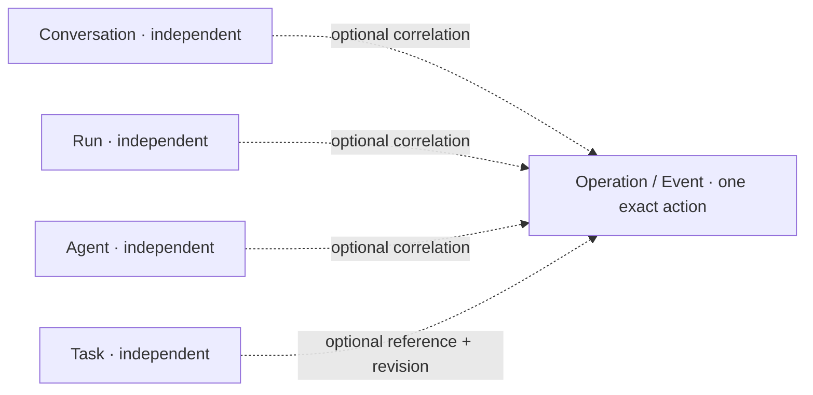
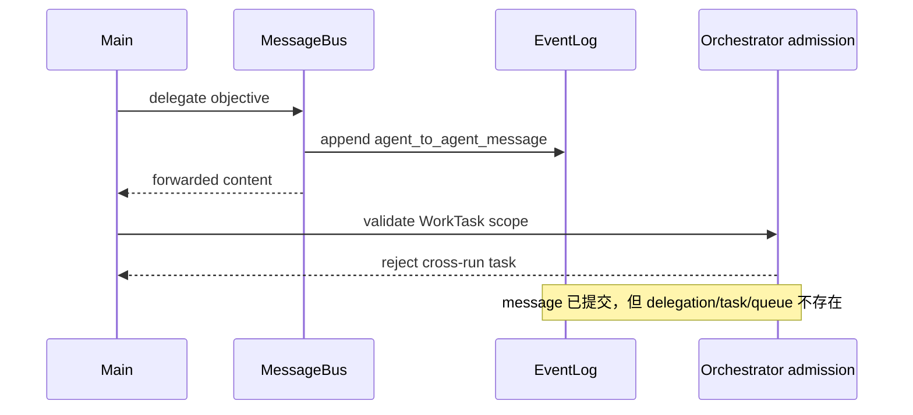

# Cowork 独立 Task、可恢复运行与自动对账机制重构报告

> 日期：2026-08-13 11:46（Asia/Singapore）
> 文档性质：事故复盘、架构纠偏与分阶段实施规格
> 范围：Cowork / AgentKernel / WorkTask / Conversation / ContinuationRun / Agent / 调度恢复 / 历史投影 / 副作用对账
> 当前状态：**设计提案，尚未实施**
> 结论级别：依据本地 Cowork EventLog、当前源码和现行项目文档交叉核对
> 隐私说明：报告保留必要的事件序号和不透明 ID；不记录用户工作区绝对路径、文件原文、凭据、完整请求或完整模型响应

## 0. 结论先行

这次故障不能概括成“提供商出错”或“测试任务没完成”。准确结论是：

1. **第一次 TLS validation failure 是真实的 provider/endpoint 传输失败。**
2. **传输失败之后，Intatis 错误地把运行记成 `cancelled`，而不是可恢复的 `interrupted`。**
3. **随后用户发送 Continue，宿主创建了全新的 ContinuationRun，但旧 WorkTask 仍显示在项目面板和模型历史中。**
4. **当前 WorkTask 又被硬绑定到创建它的旧 Run，导致新 Run 无权委派旧任务。**
5. **更严重的是，委派代码在检查 WorkTask 的 Run 归属之前，已经通过 MessageBus 持久化了一条 agent-to-agent message。** 因此宿主自己制造了“动作做了一半”的状态。
6. **AgentLoop 再把这个内部顺序错误统一包装成“可能产生副作用，需要人工对账”，继而让当前 turn、root invocation 和新 Run 一起失败/取消。**

所以，provider failure 只是触发条件，不是第二次失败的根因。真正需要修的是 Cowork 把 Task 错误绑定到 Run 的关系、状态语义、历史隔离、内部事务边界和自动恢复机制。

本报告修订后采用一个更小的目标模型：

```text
Task             独立存在，有自己的稳定 ID、内容、状态和版本
Conversation     独立存在，可以完全不使用 Task
Run              独立存在，只描述一次执行的生命周期
Agent            独立存在，只描述一个执行主体

Operation/Event  可选地同时引用上述若干 ID，仅用于这一次动作和审计
```

核心决策是：

- Task 就是 Task。它不属于某个 Conversation、Run 或 Agent；Conversation、Run、Agent 也不属于某个 Task。
- 系统不是 Task 驱动的：普通对话、文件阅读、临时提问和 agent 协作都可以没有 Task；Task 也可以在没有活动对话、运行或 agent 时继续存在。
- 一次操作可以临时引用 Task、Conversation、Run 和 Agent，但这是可选的多对多关联，不是父子关系、所有权或生命周期传播。
- Cowork session / workspace 可以作为 Task 的存储与安全命名空间，但不能因此取得 Task 的业务所有权，也不能把会话关闭解释为 Task 终结。
- Run 只描述一次执行窗口、checkpoint 和恢复边界，不拥有或激活 Task。
- 中断与取消必须成为两个不同事实。
- 历史记录只能提供线索，不能授予当前操作权限；当前动作必须重新读取 Task 的最新状态和版本后才能修改。
- 删除“人工对账”作为产品工作流和阻塞状态；保留内部 effect certainty 事实，并由宿主自动对账。
- Intatis 自己控制的任务、委派、消息和调度操作不得出现 unknown effect；它们必须变成一个原子 admission transaction。
- 外部不可原子动作必须依靠幂等键和可观察证据自动核验；无法幂等、无法观察的动作在自动模式下应在执行前拒绝，而不是执行后要求用户人工收拾。

明确不引入以下额外层级：

- 不新增 Workstream；
- 不新增 TaskAttempt 领域对象；
- 不新增把对话绑定到任务的 ActiveTaskSet；
- 不新增 Task owner Agent；
- 不把每次运行都解释成“执行某个 Task”；
- 不要求用户先创建 Task 才能使用 Cowork。

### 0.1 复杂度结论

这个方向不会把产品搞成一个庞大的任务编排系统。领域模型反而比上一版少。核心实现只有三件事：

1. 去掉 `runID`/conversation/agent 对 Task 的 ownership 与级联语义；
2. 给独立 Task 使用稳定 ID + monotonic revision，当前操作 fresh-resolve 后再 CAS；
3. 把会产生多个内部事件的动作改成 preflight-first、单次原子 admission。

`interrupted/cancelled` 分离和外部自动对账是执行可靠性机制，不要求 Task 成为系统入口。它们同样适用于完全不涉及 Task 的普通对话或工具操作。

实现工作量仍不会是“一两个条件判断”：旧协议、EventLog projection、carry-forward、Graph、scheduler、UI 和测试已经依赖 run-owned WorkTask，需要逐处移除旧假设。但这是删除耦合造成的兼容工作，而不是新增一套 Task 驱动架构。

## 1. 用户指出的四个核心问题

本次讨论收敛出的四个问题都成立，而且彼此不是孤立缺陷。

### 1.1 WorkTask 被错误绑定到运行

当前实现让 `WorkTask.runID` 成为必填身份字段，并拒绝跨 Run 的依赖与委派。结果是：

- 用户看到的是一个独立任务；
- 模型历史里记住的也是这些任务；
- 但宿主把任务当成某个瞬时 Run 的私有对象；
- Run 因网络错误结束后，任务事实仍存在，却失去可操作性；
- 新 Run 继续工作时，只能失败、复制任务，或重新创建另一组 ID。

正确修复不是把 Task 从“属于 Run”改成“属于 Conversation”“属于 Agent”或“属于 Workstream”。那只是把错误的父对象换了一个名字。Task 应当是独立对象；其他对象只在具体动作发生时临时引用它。

这也意味着系统不能反过来变成任务驱动：一个 Conversation 不需要挂在 Task 下，一个 Agent 不需要先取得 Task ownership，一个 Run 也不需要声明自己在执行哪个唯一 Task。

### 1.2 中断与取消被混成一个状态

当前 `ContinuationRunStatus` 只有：

```text
created / running / checkpointed / completed / cancelled
```

没有 `interrupted`。普通 provider failure、TLS error、运行时异常最后都可能走到 `cancelled`。

但两个概念完全不同：

- **中断**：系统本来还想继续，只是当前执行条件失效；保留任务、checkpoint 和恢复权。
- **取消**：用户或明确的宿主策略决定不再继续这项工作；撤销活动任务和后续执行权。

把 provider failure 写成 cancelled，会让系统丢失“应该恢复”的语义，也让 Retry、Resume、Continue 无法正确选择行为。

### 1.3 历史信息与当前操作没有隔离

当前系统同时存在三种互相矛盾的表现：

- UI 仍展示旧任务；
- `@main` 的 durable model history 仍能看到旧任务 ID；
- 当前 Run 的宿主校验却拒绝使用这些任务。

这意味着历史对象看起来仍然可操作，但真正执行时才被拒绝。问题不只是“模型用了错误 ID”，而是宿主给模型和用户展示了一个没有明确 current/historical 边界的世界。

### 1.4 “可能产生副作用，需要人工对账”不适合自动审核产品

当前机制把很多 non-replayable tool failure 转成：

```text
may have produced a side effect
manual reconciliation is required
```

但 Cowork 默认是自动权限审查，没有用户人工核对流程，也没有可靠的人工 reconciliation 操作面。因此这个状态只会形成死路：

- 当前调用失败；
- 整个 turn 失败；
- Run 被取消；
- UI 提示人工处理；
- 用户实际没有可执行的“处理”动作。

本报告建议删除的是：

- 用户可见的 manual reconciliation 文案；
- “等待人工核对”这个产品状态；
- unknown effect 对整个 session/项目的全局阻塞；
- 因内部控制面错误而把整轮任务终止的路径。

但不能删除一个客观事实：外部系统有时确实可能在远端成功、在本地丢失 ACK。正确替代不是假装不存在不确定性，而是把它变成宿主内部的自动 effect reconciliation。

## 2. 事故证据与时间线

### 2.1 证据来源

本报告核对了：

- 本地 Cowork session 的 append-only EventLog；
- `Packages/IntatisProtocol/Sources/WorkTask.swift`；
- `Packages/IntatisProtocol/Sources/ContinuationRun.swift`；
- `Packages/IntatisCowork/Sources/GoalRuntimeController.swift`；
- `Packages/IntatisCowork/Sources/Orchestrator.swift`；
- `Packages/IntatisCowork/Sources/MessageBus.swift`；
- `Packages/IntatisAgentKernel/Sources/AgentLoop.swift`；
- `docs/CURRENT_STATE.md`、`docs/ARCHITECTURE.md`、`docs/DO_NOT_BREAK.md`、`docs/COWORK_PRINCIPLES.md` 等当前合同文档。

为避免把私人工作资料写进仓库，本报告不复制用户原始请求、文件路径、模型长输出、provider payload 或权限上下文。

### 2.2 事件时间线

| 阶段 | EventLog 证据 | 实际发生的事情 | 正确语义 |
| --- | --- | --- | --- |
| 初始运行 | seq 10–11 | 创建并启动旧 Run `run_l19sopym` | 正常执行窗口 |
| 创建计划 | seq 212–213 | 创建并 ready 第一项 WorkTask `wt_3y0a42b7` | 独立 Task 应继续存在 |
| 创建计划 | seq 227–228 | 创建并 ready 第二项 WorkTask `wt_dggb08z7` | 独立 Task 应继续存在 |
| 传输失败 | seq 233 | provider endpoint TLS validation failed | 当前 provider attempt/Run 被中断 |
| 错误终态 | seq 235–238 | turn failed，旧 Run 被写成 cancelled | 不应视为用户取消 |
| 用户继续 | seq 240–244 | 用户提交 Continue，创建并启动新 Run `run_rvikryvh` | 应继续执行上下文；如需操作 Task，再 fresh-resolve |
| 准备 worker | seq 320–347 | 两个 Luna worker 分别完成 spawn/attach | worker 本身创建成功 |
| 新 Run 引用既有任务 | seq 374–387 | `@main` 提议让新 worker 处理既有 WorkTask，权限审查并 prepare | 宿主应 fresh-resolve Task 状态/revision，不应检查它属于哪个 Run |
| **半副作用** | **seq 388** | **先持久化了 agent-to-agent message** | 若 admission 后续失败，该消息不应存在 |
| 宿主拒绝 | seq 390 | `WorkTask is outside the current ContinuationRun` | 当前 run-owned 任务模型发生冲突 |
| 错误升级 | seq 396–401 | 包装成 manual reconciliation，turn/task failed，新 Run cancelled | 内部可纠正错误不应取消整个 Run |

### 2.3 为什么第二次失败不是 provider 的责任

第二次错误字符串 `WorkTask is outside the current ContinuationRun` 来自 Intatis 本地 `Orchestrator` 的宿主校验，不是远端 provider 响应。

provider/模型最多做了两件事：

- 根据当前可见历史，继续使用仍然显示为 ready 的 WorkTask ID；
- 提议把它们委派给已经成功创建的 worker。

这在用户视角和项目视角都是合理动作。真正矛盾的是：

```text
宿主把旧任务继续展示/提供给模型
             ↓
模型尝试继续这些任务
             ↓
宿主又以“它属于旧 Run”为由拒绝
```

即使换另一个模型或 provider，这个冲突仍会出现。模型可能偶尔绕开它，例如重新创建新任务，但那只是碰巧规避，不是机制正确。

## 3. 当前源码如何制造这个问题

### 3.1 WorkTask 的身份直接包含 Run

`Packages/IntatisProtocol/Sources/WorkTask.swift` 当前把以下字段放在 WorkTask 本体：

```swift
public var id: WorkTaskID
public var runID: ContinuationRunID
public var goalID: GoalID?
```

`runID` 是 initializer 必填项。`WorkTaskGraph` 还定义并执行 `cross_run_dependency` 拒绝。

这不是单个 guard 写错，而是当前数据模型主动声明：任务属于 Run。

### 3.2 ContinuationRun 没有 interrupted

`Packages/IntatisProtocol/Sources/ContinuationRun.swift` 的状态枚举没有 `interrupted`，terminal 只有 completed/cancelled。

因此运行时错误最后很容易被压进 cancelled，即使没有任何用户取消意图。

### 3.3 每条普通用户消息都会新建一个 Run

`GoalRuntimeController.sendUserTurn` 会为普通 Cowork turn 创建新的 `ContinuationRun`。当 `sendOperation` 返回 failed 时，它直接把 started Run transition 到 cancelled。

这意味着：

- Continue 不是“恢复原运行”；
- 它默认是“新建另一个 Run”；
- 新 Run 又无法操作旧 Run 的 WorkTask。

### 3.4 现有 carry-forward 是复制，不是恢复

Goal 路径中的 `carryForwardNonterminalWorkTasks` 会：

1. 找到旧 Run 的非终态 WorkTask；
2. 给每个任务分配新的 WorkTask ID；
3. 取消旧任务；
4. 把任务内容复制到新 Run；
5. 重映射同批依赖。

这种做法保住了“每个 Run 内部不跨边”的旧合同，却破坏了任务身份连续性：

```text
用户理解：同一任务在继续
当前实现：旧任务被取消，创建了一个内容相似的新任务
```

对长程自主任务来说，结果是：

- 引用 ID 漂移；
- evidence、状态、进度与 retry 语义需要复制；
- 历史中出现多个相似任务；
- 模型难以判断哪个才是当前权威任务；
- 普通 turn 又没有完整 carry-forward，所以行为还不一致。

### 3.5 委派路径先产生消息，再检查任务归属

当前 `Orchestrator` 的委派顺序是：

```text
检查 agent / authorization / delegation 基础条件
    ↓
await bus.deliver(...)
    ↓
MessageBus 把 agent_to_agent_message 写入 EventLog
    ↓
取得 admission lock
    ↓
读取 WorkTask
    ↓
检查 WorkTask.runID 是否等于 parent ContinuationRunID
    ↓
不相等则返回错误
```

这正好解释 seq 388 后 seq 390 的顺序。

`MessageBus.deliver` 不是预览函数。它在 mediator allow 后会直接 append `.agentToAgentMessage`。因此一旦后续 admission 被拒绝，已经存在一条 durable message，却没有对应 delegated task、queue admission 或 worker execution。

这是内部事务顺序错误，不能交给“人工对账”兜底。

### 3.6 AgentLoop 把所有 non-replayable 普通错误升级成 manual reconciliation

`AgentLoop` 对 `.requiresManualReconciliation` 工具在 executor 已进入后发生普通 error 时：

- 写 failed tool result；
- 不写有效 settled terminal；
- 抛 `toolExecutionRequiresManualReconciliation`；
- 上层把 turn、task 和 run 终结为失败/取消。

这个保守策略原本试图防止重复副作用，但它把两类情况混在一起：

1. 远端动作真的可能已经提交，但 ACK 丢失；
2. Intatis 自己先写了一部分内部事件，随后又发现参数/状态不合法。

第二类必须通过原子事务消除，不能永久保留成产品能力。

## 4. 机制级根因

本次事故至少有五个相互放大的根因。

### 根因 A：系统给 Task 强加了不应存在的所有权关系

当前模型近似：

```text
Run owns WorkTask
New Run cannot touch old WorkTask
Continuation must clone WorkTask
```

正确方向不是寻找另一个父对象，而是删除这条所有权边：

```text
Task, Conversation, Run, Agent are peers
An operation may reference any subset of them
No reference propagates lifecycle or ownership
```

Task 可以由一次对话触发创建，也可以由 UI、导入或其他机制创建；这个“创建来源”只是审计事实。它不能变成“Task 属于该对话”。同理，某个 Agent 曾处理 Task，也不能变成 Task 归该 Agent 所有。

### 根因 B：事实状态与控制意图混用

`cancelled` 同时被用于：

- 用户明确取消；
- host stop；
- provider TLS failure；
- runtime/tool failure；
- internal admission conflict。

一旦所有路径都写成 cancelled，恢复器无法知道“执行被打断”还是“用户明确不要继续”。

### 根因 C：历史内容被误当成当前操作依据

UI、模型历史、WorkTaskGraph 和 current Run admission 各自持有不同视图：

- UI 仍展示 Task；
- model history 包含旧 Task ID 和旧状态；
- `task_list` 可能只返回某个 Run 的 Task；
- `delegate_task` 又只接受当前 Run 的 Task。

根本问题不是缺少一个“当前任务集合”，而是系统把历史文本中的关系和状态当成了当前 authority。历史只能帮助定位 Task；真正修改前必须重新读取 Task 的最新记录和 revision。

### 根因 D：内部控制面缺少原子 admission transaction

一次委派至少依赖以下同一时刻成立的事实：

- target agent 仍 attached；
- 如果本次动作引用 Task，该 Task 存在、状态允许且 revision 未变化；
- workspace/capability/inference binding 已获授权；
- message、执行记录和 scheduler queue 要么同时成立，要么都不成立。

当前这些事实跨 await、跨 actor、跨 EventLog append 分散提交，导致中间状态可见。

### 根因 E：自动模式仍保留人工恢复假设

权限审核已自动化，但执行恢复仍假设“有人会看懂 unknown side effect 并手工处理”。产品没有完成这一闭环。

结果是权限自动、执行异常人工、UI 又没有人工工具，形成结构性死路。

### 根因 F：把修复继续扩展成任务驱动系统会再次走偏

如果为了解除 Run ownership，又新增 Project ownership、Workstream、TaskAttempt、ActiveTaskSet 和 Agent owner，系统会从“Run 驱动 Task”变成“Task 驱动一切”。这仍不符合产品事实：用户可以只是聊天、阅读、临时协作或执行一次操作，并不一定在管理 Task。

因此修复目标是减少关系，不是增加层级。

## 5. 最小目标模型：四个平级对象加操作关联

### 5.1 总原则

目标模型只保留四个可以独立存在的对象：

| 对象 | 自己负责什么 | 明确不负责什么 |
| --- | --- | --- |
| Task | 任务内容、状态、依赖、结果、revision | 不拥有 Conversation、Run 或 Agent；也不被它们拥有 |
| Conversation | 消息历史与交互连续性 | 不需要绑定 Task；关闭对话不终结 Task |
| Run | 一次执行的开始、checkpoint、停止、中断和用量 | 不拥有或激活 Task；结束 Run 不改变 Task 生命周期 |
| Agent | 身份、能力、租约和当前执行资格 | 不拥有 Task；detach 不取消 Task |

它们之间唯一允许的联系是：某次 operation/event 为了完成审计和并发控制，可以可选地记录自己引用了哪些 ID。

### 5.2 Task

目标 Task 只包含自身事实：

| 字段类别 | 建议内容 |
| --- | --- |
| 身份 | stable `WorkTaskID` |
| 内容 | title、description、acceptance criteria、priority |
| 结构 | `dependsOn` stable Task IDs；只表达任务间依赖 |
| 状态 | pending/ready/in_progress/blocked/completed/failed/cancelled/archived |
| 并发 | monotonic revision / expected revision |
| 结果 | result、evidence、validation linkage |
| 时间 | createdAt、updatedAt、completedAt 等 Task 自身时间 |

Task 的语义模型里不应出现：

- `conversationID` 作为 parent；
- `runID` 作为 parent 或操作 authority；
- `agentID`/ownerAgentID 作为所有权；
- `workstreamID` 作为必须存在的父层级；
- “当前对话的 Task”或“当前 Agent 的 Task”这种排他关系。

现有 `runID` 可以暂时保留为 legacy decode 或 `createdDuringRunID` 审计来源，但不能继续参与依赖、读取、更新或委派准入。

### 5.3 Conversation

Conversation 只负责消息历史。以下场景都必须合法：

- 一个 Conversation 从头到尾没有创建任何 Task；
- 一条消息临时提到多个 Task；
- 同一个 Task 在多个 Conversation 中被讨论；
- Conversation 被关闭或归档，而 Task 保持原状态；
- 新 Conversation 通过 fresh lookup 找到旧 Task，但没有建立归属关系。

历史消息里出现 Task ID 只是一段历史数据。它可以触发一次 `task_get`，不能直接授予 `task_update` 或 `delegate_task` 权限。

### 5.4 Run

Run 只负责一次执行生命周期：

- started / checkpointed / interrupted / completed / cancelled；
- provider/tool cancellation scope；
- usage、deadline 和 shutdown drain；
- crash/restart 后的恢复边界。

一个 Run 可以：

- 不引用任何 Task；
- 在不同操作中引用多个 Task；
- 只进行普通对话、搜索或阅读；
- 中断或结束而不改变任何 Task 状态。

Task 是否被更新，只由成功提交的 task mutation event 决定，不能由 Run 终态推导。

### 5.5 Agent

Agent 只负责身份、能力与执行资格。某个 Agent 处理 Task 的正确表达是：

```text
operation X was executed by Agent A and referenced Task T
```

而不是：

```text
Task T belongs to Agent A
Agent A belongs to Task T
```

调度器可以给一次具体执行发临时 lease；lease 到期、Agent detach 或执行失败都不会自动修改 Task 的归属，因为 Task 根本没有 Agent owner。

### 5.6 Operation/Event：可选关联，而不是第五个业务层级

系统已经存在 turn、tool call、durable execution ticket、message 和 scheduler execution 等运行记录。无需再新增 `TaskAttempt` 领域对象。现有执行记录只需在确有必要时带可选 correlation：

```text
operationID
conversationID?     optional audit correlation
runID?              optional execution correlation
agentID?            optional actor correlation
taskIDs[]?          optional referenced objects
expectedTaskRevisions?  only for exact mutations
```

这些字段表达“这一次动作涉及了什么”，不表达任何对象属于另一个对象。关联是可选、多对多、一次性的；删除或终结其中一个对象不会级联删除其他对象。

### 5.7 关系图



图中的虚线不是 containment，也不是 ownership。它只让系统回答“哪个动作在什么时候由谁执行、当时引用了哪些 Task”。

### 5.8 存储范围不等于业务归属

当前 EventLog、权限、workspace bookmark 和 writer lease 都以 Cowork session 为事实域。首期可以继续把 Task 记录存放在该安全边界内，以避免跨 session 并发和权限污染。

但必须明确：

```text
stored in session X  ≠  belongs to conversation X
stored in workspace namespace Y  ≠  driven by project Y
```

存储命名空间只回答“去哪里读取、由哪把锁保护、受哪个 workspace confinement 约束”；它不传播生命周期，也不要求 UI 和执行流以 Task 为中心。

### 5.9 本方案刻意删除的复杂度

与上一版提案相比，修订方案不再要求：

- Project → Workstream → WorkTask 层级；
- TaskAttempt；
- AgentInvocation 必须隶属 TaskAttempt；
- durable ActiveTaskSet；
- Task owner Agent 及 owner revision；
- Conversation 与 Task 的双向索引或从属关系；
- 每次 Continue 都选择“当前工作流”；
- task-driven root state machine。

保留下来的新增概念只有两个：Task 自身 revision，以及已有 operation/event 上的可选 correlation。二者分别解决并发更新和审计，不构成新的产品层级。

## 6. 状态机必须独立，不能级联推导

### 6.1 Task 状态

```text
pending
ready
in_progress
blocked
completed
failed
cancelled
archived
```

语义要求：

- provider failure 不自动改变 Task 状态；
- Run interrupted/cancelled/completed 不自动改变 Task 状态；
- Agent detach/failure 不自动改变 Task 状态；
- 只有成功提交的 exact task mutation 才能改变 Task；
- failed 表示 Task 按当前合同无法完成，不代表用户取消；
- cancelled 只表示用户或明确策略取消这个 exact Task；
- archived 只影响默认展示和是否允许写入，不等同失败或取消。

如果执行开始前需要显示 `in_progress`，这也必须是一次独立、带 expected revision 的 Task 更新；Run 失败时不能靠级联规则猜测应该退回 ready。恢复器只能根据已提交的 Task 事实决定是否需要显式纠正。

### 6.2 Run 状态

```text
created
running
checkpointed
interrupted
completed
cancelled
```

| 原因 | Run 状态 | Task 状态 |
| --- | --- | --- |
| 正常执行结束 | completed | 不自动改变 |
| provider TLS/network/timeout | interrupted | 不自动改变 |
| app crash / runtime unavailable | interrupted | 不自动改变 |
| 用户取消当前执行 | cancelled | 不自动改变 |
| exact Task 被用户取消 | Run 可继续 | 仅该 Task 明确变为 cancelled |
| Agent detach | Run 按实际执行情况继续或 interrupted | 不自动改变 |

`interrupted` 可以通过新 Run 从 checkpoint 继续，也可以由实现选择恢复同一 Run；无论 wire 方案如何，都不能伪装成 cancelled。

### 6.3 Conversation 状态

Conversation 的 active/closed/archived 只控制交互和展示：

- 关闭 Conversation 不取消 Task；
- 归档 Conversation 不归档 Task；
- 删除或隐藏一段历史不能改变 Task；
- 取消 Task 也不关闭 Conversation。

### 6.4 Agent 状态

attached/detached/busy/stopped 只描述执行主体。Agent 状态变化不写 Task terminal；后续其他 Agent 或用户仍可对同一 Task 发起新操作。

### 6.5 Effect certainty 状态

自动对账需要一条与 Task、Run、Conversation、Agent 状态都分离的证据轴：

```text
not_started   可以证明未越过 mutation boundary
committed     可以证明效果已提交
absent        自动 read-after-write 证明效果不存在
unknown       当前证据不足，进入自动 reconciliation
superseded    已由后续等价、可证明动作替代
```

unknown 只属于一个 exact operation，不能传播成“Task unknown”“Conversation cancelled”或“整个项目等待人工核对”。

## 7. Retry、Resume、Continue、Cancel 的非任务驱动语义

| 用户动作 | 精确目标 | 行为 |
| --- | --- | --- |
| Retry | 某个失败/中断的 provider 或 tool operation | 重试 exact operation；若涉及 Task，执行前重新读取 Task revision |
| Resume | 某个 interrupted Run/checkpoint | 继续执行上下文；不创建、激活、取消或复制 Task |
| Continue | 当前 Conversation | 添加一条新消息并开始正常执行；不隐式绑定任何 Task |
| New Conversation | 新交互历史 | 不创建新的 Task namespace，也不迁移旧 Task |
| Cancel Turn/Run | 当前执行范围 | 停止精确执行；不取消 Task、不关闭 Conversation |
| Cancel Task | exact Task | 只修改该 Task；不取消相关 Conversation、Run 或 Agent |
| Detach Agent | exact Agent | 停止其新执行资格；不改变 Task |

如果一次 Continue 的内容确实要求操作某个 Task，宿主流程应是：

```text
Continue creates ordinary operation
  -> resolve referenced Task from current Task store
  -> read latest revision and status
  -> validate exact action
  -> atomically commit the action
```

它不是：

```text
Continue resumes a Task-owned workflow
  -> activate task graph
  -> assign task owner
  -> create task attempt
```

对本次事故，正确行为应是：

```text
TLS failure
  -> Run A interrupted
  -> W1/W2 保持最后一次已提交的自身状态
用户 Continue
  -> 建立普通的新执行操作/Run B
  -> 操作 W1/W2 前 fresh-resolve 它们的 ID、状态和 revision
  -> 可由任何具备能力的 attached Agent 执行，但不取得 Task ownership
```

## 8. 历史信息与当前操作隔离

### 8.1 不新增 ActiveTaskSet

历史隔离不需要把 Task 划进“属于当前对话的 active set”。那会重新建立用户明确不要的绑定关系。

更简单的规则是：

> 历史内容没有 mutation authority；每个当前操作都必须对所引用 Task 做一次 fresh resolve，并以 expected revision 提交。

### 8.2 Fresh resolve + optimistic revision

对 `task_update`、`delegate_task`、依赖变更、完成、取消等动作：

1. 从当前 Task projection 按 stable ID 读取 Task；
2. 检查它仍存在，且状态允许该动作；
3. 取得当前 monotonic revision；
4. 完成权限、target 和 schema 预检；
5. 在原子 admission 内以 `expectedRevision` 做 compare-and-swap；
6. revision 已变化则返回 typed `not_started/stale_task_revision` 和最新安全摘要；
7. 不写 message、queue、owner 或部分 Task 事件。

模型可以根据最新结果决定是否重试，但不能凭旧 transcript 直接越过第 1–3 步。

### 8.3 UI 不是“当前对话任务面板”

Tasks UI 应呈现独立 Task store 的视图，可以按状态过滤：

```text
Open       pending / ready / in_progress / blocked
Finished   completed / failed / cancelled
Archived   archived
```

这些只是 Task 自身状态筛选，不表达它属于当前 Conversation、Run 或 Agent。切换对话不应偷偷替换 Task namespace；关闭对话也不应让 Task 消失。

### 8.4 模型上下文只提供快照，不提供 authority

模型上下文可以包含有界的 Task 摘要，也可以完全不包含 Task。无论哪一种：

- 摘要必须标注它是 snapshot；
- 历史消息中的 `wt_*` 只能作为 lookup hint；
- exact mutation 必须经过 host fresh resolve；
- 当前 tool result 可提供最新 revision，但真正提交时仍由宿主 CAS；
- 不需要把 Task 编成每个 Conversation 的系统提示主轴。

### 8.5 UI、tool 与 admission 使用同一个 Task projection

不能继续存在：

```text
UI 说 Task ready
history 说 Task ready
task_get 因“不是当前 Run”而说不存在
delegate_task 又以旧 Run ownership 拒绝
```

UI、`task_list/task_get` 和 admission guard 应读取同一个 Task projection。差别只能来自真实 revision 变化，而不能来自它们分别猜测 Task 属于哪个 Conversation、Run 或 Agent。

## 9. 删除人工对账，改为自动 effect reconciliation

### 9.1 要删除什么

在 automatic mode 中删除：

- `manual reconciliation required` 用户文案；
- “等待人工确认是否产生副作用”的 UI 状态；
- 因单个 uncertain action 停止整个 session 的机制；
- 把内部任务/消息/委派错误归为不可恢复外部副作用；
- 用户点击 Retry 前必须先完成不存在的人工核对步骤。

### 9.2 仍要保留什么

内部仍要保留：

- execution ID / idempotency key；
- prepared/settled 证据；
- effect certainty；
- read-after-write probe 结果；
- reconciliation attempt 和最终结论；
- exact action/branch quarantine。

这些是自动恢复所需的事实，不是人工工作流。

### 9.3 内部控制面动作：unknown effect 应成为不变量违规

以下动作完全由 Intatis 自己控制：

- WorkTask create/update/status/dependency change；
- agent attach/spawn/remove；
- delegation admission；
- MessageBus message creation；
- exact execution record creation；
- scheduler queue；
- lease grant/revoke。

它们共享同一 EventLog，因此应做到：

```text
validate all immutable facts
    ↓
construct one admission batch
    ↓
append once under EventLog/admission lock
    ↓
publish registry/taskGraph/mailbox/scheduler memory state
```

对这些内部操作，最终只允许：

- committed；
- not_started。

如果出现 unknown，应该记录为 host invariant violation 并自动隔离该 exact transaction，而不是要求用户人工对账。

### 9.4 外部动作：三段式自动对账

外部系统无法共享 EventLog transaction，需要：

1. **稳定 idempotency identity**
   每次精确动作带 operation/execution ID；重试不得创建第二个语义动作。
2. **可观察效果探针**
   例如 read-after-write、GET by idempotency key、文件 digest、Git object/ref、远端 resource ID。
3. **自动决策**
   - probe 证明已应用：写 committed settlement；
   - probe 证明不存在：允许同 idempotency identity 安全重试；
   - probe 暂时不可用：隔离 exact action/branch，其他无关操作继续；后台有界重试 probe；
   - 永久无法观察：标记该能力不适合 auto-only，下一次在执行前拒绝或要求改用可证明 wrapper。

### 9.5 自动审核与自动对账是两件不同的事

```text
Automatic Permission Reviewer
    判断“执行前是否允许做”

Automatic Effect Reconciler
    判断“执行后到底有没有做成”
```

前者不能替代后者。reviewer allow 只说明动作获准，不证明效果已经提交。

### 9.6 无法幂等、无法观察的动作

如果一个外部动作同时满足：

- 没有稳定幂等键；
- 没有 read-after-write/查询能力；
- 重复执行可能造成严重后果；

那么自动模式必须在执行前 fail closed，或先引入一个可证明的 transactional wrapper。不能先执行，再用“人工对账”把风险转给用户。

## 10. 委派必须成为原子 admission transaction

### 10.1 当前错误顺序



### 10.2 目标顺序

建议流程：

1. 冻结 exact caller、target、workspace、capability、inference binding 和 authorization；如果本次动作引用 Task，再冻结 exact Task ID 和 observed revision。
2. 在无副作用阶段完成 schema、target availability 和资源冲突校验；如引用 Task，从统一 Task projection fresh-resolve 并检查 status、dependency 和 revision，不检查它属于哪个 Conversation、Run 或 Agent。
3. 如存在 `await` 的 provider/catalog resolution，返回后重新取得 admission lock 并重验同一 snapshot。
4. Mediator 只做纯判定并返回 mediated content，不在此阶段写 EventLog。
5. 构造一个 EventLog admission batch，至少包含：
   - 本次动作明确要求的 optional WorkTask mutation，带 expected revision；
   - typed delegation/message fact；
   - exact execution created/queued；
   - 必需 lease/linkage events。
6. 单次 append batch 成功后，才更新 mailbox、taskGraph、registry 和 scheduler 内存状态。
7. append 失败时内存完全不变；没有 orphan message，也没有 worker 被虚假唤醒。

这里的 execution/linkage 只记录一次动作的相关 ID，不建立 Task owner，也不建立 Conversation ↔ Task 或 Run ↔ Task 的 durable membership。

### 10.3 MessageBus 的角色调整

MessageBus 仍然是唯一通信路径，但它需要区分：

- `mediate`：纯判定/纯转换，不持久化；
- `commit delivery`：由已获准的 admission transaction 在 batch 中持久化；
- `publish mailbox`：batch commit 后更新运行时。

普通独立 `send_message` 也应通过一个自身完整的 admission transaction；不能让一个 helper 在调用者尚未完成所有约束校验时提前 append。

### 10.4 对本次事故的直接修复效果

采用目标顺序后，即使 Task 已取消、归档、revision 过期或 target 已失效：

- 也会在 seq 388 之前被拒绝；
- EventLog 中不会出现 agent-to-agent message；
- 工具可以返回 typed `not_started`；
- 模型可在同一 turn 获取 Task 的最新状态/revision 后决定是否修正；
- 不会触发 unknown side effect；
- 不会取消整个 Run。

## 11. Provider、网络和运行时错误的恢复语义

### 11.1 首字节/首个有效 payload 前失败

如果 provider 在任何有效 payload 前 TLS/network/timeout 失败：

- 可以按既有有界策略重试同一个 request；
- 重试耗尽后将当前 exact provider execution 标为 interrupted 或 failed-with-no-output；
- Run 标为 interrupted；
- WorkTask 保持最后一次已提交的自身状态，不因 Run 中断被改写；
- 保存 checkpoint 和 exact provider diagnostic 的安全摘要；
- 不写 cancelled，除非同时观察到明确用户取消。

### 11.2 已收到 partial payload 后失败

为避免重复模型输出/工具调用，不自动重放整个 provider request：

- 保存 partial output 和 interruption fact；
- 如果尚未产生工具调用，可创建下一次 provider execution，向模型提供 host-authored continuation context；
- 如果已经产生工具调用，则先对每个 exact execution 做 effect reconciliation；
- 只隔离证据不明的调用，不冻结无关任务。

### 11.3 单个工具失败

工具失败默认应作为 observation 回到同一 agent turn，只要：

- turn 本身仍可继续；
- 没有用户 cancel；
- 当前 Run 未被显式 close；
- failure 没有破坏宿主控制面的硬 invariant。

模型可以修正参数、选择另一工具或报告局部 blocker。不能把任何 non-replayable tool error 自动升级成 root task/run cancellation。

### 11.4 用户取消

只有以下来源可以写 cancelled：

- 用户明确取消 exact Turn、Run 或 Task；
- 明确的 host policy cancel；
- 已有 durable close claim 表达 stopped/cancelled。

provider/runtime failure source 必须保持 runtime/interruption，不得伪装成用户取消。

不同对象的取消不能互相推导：Cancel Run 不取消 Task，Cancel Task 不取消 Conversation 或整个 Run，关闭 Conversation 也不产生 Task cancellation。

## 12. EventLog 兼容迁移

### 12.1 总原则

- 不重写现有 `events.jsonl`；
- 不修改旧 Envelope；
- 不复用旧 event type 表达新含义；
- 所有新字段保持 additive optional；
- 旧二进制仍可跳过未知 future event；
- 新二进制对完整历史使用 `replayForProjectionChecked()` 和 `hasCompleteKnownHistory`；
- migration 只追加事实和 marker。

### 12.2 新 WorkTask 写入

新式 WorkTask 不需要追加 ProjectID、WorkstreamID、ConversationID 或 Agent owner。`runID` 改成：

- legacy decode 字段；或
- `createdInRunID` 审计字段。

Task 自身需要 monotonic revision。一次运行或 Agent 操作 Task 时，由现有 operation/tool execution/message event 可选记录 correlation；不把 correlation 写回成 Task 的父子关系。

具体 wire 名称需要实现阶段评审，但语义上至少需要：

- task created/updated/settled，带 stable ID 和 revision；
- optional operation-to-task correlation；
- run interrupted；
- effect reconciliation requested/settled；
- task-decoupling migration marker。

### 12.3 旧 WorkTask 的自动 adoption

对带旧 `runID` 的任务：

1. 保留原 WorkTaskID；
2. 把原 `runID` 仅解释为 created-during-run provenance；
3. 不再用它拒绝来自其他 Run、Conversation 或 Agent 的 fresh-resolved 操作；
4. 旧 owner/assignment 如存在，只保留为历史执行信息，不作为未来 authorization；
5. 给重建后的 Task projection 分配明确 monotonic revision；
6. 追加一次 first-write migration/adoption marker，不改旧事件。

Cowork session 仍可作为查找该 Task 的存储命名空间，但 migration 不生成“Task 属于该 Conversation/Project”的业务事实。

若存在明确的 `work_task_carried_forward` chain，可以在 projection 层把后续 clone 作为最早稳定 Task ID 的 legacy alias；这只是消除旧实现制造的重复身份，不引入新的父对象。

### 12.4 歧义 legacy chain

如果旧历史存在：

- seq gap；
- unknown future event；
- conflicting carry-forward linkage；
- 多个无法判定的 source；
- 同 ID 不一致事实；

则不能猜测合并。正确自动行为是：

- 把歧义对象分别保留为只读 legacy Task；
- 不阻塞其他无关操作；
- 不要求用户执行“人工对账”流程；
- 当前操作需要它时先 fresh-resolve；无法证明 canonical identity 就 typed `not_started`，不得猜测合并；
- 记录自动 migration diagnosis 的安全摘要。

### 12.5 停止产生新 carry-forward clone

新模型上线后：

- `work_task_carried_forward` 继续 decode/replay；
- 只作为 legacy migration provenance；
- 新 Run 不再取消+克隆非终态任务；
- 新操作如需使用 Task，直接 fresh-resolve 原 WorkTask ID 和 revision；
- 不创建 TaskAttempt，不把 Task 加入 Run/Conversation 的 active set。

## 13. 分阶段实施建议

这不是一个适合“一次性大改全部”的任务，但也不能只改 UI 文案。建议按最小 coherent slice 分阶段。

### Phase 0：立即止血——消除内部半副作用

目标：即使旧 run-owned 模型暂时存在，也不再产生本次 seq 388→390 的半提交。

内容：

- 所有 WorkTask existence/status/revision/dependency 和 target 校验移动到 message append 之前；
- Mediator 判定与 durable delivery 拆开；
- delegation 的 message + invocation + queue 改成同一 admission batch；
- preflight rejection 统一证明 `not_started`；
- 该错误作为 tool observation 返回，同一 turn 可以纠正；
- 不得触发 manual reconciliation 和 Run cancellation。

相对工作量：中等。
风险：集中在 Orchestrator/MessageBus admission 顺序和现有测试假设。
价值：立刻消除最危险的内部 unknown effect。

### Phase 1：拆分 interrupted 与 cancelled

内容：

- 增加 additive run interruption 语义；
- provider/TLS/runtime/crash 走 interrupted；
- 用户/host policy cancel 才走 cancelled；
- ordinary `sendUserTurn` failure 不再无条件 cancel Run；
- UI 显示“已中断，可恢复”，不是 Turn cancelled；
- Retry/Resume/Continue planner 按 typed source 决策。

相对工作量：中等。
风险：EventLog projection、Goal recovery、run close、UI terminal 文案和测试矩阵。
价值：恢复语义正确，网络波动不再等于用户取消。

### Phase 2：解除 WorkTask 的 Run/Conversation/Agent 绑定

内容：

- `runID` 降为 legacy/created-during audit，不再是 authority；
- 不新增 ProjectID/WorkstreamID/TaskAttempt/owner Agent；
- Task 增加 monotonic revision；
- DAG 只按 stable Task ID 和存储安全边界校验，不按 Run/Conversation/Agent 归属校验；
- delegate/update/readiness 使用 fresh Task projection + expected revision；
- 任意新操作都可以引用原 WorkTask ID，只要当前状态和 revision 允许；
- 停止新 carry-forward clone。

相对工作量：中到大，但明显小于引入 Workstream、TaskAttempt 和 ActiveTaskSet 的方案。
风险：协议、投影、Graph、Goal continuation、tools、scheduler、UI、legacy fixtures。
价值：真正解决任务被某次运行锁死的问题，同时保持产品不是 Task 驱动。

### Phase 3：历史信息与当前操作隔离

内容：

- 不新增 durable ActiveTaskSet；
- UI 按 Task 自身状态过滤，不按当前 Conversation 归属分组；
- 历史 Task ID 只允许触发 fresh lookup；
- task mutation 强制 expected revision/CAS；
- task tools、UI 和 admission 消费同一 Task projection；
- Conversation history 与 operation input 分层，历史不携带 authority。

相对工作量：中等。
风险：`@main` durable history、ContextProjector、UI paging/selection。
价值：消除 stale ID/状态混用，又不建立 Conversation ↔ Task 绑定。

### Phase 4：自动 effect reconciliation，移除人工对账产品状态

内容：

- 删除 automatic mode 的 manual reconciliation 文案和 dead-end state；
- 内部控制面只允许 committed/not_started；
- 外部动作注册 idempotency/probe policy；
- exact branch quarantine，不全局冻结；
- 后台有界 reconciliation；
- 无法幂等/观察的自动能力执行前拒绝。

相对工作量：大，且需要按工具族逐步接入。
风险：不能用一个通用错误字符串分类器替代每个 executor 的真实证据。
价值：自动审核与自动恢复形成闭环。

### Phase 5：Legacy adoption 与兼容清理

内容：

- fold 旧 run-owned task；
- carry-forward chain alias；
- migration marker；
- 旧 enum/event 继续 decode；
- 新 writer 不再产生旧语义；
- 经过至少一个版本周期后，删除仅服务旧 live path 的代码，保留 decoder。

相对工作量：中到大。
风险：真实旧 session 的长历史、unknown event、重复/歧义 linkage。
价值：升级后用户不丢 Task，也不被历史坏状态永久卡住。

## 14. 推荐的最小实施顺序

如果要以最小工作量先修最重要的机制，顺序应是：

1. **先修 delegation 原子性和 preflight-before-effect。** 这是已经造成真实半副作用的 P0。
2. **再把 provider/runtime failure 从 cancelled 改成 interrupted。** 这是恢复语义的最小闭环。
3. **再解除 WorkTask 的 Run ownership，并增加 revision。** 不新增 TaskAttempt、Workstream 或 owner。
4. **随后强制 fresh resolve + expected revision。** 历史隔离靠当前读取和 CAS，不靠 ActiveTaskSet。
5. **最后逐工具族替换 manual reconciliation。** 内部控制面应在 Phase 0 就先消除；外部能力分批加入自动 probe。

不建议只做以下“看似很小”的修补：

- 删除错误文案但保留 unknown ticket；
- 让 `delegate_task` 暂时忽略 runID，但 DAG/update 仍按 runID；
- Continue 时把旧 task ID 文本替换成新 clone ID；
- 用 UI 隐藏代替 fresh resolve/revision 校验；
- 把 Conversation ID 或 Agent owner 换成 Task 的新父对象；
- 所有 provider error 都自动重试；
- 把 unknown 一律当成 not_started。

这些会隐藏症状或制造重复副作用，不构成机制修复。

## 15. 故障注入测试矩阵

### 15.1 Provider/Run

| 注入点 | 预期 |
| --- | --- |
| provider dispatch 前 TLS failure | Run interrupted；WorkTask 不取消；无工具副作用 |
| 首个有效 payload 前 timeout，重试耗尽 | exact provider execution interrupted；Run 可 Resume |
| partial text 后连接断开 | 保存 partial + interrupted；不自动重放旧输出 |
| tool call batch 已生成但尚未 permission | 无 execution effect；可从 checkpoint 继续 |
| app crash 后恢复 | 历史 running 显示 interrupted；不自动发 provider；Task 保持自身最后一次已提交状态 |
| 用户 Cancel 与 TLS failure 竞争 | durable typed source 决定：明确 user cancel 才 cancelled；否则 interrupted |

### 15.2 独立 Task

| 场景 | 预期 |
| --- | --- |
| Run A 中创建 W1/W2，Run A interrupted | W1/W2 ID 与状态不因 Run 终态自动变化 |
| Run B fresh-resolve 后委派 W1 | 不报 cross-run；按 W1 当前 revision 原子提交本次 operation |
| Conversation B 讨论 Conversation A 中首次出现的 W1 | 读取同一 W1；不建立 Conversation 归属或迁移 |
| Conversation A 关闭/归档 | W1 状态完全不变 |
| 处理过 W1 的 Agent detach | W1 状态完全不变，其他 Agent 仍可 fresh-resolve 后操作 |
| W1 archived 后模型从旧 history 引用 ID | mutation/delegation 在 preflight typed 拒绝，0 durable effect；返回最新 Task 摘要 |
| 两个 Run/Agent 并发修改 W1 | expected revision CAS 只允许一个 winner，loser 为 `not_started/stale_task_revision` |

### 15.3 Delegation transaction

对以下每个边界做 crash/failure injection：

1. mediator 前；
2. mediator 后、admission lock 前；
3. exact target resolve 后；
4. optional Task fresh-resolve/revision check 后；
5. EventLog batch 写入前；
6. WAL 已写、JSONL partial；
7. JSONL commit 后、内存 publish 前；
8. mailbox publish 后、scheduler claim 前；
9. scheduler claim 后、provider dispatch 前。

共同断言：

- 要么整组 delegation/message/execution/queue committed；
- 要么全部 not_started；
- 不存在 orphan agent-to-agent message；
- 不存在只有 Task mutation、没有对应 operation settlement 的状态；
- 不存在 queue 可见但 lease/linkage 缺失；
- replay 与 live projection 一致；
- exact retry 幂等，不创建第二条 message/execution。

### 15.4 自动 effect reconciliation

| 场景 | 预期 |
| --- | --- |
| 外部动作成功，ACK 丢失，probe 证明存在 | committed，不重做 |
| 外部动作未发生，probe 证明不存在 | 同 idempotency key 安全重试 |
| probe 暂时 5xx | 只隔离 exact action，其他无关操作继续；有界后台重试 |
| probe 永久不支持 | 该 capability 未来 automatic execution 前拒绝 |
| 后续等价成功动作覆盖旧 unknown | 旧 effect 标 superseded，解除 branch quarantine |
| reviewer allow 但 executor 未启动 | not_started；review allow 不冒充 committed |

### 15.5 History/Current operation

- UI 与 `task_list/task_get` 对同一 Task 返回同一 projection/revision；
- 切换、关闭或归档 Conversation 不改变 Task store；
- history 中的 Task ID 必须 fresh-resolve，旧状态/revision 不能直接执行；
- stale revision 在任何 durable effect 前返回 typed `not_started`；
- restart 后 Task revision 可从 EventLog 重建；
- old binary 遇到新 event 不复用 seq；
- new binary 遇到 unknown future event 不做 adoption/absence proof；
- 100 个 Run 后仍只有稳定 WorkTask，不产生 100 份 carry-forward clone。

## 16. 具体用户场景与修复后的行为

### 场景 A：provider 临时证书/TLS 故障

当前：任务 ready → provider failure → Run cancelled → Continue 新建 Run → 旧任务不可委派。

修复后：

```text
Run A interrupted
W1/W2 保持最后一次已提交的自身状态
用户 Continue/Resume
Run B 中需要操作 W1/W2 时 fresh-resolve ID/revision
具备能力的 worker 正常执行，但不取得 Task ownership
```

### 场景 B：App 被关闭或系统杀进程

修复后重新打开：

- 不自动调用 provider；
- 旧 Run 显示 interrupted；
- 独立 Task store 仍保存同一批稳定 ID；
- 用户 Resume 后继续执行上下文；需要操作 Task 时重新读取 revision；
- 已 committed 的内部动作不重复；
- unknown 外部动作先自动 probe，再决定继续。

### 场景 C：同一 Conversation 持续几小时、多轮 Continue

修复后不会每轮复制 Task。WorkTask ID、依赖和 evidence 保持稳定；Run 只记录各自的执行/checkpoint。Conversation 仍然只是消息历史，不会因为多轮 Continue 变成 Task 的父对象。模型从历史看到旧 Task ID 时，宿主会读取最新 revision，而不是采用十轮以前的状态。

### 场景 D：worker 已创建，但任务委派参数不合法

修复后所有 Task existence/status/revision/dependency 和 target 校验在 durable message 前完成。调用失败时：

- worker 可以继续留在 team roster；
- 没有发给 worker 的 orphan message；
- 没有 execution/queue；
- 工具返回 `not_started` 类型错误；
- main 可在同一 turn 获取最新 Task 信息并修正；不需要先选择“当前对话所属的 Task”。

### 场景 E：远端写入成功但本地丢 ACK

修复后不会展示“请人工核对”。宿主使用 operation ID 查询远端：

- 已存在：settle committed；
- 不存在：安全重试；
- 暂时未知：只暂停依赖该效果的 branch，其他任务继续；
- 能力永久不可核验：以后在自动模式下禁止这类动作。

### 场景 F：用户真的点击 Cancel

修复后取消目标必须明确：

- Cancel Run：只停止当前执行，Task 和 Conversation 不变；
- Cancel Task：只把 exact Task 写成 cancelled，Conversation 和 Agent 不变；
- Close Conversation：只关闭交互历史，不取消 Task；
- 用户反悔时只能显式修改 Task 状态并保留取消历史，不能靠 Resume Run 偷偷改写。

## 17. 工作量与风险判断

这项修复整体不是小改，因为现行文档、协议、projection、Graph、Goal carry-forward、scheduler、UI 和恢复测试都把 Run-owned WorkTask 当作合同。

但可以拆成两类：

| 改动 | 相对工作量 | 是否可独立交付 | 价值 |
| --- | --- | --- | --- |
| 委派 preflight-before-effect + atomic batch | 中 | 可以 | 立即消除半副作用和 manual dead-end |
| interrupted/cancelled 拆分 | 中 | 可以，但需完整状态回归 | 网络/崩溃可恢复 |
| WorkTask 解除 Run/Conversation/Agent ownership + revision | 中到大 | coherent protocol slice | 根治跨 Run 锁死，不引入新层级 |
| fresh resolve + history/operation 隔离 | 中 | 可与上项同批或紧随其后 | 消除 stale ID/状态混用 |
| 内部自动对账 | 中 | 与 atomic admission 一起 | 内部动作不再 unknown |
| 外部自动对账 | 大、按工具族累计 | 可分批 | 删除人工对账产品机制 |
| Legacy adoption | 中 | 新 writer 稳定后交付 | 升级旧记录不丢 Task |

与上一版相比，修订方案的领域复杂度明显下降：不新增 Workstream、TaskAttempt、ActiveTaskSet、Task owner 或 Conversation ↔ Task membership。真正较大的工作量来自修改已经广泛依赖 `runID` 的旧协议和测试，而不是来自新概念数量。

最重要的是：不能只删一个 cross-run guard，却让 DAG、update、carry-forward 或 scheduler 继续把 `runID` 当 authority。需要一次完整但边界清楚的“去绑定”修改。

## 18. 明确不应做的事情

- 不把本次问题归因给测试任务内容、Grok、Luna 或 OpenRouter。
- 不因 provider TLS failure 自动删除/取消 Task。
- 不让模型负责判断历史 task 是否 operational；这是宿主 authority。
- 不让 UI 隐藏承担权限隔离；真正隔离必须在 projection/admission。
- 不通过复制 WorkTask 来模拟 Resume。
- 不把所有 unknown 当成未执行。
- 不自动重放已经产生 partial provider output 或可能提交的外部写入。
- 不删除 EventLog 或重写旧事件。
- 不让同一 physical workspace 的所有 session 自动共享任务。
- 不把 Task 改成属于 Conversation、Agent、Run、Workstream 或所谓“当前工作流”。
- 不反过来让 Conversation、Agent 或 Run 属于 Task。
- 不让 Task 成为普通聊天、阅读和协作的必经入口。
- 不把 automatic reviewer 扩展成 effect reconciler；两者职责分离。
- 不恢复人工弹窗或“等待用户核对”作为自动模式的兜底。
- 不让单个 branch 的 unknown effect 全局冻结整个 Cowork session。

## 19. 现行文档合同冲突

本报告是有意提出的架构纠偏，与当前文档中的以下既有合同冲突：

1. `docs/ARCHITECTURE.md` 当前明确写 WorkTask dependency 只能在同一 ContinuationRun。
2. `docs/ARCHITECTURE.md` 与 `docs/COWORK_PRINCIPLES.md` 当前明确写新 Goal Run 会取消并克隆旧非终态 WorkTask，分配新 ID。
3. `docs/DO_NOT_BREAK.md` 当前把 cross-run dependency rejection 和 carry-forward clone 冻结为回归要求。
4. `docs/DO_NOT_BREAK.md`、`docs/COWORK_PRINCIPLES.md` 当前要求 non-replayable uncertain effect 进入 manual reconciliation。
5. `docs/TESTING.md` 当前存在相关测试，明确验证旧行为。

本修订还明确拒绝用 Project/Workstream/Conversation/Agent ownership 替代 Run ownership。现行文档在真正实施时应写成“Task 是独立对象；session/workspace 只是持久化和安全边界；operation correlation 不形成业务归属”。

因此，实现时不能只改源码绕过这些文档。正确顺序是：

- 先批准本报告中的新目标模型；
- 写出 additive migration 和 compatibility plan；
- 同一实现批次更新当前状态/架构/禁区/测试文档；
- 保留旧 decoder，但把旧 live writer path 降为 legacy；
- 用真实旧 EventLog fixtures 验证迁移。

本轮只编制报告，没有修改这些当前事实文档，因为提案尚未实施；现在把提案写成 CURRENT_STATE 会造成文档先于源码的错误声明。

## 20. 验收标准

只有同时满足以下条件，才能认为机制修复完成：

### 20.1 身份连续性

- 同一 WorkTask 跨任意数量 Run 保持同一 ID；
- Resume 不创建 carry-forward clone；
- evidence、dependency 与 history 不因 Run 变化而丢失；
- Task revision 单调且可从 EventLog 重建；
- 不需要新增 TaskAttempt 才能表达一次执行。

### 20.2 对象解耦

- Conversation 可以在没有任何 Task 的情况下完整工作；
- Task 可以在没有 active Conversation、Run 或 Agent 时存在；
- 同一 Task 可以被多个 Conversation、Run、Agent 的不同 operation 引用，而不产生 ownership；
- 关闭/归档 Conversation、结束 Run、detach Agent 都不自动改变 Task；
- 取消 Task 不关闭 Conversation、不取消整个 Run、不 detach Agent；
- session/workspace 只作为存储和安全命名空间，不成为 task-driven parent。

### 20.3 状态准确性

- TLS/network/provider/runtime/crash 不写 user cancellation；
- cancelled 只来自明确 cancel authority；
- interrupted 可显式 Resume；
- 单个工具失败不默认终止 Run。

### 20.4 历史隔离

- UI、task tools、admission 使用同一 Task projection/revision；
- 历史 Task ID 只能触发 fresh lookup，不能携带旧状态 authority；
- 每个 mutation/delegation 使用 expected revision；
- stale history ID/revision 在任何 durable effect 前被处理；
- 不依靠 ActiveTaskSet 或 Conversation membership 实现隔离。

### 20.5 原子内部控制面

- delegation/message/task/queue 要么全提交，要么全不提交；
- crash injection 后无 orphan message/lease/task/queue；
- internal actions 不出现 unknown effect；
- exact retry 幂等。

### 20.6 自动恢复

- automatic mode 不再显示 manual reconciliation；
- 外部 uncertain effect 有具体 probe policy；
- exact branch quarantine 不阻塞无关任务；
- 无法幂等/观察的动作在执行前拒绝；
- 重启后 reconciliation 能从 EventLog 恢复。

### 20.7 兼容性

- 旧 JSONL 继续解码；
- `seq` 单调且不复用；
- old carry-forward chains 可折叠/只读保留；
- unknown future event/seq gap 时不做危险迁移推断；
- 旧 App 不被新 writer 的 additive event 诱导覆盖 session projection。

## 21. 建议的下一步

下一步不应立刻大范围改 WorkTask schema。建议先做一份实现前变更清单，精确覆盖：

1. Phase 0 delegation transaction 需要改动的 production symbols 和 tests；
2. 新 interrupted semantics 的 additive wire 方案；
3. 删除 WorkTask run ownership、增加 Task revision 的最小 additive 协议草案；
4. legacy carry-forward chain adoption 算法和真实 fixture；
5. 哪些工具已有 idempotency/probe，哪些必须暂时禁止 automatic execution；
6. Task fresh resolve/expected revision 的统一 projection API；
7. 按 Phase 列出 release gate 和 rollback/fail-closed 行为。

如果只选择一个最先实施的点，应选：

> **把 delegation 的 target 与 optional Task existence/status/revision 校验放到任何 MessageBus/EventLog 副作用之前，并把 message + optional Task mutation/correlation + execution + queue 变成一次原子 admission。**

它不能独自完成 Task 去绑定，但能立即消除这次事故中最危险、最明确的“先产生副作用再发现不合法”。

---

## MODEL_CHECK_RESULT

当前执行环境只确认是 Codex；未暴露可独立验证的精确模型版本，记为 `UNKNOWN`。截图中显示的 Grok/Luna 是被审计的 Intatis session route，不是本报告作者运行身份。

## PATH_CHECK_RESULT

- `pwd`：`/Users/vita/Vitemis/Intatis`
- Git root：`/Users/vita/Vitemis/Intatis`
- 两者一致，匹配预期仓库根。

## FILES_WRITTEN

- 新增并按用户反馈修订：`codex-report/08_13_26-11_46-cowork-independent-task-recovery-redesign.md`
- 未修改任何业务源码、测试、配置或当前项目事实文档。
- 未覆盖、回退或清理用户已有未提交改动。

## PROJECT_AUDIT_SUMMARY

- 当前 WorkTask 的确是 Run-owned：本体必填 `runID`，DAG 拒绝 cross-run dependency。
- 当前 ordinary Cowork send 每次创建新 Run；失败结果会把 Run 写成 cancelled。
- 当前 Goal continuation 通过取消旧任务并克隆新 ID 实现 carry-forward。
- 当前 delegate path 在 WorkTask Run/Goal scope 检查之前调用 `MessageBus.deliver`。
- `MessageBus.deliver` 会先持久化 agent-to-agent message。
- 当前 AgentLoop 会把 executor-entered non-replayable error 升级成 manual reconciliation，并可导致 turn/task/run 全部失败。
- 本地 EventLog 的事件顺序与上述源码路径完全吻合。

## DOCS_CONTENT_SUMMARY

- `docs/CURRENT_STATE.md`：记录现行 Cowork durable run、Goal、WorkTask、权限 reviewer、恢复与已知限制。
- `docs/ARCHITECTURE.md`：明确当前四层模型，但仍把 WorkTask 依赖和 live 操作限制在 Run，并采用 clone carry-forward。
- `docs/DO_NOT_BREAK.md`：把 cross-run 拒绝、carry-forward clone 和 manual reconciliation 作为当前回归不变量。
- `docs/COWORK_PRINCIPLES.md`：强调四层终态隔离、EventLog-first、scheduler/mailbox 和无嵌套 AgentLoop；这些原则可保留，但 WorkTask 与 Run 的 ownership 关系需要删除，且不能换成 Conversation/Agent/Workstream ownership。
- `docs/TESTING.md`：现有 focused tests 证明的是当前实现合同；新方案需要替换相关断言并增加本文的 fault-injection matrix。
- `docs/VERSIONING.md`、`docs/MACOS_DISTRIBUTION.md`、`docs/PROJECT_MAP.md`、`docs/OPEN_SOURCE_REUSE.md`、`docs/NEXT_TARGET.md`：本提案不改变版本、Developer ID 分发、开源来源、平台边界或当前 release target。

## VALIDATION_RESULT

本报告编制阶段完成：

- 仓库路径与 Git root 核对；
- 工作树现有改动清点；
- 规定项目文档完整阅读；
- 关键生产源码只读核对；
- 本地 Cowork EventLog 关键事件序列只读核对；
- 现有相关设计报告只读对照。

报告写入后实际执行：

- `git diff --check`：退出 0；现有 tracked diff 无 whitespace error；
- `git diff --no-index --check /dev/null <report>`：没有 whitespace diagnostic；命令仅因新文件与 `/dev/null` 存在差异返回预期的 diff exit 1；
- `git status --short`：确认只新增本报告，用户原有 tracked/untracked 改动均仍存在；
- 报告敏感内容扫描：未发现事故工作区绝对路径、session EventLog 私有路径、credential、Authorization header 或 private-key material；
- Markdown fence 计数：52，成对闭合；
- 报告规模：约 1,400 行，覆盖事故、独立对象模型、复杂度边界、迁移、分期与验收矩阵。

本轮是报告任务，**未运行构建/测试**。

## UNCERTAINTIES

1. Task store 最终是否允许多个 Cowork session 显式访问同一安全命名空间，需要独立产品与权限设计；无论结论如何，都不能形成 Conversation ↔ Task ownership，也不能仅凭 workspace path 自动合并。
2. Legacy carry-forward chain 在所有历史 session 中是否都具备无歧义 source linkage，需要对更多真实 EventLog 做只读 corpus 审计。
3. 各外部工具是否支持 idempotency/read-after-write 需要逐 executor 盘点；不能从通用 tool category 推断。
4. Tasks UI 的最终筛选和文案尚未做视觉设计，但它必须呈现独立 Task store，不能变成“当前对话任务”面板。
5. 当前截图对应事件证明两个 worker 已 attached，但不证明任何 worker provider execution 真正开始；本报告只把已持久化的 agent-to-agent message 认定为半副作用。

## NEXT_RECOMMENDED_ACTION

本报告现已按用户反馈冻结为五个核心决策：Task 与 Conversation/Run/Agent 双向解耦且系统不以 Task 驱动、interrupted/cancelled 分离、历史只提供 lookup hint 而当前操作强制 fresh resolve + revision、内部原子 admission、自动 effect reconciliation。下一轮若进入实现，应先编制 Phase 0 的源码/事件/测试变更清单；不要引入 Workstream、TaskAttempt、ActiveTaskSet 或 Task owner 来扩大模型。
